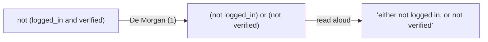
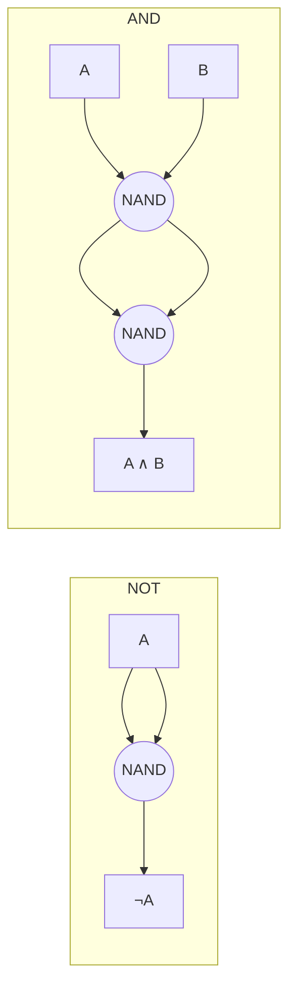
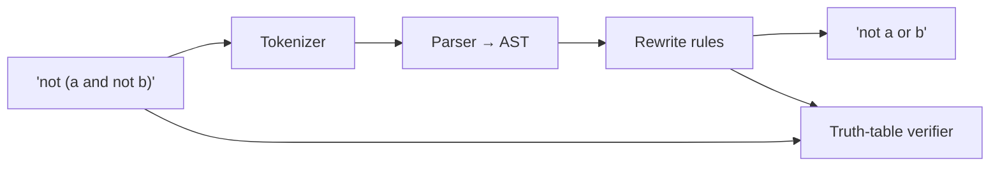

# Chapter 1 — Logic & Boolean Algebra

> **Volume 0 — Math & Mental Models** · [Contents](index.md) · Next → [Chapter 2 — Sets, Relations & Functions](ch02-sets-relations-and-functions.md)

---

## Concept

Propositional logic, truth tables, De Morgan's laws; how boolean algebra maps to `and`/`or`/`not` and bitwise operators.

**In one sentence:** every `if` you write is a small logic formula, and boolean algebra is the set of rules that lets you rewrite that formula without changing what it means.

**Mental model — light switches.** A proposition is a switch that is either ON (`True`, `1`) or OFF (`False`, `0`). Operators wire switches together:

* **AND** — two switches in *series*: the bulb lights only if both are ON.
* **OR** — two switches in *parallel*: the bulb lights if either is ON.
* **NOT** — an inverter: flips ON to OFF.

```
AND (series)                OR (parallel)
                              ┌──[A]──┐
 ─[A]──[B]──(💡)            ──┤       ├──(💡)
                              └──[B]──┘
```

**Key terms**

| Term | Symbol | Python (logical) | Bitwise | Meaning |
|------|--------|------------------|---------|---------|
| Conjunction | `A ∧ B` | `a and b` | `a & b` | both true |
| Disjunction | `A ∨ B` | `a or b` | `a \| b` | at least one true |
| Negation | `¬A` | `not a` | `~a` | flip |
| Exclusive or | `A ⊕ B` | `a != b` | `a ^ b` | exactly one true |
| Implication | `A → B` | `(not a) or b` | — | "if A then B"; false only when A is true and B is false |
| Equivalence | `A ↔ B` | `a == b` | — | same value |

**The laws you will actually use**

| Law | Form |
|-----|------|
| De Morgan (1) | `¬(A ∧ B) = ¬A ∨ ¬B` |
| De Morgan (2) | `¬(A ∨ B) = ¬A ∧ ¬B` |
| Double negation | `¬¬A = A` |
| Distributive | `A ∧ (B ∨ C) = (A ∧ B) ∨ (A ∧ C)` |
| Absorption | `A ∨ (A ∧ B) = A` |
| Identity / Annihilator | `A ∧ 1 = A`, `A ∧ 0 = 0`, `A ∨ 0 = A`, `A ∨ 1 = 1` |
| Complement | `A ∧ ¬A = 0`, `A ∨ ¬A = 1` |

**Short-circuit evaluation.** `a and b` does not evaluate `b` if `a` is false; `a or b` does not evaluate `b` if `a` is true. This is why `if user and user.is_admin:` is safe when `user` is `None`.

---

## Prereqs

None. This is the first chapter of the guide.

---

## Diagram

**Truth tables for the core gates**

| A | B | A ∧ B | A ∨ B | ¬A | A ⊕ B | A → B |
|:-:|:-:|:-----:|:-----:|:--:|:-----:|:-----:|
| 0 | 0 | 0 | 0 | 1 | 0 | 1 |
| 0 | 1 | 0 | 1 | 1 | 1 | 1 |
| 1 | 0 | 0 | 1 | 0 | 1 | 0 |
| 1 | 1 | 1 | 1 | 0 | 0 | 1 |

**De Morgan as a Venn diagram** — `¬(A ∧ B)` is "everything outside the overlap", which is exactly "outside A **or** outside B".

```
      ¬(A ∧ B)  =  ¬A ∨ ¬B
 ┌──────────────────────────────┐
 │ ░░░░░░░░░░░░░░░░░░░░░░░░░░░░ │   ░ = shaded (true)
 │ ░░░░ ╭───────╮╭───────╮ ░░░░ │
 │ ░░░░ │ ░░A░░ ││░░B░░░ │ ░░░░ │   The only unshaded
 │ ░░░░ │ ░░░░░ ╭┼╮░░░░░ │ ░░░░ │   region is the
 │ ░░░░ │ ░░░░░ │ │░░░░░ │ ░░░░ │   overlap A ∧ B.
 │ ░░░░ │ ░░░░░ ╰┼╯░░░░░ │ ░░░░ │
 │ ░░░░ ╰───────╯╰───────╯ ░░░░ │
 └──────────────────────────────┘
```

**Rewriting a condition with De Morgan**



**Every gate from NAND** — NAND (`¬(A ∧ B)`) is *functionally complete*: you can build any circuit from it alone.



---

## Example

De Morgan, checked by brute force over every input:

```python
from itertools import product

for a, b in product([False, True], repeat=2):
    assert (not (a and b)) == (not a or not b)   # De Morgan (1)
    assert (not (a or b)) == (not a and not b)   # De Morgan (2)
print("De Morgan holds for all 4 inputs")
```

The same laws hold bit-by-bit on integers:

```python
a, b = 0b1100, 0b1010
mask = 0b1111                      # keep 4 bits so ~ stays readable
assert (~(a & b)) & mask == ((~a) | (~b)) & mask
print(bin(a & b), bin(a | b), bin(a ^ b))   # 0b1000 0b1110 0b110
```

The power-of-two trick — `x & (x - 1)` clears the lowest set bit:

```
x       = 0b0100_0000   (64)
x - 1   = 0b0011_1111   (63)
x & x-1 = 0b0000_0000   → 0, so 64 is a power of two

x       = 0b0100_1000   (72)
x - 1   = 0b0100_0111
x & x-1 = 0b0100_0000   → not 0, so 72 is not
```

```python
def is_power_of_two(x: int) -> bool:
    return x > 0 and (x & (x - 1)) == 0
```

Simplifying a real condition:

```python
# Before: hard to read
if not (not is_weekend or (is_holiday and not office_open)):
    ...

# Step 1 — De Morgan (2):  ¬(X ∨ Y) = ¬X ∧ ¬Y
#   = is_weekend and not (is_holiday and not office_open)
# Step 2 — De Morgan (1):  ¬(P ∧ ¬Q) = ¬P ∨ Q
#   = is_weekend and (not is_holiday or office_open)
if is_weekend and (not is_holiday or office_open):
    ...
```

---

## Exercises

1. Build the truth table for `(A → B) ∧ ¬B` and show it forces `¬A` (modus tollens).

   <details><summary>Solution</summary>

   | A | B | A → B | ¬B | (A → B) ∧ ¬B |
   |:-:|:-:|:-----:|:--:|:------------:|
   | 0 | 0 | 1 | 1 | **1** |
   | 0 | 1 | 1 | 0 | 0 |
   | 1 | 0 | 0 | 1 | 0 |
   | 1 | 1 | 1 | 0 | 0 |

   The formula is true in exactly one row, and in that row `A = 0`. So whenever it holds, `¬A` holds.
   </details>

2. Simplify `¬(¬A ∨ (B ∧ ¬C))` to a form using only AND and NOT.

   <details><summary>Solution</summary>

   `¬(¬A ∨ (B ∧ ¬C))` → De Morgan (2) → `A ∧ ¬(B ∧ ¬C)`. That already uses only AND and NOT. (Expanded further: `A ∧ (¬B ∨ C)`.)
   </details>

3. Write `xor(a, b)` in Python using only `and`, `or`, `not`. Verify it against `a != b` for all inputs.

   <details><summary>Hint</summary>`A ⊕ B = (A ∨ B) ∧ ¬(A ∧ B)`.</details>

4. Negate this guard correctly, then simplify: `if age >= 18 and (has_id or is_member):`.

   <details><summary>Solution</summary>`age < 18 or (not has_id and not is_member)`.</details>

---

## Mini project

**A boolean-expression simplifier that reduces small expressions via De Morgan and distributivity.**



**Steps**

1. **Tokenize** strings like `not (a and not b)` into `NOT`, `LPAREN`, `VAR(a)`, `AND`, …
2. **Parse** into a tree: `Not(And(Var a, Not(Var b)))`.
3. **Rewrite** bottom-up with rules: double negation, De Morgan (push `not` inward), identity/annihilator, absorption.
4. **Verify** every rewrite by comparing truth tables of input and output — never trust a rule you haven't checked.
5. **Print** the result back as a string.

**Done when:** it reduces `not (not a or not b)` to `a and b`, and the verifier passes for 20 random expressions.

---

## Open source

* [`sympy/sympy`](https://github.com/sympy/sympy) — the `sympy.logic` module. Read `sympy/logic/boolalg.py`: look at `to_cnf`, `to_dnf`, and `simplify_logic` to see these laws applied at scale.

  ```python
  from sympy import symbols
  from sympy.logic.boolalg import simplify_logic
  a, b = symbols("a b")
  print(simplify_logic(~(~a | ~b)))   # a & b
  ```

---

## Interview

1. **"Why does `x & (x - 1) == 0` test for a power of two?"**
   <details><summary>Answer</summary>A power of two has exactly one set bit. Subtracting 1 flips that bit to 0 and every bit below it to 1, so the AND is 0. Any other positive number keeps its higher set bit, so the AND is non-zero. Guard for `x > 0`.</details>

2. **"Prove De Morgan's laws with a truth table."**
   <details><summary>Answer</summary>List all 4 rows of (A, B); compute `¬(A ∧ B)` and `¬A ∨ ¬B` column by column; the columns match in every row. Same for the OR form.</details>

---

## Checklist

- [ ] derive every gate from NAND alone
- [ ] negate a compound condition correctly
- [ ] know short-circuit evaluation order
- [ ] convert `if/else` chains into boolean expressions

---

> [Contents](index.md) · Next → [Chapter 2 — Sets, Relations & Functions](ch02-sets-relations-and-functions.md)
