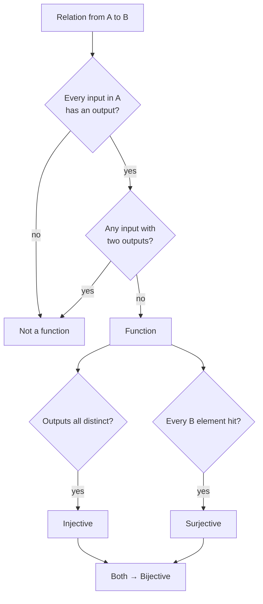
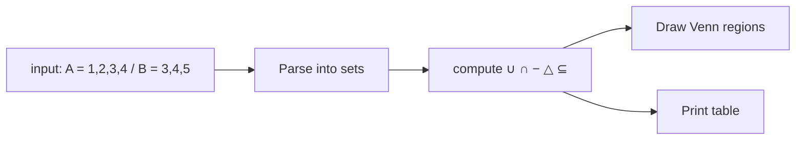

# Chapter 2 — Sets, Relations & Functions

> **Volume 0 — Math & Mental Models** · [Contents](index.md) · ← [Chapter 1 — Logic & Boolean Algebra](ch01-logic-and-boolean-algebra.md) · Next → [Chapter 3 — Combinatorics & Counting](ch03-combinatorics-and-counting.md)

---

## Concept

Sets, subsets, unions/intersections/differences, Cartesian products; relations (reflexive/symmetric/transitive); functions (injective/surjective/bijective).

**In one sentence:** a set is a bag of unique things, a relation is a list of pairs saying "these two are connected", and a function is a relation where every input gets exactly one output.

**Mental model — guest lists.** Two parties each have a guest list (sets). People on *both* lists are the intersection. Everyone invited *anywhere* is the union. "Who knows whom" is a relation. "Which seat each guest gets" is a function — every guest gets one seat.

**Set operations**

| Operation | Symbol | Python | Meaning |
|-----------|--------|--------|---------|
| Union | `A ∪ B` | `a \| b` | in A or B |
| Intersection | `A ∩ B` | `a & b` | in both |
| Difference | `A − B` | `a - b` | in A, not in B |
| Symmetric difference | `A △ B` | `a ^ b` | in exactly one |
| Subset | `A ⊆ B` | `a <= b` | every element of A is in B |
| Cartesian product | `A × B` | `itertools.product(a, b)` | all ordered pairs `(x, y)` |
| Cardinality | `\|A\|` | `len(a)` | how many elements |

**Relation properties** (a relation `R` on a set `S` is a set of pairs from `S × S`)

| Property | Rule | Example that has it |
|----------|------|---------------------|
| Reflexive | every `x R x` | `≤`, "same birthday as" |
| Symmetric | `x R y ⇒ y R x` | "is sibling of", "=" |
| Antisymmetric | `x R y ∧ y R x ⇒ x = y` | `≤`, "divides" (on positives) |
| Transitive | `x R y ∧ y R z ⇒ x R z` | `<`, "is ancestor of" |

* **Equivalence relation** = reflexive + symmetric + transitive. It splits a set into groups (equivalence classes). Example: "same remainder mod 3".
* **Partial order** = reflexive + antisymmetric + transitive. Example: `⊆` on sets, task dependencies.

**Function types** — `f: A → B`

| Type | Rule | Picture |
|------|------|---------|
| Injective (one-to-one) | different inputs → different outputs | no two arrows land on the same target |
| Surjective (onto) | every target is hit | no target left empty |
| Bijective | both | perfect pairing; has an inverse |

---

## Prereqs

* [Chapter 1 — Logic & Boolean Algebra](ch01-logic-and-boolean-algebra.md)

---

## Diagram

**Two overlapping sets**

```
        A = {1, 2, 3, 4}          B = {3, 4, 5}
     ╭───────────────╮
     │   1      ╭────┼──────────╮
     │     2    │ 3  │          │
     │          │ 4  │    5     │
     ╰──────────┼────╯          │
                ╰───────────────╯
   A − B = {1,2}   A ∩ B = {3,4}   B − A = {5}
   A ∪ B = {1,2,3,4,5}
```

**Arrow diagrams of functions**

```
 Injective, not surjective     Surjective, not injective      Bijective
   A        B                    A        B                    A        B
   1 ─────► a                    1 ─────► a                    1 ─────► a
   2 ─────► b                    2 ──┐                         2 ─────► b
   3 ─────► c                        └──► a  (shared)          3 ─────► c
            d  (never hit)       3 ─────► b
```

**Is it a function? A decision flow**



---

## Example

```python
print(set("mississippi"))            # {'m', 'i', 's', 'p'} — duplicates vanish

a, b = {1, 2, 3, 4}, {3, 4, 5}
print(a | b, a & b, a - b, a ^ b)    # {1,2,3,4,5} {3,4} {1,2} {1,2,5}

# Inclusion–exclusion, checked
assert len(a | b) == len(a) + len(b) - len(a & b)

# A bijection: each key maps to one value, each value comes from one key
code = {"red": 1, "green": 2, "blue": 3}
inverse = {v: k for k, v in code.items()}
assert len(inverse) == len(code)     # no collisions → injective, so invertible
```

**Checking relation properties by brute force**

```python
S = range(1, 7)
divides = {(x, y) for x in S for y in S if y % x == 0}

reflexive  = all((x, x) in divides for x in S)
symmetric  = all((y, x) in divides for (x, y) in divides)
transitive = all((x, z) in divides
                 for (x, y) in divides for (y2, z) in divides if y == y2)
print(reflexive, symmetric, transitive)   # True False True → a partial order
```

**Why sets give O(1) membership** — a `set` is a hash table. `x in s` hashes `x`, jumps to one bucket, and checks only what is there, instead of scanning every element like a `list` does.

```
 x in list:  [7, 3, 9, 1, 4, ...]  → check 1, 2, 3, ... n items    O(n)
 x in set:   hash(4) % 8 = 5  → bucket[5] → found                   O(1) average
```

---

## Exercises

1. Prove `|A ∪ B| = |A| + |B| − |A ∩ B|`.

   <details><summary>Solution</summary>

   Split `A ∪ B` into three disjoint parts: `A − B`, `A ∩ B`, `B − A`. Then `|A| = |A − B| + |A ∩ B|` and `|B| = |B − A| + |A ∩ B|`. Adding gives `|A| + |B| = |A ∪ B| + |A ∩ B|`, because the overlap is counted twice. Rearrange.
   </details>

2. Which relation properties does "divides" have on integers?

   <details><summary>Solution</summary>

   On positive integers: reflexive (`x | x`), antisymmetric (`x | y` and `y | x` ⇒ `x = y`), transitive. Not symmetric (`2 | 4` but `4 ∤ 2`). So it is a partial order. On all integers antisymmetry fails, since `2 | −2` and `−2 | 2`.
   </details>

3. Is `f(x) = x²` from integers to integers injective? Surjective? What if the domain is non-negative integers?

   <details><summary>Solution</summary>On all integers: not injective (`f(2) = f(−2)`), not surjective (3 is never hit). On non-negative integers: injective, still not surjective.</details>

---

## Mini project

**A set-operations calculator with a visualization of two overlapping sets.**



**Steps**

1. Read two comma-separated lists from the user.
2. Compute union, intersection, both differences, symmetric difference, and subset checks.
3. Draw a text Venn diagram that places each element in its region (only A, both, only B).
4. Bonus: use `matplotlib_venn` to draw real circles.

**Done when:** for any two inputs, the counts in each Venn region add up to `|A ∪ B|`.

---

## Open source

* [`python/cpython`](https://github.com/python/cpython) — Python's built-in `set`/`frozenset`. Read `Objects/setobject.c`: look at `set_add_entry` for hashing and probing, and `set_intersection` for how it loops over the *smaller* set.

---

## Interview

1. **"What's the difference between a function and a relation?"**
   <details><summary>Answer</summary>A relation is any set of pairs. A function is a relation where every input appears exactly once as the first element of a pair. So every function is a relation, but not every relation is a function.</details>

2. **"Give an example of a relation that's symmetric but not transitive."**
   <details><summary>Answer</summary>"Is a friend of": Alice–Bob and Bob–Carol are friends, but Alice and Carol may not be. Another: "differs by exactly 1" on integers, since 1~2 and 2~3 but not 1~3.</details>

---

## Checklist

- [ ] state the inclusion-exclusion principle
- [ ] classify a relation's properties
- [ ] explain why hash sets give O(1) membership

---

> [Contents](index.md) · ← [Chapter 1 — Logic & Boolean Algebra](ch01-logic-and-boolean-algebra.md) · Next → [Chapter 3 — Combinatorics & Counting](ch03-combinatorics-and-counting.md)
