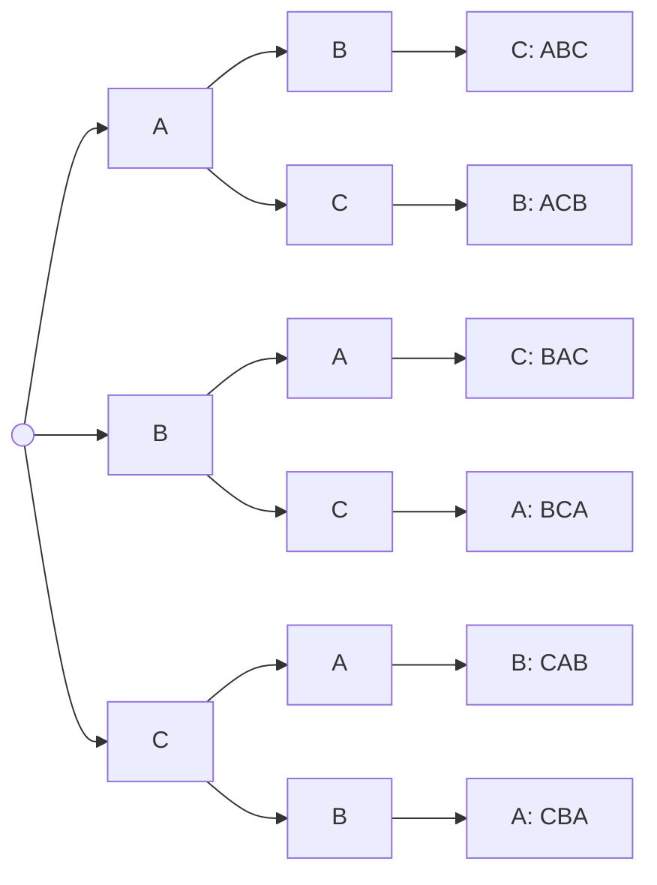
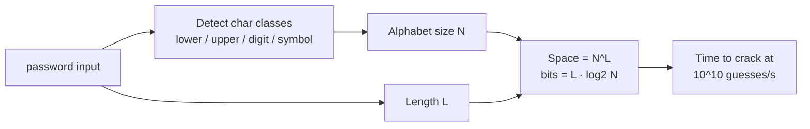

# Chapter 3 — Combinatorics & Counting

> **Volume 0 — Math & Mental Models** · [Contents](index.md) · ← [Chapter 2 — Sets, Relations & Functions](ch02-sets-relations-and-functions.md) · Next → [Chapter 4 — Graph Theory Foundations](ch04-graph-theory-foundations.md)

---

## Concept

Permutations, combinations, the multiplication/addition rules, binomial coefficients, pigeonhole principle.

**In one sentence:** combinatorics is counting without listing — it tells you how big a search space is before you try to search it.

**Mental model — the ice-cream shop.** 3 cones × 5 flavors = 15 single scoops (multiply: you choose *both*). Cone *or* cup, where there are 3 cones and 2 cups = 5 holders (add: you choose *one of*).

**The four core formulas**

| Question | Order matters? | Repeats allowed? | Formula | Example |
|----------|:-:|:-:|---------|---------|
| Arrange all n items | yes | no | `n!` | 5 books on a shelf: `120` |
| Pick k of n, in order | yes | no | `P(n,k) = n! / (n−k)!` | gold/silver/bronze from 10: `720` |
| Pick k of n, any order | no | no | `C(n,k) = n! / (k!(n−k)!)` | 3-person team from 10: `120` |
| k slots, n choices each | yes | yes | `nᵏ` | 4-digit PIN: `10⁴ = 10,000` |
| Arrange with duplicates | yes | — | `n! / (n₁! n₂! …)` | letters of "BANANA": `60` |

**Rules**

* **Multiplication rule** — a task done in step 1 (a ways) *and then* step 2 (b ways) has `a · b` ways.
* **Addition rule** — a task done *either* way 1 (a ways) *or* way 2 (b ways, no overlap) has `a + b` ways.
* **Complement trick** — count what you *don't* want and subtract: "at least one" = total − "none".
* **Pigeonhole principle** — put `n + 1` pigeons into `n` holes, and some hole has at least 2. General form: some hole has at least `⌈n/k⌉` items.

**Binomial coefficients** — `C(n, k)` is also the k-th number in row n of Pascal's triangle, and the coefficient in `(x + y)ⁿ`. Key identity: `C(n, k) = C(n−1, k−1) + C(n−1, k)` (either the item is picked, or it isn't).

---

## Prereqs

* [Chapter 1 — Logic & Boolean Algebra](ch01-logic-and-boolean-algebra.md)

---

## Diagram

**Decision tree for permutations of {A, B, C}** — 3 choices, then 2, then 1: `3 · 2 · 1 = 6` leaves.



**Why combinations divide by k!** — each unordered team appears `k!` times among ordered picks.

```
 Ordered picks of 2 from {A,B,C}:  AB BA AC CA BC CB   → P(3,2) = 6
 Group the same team:              {AB,BA} {AC,CA} {BC,CB}
 Each team counted 2! = 2 times    → C(3,2) = 6 / 2 = 3
```

**Pascal's triangle** — each number is the sum of the two above it.

```
 n=0            1
 n=1          1   1
 n=2        1   2   1
 n=3      1   3   3   1
 n=4    1   4   6   4   1        C(4,2) = 6
 n=5  1   5  10  10   5   1
```

**Pigeonhole** — 13 people, 12 months:

```
 Jan Feb Mar Apr May Jun Jul Aug Sep Oct Nov Dec
  ●   ●   ●   ●   ●   ●   ●   ●   ●   ●   ●   ●     12 people fill every month
  ●                                                  the 13th must share one
```

---

## Example

```python
import math
from itertools import permutations, combinations

print(math.comb(10, 3))            # 120 — 3 from 10, order ignored
print(math.perm(10, 3))            # 720 — 3 from 10, order matters
print(math.factorial(5))           # 120

# Brute force agrees with the formula
assert len(list(combinations(range(10), 3))) == math.comb(10, 3)

# Duplicates: distinct arrangements of BANANA
from collections import Counter
word = "BANANA"
n = math.factorial(len(word))
for count in Counter(word).values():
    n //= math.factorial(count)
print(n)                           # 60  (6! / (3! · 2! · 1!))
assert n == len(set(permutations(word)))

# Complement: P(at least one 6 in 4 dice rolls)
print(1 - (5/6)**4)                # ≈ 0.518
```

**Search-space sizing — why password length beats complexity**

| Password type | Alphabet | Length | Space | log₂ (bits) |
|---------------|---------:|-------:|------:|-----:|
| digits PIN | 10 | 4 | 10⁴ | 13.3 |
| lowercase | 26 | 8 | 2.1 × 10¹¹ | 37.6 |
| mixed + digits + symbols | 94 | 8 | 6.1 × 10¹⁵ | 52.4 |
| lowercase | 26 | 16 | 4.4 × 10²² | 75.2 |

---

## Exercises

1. How many distinct words can be made from the letters of "BANANA"?

   <details><summary>Solution</summary>6 letters: A×3, N×2, B×1. `6! / (3! · 2! · 1!) = 720 / 12 = 60`.</details>

2. Prove that among 13 people, two share a birth month (pigeonhole).

   <details><summary>Solution</summary>There are 12 months (holes) and 13 people (pigeons). If each month had at most one person, there would be at most 12 people. Contradiction, so some month has at least 2.</details>

3. How many 5-card poker hands contain at least one ace?

   <details><summary>Solution</summary>Complement: `C(52,5) − C(48,5) = 2,598,960 − 1,712,304 = 886,656`.</details>

4. How many shortest paths go from the top-left to the bottom-right corner of a 4×3 grid (moving only right or down)?

   <details><summary>Solution</summary>You make 4 rights and 3 downs in some order: `C(7,3) = 35`.</details>

---

## Mini project

**A password-strength estimator that computes the size of the search space.**



**Steps**

1. Detect which character classes appear and sum their sizes (26, 26, 10, 32).
2. Compute `space = N ** L` and `bits = L * log2(N)`.
3. Convert to human time at 10¹⁰ guesses per second.
4. Bonus: penalize dictionary words by treating each word as one "symbol" from a 20,000-word alphabet.

**Done when:** `"correcthorsebatterystaple"` scores higher than `"P@ss1"` and your output explains why.

---

## Open source

* [`scipy/scipy`](https://github.com/scipy/scipy) — `scipy.special.comb`. Read how `exact=False` uses the gamma function to handle huge `n` without overflow.
* [`dropbox/zxcvbn`](https://github.com/dropbox/zxcvbn) — a real password-strength estimator built on pattern counting.

---

## Interview

1. **"How many unique orderings of a deck of 52 cards?"**
   <details><summary>Answer</summary><code>52! ≈ 8.07 × 10⁶⁷</code>. That is so large that every well-shuffled deck is almost certainly an order no one has ever seen before.</details>

2. **"Explain the pigeonhole principle with an example."**
   <details><summary>Answer</summary>If you put more items than boxes, some box holds two. Example: any hash function mapping arbitrary strings to 32-bit values must have collisions, because there are more strings than 2³² outputs.</details>

---

## Checklist

- [ ] know when order matters
- [ ] compute permutations with duplicates
- [ ] apply the pigeonhole principle

---

> [Contents](index.md) · ← [Chapter 2 — Sets, Relations & Functions](ch02-sets-relations-and-functions.md) · Next → [Chapter 4 — Graph Theory Foundations](ch04-graph-theory-foundations.md)
