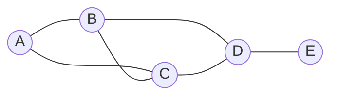
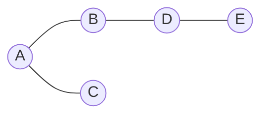
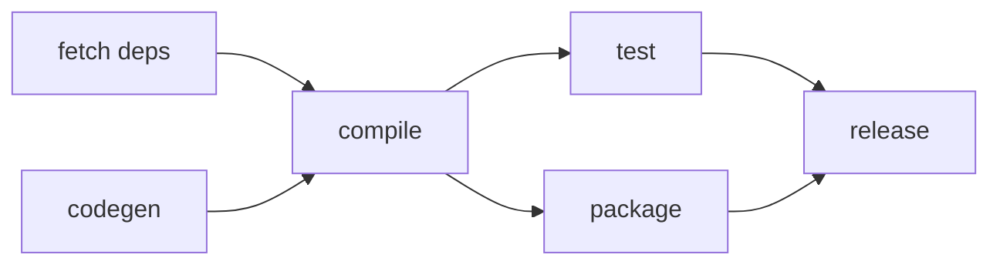
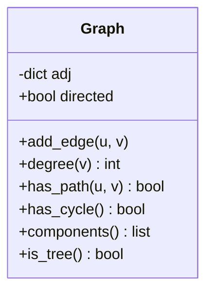

# Chapter 4 — Graph Theory Foundations

> **Volume 0 — Math & Mental Models** · [Contents](index.md) · ← [Chapter 3 — Combinatorics & Counting](ch03-combinatorics-and-counting.md) · Next → [Chapter 5 — Proof by Induction](ch05-proof-by-induction.md)

---

## Concept

Vertices, edges, directed vs undirected, degree, paths/cycles, connectivity, trees (n−1 edges, acyclic).

**In one sentence:** a graph is dots (vertices) joined by lines (edges), and it is the shape behind maps, social networks, package dependencies, and the internet.

**Mental model — a city map.** Intersections are vertices. Streets are edges. One-way streets make it *directed*. Road length makes it *weighted*. "Can I drive from here to there?" is a *path* question.

**Key terms**

| Term | Meaning |
|------|---------|
| Vertex (node) | a point, e.g. a person or a city |
| Edge | a link between two vertices |
| Directed / undirected | edge has a direction (`a → b`) or not (`a — b`) |
| Weighted | edge carries a number (distance, cost) |
| Degree | number of edges touching a vertex; in directed graphs, *in-degree* and *out-degree* |
| Walk | any sequence of connected vertices (may repeat) |
| Path | a walk with no repeated vertices |
| Cycle | a path that returns to its start |
| Connected | every vertex can reach every other |
| Component | a maximal connected piece |
| Tree | connected and acyclic; always has `n − 1` edges |
| DAG | directed acyclic graph — the shape of build steps and task dependencies |
| Bridge / cut vertex | an edge / vertex whose removal disconnects the graph |
| Biconnected | no cut vertex — survives the loss of any single vertex |

**Two ways to store a graph**

| | Adjacency list | Adjacency matrix |
|-|----------------|------------------|
| Memory | `O(V + E)` | `O(V²)` |
| "Is a–b an edge?" | `O(deg a)` | `O(1)` |
| List neighbors | `O(deg a)` | `O(V)` |
| Best for | sparse graphs (most real ones) | dense graphs, small V |

**Handshaking lemma:** `Σ deg(v) = 2 · |E|`, because every edge adds 1 to the degree of each of its two ends.

---

## Prereqs

* [Chapter 2 — Sets, Relations & Functions](ch02-sets-relations-and-functions.md) — a graph is a set of vertices plus a relation (edges) on it.

---

## Diagram

**A small graph, labeled**

```
        deg=2        deg=3
         (A)─────────(B)
          │         ╱ │
          │       ╱   │        Path:  A → B → D → E
          │     ╱     │        Cycle: B → C → D → B
          │   ╱       │        Degrees: A2 + B3 + C3 + D3 + E1 = 12
         (C)─────────(D)───(E)          = 2 × 6 edges ✓
        deg=3        deg=3  deg=1
```



**A spanning tree of that graph** — keep every vertex, drop edges until there are no cycles. 5 vertices → 4 edges.



**Directed acyclic graph (DAG) — build order**



---

## Example

```python
# Undirected triangle as an adjacency list
G = {0: {1, 2}, 1: {0, 2}, 2: {0, 1}}

degrees = {v: len(nbrs) for v, nbrs in G.items()}
edges = sum(degrees.values()) // 2                 # handshaking lemma
print(degrees, edges)                              # {0: 2, 1: 2, 2: 2} 3

def has_path(g, start, goal):
    seen, stack = set(), [start]
    while stack:
        v = stack.pop()
        if v == goal:
            return True
        if v not in seen:
            seen.add(v)
            stack.extend(g[v] - seen)
    return False

def has_cycle_undirected(g):
    seen = set()
    for root in g:
        if root in seen:
            continue
        stack = [(root, None)]
        while stack:
            v, parent = stack.pop()
            if v in seen:
                return True                        # reached again by another route
            seen.add(v)
            stack.extend((n, v) for n in g[v] if n != parent)
    return False

print(has_path(G, 0, 2), has_cycle_undirected(G))  # True True

tree = {0: {1, 2}, 1: {0}, 2: {0}}
print(has_cycle_undirected(tree))                  # False — 3 vertices, 2 edges
```

---

## Exercises

1. Prove a tree with n vertices has n−1 edges.

   <details><summary>Solution</summary>

   Induction on n. Base: n = 1 has 0 edges. Step: a tree with n ≥ 2 vertices has a leaf (a vertex of degree 1), because a longest path must end at one. Remove the leaf and its edge. What remains is still connected and acyclic, so it is a tree with n − 1 vertices and, by hypothesis, n − 2 edges. Adding the leaf back gives n − 1 edges.
   </details>

2. Show the handshaking lemma: sum of degrees = 2·|E|.

   <details><summary>Solution</summary>Count (vertex, edge) pairs where the vertex is an end of the edge. By vertex: Σ deg(v). By edge: each edge has exactly 2 ends, so 2|E|. Same set, so the counts are equal. Corollary: the number of odd-degree vertices is always even.</details>

3. Can a party of 7 people have everyone shake hands with exactly 3 others?

   <details><summary>Solution</summary>No. Degree sum would be 7 × 3 = 21, which is odd, but it must equal 2|E|.</details>

---

## Mini project

**A graph class with degree, path-existence, and cycle-detection helpers.**



**Steps**

1. Store adjacency as `dict[vertex, set[vertex]]`; support `directed=True/False`.
2. Implement `degree` (in/out for directed), `has_path` (DFS), `components`.
3. Implement `has_cycle`: parent tracking for undirected, three-color DFS for directed.
4. `is_tree()` = connected and `E == V − 1`.
5. Test against `networkx` on 100 random graphs.

**Done when:** all helpers agree with `networkx` on random inputs.

---

## Open source

* [`networkx/networkx`](https://github.com/networkx/networkx) — read `networkx/classes/graph.py` for the dict-of-dicts storage, and `networkx/algorithms/cycles.py` for cycle detection.

---

## Interview

1. **"What's the difference between a path and a walk?"**
   <details><summary>Answer</summary>A walk is any sequence of vertices joined by edges and may repeat vertices or edges. A path repeats no vertices. Every path is a walk; a walk from u to v always contains a path from u to v.</details>

2. **"When is a graph a tree?"**
   <details><summary>Answer</summary>Any two of these three imply the third: connected, acyclic, E = V − 1. Equivalently, there is exactly one path between every pair of vertices.</details>

---

## Checklist

- [ ] state the handshaking lemma
- [ ] detect a cycle
- [ ] explain connectivity vs biconnectivity

---

> [Contents](index.md) · ← [Chapter 3 — Combinatorics & Counting](ch03-combinatorics-and-counting.md) · Next → [Chapter 5 — Proof by Induction](ch05-proof-by-induction.md)
