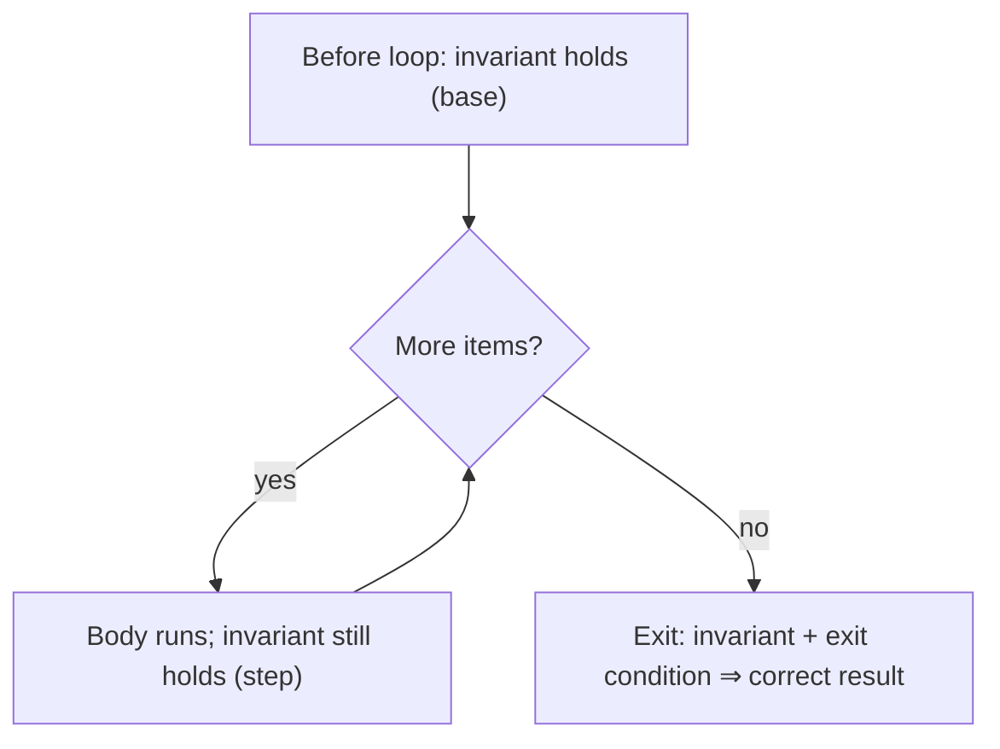

# Chapter 5 — Proof by Induction

> **Volume 0 — Math & Mental Models** · [Contents](index.md) · ← [Chapter 4 — Graph Theory Foundations](ch04-graph-theory-foundations.md) · Next → [Chapter 6 — Asymptotic Notation (Big-O, Θ, Ω)](ch06-asymptotic-notation-big-o.md)

---

## Concept

Base case + inductive step; strong induction; using induction to prove loop invariants and recursion correctness.

**In one sentence:** show it works for the first case, show that "works for k" forces "works for k + 1", and you have shown it works for every case.

**Mental model — dominoes.** You don't need to watch every domino fall. You need two facts: (1) the first one gets pushed, and (2) each one, if it falls, knocks over the next.

**The template**

| Step | What you write |
|------|----------------|
| 1. Claim | "For all n ≥ n₀, P(n)." Say exactly what P(n) is. |
| 2. Base case | Check P(n₀) directly. |
| 3. Inductive hypothesis (IH) | "Assume P(k) holds for some k ≥ n₀." |
| 4. Inductive step | Using the IH, prove P(k + 1). Point to where you use it. |
| 5. Conclude | "By induction, P(n) holds for all n ≥ n₀." |

**Weak vs strong induction**

| | Weak | Strong |
|-|------|--------|
| Hypothesis | P(k) | P(n₀), P(n₀+1), …, P(k) — all smaller cases |
| Use when | k + 1 depends only on k | k + 1 depends on some earlier case, not just the previous one (e.g. splitting in half) |
| Example | sum formulas | every integer ≥ 2 is a product of primes; merge sort correctness |

**Why programmers care**

* **Recursion** is induction run backward. The base case of the recursion is the base case of the proof. The recursive call is the inductive hypothesis.
* **Loop invariants** are induction over iterations: true before the loop (base), preserved by each iteration (step), so true when the loop ends — which gives you the result.

---

## Prereqs

* [Chapter 1 — Logic & Boolean Algebra](ch01-logic-and-boolean-algebra.md) — implication `P(k) → P(k+1)`.

---

## Diagram

**The domino chain**

```
  push
   │
   ▼
  ┃1┃ → ┃2┃ → ┃3┃ → ┃4┃ → ┃5┃ → … → ┃k┃ → ┃k+1┃ → …
  base   └────────── each falling domino topples the next ──────────┘
  case                       (inductive step: P(k) ⇒ P(k+1))
```

**Induction as a proof pipeline**


**Visual proof of `1 + 2 + … + n = n(n+1)/2`** — two staircases fill an `n × (n+1)` rectangle.

```
 n = 4:   ■ □ □ □ □
          ■ ■ □ □ □      ■ = 1+2+3+4 = 10
          ■ ■ ■ □ □      □ = the same staircase, flipped
          ■ ■ ■ ■ □      total = 4 × 5 = 20, so ■ = 20 / 2 = 10
```

**Loop invariant as induction**



---

## Example

**Prove `1 + 2 + … + n = n(n+1)/2` for all n ≥ 1.**

* **Base (n = 1):** left side is 1. Right side is `1·2/2 = 1`. ✓
* **IH:** assume `1 + … + k = k(k+1)/2`.
* **Step:** `1 + … + k + (k+1) = k(k+1)/2 + (k+1)` (by IH) `= (k+1)(k/2 + 1) = (k+1)(k+2)/2`. That is the formula with n = k + 1. ✓

**A loop invariant, made checkable**

```python
def total(xs):
    s, i = 0, 0
    # Invariant: s == sum(xs[:i])
    while i < len(xs):
        assert s == sum(xs[:i])      # holds at the top of every iteration
        s += xs[i]
        i += 1
    # Exit: i == len(xs), so s == sum(xs[:len(xs)]) == sum(xs)
    return s
```

**Recursion correctness is induction**

```python
def power(x, n):
    """Return x**n for n >= 0."""
    if n == 0:
        return 1                     # base case: x^0 = 1
    half = power(x, n // 2)          # strong IH: correct for all m < n
    return half * half * (x if n % 2 else 1)
```

Proof sketch (strong induction on n): n = 0 is correct. For n > 0, `n // 2 < n`, so by the IH `half = x^(n//2)`. If n is even, `half² = x^n`; if odd, `half² · x = x^(n−1) · x = x^n`. ✓

---

## Exercises

1. Prove `2^n > n` for all n ≥ 1.

   <details><summary>Solution</summary>Base: `2 > 1`. Step: assume `2^k > k`. Then `2^(k+1) = 2 · 2^k > 2k ≥ k + 1` for k ≥ 1. ✓</details>

2. Prove a binary tree of height h has at most `2^h − 1` nodes.

   <details><summary>Solution</summary>Strong induction on h. Base: h = 0 (empty) has 0 = 2⁰ − 1 nodes; h = 1 has 1 node. Step: a tree of height h is a root plus two subtrees of height ≤ h − 1, each with at most `2^(h−1) − 1` nodes. Total ≤ `1 + 2(2^(h−1) − 1) = 2^h − 1`. ✓</details>

3. Find the flaw: "All horses are the same color. Base: 1 horse. Step: in a group of k + 1, remove horse A — the rest match by IH; remove horse B — the rest match; so all match."

   <details><summary>Solution</summary>The step fails for k = 1 → 2. With 2 horses, the two groups of size 1 do not overlap, so nothing links their colors. An inductive step must work for every k from the base up.</details>

---

## Mini project

**A recursive factorial/power function with a written inductive proof of correctness.**

**Steps**

1. Implement `factorial(n)` and fast `power(x, n)` recursively.
2. In the docstring, write the claim, base case, IH, and step.
3. Add `assert`-based invariant checks, plus property tests (e.g. with `hypothesis`) against `math.factorial` and `x ** n`.
4. Write one *iterative* version with a loop invariant, and prove it the same way.

**Done when:** each function has a proof a reader can check line by line, and 1,000 random tests pass.

---

## Open source

* [`leanprover/lean4`](https://github.com/leanprover/lean4) — theorem prover, induction is the core tool. Try the `induction` tactic in the Lean 4 tutorial "Theorem Proving in Lean" to see a computer check each step.

---

## Interview

1. **"Prove by induction that the sum of the first n odd numbers is n²."**
   <details><summary>Answer</summary>Base: 1 = 1². IH: <code>1 + 3 + … + (2k−1) = k²</code>. Step: add the next odd number <code>2k+1</code>: <code>k² + 2k + 1 = (k+1)²</code>. ✓</details>

2. **"What's strong induction vs weak?"**
   <details><summary>Answer</summary>Weak assumes only P(k) to prove P(k+1). Strong assumes P holds for every value up to k. They prove the same things, but strong is more convenient when a case depends on a much smaller case, as in divide-and-conquer recursion.</details>

---

## Checklist

- [ ] identify base case
- [ ] write the inductive step
- [ ] use induction to justify a loop invariant

---

> [Contents](index.md) · ← [Chapter 4 — Graph Theory Foundations](ch04-graph-theory-foundations.md) · Next → [Chapter 6 — Asymptotic Notation (Big-O, Θ, Ω)](ch06-asymptotic-notation-big-o.md)
