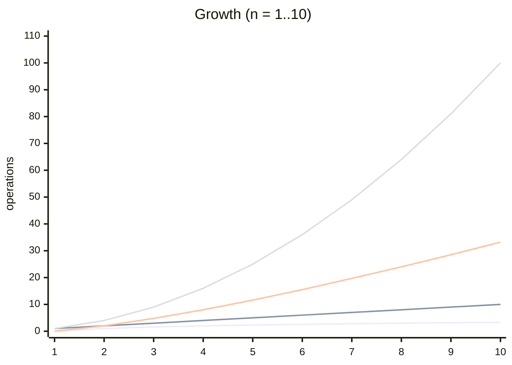
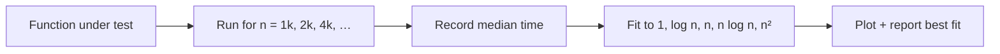

# Chapter 6 — Asymptotic Notation (Big-O, Θ, Ω)

> **Volume 0 — Math & Mental Models** · [Contents](index.md) · ← [Chapter 5 — Proof by Induction](ch05-proof-by-induction.md) · Next → [Chapter 7 — Time/Space Complexity & Amortized Analysis](ch07-time-space-complexity-and-amortized-analysis.md)

---

## Concept

Big-O (upper bound), Ω (lower bound), Θ (tight); growth classes (1, log n, n, n log n, n², 2ⁿ); worst vs average vs best case.

**In one sentence:** Big-O ignores constants and small inputs, and asks only *how fast the cost grows* as the input gets large.

**Mental model — travel time.** Walking, cycling, and driving differ by a constant factor. Walking to the next city versus walking around the world differs by the *distance*. Big-O is about distance (growth), not vehicle (constants).

**Formal definitions** (for positive functions, n ≥ n₀)

| Notation | Read as | Definition | Analogy |
|----------|---------|------------|---------|
| `f = O(g)` | "at most g" | ∃ c, n₀: `f(n) ≤ c·g(n)` for all n ≥ n₀ | `≤` |
| `f = Ω(g)` | "at least g" | ∃ c, n₀: `f(n) ≥ c·g(n)` for all n ≥ n₀ | `≥` |
| `f = Θ(g)` | "exactly g" | both O and Ω | `=` |
| `f = o(g)` | "strictly less" | `f/g → 0` | `<` |

The pair `(c, n₀)` is called a *witness*. To prove a bound, you produce one.

**Growth classes, slowest to fastest**

| Class | Name | Example | n = 10⁶ (ops) |
|-------|------|---------|--------------:|
| `O(1)` | constant | array index, hash lookup | 1 |
| `O(log n)` | logarithmic | binary search | 20 |
| `O(√n)` | root | trial-division prime check | 1,000 |
| `O(n)` | linear | one scan | 10⁶ |
| `O(n log n)` | linearithmic | merge sort | 2 × 10⁷ |
| `O(n²)` | quadratic | nested loops, bubble sort | 10¹² |
| `O(2ⁿ)` | exponential | all subsets | ∞ in practice |
| `O(n!)` | factorial | all orderings | ∞ in practice |

**Simplification rules**

* Drop constants: `5n → n`.
* Keep the dominant term: `n² + 100n + 7 → n²`.
* Log bases don't matter: `log₂ n = log₁₀ n / log₁₀ 2`, a constant factor.
* Sequential code adds: `O(f) + O(g) = O(max(f, g))`. Nested code multiplies: `O(f · g)`.

**Cases are not bounds.** "Worst case" / "average case" / "best case" pick *which input* you measure. O / Ω / Θ describe *how you bound* that measurement. Quicksort's *worst case* is `Θ(n²)`; its *average case* is `Θ(n log n)`.

---

## Prereqs

* [Chapter 3 — Combinatorics & Counting](ch03-combinatorics-and-counting.md)

---

## Diagram

**`f(n)` shaded under `c·g(n)` after `n₀`**

```
 cost
  │                                        ╱ c·g(n)
  │                                     ╱
  │                                  ╱        ● = f(n)
  │                               ╱      ●
  │         ●                  ╱    ●
  │      ●     ●            ╱  ●              after n₀, every ●
  │   ●           ●     ╱ ●                   stays under the line
  │                  ●╱●
  │               ╱   ┆
  │            ╱      ┆
  └───────────────────┼──────────────────────── n
                      n₀
   before n₀, f(n) may be above c·g(n) — Big-O does not care
```

**Growth curves** (values at small n)

| n | log₂ n | n | n log₂ n | n² | 2ⁿ |
|--:|------:|--:|---------:|---:|---:|
| 1 | 0 | 1 | 0 | 1 | 2 |
| 8 | 3 | 8 | 24 | 64 | 256 |
| 16 | 4 | 16 | 64 | 256 | 65,536 |
| 32 | 5 | 32 | 160 | 1,024 | 4.3 × 10⁹ |
| 64 | 6 | 64 | 384 | 4,096 | 1.8 × 10¹⁹ |



Lines from bottom to top: `log n`, `n`, `n log n`, `n²`.

---

## Example

```python
def contains(xs, target):          # O(n): one pass, O(1) work each
    for x in xs:
        if x == target:
            return True
    return False

def has_duplicate(xs):             # O(n²): every pair
    for i in range(len(xs)):
        for j in range(i + 1, len(xs)):
            if xs[i] == xs[j]:
                return True
    return False

def has_duplicate_fast(xs):        # O(n) expected: hash set
    seen = set()
    for x in xs:
        if x in seen:
            return True
        seen.add(x)
    return False

def binary_search(xs, target):     # O(log n): halves the range each step
    lo, hi = 0, len(xs)
    while lo < hi:
        mid = (lo + hi) // 2
        if xs[mid] < target:
            lo = mid + 1
        else:
            hi = mid
    return lo < len(xs) and xs[lo] == target
```

**Counting the nested loop exactly:** the inner body runs `(n−1) + (n−2) + … + 1 = n(n−1)/2` times, which is `Θ(n²)`.

---

## Exercises

1. Classify `3n² + 100n + 7` as Θ(n²) with witnesses c and n₀.

   <details><summary>Solution</summary>

   Upper: for n ≥ 1, `100n ≤ 100n²` and `7 ≤ 7n²`, so `f(n) ≤ 110n²`. Witness c = 110, n₀ = 1. Lower: `f(n) ≥ 3n²` for all n ≥ 1. Witness c = 3, n₀ = 1. Both hold, so Θ(n²).
   </details>

2. Order `log n, n log n, 2ⁿ, n², √n` by growth.

   <details><summary>Solution</summary><code>log n &lt; √n &lt; n log n &lt; n² &lt; 2ⁿ</code>.</details>

3. What is the complexity of this loop? `i = 1; while i < n: i *= 2`

   <details><summary>Solution</summary><code>Θ(log n)</code>: i takes values 1, 2, 4, …, so it reaches n after about log₂ n steps.</details>

---

## Mini project

**A tiny benchmark script that plots measured runtime vs n and fits the Big-O curve.**



**Steps**

1. Time a function with `timeit` for doubling n; keep the median of 5 runs.
2. For each candidate class g(n), fit `t ≈ c · g(n)` by least squares.
3. Report the class with the smallest error, and the *doubling ratio* `t(2n)/t(n)`: ≈1 → O(1), ≈2 → O(n), ≈4 → O(n²).
4. Plot with `matplotlib` on log-log axes; the slope is the exponent.

**Done when:** it correctly classifies `sorted`, `list.index`, `has_duplicate`, and `binary_search`.

---

## Open source

* [`sympy/sympy`](https://github.com/sympy/sympy) — `sympy.series.Order`. `O(3*x**2 + 100*x + 7, (x, oo))` simplifies to `O(x**2)`.

---

## Interview

1. **"What's the difference between O(n) and Ω(n)?"**
   <details><summary>Answer</summary>O(n) says the cost grows <i>no faster</i> than linearly (upper bound). Ω(n) says it grows <i>at least</i> linearly (lower bound). If both hold, it's Θ(n). Any algorithm that must read all input is Ω(n).</details>

2. **"Is O(log n) always faster than O(n)?"**
   <details><summary>Answer</summary>Only for large enough n. Big-O hides constants: 1000·log n is slower than n until n is about 14,000. Cache effects matter too — a linear scan over a small contiguous array can beat a tree search.</details>

---

## Checklist

- [ ] give formal c/n₀ witnesses
- [ ] rank common growth classes
- [ ] distinguish worst/average case

---

> [Contents](index.md) · ← [Chapter 5 — Proof by Induction](ch05-proof-by-induction.md) · Next → [Chapter 7 — Time/Space Complexity & Amortized Analysis](ch07-time-space-complexity-and-amortized-analysis.md)
