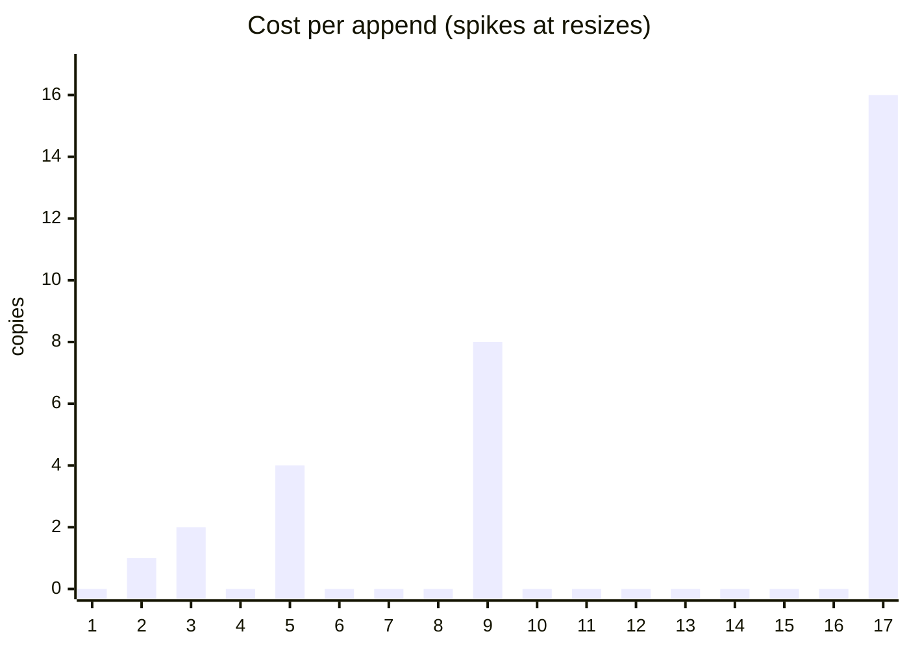
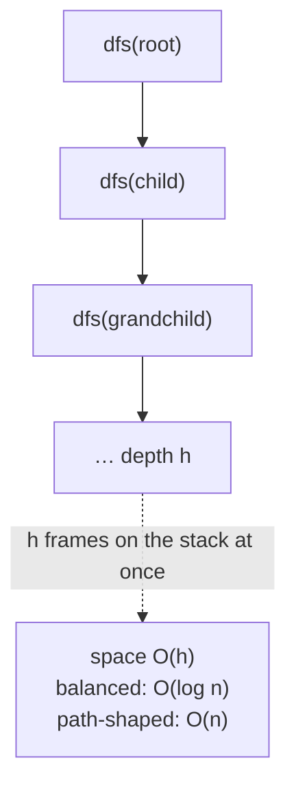
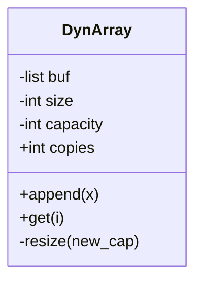

# Chapter 7 — Time/Space Complexity & Amortized Analysis

> **Volume 0 — Math & Mental Models** · [Contents](index.md) · ← [Chapter 6 — Asymptotic Notation (Big-O, Θ, Ω)](ch06-asymptotic-notation-big-o.md) · Next → [Chapter 8 — Probability, Distributions & Bayes](ch08-probability-distributions-and-bayes.md)

---

## Concept

Counting operations; space complexity incl. recursion stack; amortized cost via aggregate/accounting (dynamic-array doubling).

**In one sentence:** time complexity counts steps, space complexity counts memory (including the call stack), and amortized analysis averages rare expensive steps over the many cheap steps around them.

**Mental model — a savings jar.** Every cheap operation drops a few coins into a jar. When an expensive operation comes, it pays from the jar. If the jar never goes negative, the *average* cost per operation is the coins per drop.

**Counting time**

| Code shape | Cost |
|------------|------|
| Simple statement | `O(1)` |
| Loop of n iterations with `O(1)` body | `O(n)` |
| Loop where i doubles | `O(log n)` |
| Two nested loops over n | `O(n²)` |
| Recursion `T(n) = 2T(n/2) + O(n)` | `O(n log n)` (merge sort) |
| Recursion `T(n) = T(n−1) + O(1)` | `O(n)` |

**Counting space**

* **Input space** — the data you were given. Usually *not* counted.
* **Auxiliary space** — extra memory you allocate: new lists, hash maps, **and the recursion stack**.
* A recursive function with depth d uses `O(d)` stack space, even if it allocates nothing else.

**Three amortized methods**

| Method | Idea |
|--------|------|
| Aggregate | Total cost of n operations ÷ n. |
| Accounting (banker's) | Charge each op a fixed "price"; cheap ops overpay and store credit; expensive ops spend it. Credit must never go negative. |
| Potential | Define a potential function Φ(state); amortized cost = actual cost + ΔΦ. |

**Amortized ≠ average-case.** Average case averages over *random inputs* and can be unlucky. Amortized cost is a *guarantee* for *any* sequence of operations: n operations never cost more than n × (amortized cost).

---

## Prereqs

* [Chapter 6 — Asymptotic Notation (Big-O, Θ, Ω)](ch06-asymptotic-notation-big-o.md)

---

## Diagram

**Doubling dynamic array: the copy staircase**

```
 capacity  1   2   4       8               16
 append#   1   2   3   4   5   6   7   8   9  ...
 copies    0   1   2   0   4   0   0   0   8   0 ...
               ▲   ▲       ▲               ▲
               └───┴───────┴───────────────┴── resize: copy everything

 Total copies after n appends: 1 + 2 + 4 + … + n/2 < n
 Total work = n (writes) + n (copies) = O(n)  →  O(1) amortized per append
```



**Accounting method: each append pays 3 coins**

```
 1 coin  → write the new element now
 2 coins → saved on the element: 1 to copy itself later,
                                 1 to copy an "old" element that already spent its coins
 At resize from k to 2k, the k/2 new elements hold k coins → exactly pays for k copies.
```

**Recursion depth = stack space**



---

## Example

```python
import sys

lst = []
last = sys.getsizeof(lst)
for i in range(64):
    lst.append(i)
    size = sys.getsizeof(lst)
    if size != last:
        print(f"len={len(lst):>3}  bytes={size}")   # jumps only occasionally
        last = size
```

CPython grows lists by roughly 1.125× plus a constant, not 2×. Any constant growth factor > 1 still gives amortized O(1).

**Space: recursive vs iterative sum**

```python
def sum_rec(xs, i=0):          # O(n) stack space — one frame per element
    return 0 if i == len(xs) else xs[i] + sum_rec(xs, i + 1)

def sum_iter(xs):              # O(1) auxiliary space
    s = 0
    for x in xs:
        s += x
    return s

sum_rec(list(range(5000)))     # RecursionError: default limit is ~1000 frames
```

**Why growing by +1 is a trap**

| Strategy | Copies for n appends | Per append |
|----------|---------------------|-----------|
| grow by 1 | `1 + 2 + … + n = Θ(n²)` | `Θ(n)` |
| grow by +100 | `Θ(n²/100)` | still `Θ(n)` |
| grow by ×2 | `< n` | `Θ(1)` amortized |

---

## Exercises

1. Show that n pushes on a doubling vector cost O(n) total.

   <details><summary>Solution</summary>Resizes happen at sizes 1, 2, 4, …, 2ᵏ ≤ n and copy that many elements. The copy total is <code>1 + 2 + … + 2ᵏ = 2ᵏ⁺¹ − 1 &lt; 2n</code>. Adding n writes gives &lt; 3n = O(n). Per push: O(1) amortized.</details>

2. Compute the space complexity of a recursive DFS (stack depth).

   <details><summary>Solution</summary>O(V) for the visited set, plus O(depth) stack. Worst case depth is V (a path-shaped graph), so O(V) total. On a balanced tree, stack depth is O(log V).</details>

3. A stack supports `push`, `pop`, and `multipop(k)`. Show n operations cost O(n) total.

   <details><summary>Solution</summary>Each element is pushed once and popped at most once. Total pops (including inside multipop) ≤ total pushes ≤ n. So all n operations cost O(n).</details>

---

## Mini project

**Implement a doubling dynamic array and instrument the number of element copies across n appends.**



**Steps**

1. Back it with a fixed-size Python list of `None`s; track `size` and `capacity`.
2. On a full append, allocate `2 × capacity` and copy; count each copy.
3. Plot `copies / n` for n up to 10⁶. It should stay below 2.
4. Repeat with growth `+1`, `×1.5`, and `×2`. Compare total copies and wasted memory.

**Done when:** your plot shows `×2` flat, `×1.5` flat and higher, and `+1` growing linearly.

---

## Open source

* [`python/cpython`](https://github.com/python/cpython) — `list` growth strategy in `Objects/listobject.c`. Read `list_resize`: the comment explains the growth pattern `0, 4, 8, 16, 24, 32, 40, 52, 64, 76, …`.

---

## Interview

1. **"Why is hash table insertion 'amortized' O(1)?"**
   <details><summary>Answer</summary>Most inserts are O(1). When the load factor passes a threshold, the table doubles and rehashes all n keys, which is O(n). Because resizes double the size, they happen rarely enough that the total over n inserts is O(n), so O(1) each on average — as a guarantee, not a probability.</details>

2. **"Explain amortized analysis with a bank-account argument."**
   <details><summary>Answer</summary>Charge each cheap operation a bit more than it costs and deposit the extra. An expensive operation withdraws from the account. If the balance never goes negative, the total real cost ≤ total charges, so the charge per operation is an upper bound on the amortized cost.</details>

---

## Checklist

- [ ] do aggregate amortized math
- [ ] count auxiliary space
- [ ] explain why amortized ≠ average-case

---

> [Contents](index.md) · ← [Chapter 6 — Asymptotic Notation (Big-O, Θ, Ω)](ch06-asymptotic-notation-big-o.md) · Next → [Chapter 8 — Probability, Distributions & Bayes](ch08-probability-distributions-and-bayes.md)
