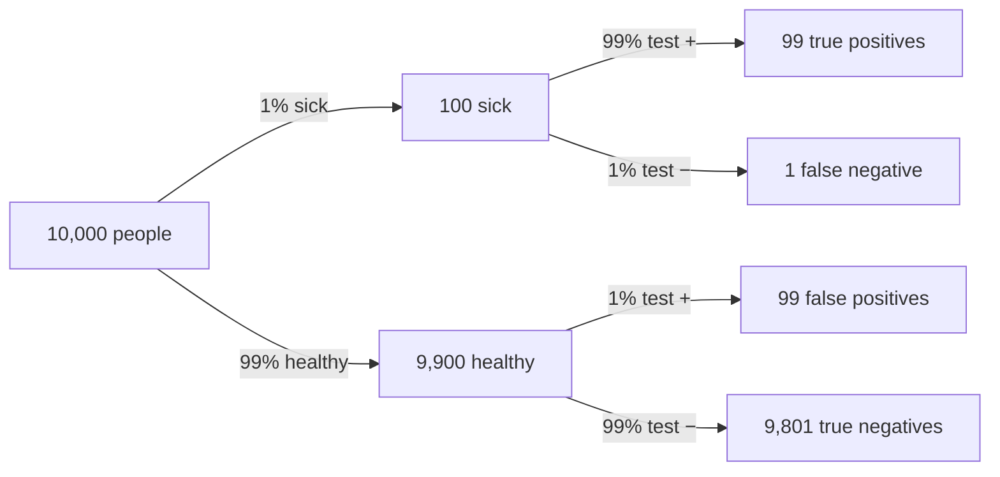
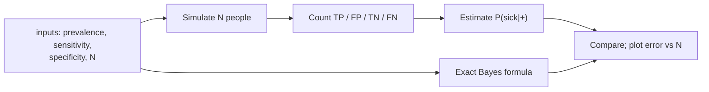

# Chapter 8 — Probability, Distributions & Bayes

> **Volume 0 — Math & Mental Models** · [Contents](index.md) · ← [Chapter 7 — Time/Space Complexity & Amortized Analysis](ch07-time-space-complexity-and-amortized-analysis.md) · Next → [Chapter 9 — Linear Algebra for AI](ch09-linear-algebra-for-ai.md)

---

## Concept

Sample spaces, independence, expectation, variance, common distributions (uniform, binomial, normal), Bayes' theorem.

**In one sentence:** probability is counting with weights, expectation is the long-run average, variance is how far results scatter, and Bayes tells you how to update a belief when new evidence arrives.

**Mental model — 1,000 people in a room.** Instead of juggling percentages, imagine a concrete crowd. "1% have the disease" means 10 people. "The test catches 99%" means about 10 of those 10 test positive. Counting heads is almost always easier than multiplying fractions.

**Core rules**

| Rule | Formula |
|------|---------|
| Probability of an event | `P(A) = favorable / total` (equally likely outcomes) |
| Complement | `P(¬A) = 1 − P(A)` |
| Addition | `P(A ∪ B) = P(A) + P(B) − P(A ∩ B)` |
| Conditional | `P(A \| B) = P(A ∩ B) / P(B)` |
| Multiplication | `P(A ∩ B) = P(A \| B) · P(B)` |
| Independence | `P(A ∩ B) = P(A) · P(B)`, i.e. `P(A \| B) = P(A)` |
| Total probability | `P(B) = P(B\|A)P(A) + P(B\|¬A)P(¬A)` |
| **Bayes** | `P(A \| B) = P(B \| A) · P(A) / P(B)` |

**Expectation and variance**

* `E[X] = Σ x · P(X = x)` — the weighted average. Linear: `E[aX + bY] = aE[X] + bE[Y]`, always, even if X and Y are dependent.
* `Var(X) = E[(X − E[X])²] = E[X²] − E[X]²` — the average squared distance from the mean.
* Standard deviation `σ = √Var(X)` — in the same units as X.

**Common distributions**

| Distribution | Models | Mean | Variance | Example |
|--------------|--------|------|----------|---------|
| Uniform (discrete, 1..n) | equally likely outcomes | `(n+1)/2` | `(n²−1)/12` | a die roll |
| Bernoulli(p) | one yes/no trial | `p` | `p(1−p)` | a single click |
| Binomial(n, p) | successes in n independent trials | `np` | `np(1−p)` | heads in 10 flips |
| Geometric(p) | trials until first success | `1/p` | `(1−p)/p²` | retries until a request succeeds |
| Poisson(λ) | events per interval at a steady rate | `λ` | `λ` | requests per second |
| Normal(μ, σ²) | sums of many small effects | `μ` | `σ²` | measurement noise, latencies (roughly) |

---

## Prereqs

* [Chapter 3 — Combinatorics & Counting](ch03-combinatorics-and-counting.md)

---

## Diagram

**Bayes as a two-branch tree** — disease prevalence 1%, test sensitivity 99%, false-positive rate 1%, population 10,000.



```
 Positives: 99 true + 99 false = 198
 P(sick | positive) = 99 / 198 = 50%      ← not 99%!
```

**The same thing as a count of 198 positive results**

```
 true positives  (sick)     ███████████████████████████████████████████████████  99
 false positives (healthy)  ███████████████████████████████████████████████████  99
                            └── same size: a rare disease × a small error rate
                                ≈ a common condition × a small error rate
```

**Normal distribution: the 68–95–99.7 rule**

```
                     ▁▃▆█████▆▃▁
                  ▁▃█████████████▃▁
               ▁▃███████████████████▃▁
         ▁▁▃▅███████████████████████████▅▃▁▁
  ───────┼──────┼──────┼──────┼──────┼──────┼───────
       μ−3σ   μ−2σ   μ−σ     μ     μ+σ   μ+2σ   μ+3σ
                      ├── 68% ──┤
               ├──────── 95% ────────┤
        ├──────────────── 99.7% ──────────────┤
```

---

## Example

```python
from fractions import Fraction

# Expectation and variance of a fair die
faces = range(1, 7)
E = sum(Fraction(x, 6) for x in faces)
E2 = sum(Fraction(x * x, 6) for x in faces)
print(E, E2 - E**2)            # 7/2  35/12

# Bayes: P(disease | positive)
p_d, sens, fpr = 0.01, 0.99, 0.01
p_pos = sens * p_d + fpr * (1 - p_d)       # total probability
print(sens * p_d / p_pos)                  # 0.5
```

**Monte Carlo check**

```python
import numpy as np
rng = np.random.default_rng(0)

n = 1_000_000
sick = rng.random(n) < 0.01
positive = np.where(sick, rng.random(n) < 0.99, rng.random(n) < 0.01)
print(sick[positive].mean())               # ≈ 0.50

print(rng.integers(1, 7, n).mean())        # ≈ 3.5
```

**Independence in engineering** — if 3 independent replicas each fail with probability 0.01, all three fail with probability `0.01³ = 10⁻⁶`. If they share a power supply, they are *not* independent, and that math is wrong.

---

## Exercises

1. Compute expectation of a fair six-sided die.

   <details><summary>Solution</summary><code>(1+2+3+4+5+6)/6 = 21/6 = 3.5</code>.</details>

2. A test is 99% accurate, disease prevalence 1% — what's P(disease|positive)?

   <details><summary>Solution</summary>With "99% accurate" meaning 99% sensitivity and 99% specificity: <code>0.99·0.01 / (0.99·0.01 + 0.01·0.99) = 0.5</code>. Half of positives are false alarms, because healthy people vastly outnumber sick ones.</details>

3. A request fails independently with probability 0.2. With up to 3 retries (4 attempts), what is the probability it eventually succeeds? What is the expected number of attempts without a limit?

   <details><summary>Solution</summary><code>1 − 0.2⁴ = 0.9984</code>. Unlimited attempts follow Geometric(0.8): expected <code>1/0.8 = 1.25</code>.</details>

---

## Mini project

**A Monte Carlo simulation of a false-positive diagnosis and a die-roll expectation.**



**Steps**

1. Simulate N people with `numpy.random`; draw sickness, then a test result.
2. Print the 2×2 confusion table and the estimated `P(sick | +)`.
3. Compare with the exact Bayes answer; plot the error for N = 10², 10³, …, 10⁶. It should shrink like `1/√N`.
4. Add a slider (or CLI flag) for prevalence and show how `P(sick | +)` changes.
5. Repeat for the die: sample mean and variance vs 3.5 and 35/12.

**Done when:** the simulation matches the exact answer to 2 decimals at N = 10⁶.

---

## Open source

* [`numpy/numpy`](https://github.com/numpy/numpy) — `numpy.random`. Read `numpy/random/_generator.pyx` for `binomial`, `normal`, and `poisson` samplers.

---

## Interview

1. **"Explain Bayes' theorem in plain words."**
   <details><summary>Answer</summary>Your new belief equals your old belief, reweighted by how well each possibility explains the evidence. How likely is A, given I saw B? Take how often B happens when A is true, multiply by how common A was to begin with, and divide by how common B is overall.</details>

2. **"What's the difference between expectation and variance?"**
   <details><summary>Answer</summary>Expectation is the center — the long-run average. Variance is the spread — the average squared distance from that center. Two services can both average 100 ms, but one with high variance has terrible tail latency.</details>

---

## Checklist

- [ ] compute expectation/variance
- [ ] apply Bayes to a real example
- [ ] recognize independence vs conditional dependence

---

> [Contents](index.md) · ← [Chapter 7 — Time/Space Complexity & Amortized Analysis](ch07-time-space-complexity-and-amortized-analysis.md) · Next → [Chapter 9 — Linear Algebra for AI](ch09-linear-algebra-for-ai.md)
