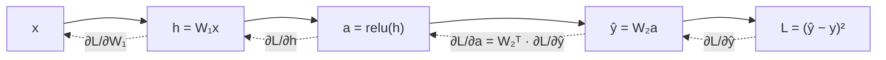
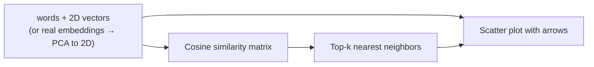

# Chapter 9 — Linear Algebra for AI

> **Volume 0 — Math & Mental Models** · [Contents](index.md) · ← [Chapter 8 — Probability, Distributions & Bayes](ch08-probability-distributions-and-bayes.md)

---

## Concept

Vectors, vector spaces, matrices & operations, dot product as similarity, eigenvalues/eigenvectors (intuition), gradients & derivatives as the engine of backprop.

**In one sentence:** in AI, everything is a list of numbers (a vector), every layer is a matrix that moves those vectors around, and the gradient tells you which way to nudge the numbers to make the answer better.

**Mental model — arrows in space.** A vector is an arrow from the origin. Its direction is *meaning*; its length is *strength*. Two arrows pointing the same way mean similar things. A matrix is a machine that stretches, rotates, or squashes every arrow at once.

**Vectors**

| Operation | Formula | Meaning |
|-----------|---------|---------|
| Add | `a + b = (a₁+b₁, a₂+b₂)` | walk a, then walk b |
| Scale | `c·a` | same direction, c times longer |
| Length (norm) | `‖a‖ = √(a₁² + a₂² + …)` | how long the arrow is |
| Dot product | `a · b = Σ aᵢbᵢ = ‖a‖‖b‖cos θ` | how much they point the same way |
| Cosine similarity | `(a · b) / (‖a‖‖b‖)` | angle only, ignores length; range −1..1 |

**Dot product sign**

| `a · b` | Angle | Meaning |
|---------|-------|---------|
| > 0 | < 90° | similar direction |
| = 0 | 90° | unrelated (orthogonal) |
| < 0 | > 90° | opposite |

**Matrices**

* An `m × n` matrix maps n-dimensional vectors to m-dimensional ones: `y = W x`.
* Multiply `A (m×k) · B (k×n) = C (m×n)`; entry `Cᵢⱼ` = row i of A · column j of B. Inner sizes must match.
* Not commutative: `AB ≠ BA` in general.
* A neural-network layer is `y = activation(W x + b)`.

**Eigenvectors (intuition)** — for most arrows, a matrix changes their direction. An *eigenvector* is a special arrow that the matrix only stretches: `A v = λ v`. The *eigenvalue* λ is the stretch factor. They reveal a matrix's "natural axes" — the idea behind PCA.

**Gradients** — for `f(x, y)`, the gradient `∇f = (∂f/∂x, ∂f/∂y)` points in the direction of steepest increase. Gradient descent steps the *opposite* way: `θ ← θ − η ∇L(θ)`, where L is the loss and η the learning rate. Backpropagation is the chain rule, applied layer by layer, to compute that gradient efficiently.

---

## Prereqs

* [Chapter 2 — Sets, Relations & Functions](ch02-sets-relations-and-functions.md)
* [Chapter 8 — Probability, Distributions & Bayes](ch08-probability-distributions-and-bayes.md)

---

## Diagram

**Dot product as similarity**

```
       y
       │      b (0.9, 0.8)   "puppy"
       │     ╱
       │    ╱ θ small → cos θ ≈ 0.99 → very similar
       │   ╱_____ a (1.0, 0.7)  "dog"
       │  ╱
       │ ╱
  ─────┼──────────────── x
       │ ╲
       │   ╲  c (0.8, −0.9)  "invoice"
       │     ╲   θ ≈ 83° → cos θ ≈ 0.12 → nearly unrelated
```

**A matrix as a transformation of space** — `W = [[2, 0], [0, 1]]` stretches x by 2.

```
 before                     after W
   ┌───┐                    ┌───────┐
   │ ■ │  unit square  ──►  │   ■   │   width doubled,
   └───┘                    └───────┘   height unchanged
   eigenvectors: (1,0) with λ=2, (0,1) with λ=1
```

**Gradient descent on a bowl `L(x, y) = x² + y²`**

```
   contour lines of the loss          each step moves against ∇L
      ╭───────────────╮
     ╭┼───────────╮   │                 ● start (3, 2)
    ╭┼┼─────────╮ │   │                  ╲
    │││   ╭──╮  │ │   │                   ● (1.8, 1.2)
    │││   │★ │  │ │   │                    ╲
    ││╰── ╰──╯ ─╯ │   │                     ● (1.08, 0.72)
    │╰────────────╯   │                      ╲
    ╰─────────────────╯                       ★ minimum (0, 0)
```

**Backprop is the chain rule flowing backward**



---

## Example

```python
import numpy as np
from numpy.linalg import norm

a = np.array([1.0, 0.7])      # "dog"
b = np.array([0.9, 0.8])      # "puppy"
c = np.array([0.8, -0.9])     # "invoice"

cos = lambda u, v: (u @ v) / (norm(u) * norm(v))
print(round(cos(a, b), 3), round(cos(a, c), 3))   # 0.993  0.116

# A matrix transforms vectors
W = np.array([[2, 0], [0, 1]])
print(W @ np.array([1, 1]))                        # [2 1]

# Eigenvectors: directions W only stretches
vals, vecs = np.linalg.eig(W)
print(vals)                                        # [2. 1.]

# Gradient descent on L = x² + y², gradient = (2x, 2y)
p, lr = np.array([3.0, 2.0]), 0.2
for _ in range(20):
    p -= lr * 2 * p
print(p.round(5))                                  # ≈ [0. 0.]
```

**The same gradient, computed automatically**

```python
import torch
x = torch.tensor([3.0, 2.0], requires_grad=True)
loss = (x ** 2).sum()
loss.backward()
print(x.grad)                                      # tensor([6., 4.]) = (2x, 2y)
```

---

## Exercises

1. Compute a dot product by hand and interpret the sign.

   <details><summary>Solution</summary><code>(2, 3) · (4, −1) = 8 − 3 = 5</code>. Positive, so the vectors point in broadly the same direction (angle below 90°).</details>

2. Compute the gradient of `f(x)=x²` and `f(x,y)=x²+y²` at a point.

   <details><summary>Solution</summary><code>f'(x) = 2x</code>, so at x = 3 the slope is 6. <code>∇f(x, y) = (2x, 2y)</code>, so at (1, 2) it is (2, 4) — it points straight away from the minimum at the origin.</details>

3. What shape is the result of `(32 × 768) @ (768 × 3072)`? What does this mean in a transformer?

   <details><summary>Solution</summary><code>32 × 3072</code>. A batch of 32 token vectors of width 768 is projected up to width 3072 — the first layer of a transformer's feed-forward block.</details>

---

## Mini project

**A 2D embedding visualizer that computes cosine similarity and nearest neighbors for a small vector set.**



**Steps**

1. Start with ~15 hand-made 2D vectors for words from 3 topics (animals, finance, sports).
2. Compute the full cosine-similarity matrix with one matrix multiply on normalized vectors.
3. For a query word, print its top 3 neighbors.
4. Plot each vector as an arrow from the origin with `matplotlib`, colored by topic.
5. Bonus: load real embeddings, reduce to 2D with PCA (eigenvectors of the covariance matrix), and plot again.

**Done when:** each query's neighbors come from its own topic, and the plot shows topics as separate "directions".

---

## Open source

* [`numpy/numpy`](https://github.com/numpy/numpy) — `numpy.linalg` (`norm`, `eig`, `svd`).
* [`pytorch/pytorch`](https://github.com/pytorch/pytorch) — `torch.autograd`. Read the "Autograd mechanics" notes to see how every operation records how to compute its own gradient.

---

## Interview

1. **"Why does the dot product measure similarity?"**
   <details><summary>Answer</summary><code>a · b = ‖a‖‖b‖ cos θ</code>. For fixed lengths, it grows as the angle shrinks. If vectors encode features, a large dot product means they share many features with the same signs. Normalizing to cosine removes the effect of length.</details>

2. **"What does an eigenvector represent?"**
   <details><summary>Answer</summary>A direction that a linear transformation only scales, never rotates. Its eigenvalue is the scale factor. In PCA, the top eigenvectors of the covariance matrix are the directions of greatest variance in the data.</details>

---

## Checklist

- [ ] multiply matrices correctly
- [ ] explain dot-product similarity
- [ ] state what a gradient tells you
- [ ] intuit eigenvalues as scaling directions

---

> [Contents](index.md) · ← [Chapter 8 — Probability, Distributions & Bayes](ch08-probability-distributions-and-bayes.md)
