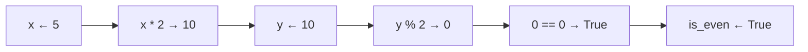
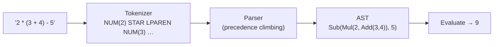

# Chapter 1 — Variables, Data Types & Operators

> **Volume 1 — Computer Science Foundations** · [Contents](index.md) · Next → [Chapter 2 — Control Flow](ch02-control-flow.md)

---

## Concept

Names that hold values; primitive (int, float, bool, char) vs complex (string, struct, object) types; arithmetic, comparison, logical, and bitwise operators; expressions vs statements.

**In one sentence:** a variable is a label stuck on a value, the type says what the value is and what you can do with it, and operators combine values into new values.

**Mental model — labeled boxes vs name tags.** In C and Rust, a variable is a *box*: `int x = 5` reserves 4 bytes and puts 5 inside. In Python and JavaScript, a variable is a *name tag* tied to an object that lives somewhere else. `y = x` ties a second tag to the same object. This one difference explains most "why did my list change?" bugs.

**Primitive types (typical sizes)**

| Type | Size | Range / precision | Rust | C | Python |
|------|-----:|-------------------|------|---|--------|
| bool | 1 byte | true / false | `bool` | `_Bool` | `bool` |
| 8-bit int | 1 | −128..127 or 0..255 | `i8`/`u8` | `int8_t` | — |
| 32-bit int | 4 | ±2.1 × 10⁹ | `i32` | `int` | — |
| 64-bit int | 8 | ±9.2 × 10¹⁸ | `i64` | `long long` | `int` is unbounded |
| 32-bit float | 4 | ~7 decimal digits | `f32` | `float` | — |
| 64-bit float | 8 | ~15–16 decimal digits | `f64` | `double` | `float` |
| char | 1 or 4 | a byte / a Unicode code point | `char` (4) | `char` (1) | 1-char `str` |

**Value vs reference types**

| | Value type | Reference type |
|-|------------|----------------|
| Assignment `b = a` | copies the data | copies the *pointer*; both see the same object |
| Examples | Rust ints/structs, C structs, Go structs | Python lists/dicts, Java objects, JS objects |
| Mutation through `b` | does not affect `a` | *does* affect `a` |

**Operators, by precedence (high → low, Python)**

| Level | Operators |
|-------|-----------|
| 1 | `()` grouping, calls, indexing |
| 2 | `**` |
| 3 | unary `-x`, `~x` |
| 4 | `*  /  //  %` |
| 5 | `+  -` |
| 6 | `<<  >>` |
| 7 | `&` then `^` then `\|` |
| 8 | comparisons `== != < <= > >= in is` |
| 9 | `not` then `and` then `or` |

When in doubt, add parentheses. Readers can't remember this table either.

**Expression vs statement** — an *expression* produces a value (`x * 2`, `f(3)`, `a if c else b`). A *statement* performs an action (`x = 5`, `if`, `return`). In Rust, most things are expressions: `let y = if c { 1 } else { 2 };`.

---

## Prereqs

None.

---

## Diagram

**A variable bound to a value in memory**

```
 Rust / C: the variable IS the box         Python: the variable POINTS to an object

  stack                                     names          heap objects
 ┌──────────┬────────────┐                ┌─────┐        ┌──────────────────┐
 │ x : i32  │ 0x00000005 │                │  a  │──────► │ list [1, 2, 3]   │
 ├──────────┼────────────┤                ├─────┤   ┌──► │ refcount = 2     │
 │ y : i32  │ 0x0000000A │                │  b  │───┘    └──────────────────┘
 └──────────┴────────────┘                └─────┘
  y = x * 2 copies the bits                 b = a copies the arrow, not the list
```

**How `x = 5; y = x * 2; is_even = (y % 2 == 0)` evaluates**



**Bitwise operators on 4-bit values**

```
 a      = 1100
 b      = 1010
 a & b  = 1000   both bits set
 a | b  = 1110   either bit set
 a ^ b  = 0110   bits differ
 a << 1 = 1000   shift left (×2, top bit falls off in 4 bits)
 a >> 2 = 0011   shift right (÷4)
```

---

## Example

```python
x = 5
y = x * 2
is_even = (y % 2 == 0)
print(type(x), type(y), type(is_even))    # <class 'int'> <class 'int'> <class 'bool'>

# Name tags, not boxes
a = [1, 2, 3]
b = a
b.append(4)
print(a)          # [1, 2, 3, 4] — same object
c = a.copy()
c.append(5)
print(a)          # [1, 2, 3, 4] — c is a new object

print(7 / 2, 7 // 2, -7 // 2, 7 % 3)      # 3.5 3 -4 1   (// floors toward −∞)
print(2 ** 100)                           # Python ints never overflow
```

```rust
fn main() {
    let x: i32 = 5;
    let y = x * 2;
    let is_even = y % 2 == 0;
    let label = if is_even { "even" } else { "odd" };   // `if` is an expression
    println!("{y} {is_even} {label}");
    println!("{}", 7 / 2);        // 3   — integer division
    println!("{}", 7.0 / 2.0);    // 3.5
}
```

---

## Exercises

1. Predict the type of `3 / 2` in Python, Rust, and JS.

   <details><summary>Solution</summary>Python: <code>1.5</code> (<code>float</code>; use <code>//</code> for 1). Rust: <code>1</code> (<code>i32</code>; integer division truncates). JavaScript: <code>1.5</code> (every number is a 64-bit float).</details>

2. Write a one-liner using only bitwise ops to swap two ints.

   <details><summary>Solution</summary><code>a ^= b; b ^= a; a ^= b</code>. It works because <code>x ^ x = 0</code> and <code>x ^ 0 = x</code>. It fails if a and b are the same memory location (both become 0), so in real code use <code>a, b = b, a</code>.</details>

3. What does `print(1 + 2 * 3 ** 2 // 4)` output?

   <details><summary>Solution</summary><code>3 ** 2 = 9</code>, <code>2 * 9 = 18</code>, <code>18 // 4 = 4</code>, <code>1 + 4 = 5</code>.</details>

---

## Mini project

**A calculator that reads an expression string, tokenizes it, and evaluates it (+, −, ×, ÷, parentheses).**



**Steps**

1. **Tokenize:** scan characters into numbers, operators, and parentheses; skip spaces.
2. **Parse** with one function per precedence level: `expr → term (('+'|'-') term)*`, `term → factor (('*'|'/') factor)*`, `factor → NUMBER | '(' expr ')' | '-' factor`.
3. **Evaluate** the tree recursively.
4. Report errors with the column number: `unexpected ')' at col 7`.

**Done when:** it matches Python's `eval` on 50 random expressions and never crashes on bad input.

---

## Open source

* [`rust-lang/rust`](https://github.com/rust-lang/rust) type system — see `library/core/src/num/` for how integer types, `checked_add`, and `wrapping_add` are defined.
* [`python/cpython`](https://github.com/python/cpython) `operator` module — `Lib/operator.py` shows every operator as a plain function (`operator.add`, `operator.and_`).

---

## Interview

1. **"What's the difference between an expression and a statement?"**
   <details><summary>Answer</summary>An expression evaluates to a value and can be nested inside other expressions. A statement performs an action and does not produce a value. <code>x + 1</code> is an expression; <code>x = x + 1</code> is a statement in Python but an expression in C.</details>

2. **"Explain `x++` vs `++x`."**
   <details><summary>Answer</summary>Both add 1 to x. <code>x++</code> (post-increment) evaluates to the <i>old</i> value; <code>++x</code> (pre-increment) evaluates to the <i>new</i> value. With x = 5, <code>y = x++</code> sets y to 5; <code>y = ++x</code> sets y to 6.</details>

---

## Checklist

- [ ] name each primitive type's size/range
- [ ] know operator precedence
- [ ] distinguish value vs reference types

---

> [Contents](index.md) · Next → [Chapter 2 — Control Flow](ch02-control-flow.md)
