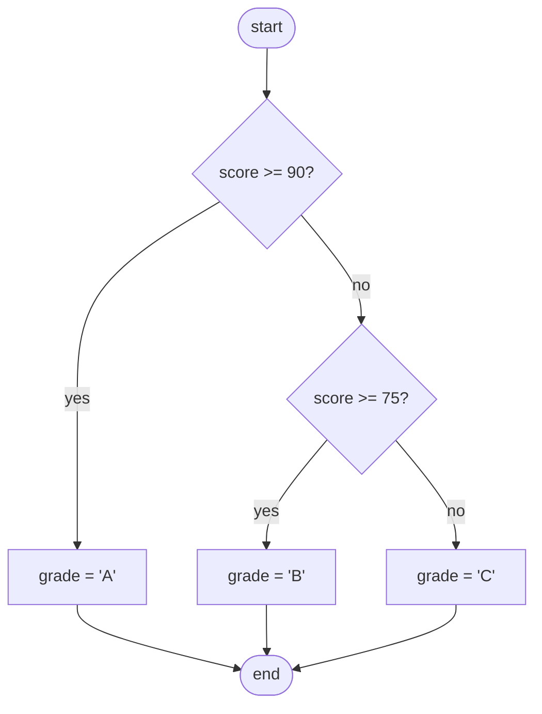
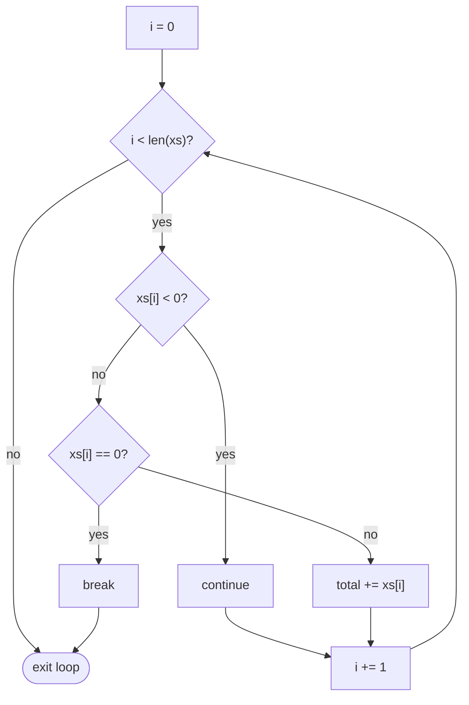
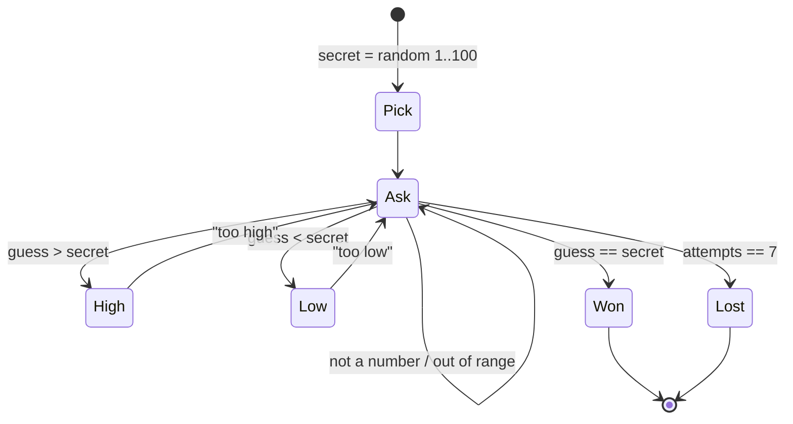

# Chapter 2 — Control Flow

> **Volume 1 — Computer Science Foundations** · [Contents](index.md) · ← [Chapter 1 — Variables, Data Types & Operators](ch01-variables-data-types-and-operators.md) · Next → [Chapter 3 — Functions, Parameters, Return Values, Scope & Namespaces](ch03-functions-parameters-return-values-scope-and-namespaces.md)

---

## Concept

`if`/`else`, `switch`/`match`, and loops (`for`, `while`, `do/while`, break, continue). Pattern matching in modern languages.

**In one sentence:** control flow decides *which* line runs next — branch on a condition, repeat while a condition holds, or jump out early.

**Mental model — a train on tracks.** The program is a train running straight down the track. An `if` is a switch point that sends it left or right. A loop is a circular siding it goes around until a signal turns green. `break` is an emergency exit off the loop. `continue` skips the rest of this lap.

**The building blocks**

| Construct | Use when | Notes |
|-----------|----------|-------|
| `if / elif / else` | 2–3 conditions | order matters: first true branch wins |
| `switch` (C, Java, JS) | one value vs many constants | falls through without `break` |
| `match` (Rust, Python 3.10+, Scala) | one value vs many *shapes* | destructures data; Rust checks exhaustiveness |
| `for x in items` | known collection | preferred; no index bugs |
| `for (i = 0; i < n; i++)` | index arithmetic needed | off-by-one risk |
| `while cond` | unknown number of iterations | make sure cond eventually becomes false |
| `do { } while (cond)` | body must run at least once | e.g. "ask until valid" |
| `break` | leave the loop now | |
| `continue` | skip to the next iteration | |
| `return` | leave the whole function | often the clearest early exit |

**Pattern matching** goes beyond comparing values. It matches *structure* and binds names:

```python
match command.split():
    case ["go", direction]:        # list of 2, first is "go"
        move(direction)
    case ["take", *items]:         # "take" followed by anything
        pick_up(items)
    case _:
        print("unknown")
```

**Off-by-one errors** — the most common loop bug. Use half-open ranges `[start, end)`: `range(0, n)` runs n times, and `range(a, b)` has `b − a` items.

---

## Prereqs

* [Chapter 1 — Variables, Data Types & Operators](ch01-variables-data-types-and-operators.md)

---

## Diagram

**if / else branching**



**A loop with its exit condition, break, and continue**



**C-style switch fallthrough**

```
 switch (n) {            n = 1 runs:
   case 1: puts("one");     "one"
   case 2: puts("two");     "two"    ← fell through! no break
           break;
   case 3: puts("three");   (stops at break)
 }
```

---

## Example

```rust
enum Shape {
    Circle { r: f64 },
    Rect { w: f64, h: f64 },
    Triangle { b: f64, h: f64 },
}

fn area(s: &Shape) -> f64 {
    match s {                                  // compiler checks every variant is handled
        Shape::Circle { r } => std::f64::consts::PI * r * r,
        Shape::Rect { w, h } => w * h,
        Shape::Triangle { b, h } => 0.5 * b * h,
    }
}

fn main() {
    let xs = [3, 1, 4, 1, 5];
    let mut total = 0;
    for x in xs {
        total += x;
    }
    println!("{total}");                                   // 14
    println!("{:.2}", area(&Shape::Circle { r: 1.0 }));    // 3.14
}
```

```python
# Early return beats deeply nested ifs
def shipping_cost(order):
    if not order.items:
        return 0
    if order.total >= 50:
        return 0
    if order.express:
        return 15
    return 5
```

---

## Exercises

1. Rewrite an if/else chain as a `match`.

   ```python
   if status == 200: msg = "ok"
   elif status == 404: msg = "not found"
   elif status in (500, 502, 503): msg = "server error"
   else: msg = "other"
   ```

   <details><summary>Solution</summary>

   ```python
   match status:
       case 200: msg = "ok"
       case 404: msg = "not found"
       case 500 | 502 | 503: msg = "server error"
       case _: msg = "other"
   ```
   </details>

2. Implement FizzBuzz using both a loop and recursion.

   <details><summary>Solution</summary>

   ```python
   def fb(i):
       return "FizzBuzz" if i % 15 == 0 else "Fizz" if i % 3 == 0 else "Buzz" if i % 5 == 0 else str(i)

   for i in range(1, 101):
       print(fb(i))

   def fizzbuzz_rec(i=1, n=100):
       if i > n:
           return
       print(fb(i))
       fizzbuzz_rec(i + 1, n)
   ```
   </details>

3. How many times does `for i in range(2, 10, 3)` run, and with which values?

   <details><summary>Solution</summary>3 times: 2, 5, 8.</details>

---

## Mini project

**A number-guessing game with input validation and a retry loop.**



**Steps**

1. Pick a secret number with `random.randint(1, 100)`.
2. Loop: read input, reject non-numbers and out-of-range values *without* using up an attempt.
3. Say "too high" or "too low"; `break` on a win.
4. Use `for … else` (Python) to print a loss message when attempts run out.
5. Ask "play again?" with a `do/while`-style loop.

**Done when:** no input can crash it, and 7 attempts are always enough with binary search (log₂ 100 < 7).

---

## Open source

* [`python/cpython`](https://github.com/python/cpython) `match` statement (3.10+) — read PEP 634 and `Lib/test/test_patma.py` for hundreds of real match cases.

---

## Interview

1. **"When is `switch` faster than an if/else chain?"**
   <details><summary>Answer</summary>When cases are dense integer constants, compilers can build a jump table: one indexed jump, O(1), instead of up to n comparisons. For sparse values they may use binary search. Modern compilers often optimize if/else chains the same way, so measure before caring.</details>

2. **"Explain fallthrough in C-style switch."**
   <details><summary>Answer</summary>A <code>case</code> label is only an entry point. Execution continues into the next case until a <code>break</code>. It lets several cases share code, but a forgotten break is a classic bug, so C# forbids implicit fallthrough and Go requires an explicit <code>fallthrough</code> keyword.</details>

---

## Checklist

- [ ] convert if/else to match
- [ ] know loop exit vs continue
- [ ] avoid off-by-one errors

---

> [Contents](index.md) · ← [Chapter 1 — Variables, Data Types & Operators](ch01-variables-data-types-and-operators.md) · Next → [Chapter 3 — Functions, Parameters, Return Values, Scope & Namespaces](ch03-functions-parameters-return-values-scope-and-namespaces.md)
