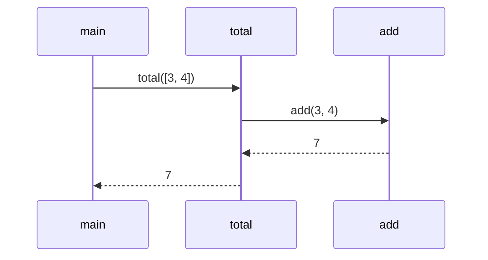
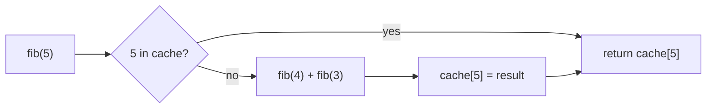

# Chapter 3 — Functions, Parameters, Return Values, Scope & Namespaces

> **Volume 1 — Computer Science Foundations** · [Contents](index.md) · ← [Chapter 2 — Control Flow](ch02-control-flow.md) · Next → [Chapter 4 — Built-in Data Structures](ch04-built-in-data-structures.md)

---

## Concept

Defining and calling functions; parameters vs arguments; pass-by-value vs pass-by-reference; return values (incl. multiple); lexical scope, closures over scope, and namespaces.

**In one sentence:** a function is a named, reusable recipe; parameters are its ingredients; scope decides which names the recipe can see; and a closure is a recipe that remembers the kitchen it was written in.

**Mental model — a stack of sticky notes.** Each call puts a new sticky note on top of a pile. The note holds that call's parameters and local variables. When the function returns, its note is thrown away and control goes back to the note underneath. That pile is the *call stack*.

**Terms**

| Term | Meaning | Example |
|------|---------|---------|
| Parameter | the name in the definition | `a`, `b` in `def add(a, b)` |
| Argument | the value passed at the call | `2`, `3` in `add(2, 3)` |
| Positional / keyword | matched by order / by name | `add(2, b=3)` |
| Default value | used when the argument is omitted | `def greet(name="world")` |
| Return value | what the call evaluates to | `return a + b` |
| Multiple returns | usually a tuple | `return q, r` → `q, r = divmod(7, 2)` |

**Passing arguments — three models**

| Model | What the callee gets | Can it change the caller's variable? | Languages |
|-------|---------------------|:-:|-----------|
| Pass by value | a copy of the value | no | C, Rust (for `Copy` types), Go |
| Pass by reference | an alias to the caller's variable | yes | C++ `int&`, Rust `&mut`, C# `ref` |
| Pass by object reference ("sharing") | a copy of the *pointer* | can mutate the object, cannot rebind the caller's name | Python, Java, JS |

**Scope: the LEGB rule (Python)** — names are looked up in this order:

1. **L**ocal — inside the current function.
2. **E**nclosing — inside any outer function.
3. **G**lobal — the module's top level.
4. **B**uilt-in — `len`, `print`, …

**Lexical scope** means what a function can see is fixed by *where it is written*, not by where it is called from.

**Closure** — a function plus the variables from its enclosing scope that it uses. Those variables stay alive as long as the function does.

**Namespace** — a mapping from names to objects. Every module, class, and function call has its own, which is why two modules can each define `load()` without clashing.

---

## Prereqs

* [Chapter 2 — Control Flow](ch02-control-flow.md)

---

## Diagram

**The call stack for `main() → total(xs) → add(a, b)`**

```
                     ┌───────────────────────────┐  ← top (running now)
                     │ add                       │
                     │   a = 3, b = 4            │
                     │   return address → total  │
                     ├───────────────────────────┤
                     │ total                     │
                     │   xs = [3, 4], acc = 3    │
                     │   return address → main   │
                     ├───────────────────────────┤
                     │ main                      │
                     │   result = ?              │
                     └───────────────────────────┘  ← bottom
   add returns 7 → its frame is popped → total resumes with acc = 7
```



**A closure keeps its enclosing variable alive**

```
 make_counter() returns ──► ┌────────────────────┐
                            │ function increment │
                            │  __closure__ ──────┼──► cell: count = 2
                            └────────────────────┘
 make_counter's frame is gone, but `count` lives on in the cell.
```

---

## Example

```python
def add(a, b):
    return a + b

def divmod_(a, b):
    return a // b, a % b          # multiple return values = a tuple

q, r = divmod_(17, 5)             # 3, 2

# Pass by object reference
def mutate(xs):
    xs.append(99)                 # changes the caller's list

def rebind(xs):
    xs = [0]                      # only changes the local name

data = [1]
mutate(data); rebind(data)
print(data)                       # [1, 99]

# A closure capturing a counter
def make_counter():
    count = 0
    def increment():
        nonlocal count            # write to the enclosing variable
        count += 1
        return count
    return increment

c = make_counter()
print(c(), c(), c())              # 1 2 3

# Trap: mutable default arguments are created ONCE
def bad(x, acc=[]):
    acc.append(x); return acc
print(bad(1), bad(2))             # [1, 2] [1, 2] — shared list!

def good(x, acc=None):
    acc = [] if acc is None else acc
    acc.append(x); return acc
```

---

## Exercises

1. Predict the output of a function with shadowed vs captured variables.

   ```python
   x = "global"
   def outer():
       x = "enclosing"
       def inner():
           return x
       x = "changed"
       return inner
   print(outer()())
   ```

   <details><summary>Solution</summary><code>changed</code>. The closure captures the <i>variable</i>, not its value at definition time, so it sees the last assignment before <code>inner()</code> runs.</details>

2. Write a function that returns another function.

   <details><summary>Solution</summary>

   ```python
   def multiplier(n):
       return lambda x: x * n

   double = multiplier(2)
   print(double(21))   # 42
   ```
   </details>

3. What does this print, and why? `fs = [lambda: i for i in range(3)]; print([f() for f in fs])`

   <details><summary>Solution</summary><code>[2, 2, 2]</code>. All three lambdas share the same <code>i</code>, which ends at 2. Fix it by binding at definition: <code>lambda i=i: i</code>.</details>

---

## Mini project

**A memoizing `fib(n)` that demonstrates parameter passing and closure state.**



**Steps**

1. Write `make_memo(f)` that returns a wrapper holding a private `cache` dict in its closure.
2. Apply it to a naive recursive `fib`, and count calls with and without memoization.
3. Show that two memoized functions have *separate* caches (separate closures).
4. Compare with `functools.lru_cache` and inspect `fib.__wrapped__` and `cache_info()`.

**Done when:** `fib(80)` returns instantly, and the call count drops from exponential to 81.

---

## Open source

* [`rust-lang/rust`](https://github.com/rust-lang/rust) (explicit lifetimes and scoping) — The Rust Book, chapter 13 "Closures", shows `Fn`, `FnMut`, and `FnOnce`: the three ways a closure can capture its scope.

---

## Interview

1. **"Pass-by-value vs pass-by-reference — what does Python do?"**
   <details><summary>Answer</summary>Neither, strictly. Python passes object references by value ("call by sharing"). The function gets its own name bound to the same object. Mutating the object is visible to the caller; rebinding the name is not.</details>

2. **"What is a closure?"**
   <details><summary>Answer</summary>A function bundled with references to variables from the scope where it was defined. Those variables outlive the outer call. Closures power callbacks, decorators, factories, and private state.</details>

---

## Checklist

- [ ] trace a call stack
- [ ] explain lexical scope
- [ ] write a closure from scratch

---

> [Contents](index.md) · ← [Chapter 2 — Control Flow](ch02-control-flow.md) · Next → [Chapter 4 — Built-in Data Structures](ch04-built-in-data-structures.md)
