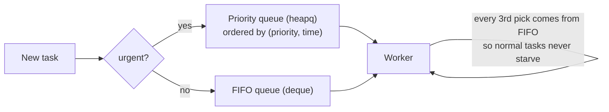

# Chapter 4 — Built-in Data Structures

> **Volume 1 — Computer Science Foundations** · [Contents](index.md) · ← [Chapter 3 — Functions, Parameters, Return Values, Scope & Namespaces](ch03-functions-parameters-return-values-scope-and-namespaces.md) · Next → [Chapter 5 — Modules, Packages, Imports & Dependency Management](ch05-modules-packages-imports-and-dependency-management.md)

---

## Concept

Arrays, lists, tuples, dictionaries/hashmaps, sets, queues, stacks — operations and time complexity for each.

**In one sentence:** each data structure is a trade-off between how fast you can find, add, and remove things, and choosing the right one is often the whole optimization.

**Mental model — storage in a house.**

* **Array/list** — a row of numbered lockers. Jump to locker 57 at once; inserting in the middle means shifting everyone.
* **Tuple** — a sealed, labeled box. You can read it, not change it.
* **Dict/hashmap** — a coat check. Hand over a ticket (key), get your coat (value) at once.
* **Set** — a guest list. Only "is this person on it?" matters.
* **Stack** — a pile of plates. Last on, first off (LIFO).
* **Queue** — a line at a shop. First in, first out (FIFO).

**Big-O cheat sheet (Python, average case)**

| Structure | Index `x[i]` | Search `in` | Append / push | Insert at front | Delete by key | Ordered? |
|-----------|:-:|:-:|:-:|:-:|:-:|:-:|
| `list` (dynamic array) | O(1) | O(n) | O(1)* | O(n) | O(n) | yes |
| `tuple` | O(1) | O(n) | — immutable | — | — | yes |
| `dict` | — | O(1) key | O(1) | — | O(1) | insertion order (3.7+) |
| `set` | — | O(1) | O(1) | — | O(1) | no |
| `collections.deque` | O(n) middle | O(n) | O(1) both ends | O(1) | O(n) | yes |
| `heapq` on a list | — | O(n) | O(log n) | — | O(log n) min | heap order |

\* amortized — see [Vol 0 Ch 7](../volume-0-math/ch07-time-space-complexity-and-amortized-analysis.md).

**Which one should I use?**

| Need | Use |
|------|-----|
| ordered items, access by position | `list` |
| fixed record, dict key, return several values | `tuple` |
| look up by key | `dict` |
| uniqueness, fast membership | `set` |
| undo history, DFS, matching brackets | stack (`list`) |
| BFS, job line, buffering | queue (`deque`) |
| "always give me the smallest/most urgent" | priority queue (`heapq`) |
| count things | `collections.Counter` |

---

## Prereqs

* [Chapter 1 — Variables, Data Types & Operators](ch01-variables-data-types-and-operators.md)

---

## Diagram

**A hashmap with buckets and chaining**

```
 key "apple" ──► hash("apple") = 9_817_223 ──► 9_817_223 % 8 = 7
 key "grape" ──► hash("grape") = 4_441_017 ──► 4_441_017 % 8 = 1
 key "melon" ──► hash("melon") = 2_003_191 ──► 2_003_191 % 8 = 7   ← collision

  buckets
  [0] ∅
  [1] ─► ("grape", 3)
  [2] ∅
  [3] ∅
  [4] ∅
  [5] ∅
  [6] ∅
  [7] ─► ("apple", 5) ─► ("melon", 2)     chain: compare keys one by one
```

When the table gets too full (load factor above ~⅔), it doubles and every key is re-placed. Python actually uses *open addressing* (probe the next slot) rather than chains, but the idea is the same.

**Stack (LIFO) vs queue (FIFO)**

```
 STACK                                 QUEUE
 push 1, push 2, push 3                enqueue 1, 2, 3
      ┌───┐ ◄── push / pop                   out ◄──┌───┬───┬───┐◄── in
      │ 3 │     pop → 3                 dequeue → 1 │ 1 │ 2 │ 3 │
      ├───┤                                         └───┴───┴───┘
      │ 2 │
      ├───┤
      │ 1 │
      └───┘
```

**Why inserting at the front of a list is O(n)**

```
 insert(0, 'X') into [A, B, C, D]
   step 1: shift  [_, A, B, C, D]   ← every element moves right
   step 2: place  [X, A, B, C, D]
```

---

## Example

```python
from collections import deque, defaultdict, Counter
import heapq

d = {"a": 1}
d["a"] += 1                                  # hashmap update: O(1)
d.setdefault("b", 0)

stack = []
stack.append(1); stack.append(2)
print(stack.pop())                           # 2 — LIFO

q = deque()
q.append("job1"); q.append("job2")
print(q.popleft())                           # job1 — FIFO, O(1)
# list.pop(0) would also work, but it is O(n)

groups = defaultdict(list)
for word in ["apple", "avocado", "banana"]:
    groups[word[0]].append(word)
print(dict(groups))                          # {'a': ['apple', 'avocado'], 'b': ['banana']}

print(Counter("mississippi").most_common(2)) # [('i', 4), ('s', 4)]

tasks = []
heapq.heappush(tasks, (2, "write docs"))
heapq.heappush(tasks, (1, "fix prod bug"))
print(heapq.heappop(tasks))                  # (1, 'fix prod bug') — smallest first

point = (3, 4)                               # tuple: immutable, hashable
seen = {point}                               # can be a set member or dict key
```

---

## Exercises

1. Implement a stack using only a list.

   <details><summary>Solution</summary>

   ```python
   class Stack:
       def __init__(self): self._items = []
       def push(self, x): self._items.append(x)          # O(1) amortized
       def pop(self):
           if not self._items: raise IndexError("pop from empty stack")
           return self._items.pop()                      # O(1)
       def peek(self): return self._items[-1]
       def __len__(self): return len(self._items)
   ```
   Push and pop at the *end* of the list. The front would make them O(n).
   </details>

2. Explain when to use a tuple over a list.

   <details><summary>Solution</summary>Use a tuple for a fixed-size record whose fields mean different things (<code>(lat, lon)</code>), when you need a hashable value (dict key, set member), or to signal "this should not change". Use a list for a variable-length collection of similar items.</details>

3. Check whether a string of brackets like `"([]{})"` is balanced.

   <details><summary>Solution</summary>Push each opener on a stack. On a closer, pop and check it matches. The string is balanced if every pop matches and the stack is empty at the end. O(n).</details>

---

## Mini project

**A task scheduler using a priority queue and a simple FIFO queue.**



**Steps**

1. `add(task, priority=None)`: urgent tasks go to a heap as `(priority, counter, task)`; the counter breaks ties in arrival order.
2. Normal tasks go to a `deque`.
3. `next()` usually takes from the heap, but every 3rd call takes from the FIFO queue to prevent starvation.
4. Add `peek`, `len`, and a simulation of 1,000 random tasks showing the wait-time distribution per queue.

**Done when:** urgent tasks always run first among urgent tasks, and no normal task waits forever.

---

## Open source

* [`python/cpython`](https://github.com/python/cpython) `collections` (`deque`, `defaultdict`) — `Modules/_collectionsmodule.c` shows `deque` as a doubly linked list of 64-item blocks, which is why both ends are O(1). `Objects/dictobject.c` has a long comment explaining Python's compact dict design.

---

## Interview

1. **"Array vs linked list — when is each better?"**
   <details><summary>Answer</summary>Arrays give O(1) indexing and are cache-friendly because elements are contiguous. Inserts in the middle are O(n). Linked lists give O(1) insert/delete at a known node but O(n) indexing and poor cache behavior. In practice, arrays win almost always; linked lists fit when you splice often and already hold node pointers (LRU caches, allocators).</details>

2. **"How does a hashmap achieve O(1) lookup?"**
   <details><summary>Answer</summary>It hashes the key to an integer and uses it (mod table size) as an array index, so it jumps straight to one slot. Collisions are handled by chaining or probing. Keeping the load factor bounded by resizing keeps the expected chain length constant. The worst case is O(n) if many keys collide.</details>

---

## Checklist

- [ ] know each structure's big-O
- [ ] pick the right structure for a task
- [ ] implement stack/queue by hand

---

> [Contents](index.md) · ← [Chapter 3 — Functions, Parameters, Return Values, Scope & Namespaces](ch03-functions-parameters-return-values-scope-and-namespaces.md) · Next → [Chapter 5 — Modules, Packages, Imports & Dependency Management](ch05-modules-packages-imports-and-dependency-management.md)
