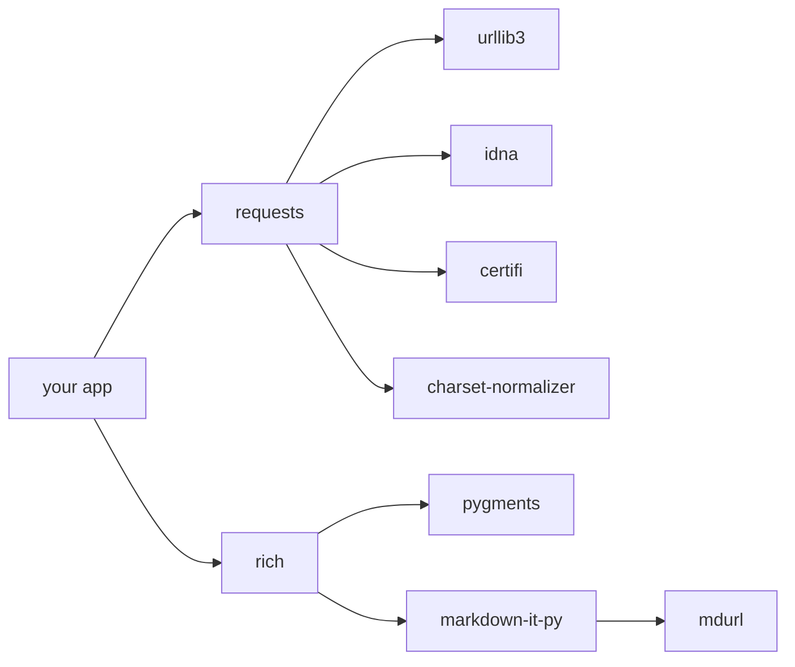
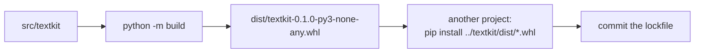

# Chapter 5 — Modules, Packages, Imports & Dependency Management

> **Volume 1 — Computer Science Foundations** · [Contents](index.md) · ← [Chapter 4 — Built-in Data Structures](ch04-built-in-data-structures.md) · Next → [Chapter 6 — Error Handling](ch06-error-handling.md)

---

## Concept

Splitting code into modules, bundling into packages/libraries, importing, and pinning dependencies.

**In one sentence:** modules split your code into files, packages group files into a folder others can install, and a lockfile freezes the exact versions so every machine builds the same thing.

**Mental model — LEGO sets.** A module is one bag of bricks. A package is the whole box with instructions. Dependencies are other boxes you need. The lockfile is a receipt listing the *exact* box editions you bought, so a friend can rebuild the same model.

**Levels**

| Level | Python | Rust | JavaScript |
|-------|--------|------|------------|
| Module | one `.py` file | one `mod` / `.rs` file | one `.js` file (ES module) |
| Package | folder with `__init__.py` | a crate | a folder with `package.json` |
| Distribution | wheel on PyPI | crate on crates.io | package on npm |
| Manifest | `pyproject.toml` | `Cargo.toml` | `package.json` |
| Lockfile | `uv.lock` / `poetry.lock` / `requirements.txt` (pinned) | `Cargo.lock` | `package-lock.json` / `pnpm-lock.yaml` |

**Version specifiers (Semantic Versioning `MAJOR.MINOR.PATCH`)**

| Spec | Meaning | Allows |
|------|---------|--------|
| `==1.4.2` (pip) / `=1.4.2` (cargo) | exact | only 1.4.2 |
| `~=1.4.2` (pip) | "compatible release" | `>=1.4.2, <1.5` |
| `~=1.4` (pip) | | `>=1.4, <2.0` |
| `^1.4.2` (npm, cargo default) | same major | `>=1.4.2, <2.0.0` |
| `^0.4.2` | 0.x is unstable, so minor acts as major | `>=0.4.2, <0.5.0` |
| `~1.4.2` (npm) | same minor | `>=1.4.2, <1.5.0` |

**Manifest vs lockfile** — the manifest states *ranges* you accept (`requests>=2.31`). The lockfile records the *exact* resolved versions and hashes of every direct and transitive dependency. Libraries publish ranges; applications commit lockfiles.

**How Python finds an import** — `import foo` checks `sys.modules` (already loaded?), then searches each directory in `sys.path` in order: the script's directory, `PYTHONPATH`, then site-packages. The first match wins. A local file named `json.py` will shadow the standard library.

---

## Prereqs

* [Chapter 3 — Functions, Parameters, Return Values, Scope & Namespaces](ch03-functions-parameters-return-values-scope-and-namespaces.md) — each module is its own namespace.

---

## Diagram

**Modules → package → library**

```
 textkit/                       ← project root
 ├── pyproject.toml             ← manifest: name, version, dependencies
 ├── uv.lock                    ← lockfile: exact versions + hashes
 ├── src/
 │   └── textkit/               ← the package (import textkit)
 │       ├── __init__.py        ← runs on import; defines the public API
 │       ├── tokenize.py        ← module: textkit.tokenize
 │       ├── stats.py           ← module: textkit.stats
 │       └── formats/           ← subpackage
 │           ├── __init__.py
 │           └── csv_io.py      ← textkit.formats.csv_io
 └── tests/
     └── test_stats.py
```

**The dependency graph** — you list 2; you get 6.



**A circular import**


Fix it by moving shared code into a third module, importing inside the function that needs it, or depending on an interface instead.

---

## Example

```python
import numpy as np                     # module import with an alias
from pathlib import Path               # import one name
from textkit.stats import word_count   # import from your own package

import sys
print(sys.path[:3])                    # where Python looks
print(np.__file__)                     # where it actually found numpy
```

```toml
# pyproject.toml
[project]
name = "textkit"
version = "0.1.0"
requires-python = ">=3.11"
dependencies = [
  "requests~=2.31",      # >=2.31, <3.0
  "rich>=13,<14",
]

[build-system]
requires = ["hatchling"]
build-backend = "hatchling.build"
```

```bash
pip install -e .          # editable install: imports point at your source folder
uv lock                   # resolve and write uv.lock
uv sync                   # install exactly what the lockfile says
```

```toml
# Cargo.toml
[dependencies]
serde = { version = "1.0", features = ["derive"] }   # means ^1.0
tokio = "=1.38.0"                                    # exact pin
```

---

## Exercises

1. Create a package with `__init__.py` and import a submodule.

   <details><summary>Solution</summary>

   ```
   shapes/__init__.py      →  from .circle import area as circle_area
   shapes/circle.py        →  def area(r): return 3.14159 * r * r
   main.py                 →  import shapes; print(shapes.circle_area(2))
   ```
   Relative imports (<code>from .circle</code>) keep the package movable.
   </details>

2. Pin a dependency and explain `~=` vs `==` vs `^`.

   <details><summary>Solution</summary><code>==2.31.0</code> accepts only that version. <code>~=2.31.0</code> accepts patch updates (<code>&lt;2.32</code>). <code>^2.31.0</code> (npm/cargo) accepts any 2.x at or above 2.31.0. Tighter pins mean fewer surprises but more manual upgrades.</details>

3. Your script `random.py` fails with `AttributeError: module 'random' has no attribute 'randint'`. Why?

   <details><summary>Solution</summary>Your own <code>random.py</code> is first on <code>sys.path</code>, so it shadows the standard library module. Rename the file and delete <code>__pycache__</code>.</details>

---

## Mini project

**A small reusable library published locally with a lockfile.**



**Steps**

1. Create `textkit` with a `src/` layout, two modules, and a clean public API in `__init__.py` (`__all__`).
2. Add one third-party dependency with a compatible-release range.
3. Build a wheel with `python -m build`.
4. In a second project, install the wheel, lock, and commit the lockfile.
5. Bump `textkit` to 0.2.0 with a breaking change; show that the consumer's lockfile protects it until it upgrades on purpose.

**Done when:** a clean virtualenv plus `uv sync` (or `pip install -r requirements.txt`) reproduces the exact environment.

---

## Open source

* [`python/cpython`](https://github.com/python/cpython) import system — `Lib/importlib/_bootstrap.py` is the real import machinery, written in Python.
* [`rust-lang/cargo`](https://github.com/rust-lang/cargo) — `src/cargo/core/resolver/` is the dependency resolver that turns version ranges into `Cargo.lock`.

---

## Interview

1. **"What's the difference between a module and a package?"**
   <details><summary>Answer</summary>A module is a single file of code with its own namespace. A package is a directory of modules (in Python, marked by <code>__init__.py</code>) that can be imported as a unit and have submodules. "Package" also means a distributable artifact on a registry.</details>

2. **"What problem do lockfiles solve?"**
   <details><summary>Answer</summary>Reproducibility. Version ranges resolve differently over time as new releases come out, so two installs a week apart can differ. A lockfile records the exact version and hash of every transitive dependency. That gives identical builds, safer upgrades (one reviewable diff), and protection against tampered packages.</details>

---

## Checklist

- [ ] structure a package cleanly
- [ ] read a lockfile
- [ ] avoid circular imports

---

> [Contents](index.md) · ← [Chapter 4 — Built-in Data Structures](ch04-built-in-data-structures.md) · Next → [Chapter 6 — Error Handling](ch06-error-handling.md)
