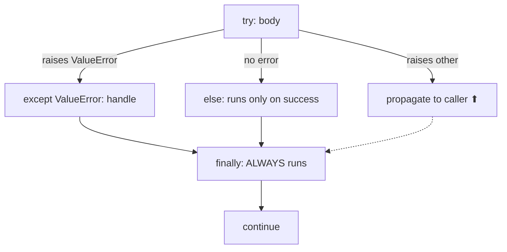
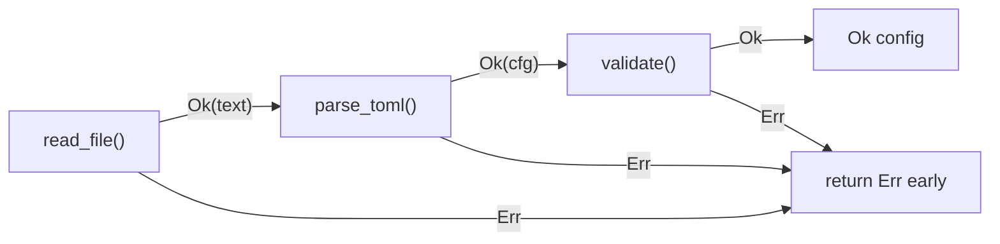
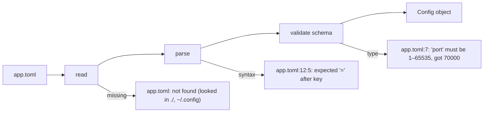

# Chapter 6 — Error Handling

> **Volume 1 — Computer Science Foundations** · [Contents](index.md) · ← [Chapter 5 — Modules, Packages, Imports & Dependency Management](ch05-modules-packages-imports-and-dependency-management.md) · Next → [Chapter 7 — File I/O](ch07-file-i-o.md)

---

## Concept

Exceptions, panics, `Result`/`Option` types, error propagation (`?`), and custom error types. Fail loudly vs gracefully.

**In one sentence:** errors are part of your function's real return type, and good error handling means every failure is either handled on purpose or reported clearly — never silently swallowed.

**Mental model — a relay race.** When a runner trips, they must pass along a note: what went wrong and where. Each runner either fixes the problem (handles it) or adds a line to the note and passes it on (propagates with context). The worst runner hides the note in their pocket (`except: pass`).

**Two styles**

| | Exceptions | Error values (`Result`, `Option`, `err`) |
|-|------------|----------------------------------------|
| Languages | Python, Java, C#, JS, C++ | Rust, Go, Haskell, Swift (partly) |
| Visible in the signature? | no (except Java checked exceptions) | yes: `fn parse() -> Result<Config, Error>` |
| Propagation | automatic, up the stack | explicit: `?` in Rust, `if err != nil` in Go |
| Cost | cheap when not thrown; slow when thrown | ordinary return value |
| Risk | forgetting a failure path exists | verbose; ignoring a returned error |

**Recoverable vs fatal**

| Kind | Examples | What to do |
|------|----------|------------|
| Expected / recoverable | file not found, invalid input, timeout | return an error or raise a specific exception; the caller decides |
| Bug / invariant broken | index out of range, `None` where impossible | fail fast: `panic!`, `assert`, crash with a stack trace |
| Environmental / fatal | out of memory, disk full | log clearly, exit, let the supervisor restart |

**Rules of thumb**

1. Catch the *narrowest* exception type you can actually handle.
2. Add context when you re-raise: *what* you were doing and *with which input*.
3. Handle errors at the level that can make a decision (retry, default, tell the user).
4. Clean up with `finally`, `with`, or RAII (Rust `Drop`), not by hand on each path.
5. Never `except Exception: pass`.

---

## Prereqs

* [Chapter 3 — Functions, Parameters, Return Values, Scope & Namespaces](ch03-functions-parameters-return-values-scope-and-namespaces.md)

---

## Diagram

**Python try / except / else / finally**



**Rust `Result<T, E>` propagation with `?`**

```
 main()
  └─ load_config("app.toml")?          ← Err bubbles up to main
       └─ read_file(path)?              ← Ok(text) continues
       └─ parse_toml(&text)?            ← Err(ParseError{line: 12})
                                            │
     each ? means: "if Err, return it now (converted with From); if Ok, unwrap"
```



---

## Example

```python
class ConfigError(Exception):
    """A config problem the user can fix."""
    def __init__(self, path, line, message):
        super().__init__(f"{path}:{line}: {message}")
        self.path, self.line = path, line

def load_port(path):
    try:
        f = open(path, encoding="utf-8")
    except FileNotFoundError as e:
        raise ConfigError(path, 0, "file not found") from e    # keep the cause
    else:
        with f:
            for n, line in enumerate(f, 1):
                if line.startswith("port="):
                    value = line.split("=", 1)[1].strip()
                    try:
                        return int(value)
                    except ValueError:
                        raise ConfigError(path, n, f"port must be a number, got {value!r}") from None
        raise ConfigError(path, 0, "missing 'port='")
    finally:
        print("load_port finished")                              # runs on every path
```

```rust
use std::{fs, num::ParseIntError};

#[derive(Debug)]
enum ConfigError {
    Io(std::io::Error),
    BadPort { line: usize, source: ParseIntError },
    Missing,
}

impl From<std::io::Error> for ConfigError {
    fn from(e: std::io::Error) -> Self { ConfigError::Io(e) }
}

fn load_port(path: &str) -> Result<u16, ConfigError> {
    let text = fs::read_to_string(path)?;               // io::Error → ConfigError via From
    for (i, line) in text.lines().enumerate() {
        if let Some(v) = line.strip_prefix("port=") {
            return v.trim().parse::<u16>()
                .map_err(|e| ConfigError::BadPort { line: i + 1, source: e });
        }
    }
    Err(ConfigError::Missing)
}
```

`Option<T>` is the same idea for "might be absent": `Some(value)` or `None`, instead of a null that crashes later.

---

## Exercises

1. Write a parser that returns `Result` instead of panicking.

   <details><summary>Solution</summary>

   ```rust
   fn parse_pair(s: &str) -> Result<(i32, i32), String> {
       let (a, b) = s.split_once(',').ok_or(format!("expected 'a,b', got {s:?}"))?;
       let a = a.trim().parse().map_err(|e| format!("bad left value: {e}"))?;
       let b = b.trim().parse().map_err(|e| format!("bad right value: {e}"))?;
       Ok((a, b))
   }
   ```
   No <code>unwrap()</code>: every failure becomes an <code>Err</code> with a message.
   </details>

2. Create a custom exception with context.

   <details><summary>Solution</summary>See <code>ConfigError</code> above: subclass <code>Exception</code>, store structured fields (path, line), build a readable message, and chain the original with <code>raise … from e</code>.</details>

3. What is wrong with this code?

   ```python
   try:
       user = get_user(uid)
       send_email(user)
   except Exception:
       pass
   ```

   <details><summary>Solution</summary>It hides every failure, including bugs like <code>NameError</code>. A try block that is too wide also makes it unclear which call failed. Catch specific exceptions around the one call that can fail, and log or re-raise the rest.</details>

---

## Mini project

**A config loader that surfaces precise, actionable errors with file/line context.**



**Steps**

1. Load TOML with `tomllib`; convert its errors into your own `ConfigError(path, line, col, message, hint)`.
2. Validate required keys, types, and ranges; collect *all* errors, not just the first.
3. Print errors like a compiler: `file:line:col: message` plus a hint line.
4. Exit with code 2 on config errors; never show a raw stack trace to users (keep it with `--debug`).

**Done when:** every broken sample config produces a message that tells the user exactly what to change.

---

## Open source

* [`rust-lang/rust`](https://github.com/rust-lang/rust) `Result`/`Option` — `library/core/src/result.rs` has `map_err`, `and_then`, and `?` support through the `Try` trait.
* [`serde-rs/serde`](https://github.com/serde-rs/serde) error types — see `serde::de::Error` and how `serde_json` reports line and column.

---

## Interview

1. **"Exceptions vs error values — trade-offs?"**
   <details><summary>Answer</summary>Exceptions keep the happy path clean and propagate automatically, but failure paths are invisible in signatures and easy to forget. Error values make failure explicit and checked by the compiler (in Rust), at the cost of more code. Many systems combine them: error values for expected failures, panics/exceptions for bugs.</details>

2. **"What does `finally` guarantee?"**
   <details><summary>Answer</summary>Its block runs whether the try block returns normally, raises, or returns early — before control leaves. It does not run if the process is killed, loses power, or calls <code>os._exit</code>. Prefer context managers (<code>with</code>) for resource cleanup.</details>

---

## Checklist

- [ ] propagate errors without swallowing them
- [ ] distinguish recoverable vs fatal
- [ ] write a custom error type

---

> [Contents](index.md) · ← [Chapter 5 — Modules, Packages, Imports & Dependency Management](ch05-modules-packages-imports-and-dependency-management.md) · Next → [Chapter 7 — File I/O](ch07-file-i-o.md)
