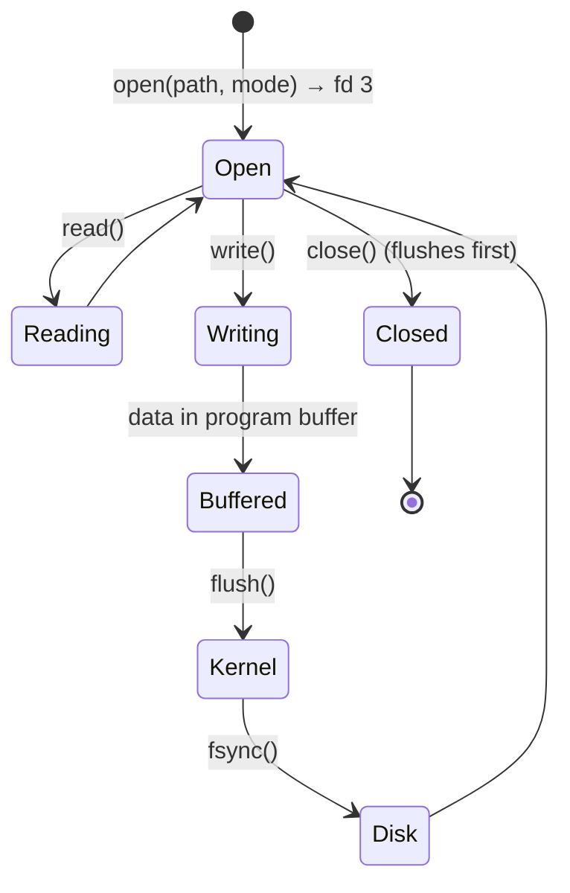
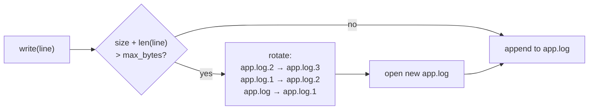

# Chapter 7 — File I/O

> **Volume 1 — Computer Science Foundations** · [Contents](index.md) · ← [Chapter 6 — Error Handling](ch06-error-handling.md) · Next → [Chapter 8 — Data Formats (Text): JSON, CSV, XML, YAML, TOML](ch08-data-formats-text-json-csv-xml-yaml.md)

---

## Concept

Opening, reading, writing, appending; text vs binary mode; buffering; atomic writes; file descriptors.

**In one sentence:** a file is a numbered handle (file descriptor) to bytes on disk; you open it, move bytes through a buffer, and close it — and if you care about crashes, you write to a temp file and rename.

**Mental model — a library loan desk.** `open()` asks the desk for a book and gets a ticket number (the file descriptor). Reading and writing go through a small tray (the buffer) so you don't walk to the shelf for every letter. `close()` returns the ticket. Tickets are limited — lose too many and the desk refuses you (`Too many open files`).

**Modes**

| Mode | Meaning | If file exists | If missing |
|------|---------|----------------|-----------|
| `r` | read | read from start | error |
| `w` | write | **truncate to empty** | create |
| `a` | append | write at end | create |
| `x` | exclusive create | error | create |
| `r+` | read + write | keep content | error |
| add `b` | binary: bytes in/out, no decoding | | |
| add `t` (default) | text: decode with an encoding, translate newlines | | |

**Text vs binary**

| | Text mode | Binary mode |
|-|-----------|-------------|
| You get | `str` | `bytes` |
| Encoding | decodes bytes (always pass `encoding="utf-8"`) | none |
| Newlines | `\r\n` ↔ `\n` translated on Windows | untouched |
| Use for | logs, CSV, JSON, source code | images, archives, hashes, protocols |

**Buffering layers**

| Layer | Where | Flushed by |
|-------|-------|------------|
| Program buffer | your process (e.g. 8 KB) | `f.flush()`, `close()`, buffer full |
| OS page cache | kernel memory | the kernel, eventually; `os.fsync(fd)` forces it |
| Disk cache | the drive | drive firmware |

Only after `fsync` is data reasonably safe from a power loss.

**Atomic write** — write the full new content to a temp file in the *same directory*, `fsync` it, then `os.replace(tmp, path)`. A rename on the same filesystem is atomic: readers see either the old file or the new one, never half of each.

---

## Prereqs

* [Chapter 3 — Functions, Parameters, Return Values, Scope & Namespaces](ch03-functions-parameters-return-values-scope-and-namespaces.md)

---

## Diagram

**File-handle lifecycle**



**Where bytes travel**

```
  your code          process              kernel               device
 ┌─────────┐  write  ┌──────────┐  flush  ┌────────────┐ fsync ┌──────┐
 │ "hello" │ ──────► │ buffer   │ ──────► │ page cache │ ────► │ disk │
 └─────────┘         │ (8 KB)   │         │            │       └──────┘
                     └──────────┘         └────────────┘
   crash here ↑ loses the buffer    ↑ survives app crash    ↑ survives power loss
```

**Atomic replace**

```
 1. write   config.json.tmp   (full new content)
 2. fsync   config.json.tmp
 3. rename  config.json.tmp → config.json     ← one atomic step
 Readers see:   old ────────────────────────┤ new
                (never a half-written file)
```

---

## Example

```python
from pathlib import Path
import os, tempfile, hashlib

# Context manager: closed even if an exception is raised
with open("f.txt", "w", encoding="utf-8") as f:
    f.write("line 1\nline 2\n")

with open("f.txt", encoding="utf-8") as f:
    for line in f:                          # streams one line at a time
        print(line.rstrip())

# Binary: hash a huge file in 1 MB chunks (constant memory)
def sha256_of(path, chunk=1 << 20):
    h = hashlib.sha256()
    with open(path, "rb") as f:
        while block := f.read(chunk):
            h.update(block)
    return h.hexdigest()

# Atomic write
def write_atomic(path, data: str):
    path = Path(path)
    fd, tmp = tempfile.mkstemp(dir=path.parent, prefix=path.name + ".")
    try:
        with os.fdopen(fd, "w", encoding="utf-8") as f:
            f.write(data)
            f.flush()
            os.fsync(f.fileno())
        os.replace(tmp, path)               # atomic on the same filesystem
    except BaseException:
        os.unlink(tmp)
        raise

write_atomic("config.json", '{"port": 8080}')
```

---

## Exercises

1. Read a 1 GB file without loading it all into memory.

   <details><summary>Solution</summary>Iterate line by line (<code>for line in f</code>) for text, or read fixed-size chunks (<code>f.read(1 &lt;&lt; 20)</code>) for binary. Memory stays at one line or one chunk. For random access, use <code>mmap</code>.</details>

2. Write atomically via temp file + rename.

   <details><summary>Solution</summary>See <code>write_atomic</code> above. Key points: temp file in the same directory (a rename across filesystems is a copy), <code>fsync</code> before rename, <code>os.replace</code> (overwrites on Windows too), and remove the temp file on failure.</details>

3. Why does `open("out.txt", "w")` in a loop keep only the last line?

   <details><summary>Solution</summary>Mode <code>w</code> truncates the file on every open. Open once outside the loop, or use <code>a</code> to append.</details>

---

## Mini project

**A log-rotating file writer that splits files by size.**



**Steps**

1. `RotatingWriter(path, max_bytes=1_000_000, backups=5)` keeps one open handle in append mode.
2. Track the current size; before a write that would exceed the limit, rotate.
3. Rotate by renaming from oldest to newest; delete anything beyond `backups`.
4. Make it a context manager (`__enter__`/`__exit__`) so it always closes.
5. Test: write 10 MB of lines; check file sizes, count, and that no line is split across files.

**Done when:** it matches the behavior of `logging.handlers.RotatingFileHandler` on the same input.

---

## Open source

* [`python/cpython`](https://github.com/python/cpython) `io` module — `Lib/_pyio.py` is a pure-Python version of the I/O stack (`FileIO` → `BufferedWriter` → `TextIOWrapper`). It is readable and shows every layer.
* [`BLAKE3-team/BLAKE3`](https://github.com/BLAKE3-team/BLAKE3) (streaming I/O patterns) — see how `b3sum` streams or memory-maps large inputs.

---

## Interview

1. **"Why use `with`/context managers for files?"**
   <details><summary>Answer</summary>They guarantee <code>close()</code> runs on every exit path, including exceptions and early returns. That flushes buffered data and releases the file descriptor. Without it, a leak in a long-running process eventually hits the OS limit on open files.</details>

2. **"Text vs binary mode — what changes?"**
   <details><summary>Answer</summary>Text mode decodes bytes into strings using an encoding and translates platform newlines. Binary mode returns raw bytes with no changes. Use binary for anything that is not human text, and always pass an explicit encoding in text mode.</details>

---

## Checklist

- [ ] always close/stream properly
- [ ] know buffered vs unbuffered
- [ ] write atomically

---

> [Contents](index.md) · ← [Chapter 6 — Error Handling](ch06-error-handling.md) · Next → [Chapter 8 — Data Formats (Text): JSON, CSV, XML, YAML, TOML](ch08-data-formats-text-json-csv-xml-yaml.md)
