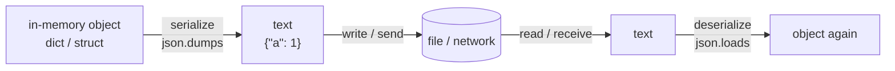
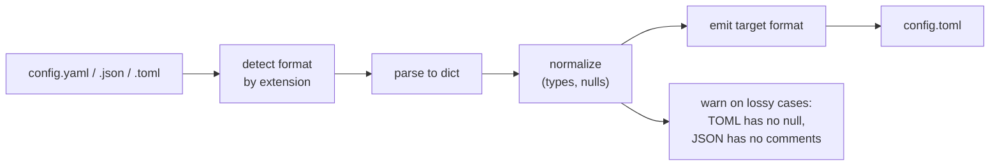

# Chapter 8 — Data Formats (Text): JSON, CSV, XML, YAML, TOML

> **Volume 1 — Computer Science Foundations** · [Contents](index.md) · ← [Chapter 7 — File I/O](ch07-file-i-o.md) · Next → [Chapter 9 — Character Encoding & Binary Serialization](ch09-character-encoding-and-binary-serialization.md)

---

## Concept

Structured serialization formats — syntax, trade-offs, and when to use each.

**In one sentence:** serialization turns in-memory objects into text you can save or send, and each text format trades off readability, strictness, and expressiveness in a different way.

**Mental model — packing for a trip.** JSON is a hard-shell suitcase: strict shape, travels anywhere. CSV is a flat tray: great for rows of identical items, useless for nesting. XML is a shipping crate with labels on every box: verbose, but very explicit. YAML is a soft duffel bag: fits anything and looks tidy, but things can shift around. TOML is a labeled drawer organizer: built for settings.

**Comparison**

| | JSON | CSV | XML | YAML | TOML |
|-|------|-----|-----|------|------|
| Nesting | yes | no (flat rows) | yes | yes | yes (tables) |
| Comments | **no** | no | yes | yes | yes |
| Types | string, number, bool, null, array, object | everything is text | everything is text (schemas add types) | many, *implicit* | string, int, float, bool, datetime, array, table |
| Strictness | strict | loose (many dialects) | strict | loose, indentation-sensitive | strict |
| Human-edited? | ok | ok in spreadsheets | painful | pleasant | pleasant |
| Best for | APIs, data exchange | tabular data, exports | documents, legacy enterprise, SVG | CI/K8s configs | app/tool configs (`pyproject.toml`, `Cargo.toml`) |

**Famous footguns**

| Format | Trap |
|--------|------|
| YAML 1.1 | `on`, `yes`, `no`, `off` become booleans; `NO` (Norway) becomes `false`; `010` may become 8 (octal) |
| YAML | `3.10` becomes the float `3.1`; indentation with tabs is an error; `yaml.load` without `SafeLoader` can run code |
| JSON | no comments; no trailing commas; large integers lose precision in JavaScript (> 2⁵³) |
| CSV | commas, quotes, and newlines inside fields; no standard encoding; Excel reformats `00123` and dates |
| XML | entity expansion attacks ("billion laughs"), external entities (XXE) — use a hardened parser |

---

## Prereqs

* [Chapter 7 — File I/O](ch07-file-i-o.md)

---

## Diagram

**The same record in five formats**

```
 JSON                                   YAML
 {                                      name: Ada Lovelace
   "name": "Ada Lovelace",              born: 1815
   "born": 1815,                        languages:
   "languages": ["English", "French"],    - English
   "active": false                        - French
 }                                      active: false

 TOML                                   XML
 name = "Ada Lovelace"                  <person active="false">
 born = 1815                              <name>Ada Lovelace</name>
 languages = ["English", "French"]        <born>1815</born>
 active = false                           <languages>
                                            <language>English</language>
 CSV (flat — the list must be squashed)     <language>French</language>
 name,born,languages,active               </languages>
 Ada Lovelace,1815,"English;French",false </person>
```

**Serialize / deserialize round trip**



**Why CSV parsing is hard** — one logical row, three physical lines:

```
 id,comment
 1,"She said ""hi"", then left
 early"
 2,plain
     ▲ quoted field containing: a comma, escaped quotes, and a newline
```

---

## Example

```python
import json, csv, io, tomllib   # tomllib: read-only, Python 3.11+
import yaml                     # pip install pyyaml

record = {"name": "Ada", "born": 1815, "languages": ["English", "French"]}

text = json.dumps(record, indent=2)
assert json.loads(text) == record

print(yaml.safe_dump(record, sort_keys=False))
print(yaml.safe_load("country: NO"))          # {'country': False}  ← footgun
print(yaml.safe_load("country: 'NO'"))        # {'country': 'NO'}   ← quote it

config = tomllib.loads("""
[server]
host = "0.0.0.0"
port = 8080

[database]
url = "postgres://localhost/app"
pool_size = 10
""")
print(config["server"]["port"])               # 8080 (an int, not "8080")

raw = 'id,comment\n1,"She said ""hi"", then left"\n'
for row in csv.DictReader(io.StringIO(raw)):
    print(row)                                # {'id': '1', 'comment': 'She said "hi", then left'}
```

---

## Exercises

1. Parse a CSV with quoted commas.

   <details><summary>Solution</summary>Never use <code>line.split(",")</code>. Use <code>csv.reader</code> or <code>csv.DictReader</code>, and open the file with <code>newline=""</code> so newlines inside quoted fields are preserved.</details>

2. Round-trip a nested object through JSON and YAML.

   <details><summary>Solution</summary><code>assert yaml.safe_load(yaml.safe_dump(obj)) == json.loads(json.dumps(obj)) == obj</code>. It holds for plain dicts, lists, strings, numbers, bools, and None. Tuples become lists, and datetimes need custom handling in JSON.</details>

3. Which format for: (a) a public REST API, (b) a Kubernetes manifest, (c) a Rust project's settings, (d) a 2 GB sales export for analysts?

   <details><summary>Solution</summary>(a) JSON, (b) YAML (the ecosystem standard), (c) TOML (<code>Cargo.toml</code>), (d) CSV — or better, Parquet (see <a href="ch53-etl-elt-batch-and-stream-processing.md">Ch 53</a>).</details>

---

## Mini project

**A config-file migrator that converts YAML ↔ JSON ↔ TOML.**



**Steps**

1. CLI: `migrate config.yaml --to toml`.
2. Parse with `yaml.safe_load`, `json.load`, or `tomllib.load`; write with `yaml.safe_dump`, `json.dump`, or `tomli_w.dump`.
3. Detect and warn about lossy conversions (null in TOML, comments dropped, mixed-type arrays).
4. Verify: convert A → B → A and compare to the original dict.

**Done when:** round trips are exact for supported data and every lossy case prints a clear warning.

---

## Open source

* [`yaml/pyyaml`](https://github.com/yaml/pyyaml) — `lib/yaml/resolver.py` holds the regexes that turn `yes`/`on`/`NO` into booleans. It is the source of the footgun.
* [`toml-lang/toml`](https://github.com/toml-lang/toml) — the spec itself. It is short and worth reading end to end.

---

## Interview

1. **"YAML vs JSON vs TOML — when each?"**
   <details><summary>Answer</summary>JSON for machine-to-machine data: strict, universal, fast parsers. YAML for human-edited, deeply nested configs where the ecosystem expects it (Kubernetes, CI), with care around implicit typing. TOML for flat-to-moderately nested app configs that people edit: explicit types, comments, no indentation traps.</details>

2. **"Why is CSV parsing non-trivial?"**
   <details><summary>Answer</summary>There is no single standard. Fields may contain delimiters, quotes (escaped by doubling), and newlines, so one record can span several lines. Delimiters, encodings, headers, and line endings vary by tool. Always use a real CSV parser.</details>

---

## Checklist

- [ ] pick the right format for config vs data
- [ ] handle escaping correctly
- [ ] avoid YAML footguns (e.g., `on` = true)

---

> [Contents](index.md) · ← [Chapter 7 — File I/O](ch07-file-i-o.md) · Next → [Chapter 9 — Character Encoding & Binary Serialization](ch09-character-encoding-and-binary-serialization.md)
