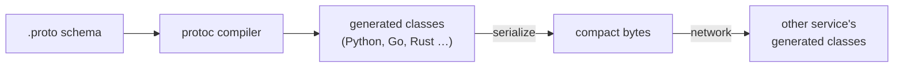
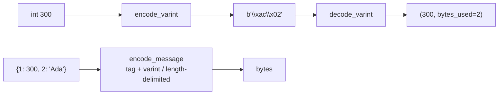

# Chapter 9 — Character Encoding & Binary Serialization

> **Volume 1 — Computer Science Foundations** · [Contents](index.md) · ← [Chapter 8 — Data Formats (Text): JSON, CSV, XML, YAML, TOML](ch08-data-formats-text-json-csv-xml-yaml.md) · Next → [Chapter 10 — Generics, Traits, Interfaces & Abstract Classes](ch10-generics-traits-interfaces-and-abstract-classes.md)

---

## Concept

ASCII, Unicode, UTF-8 vs UTF-16 vs UTF-32; encoding/decoding; binary formats: Protobuf, MessagePack, Avro.

**In one sentence:** computers store only bytes, so text needs an agreed mapping from characters to numbers (Unicode) and from numbers to bytes (UTF-8), and structured data can skip text entirely with compact binary formats.

**Mental model — two dictionaries.** Unicode is a giant phone book giving every character a number (a *code point*): `A` = U+0041, `é` = U+00E9, `😀` = U+1F600. An *encoding* such as UTF-8 is the rule for writing that number as bytes. Decoding with the wrong rule gives mojibake: `café` instead of `café`.

**Encodings**

| Encoding | Bytes per character | ASCII-compatible? | Used by |
|----------|--------------------:|:-:|---------|
| ASCII | 1 (only 128 chars) | — | old protocols |
| UTF-8 | 1–4 | yes | the web (~98%), Linux, files, JSON |
| UTF-16 | 2 or 4 (surrogate pairs) | no | Windows APIs, Java, JavaScript strings |
| UTF-32 | always 4 | no | internal fixed-width processing |

**UTF-8 layout**

| Code point range | Bytes | Bit pattern |
|------------------|:-:|-------------|
| U+0000 – U+007F | 1 | `0xxxxxxx` |
| U+0080 – U+07FF | 2 | `110xxxxx 10xxxxxx` |
| U+0800 – U+FFFF | 3 | `1110xxxx 10xxxxxx 10xxxxxx` |
| U+10000 – U+10FFFF | 4 | `11110xxx 10xxxxxx 10xxxxxx 10xxxxxx` |

The leading bits say how long a sequence is, and continuation bytes always start with `10`. So you can jump into the middle of UTF-8 and resynchronize.

**"Length" has four meanings** for `"é👍🏽"`: bytes in UTF-8 (10), UTF-16 code units (5), code points (3, or 4 if `é` is stored as `e` + a combining accent), and user-visible characters, called *grapheme clusters* (2).

**Binary serialization formats**

| Format | Schema | Self-describing? | Strengths |
|--------|--------|:-:|-----------|
| JSON (text, for comparison) | none | yes | readable, universal |
| MessagePack | none | yes | "binary JSON": drop-in, smaller, faster |
| Protocol Buffers | `.proto`, required | no — field numbers only | small, fast, strong evolution rules, gRPC |
| Avro | JSON schema, sent with or before the data | no | big-data pipelines, schema registry, Kafka |
| CBOR | none | yes | IoT, WebAuthn |

---

## Prereqs

* [Chapter 8 — Data Formats (Text): JSON, CSV, XML, YAML, TOML](ch08-data-formats-text-json-csv-xml-yaml.md)

---

## Diagram

**UTF-8 multibyte encoding of `é` (U+00E9)**

```
 code point  U+00E9 = 0000 0000 1110 1001  (binary)
 needs 2 bytes (range U+0080–U+07FF): 110xxxxx 10xxxxxx
 split the 11 payload bits:          00011   101001
                                    ┌──┴──┐ ┌──┴───┐
 byte 1:   110 00011  = 0xC3        │00011│ │101001│
 byte 2:   10  101001 = 0xA9        └─────┘ └──────┘
 "é".encode("utf-8") == b"\xc3\xa9"
```

**Same text, three encodings**

```
 text:     A        é            😀
 UTF-8:    41       C3 A9        F0 9F 98 80
 UTF-16:   0041     00E9         D83D DE00     (surrogate pair)
 UTF-32:   00000041 000000E9     0001F600
```

**Protobuf varint for field `id = 300`**

```
 300 decimal = 1 0010 1100 (binary)
 split into 7-bit groups, least-significant first:  0101100   0000010
 set the high "more" bit on every byte except the last:
     1 0101100 = 0xAC      0 0000010 = 0x02
 field tag: (field_number 1 << 3) | wire_type 0 (varint) = 0x08

 bytes on the wire:  08  AC  02          ← 3 bytes
 JSON equivalent:    {"id":300}          ← 10 bytes
```



---

## Example

```python
s = "café 😀"
b = s.encode("utf-8")
print(len(s), len(b), b)          # 6 10 b'caf\xc3\xa9 \xf0\x9f\x98\x80'
print(b.decode("latin-1"))        # 'café ð\x9f\x98\x80' — mojibake
print(b.decode("utf-8"))          # 'café 😀'

import unicodedata
a, b2 = "é", "é"            # precomposed vs e + combining accent
print(a == b2)                                                 # False
print(unicodedata.normalize("NFC", a) == unicodedata.normalize("NFC", b2))  # True

import json, msgpack               # pip install msgpack
obj = {"id": 300, "name": "Ada", "tags": ["math", "poetry"], "active": True}
print(len(json.dumps(obj).encode()), len(msgpack.packb(obj)))  # 70 42
```

```protobuf
// user.proto
syntax = "proto3";
message User {
  int32 id = 1;              // field numbers go on the wire, not names
  string name = 2;
  repeated string tags = 3;
  bool active = 4;
  // Never reuse a deleted field number; mark it reserved.
  reserved 5;
}
```

---

## Exercises

1. Manually encode a code point to UTF-8 bytes.

   <details><summary>Solution</summary>€ is U+20AC = <code>0010 0000 1010 1100</code>. It is in U+0800–U+FFFF, so 3 bytes: <code>1110xxxx 10xxxxxx 10xxxxxx</code>. Payload split 0010 / 000010 / 101100 gives <code>E2 82 AC</code>. Check: <code>"€".encode()</code>.</details>

2. Compare JSON vs MessagePack sizes for a sample object.

   <details><summary>Solution</summary>MessagePack is typically 30–50% smaller for small objects. It stores small integers in 1 byte, omits quotes and colons, and prefixes lengths. The gap shrinks for text-heavy data and grows for numeric data. Gzip narrows it further.</details>

3. Decode the Protobuf varint `96 01`.

   <details><summary>Solution</summary><code>0x96 = 1 0010110</code> (more bytes follow, payload 0010110), <code>0x01 = 0 0000001</code>. Least-significant group first: <code>0000001 0010110</code> = 150.</details>

---

## Mini project

**A tiny Protobuf-like varint encoder/decoder.**



**Steps**

1. `encode_varint(n)`: emit 7 bits at a time with the high bit as the "more" flag.
2. `decode_varint(buf, pos)`: return `(value, new_pos)`; reject varints longer than 10 bytes.
3. Add ZigZag encoding for negative numbers: `(n << 1) ^ (n >> 63)`.
4. Encode a message: for each field write `tag = (num << 3) | wire_type`, then a varint (type 0) or a length plus bytes (type 2).
5. Check your bytes against the official `protobuf` library for the same message.

**Done when:** your encoder's output is byte-for-byte identical to `protoc`-generated code for ints and strings.

---

## Open source

* [`protocolbuffers/protobuf`](https://github.com/protocolbuffers/protobuf) — the "Encoding" page of the docs, plus `python/google/protobuf/internal/encoder.py` and `decoder.py` for varints in plain Python.
* [`simdutf/simdutf`](https://github.com/simdutf/simdutf) — validates and transcodes UTF-8 at gigabytes per second using SIMD. It shows how regular UTF-8's design is.

---

## Interview

1. **"Why does UTF-8 dominate?"**
   <details><summary>Answer</summary>It is backward compatible with ASCII, so old tools and protocols work unchanged. It has no byte-order issues and no zero bytes inside multibyte characters (C strings still work). It is self-synchronizing and compact for Latin text. It can represent every Unicode code point.</details>

2. **"Schema-first (Protobuf) vs schema-less (JSON) — trade-offs?"**
   <details><summary>Answer</summary>Protobuf is smaller and faster, and it gives typed generated code and clear rules for evolving a schema (add fields with new numbers, never reuse numbers). But it is not human-readable, and both sides need the schema. JSON is readable, flexible, and universal, but larger and slower, with no enforced contract. Use Protobuf between internal services, JSON for public and browser-facing APIs.</details>

---

## Checklist

- [ ] explain UTF-8 multibyte
- [ ] know when binary beats text
- [ ] read a varint

---

> [Contents](index.md) · ← [Chapter 8 — Data Formats (Text): JSON, CSV, XML, YAML, TOML](ch08-data-formats-text-json-csv-xml-yaml.md) · Next → [Chapter 10 — Generics, Traits, Interfaces & Abstract Classes](ch10-generics-traits-interfaces-and-abstract-classes.md)
