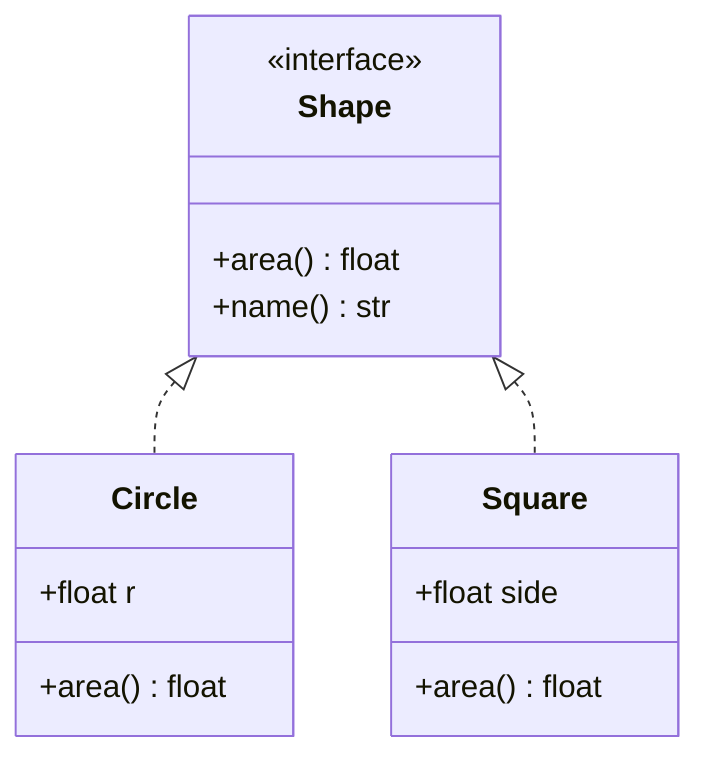
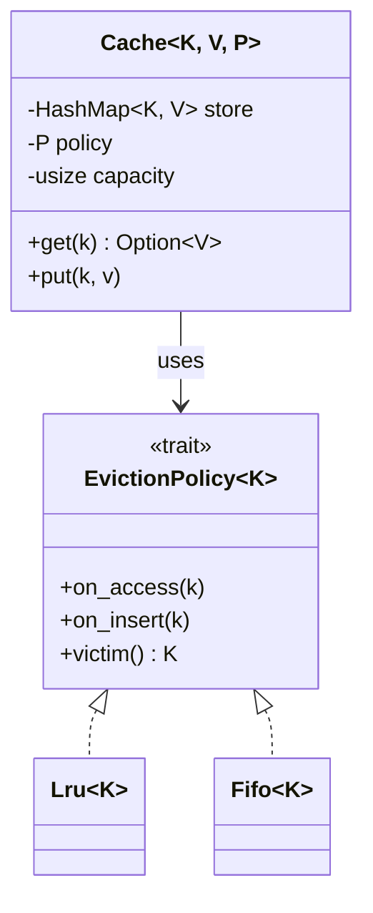

# Chapter 10 — Generics, Traits, Interfaces & Abstract Classes

> **Volume 1 — Computer Science Foundations** · [Contents](index.md) · ← [Chapter 9 — Character Encoding & Binary Serialization](ch09-character-encoding-and-binary-serialization.md) · Next → [Chapter 11 — Advanced Language Features](ch11-advanced-language-features.md)

---

## Concept

Writing code over types; bounded polymorphism (traits/interfaces) and shared contracts (abstract classes).

**In one sentence:** generics let one piece of code work for many types, and traits/interfaces say *what a type must be able to do* for that code to work.

**Mental model — a USB port.** A laptop's USB port doesn't care whether you plug in a mouse, a drive, or a phone. It only requires that the device speaks USB. The port is generic code; "speaks USB" is the trait bound; each device is a type that implements it.

**The tools**

| Tool | What it is | Example |
|------|-----------|---------|
| Generic type | a container parameterized by a type | `List<T>`, `Vec<T>`, `dict[str, int]` |
| Generic function | a function parameterized by a type | `fn largest<T: PartialOrd>(xs: &[T]) -> &T` |
| Interface (Java, Go, TS) | a set of method signatures a type promises | `interface Shape { double area(); }` |
| Trait (Rust) | an interface that can also carry default methods and be implemented for existing types | `impl Display for Point` |
| Protocol (Python) | structural typing: "has these methods" | `class Sized(Protocol): def __len__(self) -> int` |
| Abstract class | a partial class: some methods implemented, some left abstract; cannot be instantiated | `class Shape(ABC)` with `@abstractmethod area` |

**Interface vs abstract class**

| | Interface / trait | Abstract class |
|-|-------------------|----------------|
| Holds state (fields)? | no | yes |
| Implement many? | yes | usually one parent |
| Best for | "can do" capabilities: `Comparable`, `Iterator` | "is a" families with shared code: `HttpHandler` base |

**Static vs dynamic dispatch**

| | Static (monomorphization) | Dynamic (vtable) |
|-|---------------------------|------------------|
| Rust syntax | `fn f<T: Shape>(s: &T)` or `impl Shape` | `fn f(s: &dyn Shape)` |
| How | the compiler makes a separate copy for each concrete type | one copy; calls go through a table of function pointers |
| Speed | fastest; can inline | one indirect call; no inlining |
| Binary size | larger | smaller |
| Mixed types in one list? | no | yes: `Vec<Box<dyn Shape>>` |

---

## Prereqs

* [Chapter 3 — Functions, Parameters, Return Values, Scope & Namespaces](ch03-functions-parameters-return-values-scope-and-namespaces.md)

---

## Diagram

**`Box<T>` / `List<T>` — one blueprint, many concrete types**

```
          List<T>  (the blueprint)
         ┌──────────────────────┐
         │ items: [T]           │
         │ push(x: T)           │
         │ get(i) -> T          │
         └──────────┬───────────┘
        ┌───────────┼────────────┐
        ▼           ▼            ▼
   List<int>   List<String>   List<User>     ← the compiler checks each use
```

**A `Shape` interface implemented by `Circle` and `Square`**



**Dispatch: monomorphized copies vs one vtable**

```
 static (generics)                        dynamic (dyn Shape)
 print_area::<Circle>  ──► Circle::area    &dyn Shape = (data ptr, vtable ptr)
 print_area::<Square>  ──► Square::area                         │
   two compiled copies, direct calls                  vtable: [area → Circle::area,
                                                               name → Circle::name]
```

---

## Example

```rust
use std::fmt::Display;

fn largest<T: PartialOrd>(xs: &[T]) -> &T {
    let mut best = &xs[0];
    for x in xs {
        if x > best { best = x; }
    }
    best
}

trait Shape {
    fn area(&self) -> f64;
    fn describe(&self) -> String { format!("shape with area {:.2}", self.area()) } // default method
}

struct Circle { r: f64 }
struct Square { side: f64 }
impl Shape for Circle { fn area(&self) -> f64 { std::f64::consts::PI * self.r * self.r } }
impl Shape for Square { fn area(&self) -> f64 { self.side * self.side } }

fn print_static<T: Shape>(s: &T) { println!("{}", s.describe()); }   // monomorphized
fn print_dynamic(s: &dyn Shape)   { println!("{}", s.describe()); }   // vtable

fn show_all<T: Display>(xs: &[T]) { for x in xs { print!("{x} "); } }

fn main() {
    println!("{}", largest(&[3, 9, 2]));          // 9
    println!("{}", largest(&["pear", "apple"]));  // pear
    let shapes: Vec<Box<dyn Shape>> = vec![Box::new(Circle { r: 1.0 }), Box::new(Square { side: 2.0 })];
    for s in &shapes { print_dynamic(s.as_ref()); }
    print_static(&Square { side: 3.0 });
    show_all(&[1, 2, 3]);
}
```

```python
from abc import ABC, abstractmethod
from typing import Protocol, TypeVar

class Shape(ABC):
    @abstractmethod
    def area(self) -> float: ...
    def describe(self) -> str:                 # shared code
        return f"{type(self).__name__}: {self.area():.2f}"

class Circle(Shape):
    def __init__(self, r): self.r = r
    def area(self): return 3.14159 * self.r ** 2

class Comparable(Protocol):
    def __lt__(self, other, /) -> bool: ...

T = TypeVar("T", bound=Comparable)
def smallest(xs: list[T]) -> T:
    return min(xs)
```

---

## Exercises

1. Write a generic `sort` that works on any `Comparable`.

   <details><summary>Solution</summary>

   ```rust
   fn insertion_sort<T: Ord>(xs: &mut [T]) {
       for i in 1..xs.len() {
           let mut j = i;
           while j > 0 && xs[j - 1] > xs[j] { xs.swap(j - 1, j); j -= 1; }
       }
   }
   ```
   It works for integers, strings, and any struct that derives <code>Ord</code>.
   </details>

2. Implement an interface with two different classes.

   <details><summary>Solution</summary>See <code>Circle</code> and <code>Square</code> implementing <code>Shape</code> above. Both can be passed wherever a <code>Shape</code> is expected, and the caller never checks which one it has.</details>

3. Why doesn't `largest(&[1.0, f64::NAN])` compile if the bound is `Ord` instead of `PartialOrd`?

   <details><summary>Solution</summary>Floats are only <code>PartialOrd</code>: NaN is not comparable to anything, so there is no total order. <code>Ord</code> requires a total order, and <code>f64</code> does not implement it.</details>

---

## Mini project

**A generic in-memory cache `Cache<K, V>` with a trait for eviction policy.**



**Steps**

1. Define `trait EvictionPolicy<K> { fn on_access(&mut self, k: &K); fn on_insert(&mut self, k: K); fn victim(&mut self) -> Option<K>; }`.
2. Implement `Fifo` (a `VecDeque`) and `Lru` (a `VecDeque` moved-to-back on access; optimize later).
3. `Cache<K: Hash + Eq + Clone, V, P: EvictionPolicy<K>>` evicts `policy.victim()` when full.
4. Test the same access sequence under both policies and compare hit rates.

**Done when:** swapping the policy is a one-word change at the call site, and tests pass for both.

---

## Open source

* [`rust-lang/rust`](https://github.com/rust-lang/rust) std traits (`Iterator`, `Display`) — `library/core/src/iter/traits/iterator.rs`: implement one method (`next`), and you get about 75 default methods (`map`, `filter`, `sum`, …) for free.

---

## Interview

1. **"Generics vs inheritance — when each?"**
   <details><summary>Answer</summary>Use generics when the algorithm is identical for every type and only needs a few capabilities (sorting, containers). Use inheritance or interfaces when behavior <i>differs</i> per type and must be chosen at runtime. Prefer composition plus interfaces over deep inheritance trees.</details>

2. **"What's monomorphization?"**
   <details><summary>Answer</summary>The compiler generates a specialized copy of generic code for each concrete type used. It gives zero-cost abstraction (direct calls, inlining) at the cost of longer compile times and larger binaries. Rust and C++ templates do this. Java erases generics to one version instead.</details>

---

## Checklist

- [ ] write a generic function
- [ ] implement a trait/interface
- [ ] know dynamic vs static dispatch

---

> [Contents](index.md) · ← [Chapter 9 — Character Encoding & Binary Serialization](ch09-character-encoding-and-binary-serialization.md) · Next → [Chapter 11 — Advanced Language Features](ch11-advanced-language-features.md)
