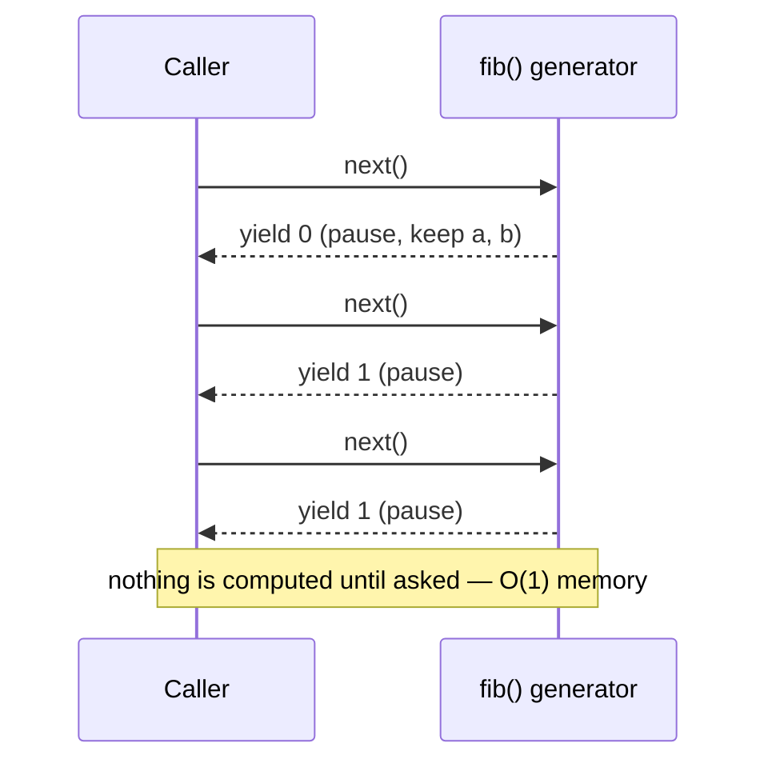
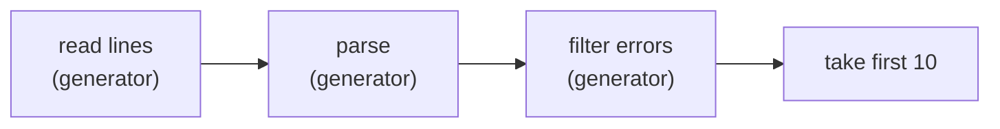
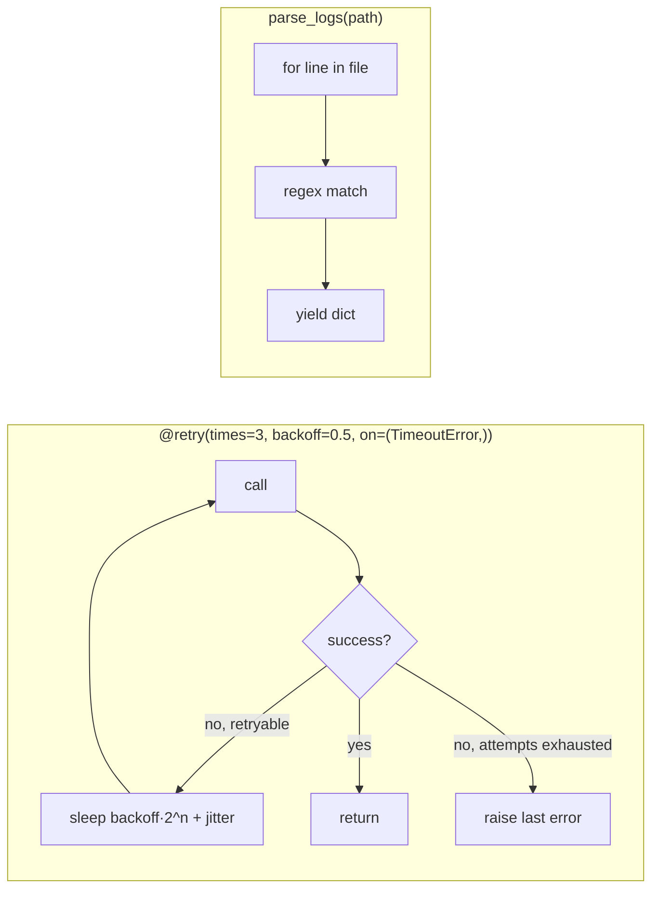

# Chapter 11 — Advanced Language Features

> **Volume 1 — Computer Science Foundations** · [Contents](index.md) · ← [Chapter 10 — Generics, Traits, Interfaces & Abstract Classes](ch10-generics-traits-interfaces-and-abstract-classes.md) · Next → [Chapter 12 — Memory: Stack, Heap, Ownership & Garbage Collection](ch12-memory-stack-heap-ownership-and-garbage-collection.md)

---

## Concept

Reflection, metaprogramming, decorators, context managers, closures, lambdas, iterators, generators, regular expressions — the power tools of a language.

**In one sentence:** these features let code wrap, inspect, generate, or lazily produce other code and data, so you can remove repetition — at the price of making things harder to follow if overused.

**Mental model — kitchen gadgets.** A decorator is a gift wrapper: same present, extra layer. A context manager is an automatic door that always closes behind you. A generator is a tap: water flows only when you open it, instead of filling a swimming pool first. A regex is a stencil you slide over text to find shapes.

**The toolbox (Python names; most languages have equivalents)**

| Feature | What it does | Typical use |
|---------|-------------|-------------|
| Lambda | tiny anonymous function | `sorted(users, key=lambda u: u.age)` |
| Closure | function + captured variables | factories, callbacks ([Ch 3](ch03-functions-parameters-return-values-scope-and-namespaces.md)) |
| Decorator | function that takes a function and returns a wrapped one | timing, caching, retries, auth checks, routing (`@app.get`) |
| Context manager | `__enter__`/`__exit__` around a block | files, locks, transactions, timers |
| Iterator | object with `__next__` that raises `StopIteration` at the end | anything `for` can loop over |
| Generator | function with `yield`: pauses and resumes | lazy streams, pipelines, infinite sequences |
| Reflection | inspect objects at runtime | `getattr`, `type()`, `inspect.signature`, serializers, DI containers |
| Metaprogramming | code that writes or changes code | `dataclasses`, metaclasses, Rust macros, codegen |
| Regular expression | a pattern language for text | validation, parsing logs, search/replace |

**Regex quick reference**

| Pattern | Matches |
|---------|---------|
| `\d` `\w` `\s` | digit, word char, whitespace |
| `.` | any char except newline |
| `*` `+` `?` `{2,5}` | 0+, 1+, 0–1, 2–5 times (greedy) |
| `*?` `+?` | lazy versions (as few as possible) |
| `^` `$` `\b` | start, end, word boundary |
| `[a-z]` `[^0-9]` | character class, negated class |
| `(…)` `(?P<name>…)` `(?:…)` | capture group, named group, non-capturing |
| `a\|b` | alternation |

**Use with restraint.** Every layer of magic is one more thing a reader must understand. Reach for these when they remove *real* duplication or leaks.

---

## Prereqs

* [Chapter 3 — Functions, Parameters, Return Values, Scope & Namespaces](ch03-functions-parameters-return-values-scope-and-namespaces.md)
* [Chapter 10 — Generics, Traits, Interfaces & Abstract Classes](ch10-generics-traits-interfaces-and-abstract-classes.md)

---

## Diagram

**A decorator wrapping a function**

```
 @timed
 def fetch(url): ...          is the same as:   fetch = timed(fetch)

           call fetch("x")
                │
     ┌──────────▼───────────────────────────┐
     │ wrapper (from timed)                 │
     │   start = now()                      │   ← extra behavior before
     │   ┌──────────────────────────────┐   │
     │   │ original fetch("x")          │   │
     │   └──────────────────────────────┘   │
     │   print(now() - start)               │   ← extra behavior after
     │   return result                      │
     └──────────────────────────────────────┘
```

**A generator's yield / pause / resume cycle**



**A lazy pipeline — each line flows through all stages before the next is read**



---

## Example

```python
import functools, time, re, contextlib, inspect

def timed(fn):
    @functools.wraps(fn)                       # keep name, docstring, signature
    def wrapper(*args, **kwargs):
        start = time.perf_counter()
        try:
            return fn(*args, **kwargs)
        finally:
            print(f"{fn.__name__} took {time.perf_counter() - start:.4f}s")
    return wrapper

@functools.lru_cache(maxsize=None)
def fib(n):
    return n if n < 2 else fib(n - 1) + fib(n - 2)

@timed
def compute():
    return fib(200)

compute()

def fib_gen():
    a, b = 0, 1
    while True:                                # infinite, but lazy
        yield a
        a, b = b, a + b

from itertools import islice
print(list(islice(fib_gen(), 10)))             # [0, 1, 1, 2, 3, 5, 8, 13, 21, 34]

positives = (x for x in [-2, 5, -1, 7] if x > 0)   # generator expression

@contextlib.contextmanager
def timer(label):
    start = time.perf_counter()
    yield
    print(label, time.perf_counter() - start)

with timer("block"):
    sum(range(10**6))

m = re.search(r"(?P<status>\d{3}) (?P<ms>\d+)ms", "GET /api 200 35ms")
print(m["status"], int(m["ms"]))               # 200 35

print(inspect.signature(fib.__wrapped__))      # (n) — reflection
print(getattr(m, "group")(0))                  # call a method by name
```

---

## Exercises

1. Write a decorator that times a function.

   <details><summary>Solution</summary>See <code>timed</code> above. Use <code>functools.wraps</code>, accept <code>*args, **kwargs</code>, and put the timing in <code>finally</code> so it reports even when the function raises.</details>

2. Build a generator producing the Fibonacci sequence.

   <details><summary>Solution</summary>See <code>fib_gen</code>. Consume it with <code>itertools.islice</code> or a <code>for</code> loop with a <code>break</code>. Never call <code>list()</code> on an infinite generator.</details>

3. Write a regex that extracts ISO dates (`2024-03-15`) from text and rejects month 13.

   <details><summary>Solution</summary><code>\b(\d{4})-(0[1-9]|1[0-2])-(0[1-9]|[12]\d|3[01])\b</code>. A regex checks shape. Use <code>datetime.date.fromisoformat</code> to check real validity, such as Feb 30.</details>

---

## Mini project

**A retry decorator + a streaming log-line regex parser.**



**Steps**

1. `@retry(times, backoff, on=(ExceptionTypes,))` — a decorator *factory*: a function that returns a decorator.
2. Retry only the listed exceptions; add exponential backoff with jitter; log each attempt.
3. `parse_logs(path)` yields `{"ts", "level", "path", "status", "ms"}` per line using one compiled regex with named groups; skip non-matching lines and count them.
4. Chain generators: `slow = (r for r in parse_logs(p) if r["ms"] > 500)`.
5. Run it on a 1 GB log and confirm memory stays flat.

**Done when:** the retry decorator has unit tests with a fake clock, and the parser handles 1 GB with under 50 MB of memory.

---

## Open source

* [`python/cpython`](https://github.com/python/cpython) `functools`, `re`, `contextlib` — `Lib/functools.py` (`wraps`, `lru_cache`) and `Lib/contextlib.py` (`contextmanager` is a generator turned into a context manager) are short and very readable.

---

## Interview

1. **"What's a generator, and why is it memory-efficient?"**
   <details><summary>Answer</summary>A generator is a function that <code>yield</code>s values one at a time, pausing its state between calls. It produces each item only on demand, so memory holds one item plus the function's local state, instead of the full sequence. That allows infinite streams and constant-memory pipelines over huge files.</details>

2. **"When would you use reflection?"**
   <details><summary>Answer</summary>When code must work with types it doesn't know at compile time: serializers and ORMs mapping fields, dependency-injection containers, test frameworks discovering <code>test_*</code> functions, plugin loaders, CLI builders reading signatures. Avoid it in normal business logic — it hides dependencies and defeats type checkers.</details>

---

## Checklist

- [ ] write a decorator/context manager
- [ ] lazily stream with a generator
- [ ] craft a non-trivial regex

---

> [Contents](index.md) · ← [Chapter 10 — Generics, Traits, Interfaces & Abstract Classes](ch10-generics-traits-interfaces-and-abstract-classes.md) · Next → [Chapter 12 — Memory: Stack, Heap, Ownership & Garbage Collection](ch12-memory-stack-heap-ownership-and-garbage-collection.md)
