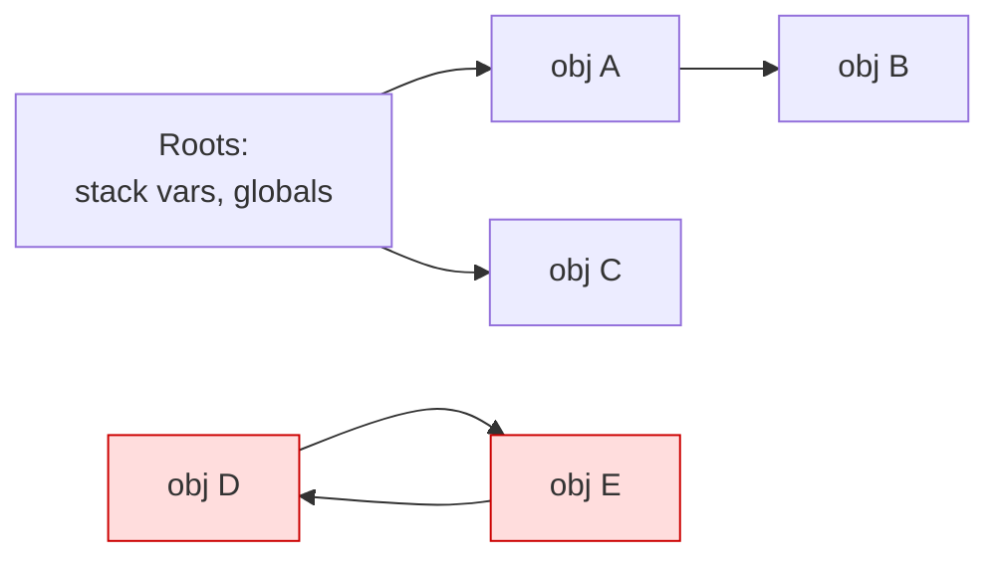
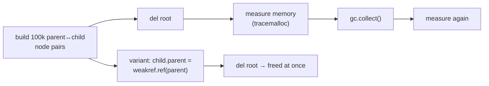

# Chapter 12 — Memory: Stack, Heap, Ownership & Garbage Collection

> **Volume 1 — Computer Science Foundations** · [Contents](index.md) · ← [Chapter 11 — Advanced Language Features](ch11-advanced-language-features.md) · Next → [Chapter 13 — Concurrency: Threads, Processes, Async, Futures & Coroutines](ch13-concurrency-threads-processes-async-futures-and-coroutines.md)

---

## Concept

Stack vs heap allocation; references; Rust ownership/borrowing/lifetimes; tracing GC vs reference counting.

**In one sentence:** the stack is fast, automatic, short-lived memory tied to function calls; the heap is flexible memory that someone must eventually free — by hand (C), by ownership rules checked at compile time (Rust), or by a garbage collector (Python, Java, Go).

**Mental model — hotel rooms vs a warehouse.** The stack is a stack of hotel trays: each function call takes the next tray, and trays are cleared automatically when the call ends. The heap is a warehouse: you can rent any size of space for any length of time, but somebody must return the key. Forgetting is a *leak*. Using the space after returning the key is *use-after-free*.

**Stack vs heap**

| | Stack | Heap |
|-|-------|------|
| Allocation | move a pointer (nanoseconds) | allocator search (slower) |
| Freed | automatically when the function returns | manually, by ownership, or by the GC |
| Size | small (1–8 MB per thread), fixed at compile time per frame | large, dynamic |
| Holds | locals, parameters, return addresses | objects that outlive a call or have dynamic size |
| Failure | stack overflow (deep recursion) | out of memory, fragmentation, leaks |

**Three memory-management strategies**

| Strategy | Languages | How it frees | Cost |
|----------|-----------|-------------|------|
| Manual | C, C++ (`malloc`/`free`, `new`/`delete`) | the programmer calls free | bugs: leaks, double free, use-after-free |
| Ownership + borrowing | Rust (and C++ RAII) | the compiler inserts the free when the owner goes out of scope | learning curve; compile-time checks |
| Reference counting | Python (plus a cycle collector), Swift, `Rc`/`Arc` | free when the count hits 0 | a count update on every copy; cycles leak without help |
| Tracing GC | Java, Go, JS, C#, Python's cycle collector | periodically mark everything reachable from roots, sweep the rest | pauses, extra memory headroom |

**Rust ownership rules**

1. Each value has exactly one *owner*.
2. When the owner goes out of scope, the value is dropped (freed).
3. You may *borrow*: either **any number of shared `&T`** or **exactly one mutable `&mut T`** — never both at the same time.
4. A reference can never outlive the value it points to. *Lifetimes* are how the compiler checks this.

---

## Prereqs

* [Chapter 3 — Functions, Parameters, Return Values, Scope & Namespaces](ch03-functions-parameters-return-values-scope-and-namespaces.md)

---

## Diagram

**Memory layout: stack frames and a heap with GC roots**

```
 STACK (grows down)                         HEAP
 ┌───────────────────────────┐
 │ main                      │           ┌───────────────┐
 │   users ──────────────────┼─────────► │ list [ •, • ] │── root-reachable
 │   count = 2  (int, inline)│           └──┬─────┬──────┘
 ├───────────────────────────┤              ▼     ▼
 │ load_user                 │        ┌────────┐ ┌────────┐
 │   u ──────────────────────┼──────► │ User A │ │ User B │
 │   buf = [u8; 64] (inline) │        └────────┘ └────────┘
 └───────────────────────────┘
                                       ┌────────┐     ┌────────┐
                                       │ Node X │ ◄──►│ Node Y │  unreachable cycle:
                                       └────────┘     └────────┘  refcounts stay 1,
                                                                   only a tracing GC frees it
```

**Tracing GC: mark and sweep**



Mark everything reachable from the roots (A, B, C). Sweep the rest (D, E — red).

**Rust move and borrow**

```
 let a = String::from("hi");     a ──► [heap "hi"]
 let b = a;                      a ✗   b ──► [heap "hi"]    ownership MOVED; using a is a compile error
 let r1 = &b; let r2 = &b;       two shared borrows: fine
 let m = &mut b;                 ✗ error while r1/r2 are still used later
```

---

## Example

```rust
fn longest<'a>(x: &'a str, y: &'a str) -> &'a str {   // result lives as long as both inputs
    if x.len() > y.len() { x } else { y }
}

fn main() {
    let mut v = vec![1, 2, 3];
    let first = &v[0];            // shared borrow of v
    // v.push(4);                 // ❌ error[E0502]: cannot borrow `v` as mutable
    //                            //    because it is also borrowed as immutable
    println!("{first}");          // last use of `first` — borrow ends here
    v.push(4);                    // ✅ fine now

    let s = String::from("hello");
    let t = s;                    // move
    // println!("{s}");           // ❌ error[E0382]: borrow of moved value: `s`
    println!("{}", longest(&t, "hi"));
}
```

Why `v.push(4)` must be rejected: `push` may reallocate the vector's buffer to a new address, leaving `first` pointing at freed memory. The borrow checker turns that runtime bug into a compile error.

```python
import sys, gc

x = []
print(sys.getrefcount(x))        # 2: `x` + the temporary argument
y = x
print(sys.getrefcount(x))        # 3

class Node:
    def __init__(self): self.other = None

a, b = Node(), Node()
a.other, b.other = b, a          # a reference cycle
del a, b                         # refcounts never reach 0...
print(gc.collect())              # ...the cycle collector finds and frees them (prints > 0)
```

---

## Exercises

1. Explain why a returned reference to a stack local is invalid.

   <details><summary>Solution</summary>The local lives in the function's stack frame, which is reclaimed when the function returns. The next call reuses that memory, so the reference would point at garbage (a dangling pointer). C compilers warn; Rust refuses: "returns a reference to data owned by the current function". Return the value itself (moved or copied) instead.</details>

2. Write a Rust program and fix a borrow-checker error.

   <details><summary>Solution</summary>The <code>v.push</code> example above: shorten the shared borrow's life (use it before mutating), clone the value (<code>let first = v[0];</code> copies an <code>i32</code>), or restructure so the mutation happens first.</details>

3. Why can't reference counting alone free a doubly linked list?

   <details><summary>Solution</summary>Each node is referenced by its neighbors, so counts never reach 0 even after the list is unreachable. Fixes: a tracing cycle collector (Python), or weak back-pointers that don't count (<code>Weak&lt;T&gt;</code> in Rust, <code>weakref</code> in Python).</details>

---

## Mini project

**A cycle-producing data structure in Python and how the GC collects it.**



**Steps**

1. Build a tree where each child has a strong reference to its parent (cycles everywhere).
2. Disable automatic GC (`gc.disable()`), delete the root, and show with `tracemalloc` that memory is *not* released.
3. Call `gc.collect()`; show the count of collected objects and the memory drop.
4. Rewrite with `weakref.ref` for the parent pointer; show memory is released immediately with GC still disabled.
5. Use `gc.get_referrers` to explain *who* keeps an object alive.

**Done when:** you can show three memory numbers (built, after del, after collect) for both versions and explain each.

---

## Open source

* [`python/cpython`](https://github.com/python/cpython) GC — `Python/gc.c`, and the "Garbage collector design" doc in `InternalDocs/`, explain generational cycle detection on top of refcounting.
* [`rust-lang/rust`](https://github.com/rust-lang/rust) borrow checker — `compiler/rustc_borrowck/`; the Rust Book chapter 4, "Understanding Ownership", is the friendlier entry point.

---

## Interview

1. **"Stack vs heap allocation?"**
   <details><summary>Answer</summary>Stack allocation is a pointer bump. It is freed automatically on return and is very fast and cache-friendly, but sizes must be known and lifetimes end with the call. Heap allocation supports dynamic sizes and lifetimes beyond the call, but costs more, can fragment, and needs a freeing strategy.</details>

2. **"How does Rust prevent use-after-free?"**
   <details><summary>Answer</summary>At compile time, not runtime. Each value has one owner that frees it when it goes out of scope. References are checked by lifetimes so they cannot outlive the owner. The aliasing-XOR-mutation rule prevents one path from freeing or reallocating memory while another still reads it. No GC and no runtime cost.</details>

---

## Checklist

- [ ] explain stack/heap
- [ ] read a borrow error
- [ ] know GC vs refcounting trade-offs

---

> [Contents](index.md) · ← [Chapter 11 — Advanced Language Features](ch11-advanced-language-features.md) · Next → [Chapter 13 — Concurrency: Threads, Processes, Async, Futures & Coroutines](ch13-concurrency-threads-processes-async-futures-and-coroutines.md)
