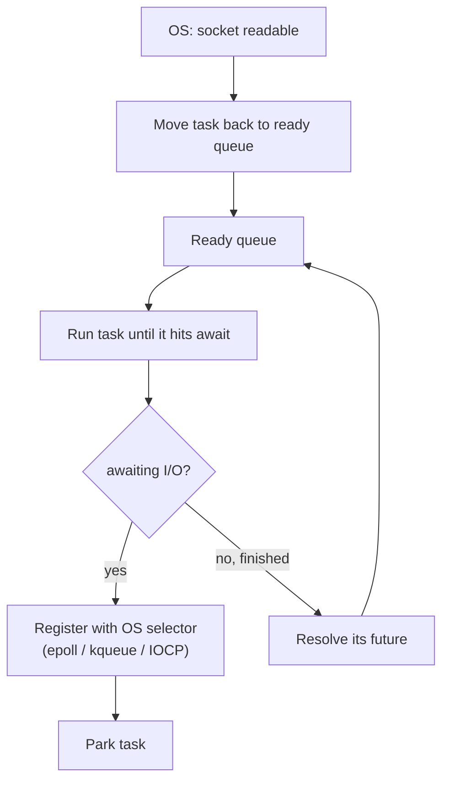
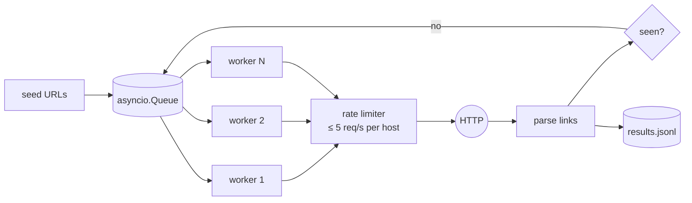

# Chapter 13 — Concurrency: Threads, Processes, Async, Futures & Coroutines

> **Volume 1 — Computer Science Foundations** · [Contents](index.md) · ← [Chapter 12 — Memory: Stack, Heap, Ownership & Garbage Collection](ch12-memory-stack-heap-ownership-and-garbage-collection.md) · Next → [Chapter 14 — Programming Paradigms](ch14-programming-paradigms.md)

---

## Concept

Threads vs processes; shared memory vs message passing; async/await, futures/promises, coroutines; the event loop.

**In one sentence:** concurrency is *dealing with* many things at once (interleaving); parallelism is *doing* many things at once (multiple cores); and the right tool depends on whether your work waits on I/O or burns CPU.

**Mental model — a restaurant.**

* **Process** — a separate restaurant with its own kitchen. Fully isolated; sharing means phoning each other (message passing).
* **Thread** — another cook in the same kitchen. They share the fridge (memory), so they can bump into each other (races) and need rules (locks).
* **Async / coroutines** — one very organized waiter serving 50 tables. While table 3's food cooks (I/O wait), they take table 7's order. Never truly two things at once, but nothing sits idle.

**Comparison**

| | Process | OS thread | Coroutine (async task) |
|-|---------|-----------|------------------------|
| Memory | separate | shared | shared |
| Created by | OS | OS | language runtime |
| Cost to create | ~ms, MBs | ~10–100 µs, ~1–8 MB stack | ~µs, ~KBs |
| Switching | OS, expensive | OS, preemptive | cooperative, at `await` points |
| Parallel on multiple cores? | yes | yes (not for Python bytecode under the GIL) | no, unless the runtime has many worker threads (Tokio, Go) |
| Best for | CPU-bound work, isolation | blocking I/O, CPU work in non-GIL languages | thousands of concurrent I/O waits |

**Which tool?**

| Workload | Python | Rust / Go |
|----------|--------|-----------|
| I/O-bound, many connections | `asyncio` | Tokio / goroutines |
| I/O-bound, blocking libraries | `ThreadPoolExecutor` | thread pool |
| CPU-bound | `ProcessPoolExecutor` / multiprocessing (or free-threaded 3.13+) | threads, `rayon` |

**Key terms**

* **Race condition** — the result depends on timing. A *data race* is two threads touching the same memory, at least one writing, with no synchronization.
* **Lock / mutex** — only one holder at a time. **Semaphore** — at most N holders.
* **Future / promise** — a placeholder for a result that isn't ready yet.
* **Coroutine** — a function that can pause (`await`) and resume later.
* **Event loop** — the scheduler that runs ready coroutines and parks waiting ones until their I/O completes.
* **GIL** — CPython's Global Interpreter Lock: only one thread runs Python bytecode at a time. It is released during I/O, and it is optional in free-threaded builds from 3.13.

---

## Prereqs

* [Chapter 12 — Memory: Stack, Heap, Ownership & Garbage Collection](ch12-memory-stack-heap-ownership-and-garbage-collection.md)

---

## Diagram

**Threads under the GIL vs a single-threaded event loop**

```
 CPU-bound threads with the GIL (one core does all the work)
 T1  ████░░░░████░░░░████          █ = running Python bytecode
 T2  ░░░░████░░░░████░░░░████      ░ = waiting for the GIL

 Async event loop, I/O-bound (one thread, overlapping waits)
 task A  ██▒▒▒▒▒▒▒▒▒██              █ = running
 task B    ██▒▒▒▒▒▒▒▒▒██            ▒ = awaiting the network (loop runs others)
 task C      ██▒▒▒▒▒▒▒▒▒██
 time  ─────────────────────►  total ≈ one wait, not three
```

**The event loop**



**A race on a shared counter**

```
 counter = 0;  two threads each run: counter += 1
 (which is really: read → add → write)

 T1: read 0 ────── add → 1 ─── write 1
 T2:     read 0 ────── add → 1 ────── write 1
 final: 1   (expected 2) — one update lost
```

---

## Example

```python
import asyncio, time

async def fetch(i):
    await asyncio.sleep(1)                 # stands in for a network call
    return i * 10

async def main():
    start = time.perf_counter()
    results = await asyncio.gather(*(fetch(i) for i in range(100)))
    print(len(results), f"{time.perf_counter() - start:.1f}s")   # 100 1.0s — not 100s

asyncio.run(main())

# Bounding concurrency with a semaphore
async def bounded(urls, limit=10):
    sem = asyncio.Semaphore(limit)
    async def one(u):
        async with sem:                    # at most `limit` at once
            return await fetch(u)
    return await asyncio.gather(*(one(u) for u in urls))
```

```python
import threading

counter = 0
lock = threading.Lock()

def work():
    global counter
    for _ in range(100_000):
        with lock:                         # remove the lock and the total may come out short
            counter += 1

threads = [threading.Thread(target=work) for _ in range(8)]
for t in threads: t.start()
for t in threads: t.join()
print(counter)                             # 800000
```

```rust
#[tokio::main]
async fn main() {
    let handles: Vec<_> = (0..100)
        .map(|i| tokio::spawn(async move {
            tokio::time::sleep(std::time::Duration::from_secs(1)).await;
            i * 10
        }))
        .collect();
    let mut total = 0;
    for h in handles { total += h.await.unwrap(); }
    println!("{total}");                   // after ~1 s
}
```

---

## Exercises

1. Parallelize I/O-bound work with async.

   <details><summary>Solution</summary>Replace a loop of blocking <code>requests.get</code> calls with <code>httpx.AsyncClient</code> and <code>asyncio.gather</code>, bounded by a semaphore. Total time drops from the sum of the latencies to about the slowest single request.</details>

2. Show a race condition on a shared counter and fix it.

   <details><summary>Solution</summary>Run the threading example without the lock, using a read–sleep(0)–write sequence to widen the window. The count comes out short. Fix it with a <code>Lock</code>, an atomic (<code>AtomicUsize</code> in Rust), or by giving each thread its own counter and summing at the end (no sharing).</details>

3. What goes wrong if you call `time.sleep(5)` inside an `async def`?

   <details><summary>Solution</summary>It blocks the whole event loop thread, so every other task freezes for 5 seconds. Use <code>await asyncio.sleep(5)</code>, or push blocking calls to a thread with <code>await asyncio.to_thread(fn)</code>.</details>

---

## Mini project

**A concurrent web scraper with a bounded worker pool and rate limiting.**



**Steps**

1. An `asyncio.Queue` of URLs and N worker coroutines that loop `get → fetch → parse → put new links`.
2. A per-host token-bucket rate limiter (see [Vol 4 Ch 6](../volume-4-high-level-design/ch06-rate-limiting-throttling-and-backpressure.md)).
3. A timeout per request, retries with backoff, and a `seen` set for dedup; stop at max depth or page count.
4. Graceful shutdown: `queue.join()`, then cancel the workers.
5. Compare throughput for N = 1, 5, 20, 50.

**Done when:** it crawls 1,000 pages of a test site without exceeding the rate limit, and throughput scales with N until the limit caps it.

---

## Open source

* [`python/cpython`](https://github.com/python/cpython) `asyncio` — `Lib/asyncio/base_events.py` (`_run_once` is the heart of the loop) and `Lib/asyncio/futures.py`.
* [`tokio-rs/tokio`](https://github.com/tokio-rs/tokio) — `tokio/src/runtime/scheduler/multi_thread/` is a work-stealing scheduler that runs async tasks across all cores.

---

## Interview

1. **"Threads vs processes vs coroutines?"**
   <details><summary>Answer</summary>Processes are isolated and truly parallel, but heavy, and they communicate by messages. Threads share memory and are parallel (except under the GIL); they are lighter but need synchronization. Coroutines are very light, cooperative tasks scheduled by a runtime — ideal for huge numbers of I/O waits, but a blocking call stalls them all.</details>

2. **"What is a future/promise?"**
   <details><summary>Answer</summary>An object representing a result that will be available later. You can attach callbacks or <code>await</code> it. It resolves with a value or fails with an error, which lets code start work now and use the result when ready without blocking a thread.</details>

---

## Checklist

- [ ] choose thread vs async per workload
- [ ] detect a data race
- [ ] use a semaphore to bound concurrency

---

> [Contents](index.md) · ← [Chapter 12 — Memory: Stack, Heap, Ownership & Garbage Collection](ch12-memory-stack-heap-ownership-and-garbage-collection.md) · Next → [Chapter 14 — Programming Paradigms](ch14-programming-paradigms.md)
