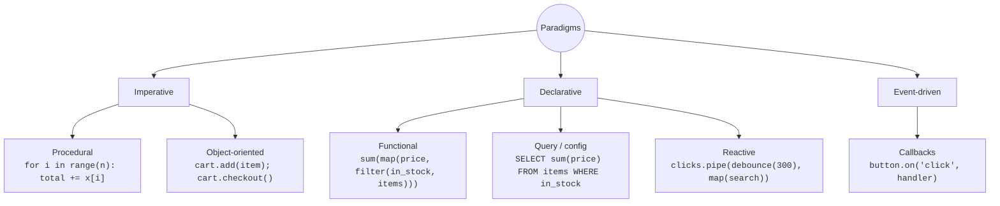
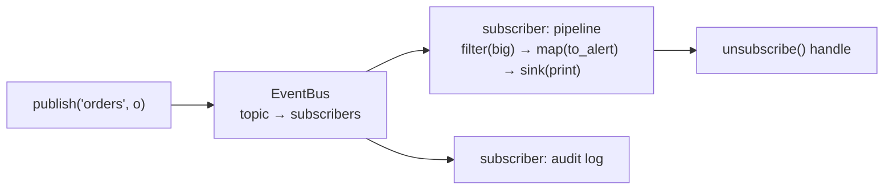

# Chapter 14 — Programming Paradigms

> **Volume 1 — Computer Science Foundations** · [Contents](index.md) · ← [Chapter 13 — Concurrency: Threads, Processes, Async, Futures & Coroutines](ch13-concurrency-threads-processes-async-futures-and-coroutines.md) · Next → [Chapter 15 — Correctness Traps](ch15-correctness-traps.md)

---

## Concept

Imperative, declarative, object-oriented, functional, reactive, and event-driven styles — and recognizing them in real code.

**In one sentence:** a paradigm is a way of organizing a program — step-by-step instructions, descriptions of the result, objects sending messages, pure functions transforming data, or reactions to streams of events — and real codebases mix them.

**Mental model — getting a sandwich.**

* **Imperative:** "Take two slices. Spread butter. Add cheese. Close." (How.)
* **Declarative:** "One cheese sandwich, please." (What.)
* **Object-oriented:** ask the `Chef` object to `make(Sandwich)`; the chef hides how.
* **Functional:** `sandwich = close(add(cheese, spread(butter, bread)))` — no step changes an existing thing; each returns a new one.
* **Event-driven:** when the buzzer rings (event), pick up the sandwich (handler).
* **Reactive:** subscribe to a stream of orders and describe how every future order flows to the counter.

**The paradigms**

| Paradigm | Core idea | You'll see | Languages / tools |
|----------|-----------|-----------|-------------------|
| Imperative | statements change state step by step | loops, assignments, mutation | C, Python, Go |
| Procedural | imperative, organized into procedures | functions over shared structs | C, Pascal |
| Declarative | describe the result, not the steps | queries, configs, markup | SQL, HTML, CSS, Terraform, regex |
| Object-oriented | bundle data + behavior; objects collaborate | classes, methods, interfaces, polymorphism | Java, C#, Python, Ruby |
| Functional | pure functions, immutable data, functions as values | `map`/`filter`/`reduce`, recursion, no mutation | Haskell, Elixir, Clojure, F#; functional style in JS/Python/Rust |
| Event-driven | control flow is driven by events | callbacks, handlers, listeners, message queues | JS in browsers, GUIs, Node.js |
| Reactive | compose asynchronous *streams* of values over time | observables, operators (`map`, `debounce`, `merge`) | RxJS, RxPY, Reactor, Kotlin Flow |

**Pure functions and immutability** — the heart of functional style.

* A **pure function** returns the same output for the same input and has no side effects (no I/O, no mutation of outside state). Easy to test, cache, and parallelize.
* **Immutable data** can't be changed after creation. No one can modify it behind your back, so sharing it between threads is safe.
* Real programs need side effects. Functional style *pushes them to the edges*: a pure core, with a thin imperative shell doing I/O.

---

## Prereqs

* [Chapter 3 — Functions, Parameters, Return Values, Scope & Namespaces](ch03-functions-parameters-return-values-scope-and-namespaces.md)
* [Chapter 13 — Concurrency: Threads, Processes, Async, Futures & Coroutines](ch13-concurrency-threads-processes-async-futures-and-coroutines.md)

---

## Diagram

**A map of paradigms**



**Same task, three styles: total price of in-stock items**

```
 IMPERATIVE                  FUNCTIONAL                          DECLARATIVE (SQL)
 total = 0                   total = sum(                        SELECT SUM(price)
 for it in items:                i.price                         FROM items
     if it.in_stock:             for i in items                  WHERE in_stock;
         total += it.price       if i.in_stock)
   how, step by step           transform data, no mutation         what, not how
```

**Reactive stream: search-as-you-type**

```
 keystrokes:   h──e──l──l──o────────────w──o──r──l──d──────►
 debounce(300)                  "hello"                 "world"
 map(search)                    [results…]              [results…]
 switchMap cancels the "hello" request if "world" arrives first
```

---

## Example

```python
from functools import reduce
from dataclasses import dataclass

@dataclass(frozen=True)                     # immutable object
class Item:
    name: str
    price: float
    in_stock: bool

items = [Item("pen", 2.0, True), Item("ink", 9.5, False), Item("pad", 4.0, True)]

# Imperative
total = 0.0
for it in items:
    if it.in_stock:
        total += it.price

# Functional: map / filter / reduce
total_fn = reduce(lambda acc, p: acc + p,
                  map(lambda i: i.price, filter(lambda i: i.in_stock, items)), 0.0)
assert total == total_fn == 6.0

# Object-oriented
class Cart:
    def __init__(self): self._items = []
    def add(self, item): self._items.append(item)
    def total(self): return sum(i.price for i in self._items if i.in_stock)

# Event-driven: register callbacks, fire events
handlers = {}
def on(event, fn): handlers.setdefault(event, []).append(fn)
def emit(event, payload):
    for fn in handlers.get(event, []): fn(payload)

on("order_placed", lambda o: print("email receipt for", o))
on("order_placed", lambda o: print("reserve stock for", o))
emit("order_placed", "order-42")
```

```python
# Reactive (RxPY): pip install reactivex
import reactivex as rx
from reactivex import operators as ops

rx.from_iterable([1, 2, 3, 4, 5, 6]).pipe(
    ops.filter(lambda x: x % 2 == 0),
    ops.map(lambda x: x * 10),
).subscribe(print)                          # 20 40 60
```

---

## Exercises

1. Rewrite an imperative loop as `map/filter/reduce`.

   ```python
   out = []
   for w in words:
       if len(w) > 3:
           out.append(w.upper())
   ```

   <details><summary>Solution</summary><code>out = list(map(str.upper, filter(lambda w: len(w) &gt; 3, words)))</code>, or more idiomatically <code>[w.upper() for w in words if len(w) &gt; 3]</code>.</details>

2. Model an event-driven system with callbacks.

   <details><summary>Solution</summary>See the <code>on</code>/<code>emit</code> example. Extend it: <code>off()</code> to unsubscribe, catch exceptions per handler so one failing listener doesn't break the rest, and async handlers.</details>

3. Is this function pure? `def add_tax(order): order.total *= 1.2; return order`

   <details><summary>Solution</summary>No. It mutates its input — a side effect visible to the caller. Pure version: <code>return replace(order, total=order.total * 1.2)</code>, which returns a new object.</details>

---

## Mini project

**A tiny reactive event bus with subscribe/publish and a functional pipeline.**



**Steps**

1. `EventBus.subscribe(topic, fn)` returns an unsubscribe function; `publish(topic, payload)` calls every subscriber.
2. A `Stream` class with chainable `map`, `filter`, `take(n)`, and `debounce(seconds)` that returns new streams (immutable pipeline objects).
3. Connect them: `bus.stream("orders").filter(lambda o: o.total > 100).map(to_alert).subscribe(print)`.
4. Isolate failures: one subscriber raising must not stop the others.
5. Write the pipeline operators as pure functions and test them without the bus.

**Done when:** you can build a 3-stage pipeline in one line, and every operator has a unit test with no mocks.

---

## Open source

* [`ReactiveX/RxPY`](https://github.com/ReactiveX/RxPY) — `reactivex/operators/` implements each operator as a function returning a function. It is functional composition in practice.
* [`python/cpython`](https://github.com/python/cpython) `itertools` — the docs' "Itertools Recipes" section is a masterclass in lazy functional pipelines.

---

## Interview

1. **"Declarative vs imperative?"**
   <details><summary>Answer</summary>Imperative code tells the computer <i>how</i>: explicit steps and state changes. Declarative code states <i>what</i> result you want and lets an engine decide how (SQL's query planner, React's DOM diffing, Terraform's plan). Declarative code is usually shorter and easier to optimize; imperative code gives precise control.</details>

2. **"What makes code 'functional'?"**
   <details><summary>Answer</summary>Functions are values (passed and returned), most functions are pure, data is immutable, and programs are built by composing transformations instead of mutating state. Side effects are isolated at the edges. You can write functional-style code in most languages.</details>

---

## Checklist

- [ ] write pure functions
- [ ] identify a paradigm in the wild
- [ ] explain immutability benefits

---

> [Contents](index.md) · ← [Chapter 13 — Concurrency: Threads, Processes, Async, Futures & Coroutines](ch13-concurrency-threads-processes-async-futures-and-coroutines.md) · Next → [Chapter 15 — Correctness Traps](ch15-correctness-traps.md)
