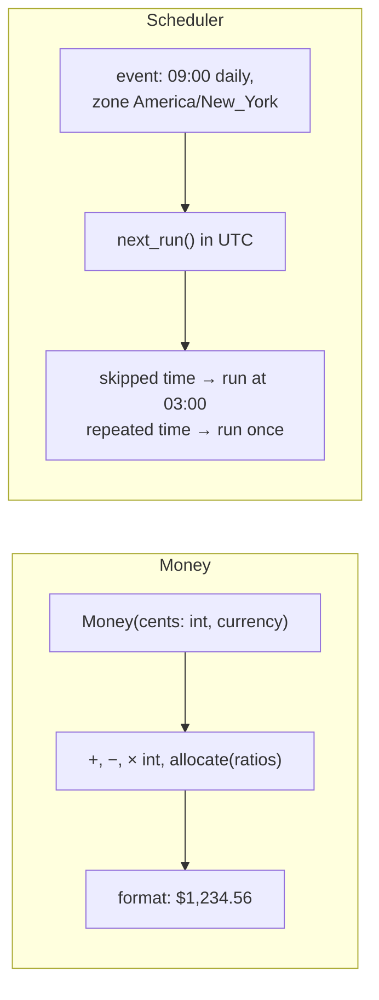

# Chapter 15 — Correctness Traps

> **Volume 1 — Computer Science Foundations** · [Contents](index.md) · ← [Chapter 14 — Programming Paradigms](ch14-programming-paradigms.md) · Next → [Chapter 16 — Linux: Filesystem, Shell, Bash, Permissions, Users & Groups](ch16-linux-filesystem-shell-bash-permissions-users-and.md)

---

## Concept

IEEE-754 floating point, integer overflow/signedness, and date/time/timezone bugs — the silent killers.

**In one sentence:** computers approximate real numbers, cap integers at fixed sizes, and live in a world of time zones and daylight saving — and each of these produces wrong answers without any error message.

**Mental model — rulers with limits.** A float is a ruler with fine marks near zero and coarse marks far away: most numbers fall *between* marks and get rounded. An integer is a car odometer: past 999,999 it rolls over to 000,000. Local time is a wall clock that someone moves forward and back twice a year.

**Floating point (IEEE-754 double)**

| Fact | Consequence |
|------|------------|
| 0.1 has no exact binary form (like 1/3 in decimal) | `0.1 + 0.2 == 0.30000000000000004` |
| ~15–17 significant digits | `1e16 + 1 == 1e16` |
| Rounding error accumulates | summing a million values drifts; use `math.fsum` |
| Special values | `inf`, `-inf`, `nan`; `nan != nan` |
| Not associative | `(a + b) + c` may differ from `a + (b + c)` |

**Rule:** never compare floats with `==`. Use `math.isclose(a, b, rel_tol=1e-9, abs_tol=…)`. For money, use integers (cents) or `Decimal`.

**Integers**

| Type | Range | Overflow behavior |
|------|-------|-------------------|
| `i32` | −2,147,483,648 .. 2,147,483,647 | Rust: panic in debug, wrap in release; C: **undefined behavior** for signed |
| `u32` | 0 .. 4,294,967,295 | wraps mod 2³² |
| `i64` | ±9.2 × 10¹⁸ | |
| Python `int` | unbounded | none (but NumPy arrays use fixed widths!) |
| JavaScript `number` | exact integers only up to 2⁵³ − 1 | silently loses precision; use `BigInt` |

Famous failures: the Ariane 5 rocket (a 64-bit float converted to a 16-bit int overflowed), YouTube's view counter (Gangnam Style passed 2³¹ − 1), and the Year 2038 problem (32-bit Unix time).

**Date and time**

| Trap | Example |
|------|---------|
| Local time is ambiguous | 01:30 happens *twice* on the night clocks go back |
| Local time can be missing | 02:30 doesn't exist on the night clocks go forward |
| A "day" isn't always 24 h | a DST change day is 23 or 25 hours |
| Offsets ≠ zones | `+01:00` is an offset; `Europe/Paris` is a zone with rules that change over time |
| Naive datetimes | Python `datetime.now()` has no zone; comparing naive and aware values raises an error |
| Zone rules change | governments change DST rules; keep `tzdata` updated |

**Rule:** store and compute in **UTC**, keep the **IANA zone name** (`America/New_York`) next to user-facing times, and convert to local time only for display.

---

## Prereqs

* [Chapter 1 — Variables, Data Types & Operators](ch01-variables-data-types-and-operators.md)

---

## Diagram

**IEEE-754 double: 64 bits**

```
  1 bit   11 bits           52 bits
 ┌─┬───────────┬────────────────────────────────────────────────────┐
 │S│ exponent  │ mantissa (fraction)                                │
 └─┴───────────┴────────────────────────────────────────────────────┘
 value = (−1)^S × 1.mantissa × 2^(exponent − 1023)

 0.1 = 0 01111111011 1001100110011001100110011001100110011001100110011010
                     └── 1001 repeats forever, so it is cut off and rounded
```

**Float precision gets coarser as numbers grow**

```
 near 1:      |‖‖‖‖‖‖‖‖‖‖‖‖‖‖‖‖‖‖|   gap ≈ 2.2e-16
 near 1e6:    | | | | | | | | | |    gap ≈ 1.2e-10
 near 1e16:   |    |    |    |       gap = 2   → 1e16 + 1 rounds back to 1e16
```

**Two's-complement wrap-around (8-bit)**

```
        0111 1111  = 127   (i8::MAX)
      +         1
      ───────────
        1000 0000  = −128  (i8::MIN)   the sign bit flipped

   number circle:   … 125 126 127 │ −128 −127 −126 …
                                  └ wraps here
```

**A DST boundary (US, second Sunday of March)**

```mermaid
gantt
    dateFormat HH:mm
    axisFormat %H:%M
    title Local clock on the spring-forward night
    section New York
    EST (UTC−5)          :a1, 00:00, 2h
    skipped hour 02:00–02:59 :crit, a2, 02:00, 1h
    EDT (UTC−4)          :a3, 03:00, 3h
```

---

## Example

```python
import math
from decimal import Decimal
from fractions import Fraction

print(0.1 + 0.2)                          # 0.30000000000000004
print(0.1 + 0.2 == 0.3)                   # False
print(math.isclose(0.1 + 0.2, 0.3))       # True
t = 0.0
for _ in range(10):
    t += 0.1
print(t, math.fsum([0.1] * 10))           # 0.9999999999999999 1.0
# (built-in sum() compensates for this since Python 3.12)
print(Decimal("0.1") + Decimal("0.2"))    # 0.3 — exact decimal
print(Fraction(1, 10) + Fraction(2, 10))  # 3/10 — exact rational
print(float("nan") == float("nan"))       # False

import numpy as np
print(np.array([2**31 - 1], dtype=np.int32) + 1)   # [-2147483648] — silent wrap
```

```rust
fn main() {
    let x: i32 = i32::MAX;
    println!("{:?}", x.checked_add(1));    // None
    println!("{}", x.wrapping_add(1));     // -2147483648
    println!("{:?}", x.overflowing_add(1)); // (-2147483648, true)
    println!("{}", x.saturating_add(1));   // 2147483647
    // x + 1 panics in a debug build: "attempt to add with overflow"
}
```

```python
from datetime import datetime, timedelta
from zoneinfo import ZoneInfo

ny = ZoneInfo("America/New_York")
start = datetime(2024, 3, 9, 12, 0, tzinfo=ny)      # Saturday noon, EST
end = datetime(2024, 3, 10, 12, 0, tzinfo=ny)       # Sunday noon, EDT

utc = ZoneInfo("UTC")
print(end - start)                                  # 1 day, 0:00:00 — WRONG: same tzinfo → wall-clock math
print(end.astimezone(utc) - start.astimezone(utc))  # 23:00:00 — the real elapsed time
print(start + timedelta(days=1))                    # 2024-03-10 12:00-04:00 (wall-clock arithmetic)
```

---

## Exercises

1. Find a floating-point comparison bug and fix it with epsilon.

   <details><summary>Solution</summary><code>while x != 1.0: x += 0.1</code> never ends, because x skips past 1.0. Fix: <code>while x &lt; 1.0 - 1e-9</code>, or better, loop over integers: <code>for i in range(10): x = i / 10</code>.</details>

2. Compute a duration across a DST boundary correctly.

   <details><summary>Solution</summary>Convert both aware datetimes to UTC and subtract, as in the example above (23 hours). Subtracting in local wall-clock time gives 24 hours — and in Python that includes subtracting two aware datetimes that share the same <code>tzinfo</code>, which silently does wall-clock math.</details>

3. Why is `(a + b) / 2` a bug in binary search with 32-bit ints? Fix it.

   <details><summary>Solution</summary>If a + b exceeds 2³¹ − 1 it overflows to a negative number. Use <code>a + (b − a) / 2</code>. This exact bug sat in Java's <code>Arrays.binarySearch</code> for about 9 years.</details>

---

## Mini project

**A money class using integers (cents) and a DST-aware event scheduler.**



**Steps**

1. `Money` stores an integer count of minor units plus a currency code; refuse to add different currencies.
2. `allocate([1, 1, 1])` splits $100.00 into 33.34 / 33.33 / 33.33 — no cent lost.
3. Parse and format safely; never go through `float`.
4. `Scheduler.next_run(rule, now_utc)` computes the next local 09:00 in the event's zone and returns UTC.
5. Tests: runs across both DST transitions, a daily event at 02:30 (missing and repeated days), and a zone whose rules changed.

**Done when:** splitting money always sums to the original, and the scheduler never fires twice or skips a day across DST.

---

## Open source

* [`python/cpython`](https://github.com/python/cpython) `decimal`/`fractions` — `Lib/fractions.py` is short and shows exact rational arithmetic; `Lib/_pydecimal.py` is the pure-Python decimal.
* [`chronotope/chrono`](https://github.com/chronotope/chrono) — Rust date/time. See how `LocalResult::Ambiguous` and `LocalResult::None` force you to handle repeated and skipped local times.

---

## Interview

1. **"Why is `0.1 + 0.2 != 0.3`?"**
   <details><summary>Answer</summary>Floats are stored in binary. 0.1, 0.2, and 0.3 have infinite binary expansions, so each is rounded to the nearest representable double. The rounding errors of 0.1 and 0.2 add up to a value one step above the double nearest to 0.3.</details>

2. **"How do you store money?"**
   <details><summary>Answer</summary>As an integer count of the smallest unit (cents), or as a fixed-point decimal type (<code>Decimal</code>, SQL <code>NUMERIC(19,4)</code>), always with an explicit currency. Never as a binary float. Define rounding rules explicitly (e.g. banker's rounding) and allocate remainders so totals are preserved.</details>

---

## Checklist

- [ ] never compare floats with `==`
- [ ] check overflow modes
- [ ] always store UTC + explicit tz

---

> [Contents](index.md) · ← [Chapter 14 — Programming Paradigms](ch14-programming-paradigms.md) · Next → [Chapter 16 — Linux: Filesystem, Shell, Bash, Permissions, Users & Groups](ch16-linux-filesystem-shell-bash-permissions-users-and.md)
