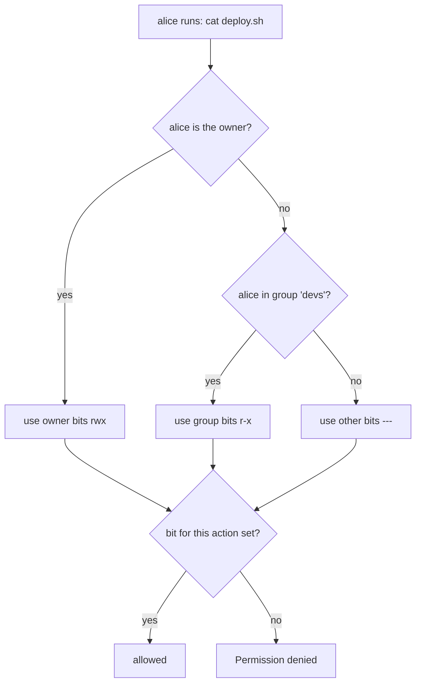
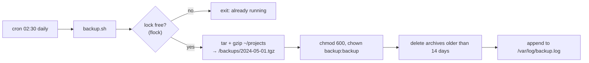

# Chapter 16 — Linux: Filesystem, Shell, Bash, Permissions, Users & Groups

> **Volume 1 — Computer Science Foundations** · [Contents](index.md) · ← [Chapter 15 — Correctness Traps](ch15-correctness-traps.md) · Next → [Chapter 17 — Linux: Processes, Signals, Services, systemd, SSH, Cron & Networking](ch17-linux-processes-signals-services-systemd-ssh-cron.md)

---

## Concept

The Unix filesystem tree, shell basics, Bash scripting, file permissions, users and groups.

**In one sentence:** in Linux everything hangs off one tree starting at `/`, you drive it by typing commands into a shell, and every file says which user, which group, and everyone else may read, write, or run it.

**Mental model — an office building.** `/` is the lobby. Each folder is a room. Your *user* is your badge; *groups* are departments. Each door (file) has a sign with three rows: what the owner may do, what the owner's department may do, and what anyone else may do.

**The filesystem tree**

| Path | Holds |
|------|-------|
| `/` | the root of everything |
| `/home/alice` | Alice's files (`~` is a shortcut) |
| `/root` | the superuser's home |
| `/etc` | system configuration (`/etc/passwd`, `/etc/ssh/sshd_config`) |
| `/bin`, `/usr/bin` | programs (`ls`, `grep`) |
| `/var/log` | logs |
| `/tmp` | temporary files, often cleared on reboot |
| `/dev` | devices as files (`/dev/null`, `/dev/sda`) |
| `/proc`, `/sys` | live kernel and process info as virtual files |
| `/opt`, `/srv` | add-on software, served data |

**Permissions**

```
 -rwxr-x---  1  alice  devs  4096  script.sh
 │└┬┘└┬┘└┬┘     owner  group
 │ │  │  └── others:  ---  = 0
 │ │  └───── group:   r-x  = 4+0+1 = 5
 │ └──────── owner:   rwx  = 4+2+1 = 7
 └────────── type: - file, d directory, l symlink
```

| Bit | Value | On a file | On a directory |
|-----|:-:|-----------|----------------|
| `r` | 4 | read contents | list names (`ls`) |
| `w` | 2 | modify contents | create / delete / rename entries inside |
| `x` | 1 | run as a program | enter it (`cd`) and reach files inside |

Common modes: `644` (files: owner writes, all read), `755` (programs and dirs), `600` (secrets: owner only), `700` (private dirs). Special bits: **setuid** (runs as the file's owner — how `passwd` works), **setgid**, and the **sticky bit** on `/tmp` (only the owner can delete their own files).

**Shell essentials**

| Concept | Syntax |
|---------|--------|
| Pipe output into another command | `cmd1 \| cmd2` |
| Redirect stdout / stderr / both | `> out.txt`, `2> err.txt`, `&> all.txt`, `>>` appends |
| Variables | `name="x"; echo "$name"` — **always quote** |
| Command substitution | `today=$(date +%F)` |
| Exit status | `$?`; 0 = success; `&&` runs next on success, `\|\|` on failure |
| Globs | `*.txt`, `file?.log`, `{a,b}.conf` |

**Safe Bash header:** `set -euo pipefail` — exit on errors (`-e`), fail on unset variables (`-u`), and fail a pipeline if any part fails (`pipefail`).

---

## Prereqs

None.

---

## Diagram

**Filesystem tree with permission annotations**

```
 /                                   drwxr-xr-x root  root
 ├── etc/                            drwxr-xr-x root  root
 │   ├── passwd                      -rw-r--r-- root  root    (everyone may read)
 │   └── shadow                      -rw-r----- root  shadow  (password hashes: locked)
 ├── home/
 │   └── alice/                      drwx------ alice alice   (private)
 │       ├── notes.txt               -rw-r--r-- alice alice
 │       └── deploy.sh               -rwxr-x--- alice devs    (750)
 ├── tmp/                            drwxrwxrwt root  root    (t = sticky bit)
 ├── usr/bin/passwd                  -rwsr-xr-x root  root    (s = setuid)
 └── var/log/                        drwxr-xr-x root  root
```

**How the kernel checks access**



Only the *first* matching class counts. If you are the owner with `---`, group bits do not rescue you.

---

## Example

```bash
chmod 750 script.sh            # rwx for owner, r-x for group, nothing for others
chmod u+x,g-w file             # symbolic form
chown alice:devs script.sh     # change owner and group
ls -l script.sh
id                             # uid=1000(alice) gid=1000(alice) groups=1000(alice),27(sudo),1001(devs)
sudo usermod -aG devs bob      # add bob to devs (-a: append, don't replace groups)
umask                          # 0022 → new files 644, new dirs 755
```

```bash
#!/usr/bin/env bash
set -euo pipefail

# Count lines in every .txt file (quoted, so spaces in names are safe)
for f in *.txt; do
    [[ -e "$f" ]] || continue            # no matches → the glob stays literal; skip it
    printf '%6d  %s\n' "$(wc -l < "$f")" "$f"
done

# Functions, arguments, and exit codes
backup() {
    local src="$1" dest="$2"
    cp -a -- "$src" "$dest" || { echo "copy failed: $src" >&2; return 1; }
}
backup notes.txt /tmp/notes.bak && echo "ok"
```

---

## Exercises

1. Explain `chmod 750` in words.

   <details><summary>Solution</summary>Owner: read, write, execute (7). Group: read and execute, no write (5). Others: no access (0). Typical for a script shared with your team but hidden from everyone else.</details>

2. Write a Bash script that finds and deletes files older than 30 days.

   <details><summary>Solution</summary>

   ```bash
   #!/usr/bin/env bash
   set -euo pipefail
   dir="${1:?usage: $0 DIR}"
   find "$dir" -type f -mtime +30 -print          # dry run first: look before deleting
   read -rp "Delete these? [y/N] " ok
   [[ "$ok" == "y" ]] && find "$dir" -type f -mtime +30 -delete
   ```
   <code>${1:?…}</code> stops the script if no directory is given, so it never runs <code>find</code> on an empty path.
   </details>

3. Why does `rm -rf $DIR/` with an unset `DIR` destroy a system, and how does `set -u` help?

   <details><summary>Solution</summary>Unset and unquoted, it expands to <code>rm -rf /</code>. <code>set -u</code> makes the script exit on the unset variable before running <code>rm</code>. Also quote it (<code>"$DIR"</code>) and use <code>${DIR:?}</code>.</details>

---

## Mini project

**A Bash backup script with permission handling and a cron entry.**



**Steps**

1. `set -euo pipefail`; take the source and destination as arguments with defaults.
2. Use `flock` so two runs never overlap.
3. Create a dated archive with `tar -czf`; set `umask 077` so archives are private from creation.
4. Keep the last 14 archives; delete older ones with `find -mtime +14 -delete`.
5. Log start, end, size, and exit status; exit non-zero on failure.
6. Install with `crontab -e`: `30 2 * * * /usr/local/bin/backup.sh >> /var/log/backup.log 2>&1`.

**Done when:** archives are mode 600, a second concurrent run exits cleanly, and a restore test gives back identical files (`diff -r`).

---

## Open source

* [`torvalds/linux`](https://github.com/torvalds/linux) (permission model) — `fs/namei.c`, function `generic_permission`, is the owner → group → other check shown in the diagram.
* [`bash`](https://www.gnu.org/software/bash/) — the manual's "Shell Expansions" section explains the order of brace, tilde, parameter, command, arithmetic, word-splitting, and glob expansion — the root of most quoting bugs.

---

## Interview

1. **"What do 4/2/1 mean in permissions?"**
   <details><summary>Answer</summary>Read = 4, write = 2, execute = 1. Add them per class (owner, group, others) to get one octal digit each. So 754 = rwx for owner, r-x for group, r-- for others.</details>

2. **"How do you make a script executable?"**
   <details><summary>Answer</summary>Add a shebang line (<code>#!/usr/bin/env bash</code>), then <code>chmod +x script.sh</code>, and run it with <code>./script.sh</code> (or put it on <code>$PATH</code>). Without the execute bit you can still run it as <code>bash script.sh</code>.</details>

---

## Checklist

- [ ] navigate the tree by heart
- [ ] set permissions correctly
- [ ] write a safe Bash script

---

> [Contents](index.md) · ← [Chapter 15 — Correctness Traps](ch15-correctness-traps.md) · Next → [Chapter 17 — Linux: Processes, Signals, Services, systemd, SSH, Cron & Networking](ch17-linux-processes-signals-services-systemd-ssh-cron.md)
