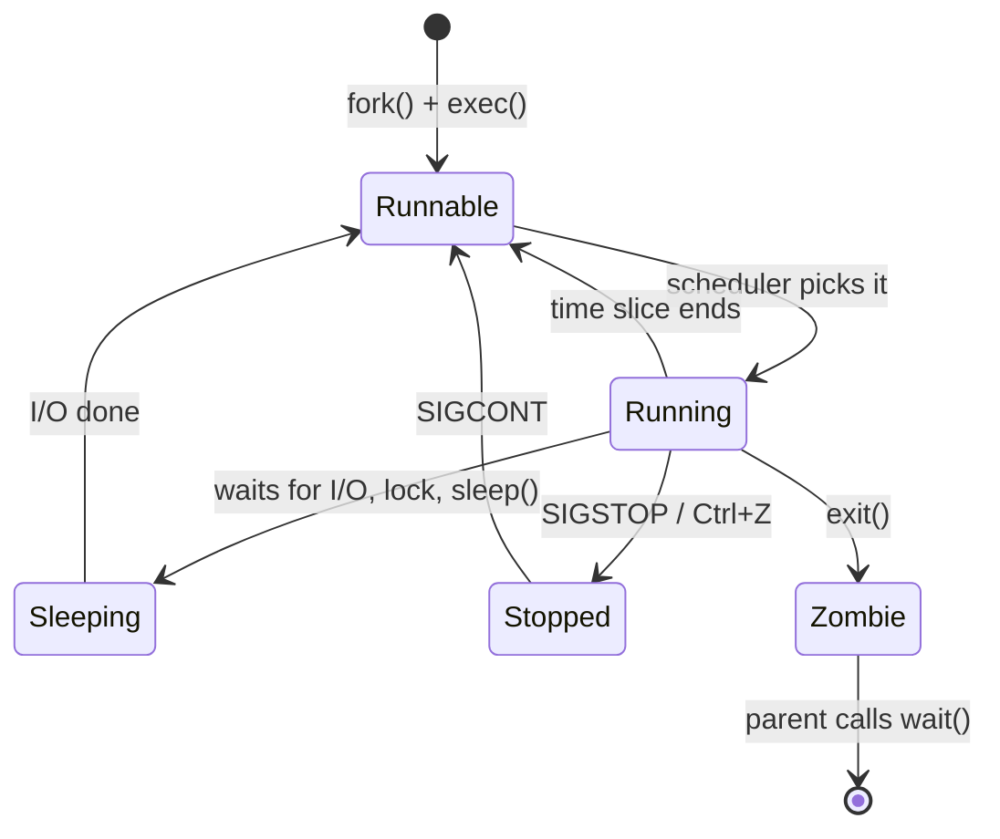
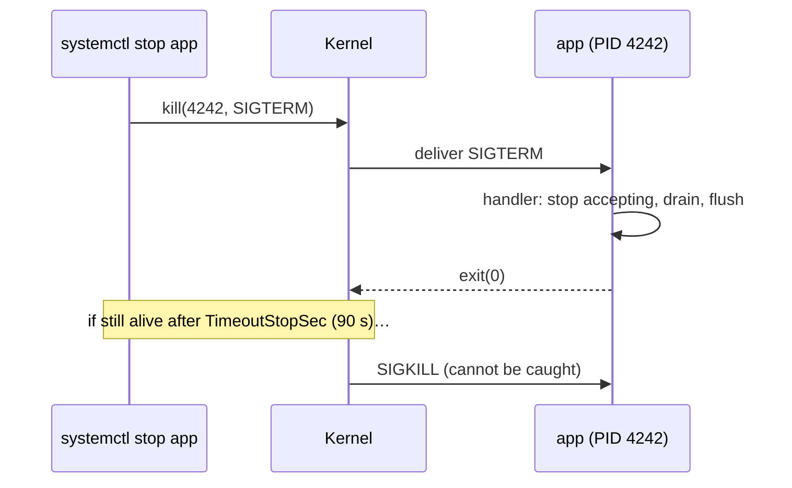
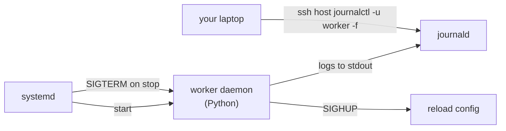

# Chapter 17 — Linux: Processes, Signals, Services, systemd, SSH, Cron & Networking

> **Volume 1 — Computer Science Foundations** · [Contents](index.md) · ← [Chapter 16 — Linux: Filesystem, Shell, Bash, Permissions, Users & Groups](ch16-linux-filesystem-shell-bash-permissions-users-and.md) · Next → [Chapter 18 — Terminal Tools: grep, sed, awk, jq, curl, wget, find, xargs, tmux, rsync](ch18-terminal-tools-grep-sed-awk-jq-curl.md)

---

## Concept

Process lifecycle, signals (SIGTERM/SIGKILL/SIGINT), systemd units, remote access via SSH, and scheduled jobs via cron.

**In one sentence:** every running program is a process with an ID; the kernel talks to processes through signals; systemd keeps long-running services alive; SSH lets you do all of this on another machine; and cron runs jobs on a timetable.

**Mental model — a hospital.** Processes are patients with a chart number (PID). Each was admitted by a parent process. Signals are messages from the front desk: "please get ready to leave" (SIGTERM), "you're out now" (SIGKILL). systemd is the head nurse who restarts anyone who collapses. SSH is the secure phone line to another hospital. Cron is the ward's daily schedule.

**Process basics**

| Term | Meaning |
|------|---------|
| PID / PPID | process ID / parent's ID; PID 1 is `systemd` (init) |
| `fork` + `exec` | how a process is born: copy the parent, then replace the program |
| Exit code | 0 = success, 1–255 = failure; 128 + N = killed by signal N |
| Zombie | finished, but the parent hasn't read its exit code yet (`wait`) |
| Orphan | parent died first; adopted by PID 1 |
| Daemon | a background process with no terminal |

**Signals you must know**

| Signal | # | Default | Can be caught? | Sent by |
|--------|:-:|---------|:-:|---------|
| `SIGINT` | 2 | terminate | yes | Ctrl+C |
| `SIGTERM` | 15 | terminate | yes | `kill PID`, `systemctl stop`, Kubernetes |
| `SIGKILL` | 9 | terminate now | **no** | `kill -9`, the OOM killer |
| `SIGHUP` | 1 | terminate | yes | terminal closed; often means "reload config" |
| `SIGSTOP` / `SIGCONT` | 19 / 18 | pause / resume | no / yes | Ctrl+Z, `fg` |
| `SIGCHLD` | 17 | ignore | yes | a child exited |

**Graceful shutdown:** on SIGTERM, stop accepting new work, finish in-flight work, flush, close, and exit 0 — within the grace period (systemd defaults to 90 s, Kubernetes to 30 s) before SIGKILL arrives.

**Cron syntax**

```
 ┌───────── minute (0–59)
 │ ┌─────── hour (0–23)
 │ │ ┌───── day of month (1–31)
 │ │ │ ┌─── month (1–12)
 │ │ │ │ ┌─ day of week (0–6, Sun = 0)
 │ │ │ │ │
 0 3 * * *   /usr/local/bin/backup.sh        → 03:00 every day
 */15 * * * * /usr/local/bin/poll.sh         → every 15 minutes
 0 9 * * 1-5 /usr/local/bin/report.sh        → 09:00 on weekdays
```

**Networking commands**

| Task | Command |
|------|---------|
| Addresses and interfaces | `ip addr`, `ip route` |
| Who listens on which port | `ss -tlnp` |
| Is a host reachable / where does it break | `ping`, `traceroute`, `mtr` |
| DNS lookup | `dig example.com`, `getent hosts example.com` |
| Test a TCP port | `nc -vz host 5432` |
| HTTP request | `curl -v https://…` |

---

## Prereqs

* [Chapter 16 — Linux: Filesystem, Shell, Bash, Permissions, Users & Groups](ch16-linux-filesystem-shell-bash-permissions-users-and.md)

---

## Diagram

**Process state machine**



**Signal delivery**



**SSH key authentication**

```
 your laptop                                   server
 ~/.ssh/id_ed25519      (private — never leaves)
 ~/.ssh/id_ed25519.pub ──── copied once ────►  ~/.ssh/authorized_keys
 ssh alice@server
   1. server sends a challenge
   2. laptop signs it with the private key
   3. server checks the signature with the public key → logged in, no password sent
```

---

## Example

```bash
ps -eo pid,ppid,stat,cmd | head      # STAT: R running, S sleeping, Z zombie, T stopped
pgrep -f "python app.py"
kill -TERM "$PID"                    # polite
kill -KILL "$PID"                    # last resort
systemctl restart app
systemctl status app
journalctl -u app -f --since "10 min ago"
```

```bash
#!/usr/bin/env bash
# Trap SIGTERM/SIGINT to clean up
set -euo pipefail
tmp=$(mktemp -d)
cleanup() { echo "cleaning $tmp"; rm -rf -- "$tmp"; }
trap cleanup EXIT                    # runs on any exit
trap 'echo "got SIGTERM"; exit 143' TERM
echo "working in $tmp (PID $$)"
sleep 1000 & wait $!                 # wait is interruptible; a foreground sleep would delay the trap
```

```ini
# /etc/systemd/system/app.service
[Unit]
Description=Order API
After=network-online.target
Wants=network-online.target

[Service]
User=app
WorkingDirectory=/opt/app
ExecStart=/opt/app/.venv/bin/python -m app
Restart=on-failure
RestartSec=2
TimeoutStopSec=30
Environment=PORT=8080
EnvironmentFile=-/etc/app/env

[Install]
WantedBy=multi-user.target
```

```bash
sudo systemctl daemon-reload && sudo systemctl enable --now app
ssh -i ~/.ssh/id_ed25519 alice@server 'journalctl -u app -n 50'
ssh -L 5432:localhost:5432 alice@db-host      # tunnel: local 5432 → the server's 5432
```

---

## Exercises

1. Trap SIGTERM in a script to clean up gracefully.

   <details><summary>Solution</summary>See the trap script above. Test it: run it, then <code>kill -TERM &lt;pid&gt;</code> from another shell; the temp directory is removed. Try <code>kill -9</code>: no cleanup runs, which is why you should never rely on SIGKILL.</details>

2. Write a systemd unit for a long-running service.

   <details><summary>Solution</summary>See <code>app.service</code> above. Key choices: a dedicated <code>User</code>, <code>Restart=on-failure</code>, and a <code>TimeoutStopSec</code> matching your drain time. Run in the foreground (no daemonizing) and log to stdout; journald collects it.</details>

3. A cron job works when you run it by hand but not from cron. Name three likely causes.

   <details><summary>Solution</summary>(1) A different <code>PATH</code> — cron's is minimal, so use absolute paths. (2) No environment variables or shell profile. (3) The working directory is <code>$HOME</code>, so relative paths break. Also: <code>%</code> must be escaped in crontab, and output goes nowhere unless redirected.</details>

---

## Mini project

**A daemon with a systemd unit, a signal handler, and SSH remote logs.**



**Steps**

1. A Python worker that processes jobs from a directory in a loop.
2. `signal.signal(SIGTERM, …)` sets a `stopping` flag; the loop finishes the current job, then exits 0.
3. `SIGHUP` reloads the config file without restarting.
4. A systemd unit with `Restart=on-failure`; prove it restarts after `kill -9`.
5. From another machine, follow the logs over SSH with key-based auth only (`PasswordAuthentication no`).

**Done when:** `systemctl stop` never loses a job, `kill -9` leads to an automatic restart, and `kill -HUP` applies new config.

---

## Open source

* [`systemd/systemd`](https://github.com/systemd/systemd) — `man systemd.service` and `man systemd.kill` document restart and stop behavior precisely.
* [`openssh/openssh-portable`](https://github.com/openssh/openssh-portable) — `sshd_config(5)`: read the settings for `PermitRootLogin`, `PasswordAuthentication`, and `AllowUsers`.

---

## Interview

1. **"SIGTERM vs SIGKILL?"**
   <details><summary>Answer</summary>SIGTERM asks a process to stop; it can catch it, clean up, and exit. SIGKILL is handled by the kernel and cannot be caught: the process dies immediately with no cleanup. Always send SIGTERM first, wait a grace period, then SIGKILL.</details>

2. **"What is a zombie process?"**
   <details><summary>Answer</summary>A process that has exited but still has an entry in the process table because its parent hasn't called <code>wait()</code> to collect the exit status. It uses no CPU or memory beyond that entry. Many zombies mean a buggy parent. If the parent dies, PID 1 adopts and reaps them.</details>

---

## Checklist

- [ ] trap signals
- [ ] write a systemd unit
- [ ] schedule with cron safely

---

> [Contents](index.md) · ← [Chapter 16 — Linux: Filesystem, Shell, Bash, Permissions, Users & Groups](ch16-linux-filesystem-shell-bash-permissions-users-and.md) · Next → [Chapter 18 — Terminal Tools: grep, sed, awk, jq, curl, wget, find, xargs, tmux, rsync](ch18-terminal-tools-grep-sed-awk-jq-curl.md)
