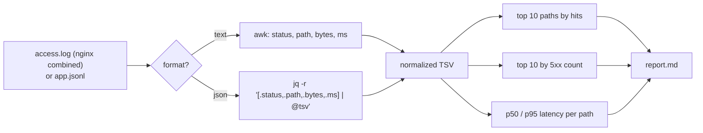

# Chapter 18 — Terminal Tools: grep, sed, awk, jq, curl, wget, find, xargs, tmux, rsync

> **Volume 1 — Computer Science Foundations** · [Contents](index.md) · ← [Chapter 17 — Linux: Processes, Signals, Services, systemd, SSH, Cron & Networking](ch17-linux-processes-signals-services-systemd-ssh-cron.md) · Next → [Chapter 19 — Git: Branching, Merge, Rebase & Cherry-Pick](ch19-git-branching-merge-rebase-and-cherry-pick.md)

---

## Concept

The Unix toolbox — text search/transform, JSON, HTTP clients, file discovery, multiplexing, and sync.

**In one sentence:** each Unix tool does one small job on a stream of text, and the pipe `|` snaps them together into programs you write in one line.

**Mental model — a factory conveyor belt.** Text rides along the belt. `grep` is a filter that removes items. `sed` is a stamping machine that edits each item. `awk` is a sorter that splits items into columns and does arithmetic. `sort | uniq -c` is the counting station at the end.

**The toolbox**

| Tool | Job | Most-used forms |
|------|-----|-----------------|
| `grep` | keep lines matching a pattern | `-i` ignore case, `-v` invert, `-r` recurse, `-n` line numbers, `-E` extended regex, `-o` only the match, `-c` count |
| `sed` | edit lines in a stream | `s/old/new/g`, `-n '5,10p'`, `-i` in place (GNU) |
| `awk` | column processing + small programs | `awk -F, '{s+=$3} END {print s}'`, `$1`, `NF`, `NR` |
| `sort` / `uniq` | order / collapse duplicates | `sort -n`, `-r`, `-k2,2`, `-t,`; `uniq -c` needs sorted input |
| `cut` / `tr` / `wc` / `head` / `tail` | slice columns, translate chars, count, peek | `cut -d, -f2`, `tr a-z A-Z`, `wc -l`, `tail -f` |
| `jq` | query and transform JSON | `.field`, `.[]`, `select(.x > 1)`, `-r` raw output |
| `curl` | HTTP (and more) client | `-sS` quiet with errors, `-X POST`, `-H`, `-d`, `-o`, `-L` follow redirects, `-w '%{http_code}'` |
| `wget` | download files, recursively | `wget -c` resume, `-r -np` mirror |
| `find` | locate files by name, type, size, time | `-name '*.py'`, `-type f`, `-size +100M`, `-mtime -1`, `-exec … {} +` |
| `xargs` | turn input lines into command arguments | `-0` with `find -print0`, `-n1` one at a time, `-P8` in parallel |
| `tmux` | persistent terminal sessions, splits | `tmux new -s work`, detach `Ctrl-b d`, `tmux attach -t work` |
| `rsync` | efficient sync (sends only differences) | `rsync -avz --delete src/ host:dst/`, `-n` dry run |

**Why `xargs`?** Many commands take file names as *arguments*, not as *stdin*. `find … | rm` does nothing useful, because `rm` doesn't read stdin. `xargs` converts the stream into arguments, and batches them to stay under the OS argument-length limit.

---

## Prereqs

* [Chapter 16 — Linux: Filesystem, Shell, Bash, Permissions, Users & Groups](ch16-linux-filesystem-shell-bash-permissions-users-and.md)

---

## Diagram

**A pipeline: top error paths in an access log**


```
 stage          sample output
 ─────────────  ───────────────────────────────────────────────────────────
 grep           10.0.0.7 - - [..] "GET /api/cart?id=9 HTTP/1.1" 500 ...
 sed            10.0.0.7 - - [..] "GET /api/cart HTTP/1.1" 500 ...
 awk            /api/cart
 sort|uniq -c      412 /api/cart
                    97 /api/pay
 sort -rn|head  412 /api/cart  ← the answer
```

**Streams: stdin, stdout, stderr**

```
            ┌──────────┐ stdout (1) ──► next command in the pipe
 stdin (0) ─►  command  │
            └──────────┘ stderr (2) ──► terminal (not piped unless 2>&1)
```

---

## Example

```bash
# Count HTTP statuses in JSON logs (one object per line)
jq -r '.status' logs.json | sort | uniq -c | sort -rn

# Find TODOs in Python files (safe with spaces in names)
find . -name '*.py' -print0 | xargs -0 grep -n TODO

# Sum the 3rd column of a CSV, skipping the header
awk -F, 'NR > 1 { total += $3 } END { printf "%.2f\n", total }' sales.csv

# In-place replace across files (GNU sed; on macOS use sed -i '')
grep -rl 'old_name' src/ | xargs sed -i 's/old_name/new_name/g'

# The 10 largest files under a directory
find /var -type f -printf '%s %p\n' 2>/dev/null | sort -rn | head -10
du -ah /var 2>/dev/null | sort -rh | head -10           # alternative, human-readable

# HTTP: status code and timing only
curl -sS -o /dev/null -w '%{http_code} %{time_total}s\n' https://example.com

# POST JSON and pick a field
curl -sS -X POST https://httpbin.org/post -H 'Content-Type: application/json' \
     -d '{"name":"ada"}' | jq -r '.json.name'

# jq: filter and reshape
jq '[.[] | select(.age >= 18) | {name, email}]' users.json

# Parallel: compress logs with 8 workers
find logs -name '*.log' -print0 | xargs -0 -n1 -P8 gzip

# Sync a folder to a server (dry run first!)
rsync -avzn --delete ./site/ web:/var/www/site/
```

---

## Exercises

1. Sum a CSV column with awk.

   <details><summary>Solution</summary><code>awk -F, 'NR&gt;1 {s+=$3} END {print s}' file.csv</code>. For CSVs with quoted commas, awk is the wrong tool; use <code>mlr</code>, <code>csvkit</code>, or Python.</details>

2. Extract all URLs from logs with grep + sed.

   <details><summary>Solution</summary><code>grep -oE 'https?://[^ "]+' app.log | sed -E 's/[).,;]+$//' | sort -u</code>. <code>-o</code> prints only the match, the sed strips trailing punctuation, and <code>sort -u</code> dedups.</details>

3. Why is `for f in $(find . -name '*.txt')` dangerous?

   <details><summary>Solution</summary>Word splitting breaks names containing spaces or newlines into several items, and globs in names expand. Use <code>find … -print0 | xargs -0</code>, <code>find … -exec cmd {} +</code>, or a <code>while IFS= read -r -d '' f</code> loop.</details>

---

## Mini project

**A shell pipeline that parses access logs into a top-N report using jq/awk/sort.**



**Steps**

1. `report.sh LOGFILE [N]` with `set -euo pipefail` and a usage message.
2. Normalize both input formats into TSV: `status  path  bytes  ms`.
3. Build three tables with `sort | uniq -c | sort -rn | head -N`, and compute p95 by sorting the `ms` values per path in awk.
4. Write Markdown tables to `report.md`.
5. Benchmark it on 1 GB of logs and compare with a Python version.

**Done when:** one command produces the report for both formats, and the numbers match a Python cross-check.

---

## Open source

* [`jqlang/jq`](https://github.com/jqlang/jq) — the manual's "Basic filters" and "Builtin operators and functions" sections; `src/builtin.jq` shows many built-ins are written in jq itself.
* [`curl/curl`](https://github.com/curl/curl) — `docs/cmdline-opts/` has one file per option; `everything.curl.dev` is the free book.

---

## Interview

1. **"How do you find the 10 largest files under a directory?"**
   <details><summary>Answer</summary><code>find DIR -type f -printf '%s %p\n' | sort -rn | head -10</code> (GNU), or <code>du -ah DIR | sort -rh | head -10</code>. On macOS: <code>find DIR -type f -exec stat -f '%z %N' {} + | sort -rn | head</code>. For interactive use, <code>ncdu</code>.</details>

2. **"xargs — why is it needed?"**
   <details><summary>Answer</summary>It turns lines on stdin into command-line arguments for commands that don't read stdin (<code>rm</code>, <code>grep</code> on files, <code>gzip</code>). It batches arguments to stay under the OS limit and can run in parallel (<code>-P</code>). Use <code>-0</code> with <code>find -print0</code> to handle any file name safely.</details>

---

## Checklist

- [ ] compose pipelines fluently
- [ ] use jq for JSON
- [ ] batch safely with xargs

---

> [Contents](index.md) · ← [Chapter 17 — Linux: Processes, Signals, Services, systemd, SSH, Cron & Networking](ch17-linux-processes-signals-services-systemd-ssh-cron.md) · Next → [Chapter 19 — Git: Branching, Merge, Rebase & Cherry-Pick](ch19-git-branching-merge-rebase-and-cherry-pick.md)
