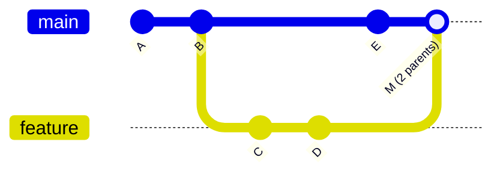
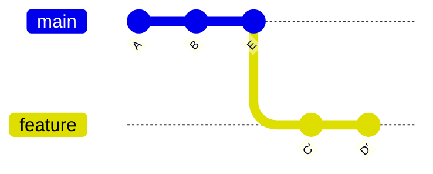
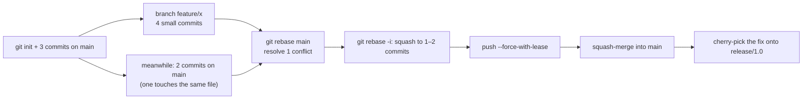

# Chapter 19 — Git: Branching, Merge, Rebase & Cherry-Pick

> **Volume 1 — Computer Science Foundations** · [Contents](index.md) · ← [Chapter 18 — Terminal Tools: grep, sed, awk, jq, curl, wget, find, xargs, tmux, rsync](ch18-terminal-tools-grep-sed-awk-jq-curl.md) · Next → [Chapter 20 — Git: Tags, Stash, Hooks & Internals](ch20-git-tags-stash-hooks-and-internals.md)

---

## Concept

The commit DAG, branches, merge (3-way), rebase (replay), and cherry-pick (apply a commit elsewhere).

**In one sentence:** Git history is a graph of snapshots; a branch is just a movable label on one snapshot; merge joins two lines of history, rebase replays your commits on a new base, and cherry-pick copies one commit somewhere else.

**Mental model — sticky notes on a family tree.** Each commit is a photo that points back to its parent photo(s). A branch is a sticky note stuck on one photo. Committing adds a new photo and moves the sticky note forward. `HEAD` is a note saying "you are here".

**Key terms**

| Term | Meaning |
|------|---------|
| Commit | a snapshot of the whole project + metadata + parent pointer(s) |
| DAG | directed acyclic graph: commits point to parents; merges have two parents |
| Branch | a named pointer to a commit (a 41-byte file in `.git/refs/heads/`) |
| `HEAD` | the commit or branch you have checked out |
| Merge base | the most recent common ancestor of two branches |
| Fast-forward | the target has no new commits, so the pointer just moves forward |
| 3-way merge | combine *base*, *ours*, and *theirs* into a new merge commit |
| Rebase | re-apply your commits one by one on top of another commit (new IDs) |
| Cherry-pick | apply the change from one commit onto the current branch (new ID) |
| Conflict | both sides changed the same lines differently; you decide |

**Merge vs rebase**

| | Merge | Rebase |
|-|-------|--------|
| History | true, branching, with merge commits | linear, rewritten |
| Commit IDs | unchanged | new IDs for replayed commits |
| Safe on shared branches? | yes | **no** — rewrites history others may have |
| Conflicts | resolved once | may be resolved per replayed commit |
| Best for | integrating long-lived branches; keeping context | cleaning up *your own* feature branch before review |

**The golden rule:** never rebase commits that others have already pulled. If you must update a pushed branch you own, use `git push --force-with-lease`, never plain `--force`.

---

## Prereqs

None. (Graph ideas from [Vol 0 Ch 4](../volume-0-math/ch04-graph-theory-foundations.md) help.)

---

## Diagram

**A branch and a merge commit**



**The same work, rebased instead** — C and D are replayed on top of E as new commits C′ and D′.



No merge commit is needed: `main` can now fast-forward its label from E to D′.

**3-way merge: how Git decides**

```
 base (merge base):  greeting = "hello"      timeout = 30
 ours (main):        greeting = "hello"      timeout = 60     ← only ours changed timeout
 theirs (feature):   greeting = "hi"         timeout = 30     ← only theirs changed greeting
 result:             greeting = "hi"         timeout = 60     ✓ automatic
 if both changed the same line differently → CONFLICT, you choose
```

**Cherry-pick**

```
 main:     A ── B ── E ── F′      ← F′ = the same change as F, new ID
                 \
 release:         C ── F          (a hotfix on release, also needed on main)
```

---

## Example

```bash
git switch -c feature/login          # create + switch
git commit -am "Add login form"
git log --oneline --graph --all      # read the DAG

# Update your feature branch with main — two ways
git fetch origin
git merge origin/main                # keeps history, adds a merge commit
# or
git rebase origin/main               # replays your commits on top of main

# Resolving a conflict
git merge origin/main
# CONFLICT (content): Merge conflict in app.py
git status                           # shows "both modified: app.py"
```

```
<<<<<<< HEAD
TIMEOUT = 60
=======
TIMEOUT = 45
>>>>>>> origin/main
```

```bash
# edit to the correct final content, delete the markers, then:
git add app.py
git commit                           # (during a rebase: git rebase --continue)
git merge --abort                    # escape hatch: back to before the merge

# Apply a single commit from another branch
git cherry-pick abc1234
git cherry-pick -x abc1234           # -x records "(cherry picked from commit …)"

# Clean up your own commits before review
git rebase -i origin/main            # squash / reword / reorder (interactive)
git push --force-with-lease          # refuses if someone else pushed meanwhile
```

---

## Exercises

1. Resolve a merge conflict by hand.

   <details><summary>Solution</summary>Make two branches that change the same line, then merge. Open the file, read both sides between the markers, write the intended final code (sometimes neither side, but a combination), remove the markers, run the tests, <code>git add</code>, and commit. <code>git diff --cc</code> or a merge tool helps on big conflicts.</details>

2. Rebase a feature branch and explain the resulting history.

   <details><summary>Solution</summary>After <code>git rebase main</code>, the feature commits sit on top of main's latest commit with new SHAs. The old commits still exist, unreferenced, until garbage collection (see <code>git reflog</code>). History is linear, so main can fast-forward to the feature.</details>

3. You committed to `main` by mistake instead of a new branch. Fix it without losing work.

   <details><summary>Solution</summary><code>git branch feature</code> (label the current commit), <code>git reset --hard origin/main</code> (move main back), <code>git switch feature</code>. Only do this if you haven't pushed main.</details>

---

## Mini project

**Reproduce a real PR flow (branch → commits → rebase → squash-merge) on a toy repo.**



**Steps**

1. Script the setup so it's repeatable (`setup.sh`).
2. Produce a real conflict and resolve it during the rebase.
3. Squash to a clean history with good commit messages.
4. Compare the graphs for a merge commit, a rebase + fast-forward, and a squash-merge (`git log --graph`).
5. Cherry-pick one commit to a release branch with `-x`.
6. Use `git reflog` to recover a commit you "lost" during the rebase.

**Done when:** you can draw each graph before running the command, and your drawing matches `git log --graph`.

---

## Open source

* [`git/git`](https://github.com/git/git) — `Documentation/git-rebase.txt` and `git-merge.txt` are the definitive references; `merge-ort.c` is the modern merge engine.

---

## Interview

1. **"Merge vs rebase — trade-offs?"**
   <details><summary>Answer</summary>Merge preserves exactly what happened and never rewrites history, but adds merge commits and a busier graph. Rebase produces a linear, readable history and easier bisecting, but rewrites commit IDs, so it's unsafe on shared branches and conflicts may repeat per commit. Common policy: rebase your private branch, merge (or squash-merge) into main.</details>

2. **"What is a fast-forward merge?"**
   <details><summary>Answer</summary>When the target branch has no commits that aren't already in the source, Git just moves the target's pointer forward to the source's tip. No merge commit is created. <code>--no-ff</code> forces a merge commit anyway; <code>--ff-only</code> refuses anything else.</details>

---

## Checklist

- [ ] read a commit graph
- [ ] resolve conflicts confidently
- [ ] choose merge vs rebase deliberately

---

> [Contents](index.md) · ← [Chapter 18 — Terminal Tools: grep, sed, awk, jq, curl, wget, find, xargs, tmux, rsync](ch18-terminal-tools-grep-sed-awk-jq-curl.md) · Next → [Chapter 20 — Git: Tags, Stash, Hooks & Internals](ch20-git-tags-stash-hooks-and-internals.md)
