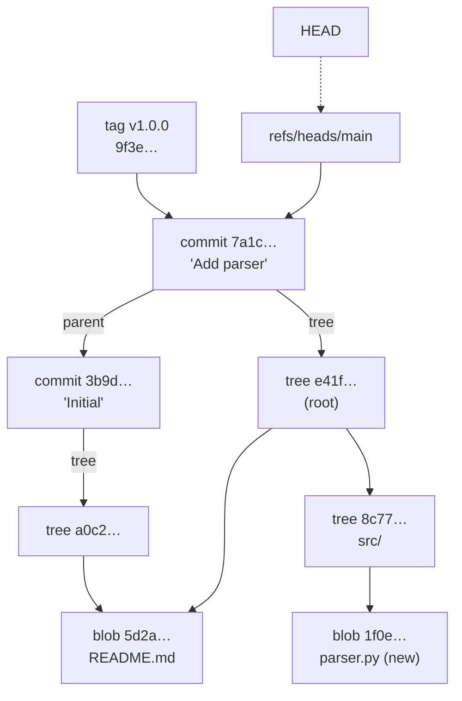
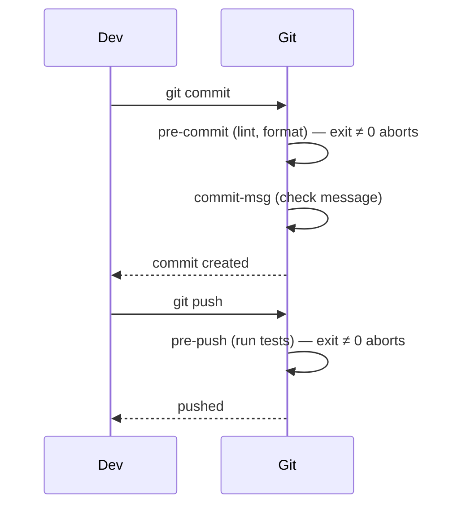
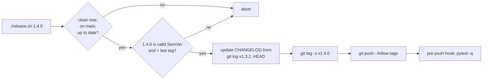

# Chapter 20 — Git: Tags, Stash, Hooks & Internals

> **Volume 1 — Computer Science Foundations** · [Contents](index.md) · ← [Chapter 19 — Git: Branching, Merge, Rebase & Cherry-Pick](ch19-git-branching-merge-rebase-and-cherry-pick.md) · Next → [Chapter 21 — Build Systems & Package Management](ch21-build-systems-and-package-management.md)

---

## Concept

Tags (releases), stash (temporary WIP), hooks (automation), and Git's object model (blobs/trees/commits, content addressing).

**In one sentence:** under the hood Git is a key–value store where the key is the hash of the content, and tags, stashes, branches, and hooks are small conveniences built on top of it.

**Mental model — a library of sealed envelopes.** Every file version, folder listing, and commit is sealed in an envelope labeled with the fingerprint (hash) of its contents. The same content always gets the same label, so it is stored once. Change one byte and you get a new envelope with a new label. Branches and tags are bookmarks pointing at envelopes.

**The four object types**

| Object | Stores | Points to |
|--------|--------|-----------|
| **blob** | the raw bytes of one file version (no name!) | nothing |
| **tree** | a directory listing: mode, name, and hash per entry | blobs and sub-trees |
| **commit** | author, committer, date, message | one tree (the snapshot) + parent commit(s) |
| **tag** (annotated) | tagger, date, message, optional signature | usually a commit |

**Content addressing:** `id = SHA-1("blob <size>\0<content>")` (SHA-256 in newer repos). Consequences: identical files are stored once; any change to any file changes its tree, every parent tree, and the commit ID — so a commit ID fingerprints the *entire* history behind it.

**Refs** are just files holding a hash: `.git/refs/heads/main`, `.git/refs/tags/v1.0.0`. `HEAD` usually holds `ref: refs/heads/main`.

**Tags**

| | Lightweight | Annotated |
|-|-------------|-----------|
| What | a ref pointing at a commit | a real tag object with tagger, date, message, and optional GPG/SSH signature |
| Create | `git tag v1.0.0` | `git tag -a v1.0.0 -m "…"` (`-s` to sign) |
| Use for | private bookmarks | **releases** (shown by `git describe`) |
| Pushed by default? | no — `git push origin v1.0.0` or `--follow-tags` | same |

**Stash** — a stack of temporary commits for work-in-progress: `git stash push -m "wip"` saves and cleans the working tree; `git stash pop` re-applies it.

**Hooks** — scripts in `.git/hooks/` that Git runs at set moments. They aren't versioned by default, so teams share them with the `pre-commit` framework or `core.hooksPath`.

| Hook | When | Typical use |
|------|------|-------------|
| `pre-commit` | before a commit is created | format, lint, block secrets |
| `commit-msg` | after the message is written | enforce Conventional Commits |
| `pre-push` | before pushing | run the fast test suite |
| `post-merge` / `post-checkout` | after | reinstall dependencies |
| server `pre-receive` | on the server, before accepting a push | enforce policies |

---

## Prereqs

* [Chapter 19 — Git: Branching, Merge, Rebase & Cherry-Pick](ch19-git-branching-merge-rebase-and-cherry-pick.md)

---

## Diagram

**Git's object database**



`README.md` didn't change, so both trees point to the **same** blob — stored once.

**How a change ripples up**

```
 edit src/parser.py
   → new blob          (content changed)
   → new tree src/     (its entry's hash changed)
   → new root tree     (src/'s hash changed)
   → new commit        (its tree hash changed)
 Unchanged files and folders are reused as-is.
```

**Hook timeline for one commit and push**



---

## Example

```bash
echo "hello" | git hash-object --stdin          # ce013625030ba8dba906f756967f9e9ca394464a
git cat-file -t HEAD                            # commit
git cat-file -p HEAD                            # tree …, parent …, author …, message
git cat-file -p 'HEAD^{tree}'                   # 100644 blob 5d2a…  README.md
                                                # 040000 tree 8c77…  src
git rev-parse HEAD
cat .git/HEAD                                   # ref: refs/heads/main

git tag -a v1.0.0 -m "First stable release"     # annotated
git push origin v1.0.0
git describe --tags                             # v1.0.0-3-g7a1c2e4 (3 commits after the tag)

git stash push -m "wip: half-done refactor"
git stash list                                  # stash@{0}: On main: wip: half-done refactor
git stash pop
```

```bash
#!/usr/bin/env bash
# .git/hooks/pre-commit — block whitespace errors and debug prints (chmod +x it)
set -euo pipefail
if ! git diff --cached --check; then
    echo "✗ whitespace errors (see above)"; exit 1
fi
if git diff --cached -U0 -- '*.py' | grep -E '^\+.*\bbreakpoint\(\)'; then
    echo "✗ remove breakpoint() before committing"; exit 1
fi
```

```yaml
# .pre-commit-config.yaml — versioned, shared hooks
repos:
  - repo: https://github.com/astral-sh/ruff-pre-commit
    rev: v0.6.9
    hooks:
      - id: ruff
      - id: ruff-format
  - repo: https://github.com/pre-commit/pre-commit-hooks
    rev: v4.6.0
    hooks:
      - id: trailing-whitespace
      - id: detect-private-key
```

---

## Exercises

1. Inspect a commit object with `git cat-file`.

   <details><summary>Solution</summary><code>git cat-file -p HEAD</code> shows <code>tree</code>, <code>parent</code>, <code>author</code>, <code>committer</code>, and the message. Follow the tree hash with <code>git cat-file -p &lt;tree&gt;</code> down to a blob. Compare with <code>git hash-object path/to/file</code>: the hashes match.</details>

2. Write a pre-commit hook that blocks whitespace errors.

   <details><summary>Solution</summary>See the hook above: <code>git diff --cached --check</code> exits non-zero on trailing whitespace or conflict markers in staged changes. Make the file executable. Bypass it in an emergency with <code>git commit --no-verify</code> (and know that it's possible).</details>

3. Why does renaming a file without changing it create no new blob?

   <details><summary>Solution</summary>A blob stores only content, not the name. The name lives in the tree. Renaming changes the tree entry, so there's a new tree and commit, but the blob hash is unchanged and reused.</details>

---

## Mini project

**A release script that tags, signs, and pushes — plus a pre-push hook running tests.**



**Steps**

1. Refuse to run with uncommitted changes, off `main`, or behind `origin/main`.
2. Validate the version (SemVer regex) and check it is greater than `git describe --tags --abbrev=0`.
3. Generate changelog lines from `git log --pretty='- %s' LAST..HEAD`.
4. Create a signed annotated tag (`-s`, using an SSH or GPG key); verify with `git tag -v`.
5. Install a `pre-push` hook (via `core.hooksPath=.githooks`) that runs the fast tests.

**Done when:** a bad version or a failing test stops the release before anything is pushed, and `git tag -v v1.4.0` verifies.

---

## Open source

* [`git/git`](https://github.com/git/git) internals — `Documentation/gitformat-*.txt` and the "Git Internals" chapter of *Pro Git* (free online) walk through `.git/objects` by hand.
* [`pre-commit/pre-commit`](https://github.com/pre-commit/pre-commit) — the framework that installs versioned hooks in isolated environments.

---

## Interview

1. **"What is Git's content model?"**
   <details><summary>Answer</summary>A content-addressed object store. Blobs hold file contents, trees hold directory listings, and commits point to one root tree plus parents. Each object's ID is the hash of its contents, so identical content is deduplicated and any change produces new IDs up to the commit — making history tamper-evident.</details>

2. **"What's a lightweight vs annotated tag?"**
   <details><summary>Answer</summary>A lightweight tag is just a ref naming a commit. An annotated tag is a full object with tagger, date, message, and optional signature. Use annotated (ideally signed) tags for releases; <code>git describe</code> uses them by default.</details>

---

## Checklist

- [ ] explain content addressing
- [ ] tag a release
- [ ] automate with hooks

---

> [Contents](index.md) · ← [Chapter 19 — Git: Branching, Merge, Rebase & Cherry-Pick](ch19-git-branching-merge-rebase-and-cherry-pick.md) · Next → [Chapter 21 — Build Systems & Package Management](ch21-build-systems-and-package-management.md)
