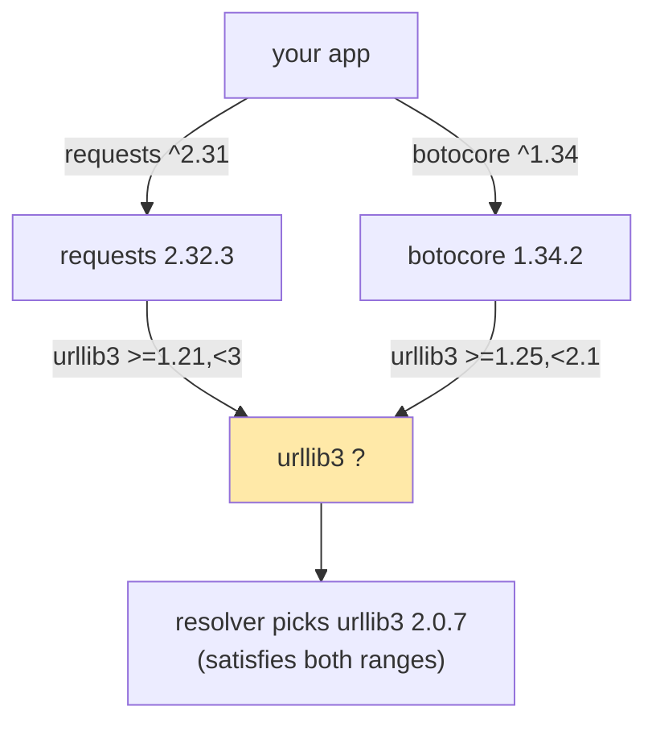
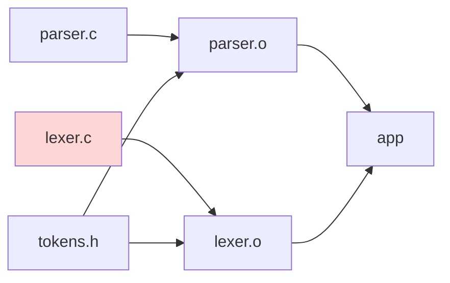
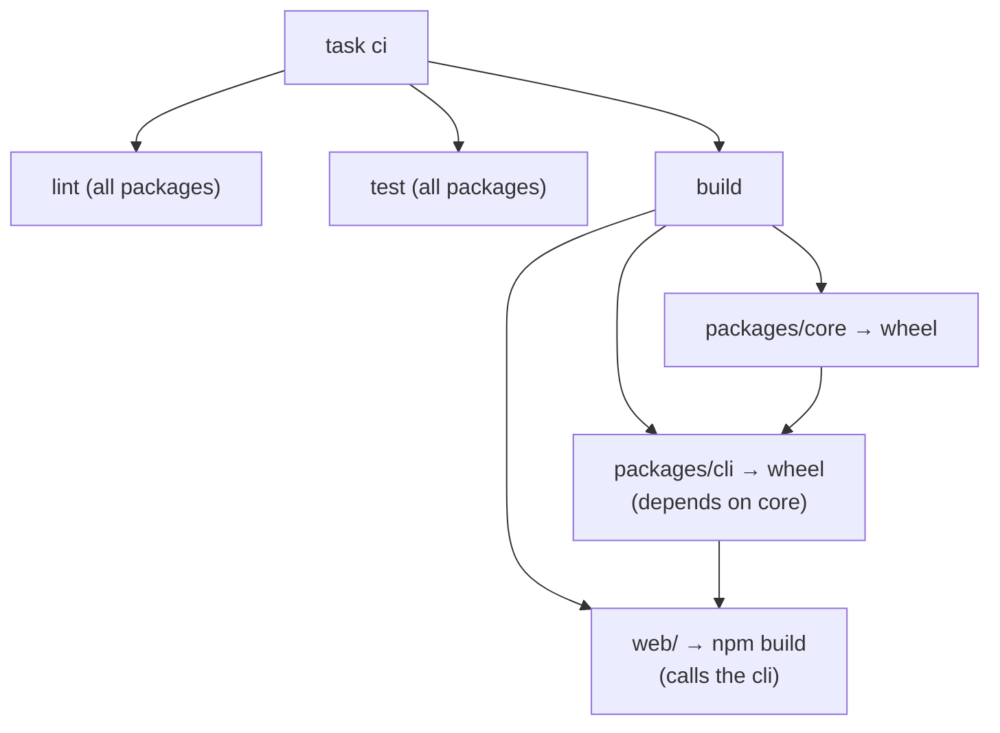

# Chapter 21 — Build Systems & Package Management

> **Volume 1 — Computer Science Foundations** · [Contents](index.md) · ← [Chapter 20 — Git: Tags, Stash, Hooks & Internals](ch20-git-tags-stash-hooks-and-internals.md) · Next → [Chapter 22 — Clean Code & Refactoring](ch22-clean-code-and-refactoring.md)

---

## Concept

Cargo, pip, uv, Poetry, npm, pnpm, Make, CMake, Taskfiles; packaging Python/Rust/Node projects; semantic versioning.

**In one sentence:** a package manager fetches the right versions of other people's code, a build system turns source into artifacts in the right order, and both exist so that "it works on my machine" becomes "it works on every machine".

**Mental model — a recipe book and a pantry.** The package manager stocks the pantry with exactly the ingredients (dependencies) the recipe lists, at the right brand and version. The build system is the recipe's step order: you can't frost a cake before baking it, and you don't re-bake a cake that hasn't changed.

**Tools by ecosystem**

| Ecosystem | Package manager | Manifest | Lockfile | Build / task runner |
|-----------|-----------------|----------|----------|---------------------|
| Python | pip, **uv**, Poetry, PDM | `pyproject.toml` | `uv.lock`, `poetry.lock` | `python -m build`, hatch, setuptools |
| Rust | Cargo | `Cargo.toml` | `Cargo.lock` | Cargo (also the build system) |
| Node | npm, **pnpm**, yarn | `package.json` | `package-lock.json`, `pnpm-lock.yaml` | `npm run`, Vite, esbuild |
| C/C++ | vcpkg, Conan | `CMakeLists.txt`, `conanfile` | | CMake + Ninja/Make |
| Any | — | — | — | Make, Just, Taskfile, Bazel |

**Semantic Versioning: `MAJOR.MINOR.PATCH`**

| Bump | When | Example |
|------|------|---------|
| MAJOR | a breaking change to the public API | remove a function, change a return type |
| MINOR | backward-compatible new features | add an optional parameter or a new function |
| PATCH | backward-compatible bug fixes | fix an off-by-one |
| pre-release / build | `1.4.0-rc.1`, `1.4.0+sha.7a1c` | release candidates, build metadata |

Before `1.0.0`, anything may change; tools treat `0.x` minor bumps as breaking.

**Dependency resolution** — find one version of each package that satisfies *every* constraint in the whole graph. It is a constraint-satisfaction problem (NP-hard in general). npm can install duplicate versions side by side; pip, uv, and Cargo (within a major version) must pick one.

**Make in one idea** — a *target* is rebuilt only if it's missing or older than a *prerequisite*. That turns a full rebuild into an incremental one.

---

## Prereqs

* [Chapter 5 — Modules, Packages, Imports & Dependency Management](ch05-modules-packages-imports-and-dependency-management.md)

---

## Diagram

**Direct vs transitive dependencies and a version conflict**



**The SemVer axis — what `^1.2.3` and `~1.2.3` accept**

```
 1.2.2   1.2.3   1.2.9   1.3.0   1.9.9   2.0.0
   ✗       ✓       ✓       ✓       ✓       ✗      ^1.2.3  (>=1.2.3 <2.0.0)
   ✗       ✓       ✓       ✗       ✗       ✗      ~1.2.3  (>=1.2.3 <1.3.0)
           └─ patch ─┘└──── minor ────┘└─ major: breaking
```

**Make's incremental build graph**



Edit only `lexer.c`: Make rebuilds `lexer.o` and `app`, and reuses `parser.o`.

---

## Example

```bash
# Rust
cargo new cli && cd cli
cargo add serde --features derive      # edits Cargo.toml
cargo build --release                  # target/release/cli
cargo tree                             # show the dependency graph

# Python with uv
uv init mylib && cd mylib
uv add "httpx>=0.27"                   # updates pyproject.toml + uv.lock
uv pip install -e .                    # editable install
uv sync --frozen                       # install exactly the lockfile; fail if it's stale
uv build                               # sdist + wheel in dist/

# Node
npm install                            # resolves; writes package-lock.json
npm ci                                 # CI: clean install exactly from the lockfile
pnpm install --frozen-lockfile
```

```make
# Makefile — recipe lines must start with a TAB
.PHONY: all test lint clean
all: lint test build

lint:
	ruff check . && ruff format --check .

test:
	pytest -q

build: dist/app.whl
dist/app.whl: $(shell find src -name '*.py') pyproject.toml
	uv build --wheel -o dist && touch $@

clean:
	rm -rf dist .pytest_cache
```

```yaml
# Taskfile.yml — the same idea, in YAML, cross-platform
version: "3"
tasks:
  test:
    cmds: [pytest -q]
  build:
    sources: ["src/**/*.py", "pyproject.toml"]
    generates: ["dist/*.whl"]
    cmds: [uv build --wheel]
```

---

## Exercises

1. Add a dependency and pin it with a lockfile.

   <details><summary>Solution</summary><code>uv add rich</code> (or <code>cargo add</code>, <code>npm install</code>) updates the manifest range and writes exact versions and hashes to the lockfile. Commit both. In CI use <code>uv sync --frozen</code> / <code>npm ci</code> / <code>cargo build --locked</code> so a stale lockfile fails the build instead of silently re-resolving.</details>

2. Explain how `^1.2.3` resolves.

   <details><summary>Solution</summary>It allows <code>&gt;=1.2.3, &lt;2.0.0</code>. The resolver picks the newest version in that range that satisfies all other constraints. For <code>^0.2.3</code> the range is <code>&gt;=0.2.3, &lt;0.3.0</code>, because 0.x minors are treated as breaking.</details>

3. You changed a function's return type from `list` to `iterator`. Which version part do you bump?

   <details><summary>Solution</summary>MAJOR. Callers that index or <code>len()</code> the result break, even though the change looks small.</details>

---

## Mini project

**A multi-package repo built end-to-end by one Make/Taskfile command.**



**Steps**

1. Layout: `packages/core` (Python library), `packages/cli` (depends on core via a workspace path), `web/` (a Node frontend).
2. One lockfile per ecosystem (a uv workspace, `pnpm-lock.yaml`).
3. A `Taskfile.yml` or `Makefile` with `lint`, `test`, `build`, and `ci`; each target declares sources so unchanged packages are skipped.
4. `task ci` from a fresh clone must produce all artifacts.
5. Time a no-change second run; it should take seconds.

**Done when:** a new teammate runs one command on a clean machine and gets identical artifacts.

---

## Open source

* [`astral-sh/uv`](https://github.com/astral-sh/uv) — `crates/uv-resolver/` implements PubGrub, a resolver that explains *why* a conflict has no solution.
* [`rust-lang/cargo`](https://github.com/rust-lang/cargo) — the Cargo Book's "Specifying Dependencies" and "SemVer Compatibility" chapters are the best practical SemVer guide.

---

## Interview

1. **"What is SemVer and when to bump major/minor/patch?"**
   <details><summary>Answer</summary>A version contract: MAJOR for breaking API changes, MINOR for backward-compatible features, PATCH for backward-compatible fixes. It lets consumers use ranges like <code>^1.4</code> to get fixes and features automatically without breakage — only if maintainers honor it.</details>

2. **"Lockfile vs manifest?"**
   <details><summary>Answer</summary>The manifest declares direct dependencies and the ranges you accept — human-edited intent. The lockfile records the exact resolved version and hash of every transitive dependency — machine-generated fact. Applications commit lockfiles for reproducible builds; libraries publish ranges so they compose with other libraries.</details>

---

## Checklist

- [ ] reproduce a build from a lockfile
- [ ] read SemVer ranges
- [ ] script common tasks

---

> [Contents](index.md) · ← [Chapter 20 — Git: Tags, Stash, Hooks & Internals](ch20-git-tags-stash-hooks-and-internals.md) · Next → [Chapter 22 — Clean Code & Refactoring](ch22-clean-code-and-refactoring.md)
