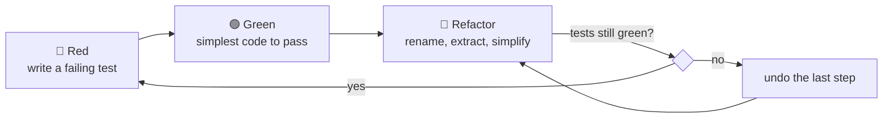
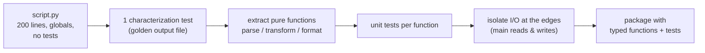

# Chapter 22 — Clean Code & Refactoring

> **Volume 1 — Computer Science Foundations** · [Contents](index.md) · ← [Chapter 21 — Build Systems & Package Management](ch21-build-systems-and-package-management.md) · Next → [Chapter 23 — Documentation, ADRs & READMEs](ch23-documentation-adrs-and-readmes.md)

---

## Concept

Naming, small functions/classes, readability, and safe refactoring (red/green/refactor).

**In one sentence:** code is read far more often than it is written, so clean code optimizes for the next reader, and refactoring is changing the structure of code without changing what it does — always under the protection of tests.

**Mental model — a tidy workshop.** Every tool has a labeled place (good names). Each drawer holds one kind of thing (single responsibility). You tidy a little every day rather than once a year (continuous refactoring). And you never rearrange the shop while a customer's order is half-built, unless you can check the order still works afterward (tests).

**Naming**

| Instead of | Write | Why |
|------------|-------|-----|
| `d`, `tmp`, `data2` | `elapsed_ms`, `pending_orders` | say what it is, with units |
| `process()`, `handle()` | `apply_discount()`, `send_invoice()` | say what it does |
| `flag`, `check` | `is_expired`, `has_access` | booleans read as yes/no questions |
| `UserManagerHelperUtil` | `UserRepository`, `PasswordHasher` | a noun for one clear role |
| `getData()` returning a total | `total_revenue()` | no surprises |

**Smells and their refactorings**

| Smell | Refactoring |
|-------|-------------|
| Long function (does several things) | **Extract Function** — one named step each |
| Mysterious name | **Rename** |
| Duplicated code | Extract and reuse (but see YAGNI/DRY in [Vol 3 Ch 3](../volume-3-low-level-design/ch03-design-principles-cohesion-coupling-yagni-dry-kiss.md)) |
| Deep nesting | **Guard clauses** (return early) |
| Long parameter list | **Introduce Parameter Object** |
| Magic numbers | **Named constant** |
| A comment explaining a block | extract the block into a function named after the comment |
| Flag argument (`render(x, True)`) | split into two functions |

**One level of abstraction per function** — a function should read like a table of contents: either all high-level steps (`validate`, `price`, `save`) or all low-level detail (string slicing, arithmetic), not a mix.

**Red → green → refactor**

1. **Red** — write a failing test for the behavior.
2. **Green** — make it pass in the simplest way.
3. **Refactor** — clean up while the test stays green.

To refactor untested legacy code, first write *characterization tests* that record what the code does today, including its bugs.

---

## Prereqs

* [Chapter 3 — Functions, Parameters, Return Values, Scope & Namespaces](ch03-functions-parameters-return-values-scope-and-namespaces.md)

---

## Diagram

**Before and after: one long function becomes named steps**

```
 BEFORE: handle(r)  — 60 lines                AFTER: handle_order(request)
 ┌──────────────────────────────────┐        ┌───────────────────────────────┐
 │ parse JSON, check 6 fields       │        │ order = parse_order(request)  │
 │ if/else for discount rules …     │  ───►  │ validate(order)               │
 │ loop to compute tax …            │        │ total = price(order)          │
 │ build SQL string, execute …      │        │ save(order, total)            │
 │ format email, send …             │        │ notify_customer(order)        │
 └──────────────────────────────────┘        └───────────────────────────────┘
                                               each step: small, named, testable
```

**The refactoring loop**



**Guard clauses flatten nesting**

```
 if user:                                  if not user: return deny()
     if user.active:                       if not user.active: return deny()
         if user.has_role("admin"):   ─►   if not user.has_role("admin"): return deny()
             return allow()                return allow()
         else: return deny()
     …
```

---

## Example

```python
# BEFORE
def calc(d, t):
    r = 0
    for i in d:
        if i["s"] == "paid":
            if t == 1:
                r += i["a"] * 0.9
            else:
                r += i["a"]
    return r

# AFTER — same behavior, readable
MEMBER_DISCOUNT = 0.10

def revenue(invoices, is_member: bool) -> float:
    paid = (inv for inv in invoices if inv["status"] == "paid")
    return sum(discounted(inv["amount"], is_member) for inv in paid)

def discounted(amount: float, is_member: bool) -> float:
    return amount * (1 - MEMBER_DISCOUNT) if is_member else amount
```

```python
# Characterization test written BEFORE refactoring — locks in current behavior
def test_revenue_matches_legacy():
    data = [{"s": "paid", "a": 100}, {"s": "void", "a": 50}, {"s": "paid", "a": 20}]
    legacy = calc(data, 1)
    new = revenue([{"status": x["s"], "amount": x["a"]} for x in data], True)
    assert new == legacy == 108.0
```

---

## Exercises

1. Refactor a messy function without changing behavior (tests stay green).

   <details><summary>Solution</summary>Write characterization tests first. Then take tiny steps, running the tests after each: rename variables → extract constants → extract the inner loop body into a function → replace the flag argument with a boolean → use guard clauses. Commit after each green step so any mistake is one <code>git restore</code> away.</details>

2. Apply the "one level of abstraction per function" rule.

   <details><summary>Solution</summary>If a function mixes <code>validate(order)</code> with <code>line.split(",")[3].strip()</code>, move the low-level parsing into a named helper (<code>parse_quantity(line)</code>) so the top-level function reads as steps only.</details>

3. Is this comment a smell? `# check if user can edit` above a 6-line `if` block.

   <details><summary>Solution</summary>Yes — extract <code>def can_edit(user, doc) -&gt; bool</code>. The name replaces the comment and cannot go stale. Keep comments for <i>why</i> (a business reason, a workaround link), not for <i>what</i>.</details>

---

## Mini project

**Take a 200-line script and refactor it into small, tested functions.**



**Steps**

1. Pick a real messy script (or write one: read a CSV, compute stats, print a report).
2. Save its output for a fixed input as a golden file; a test compares output to it.
3. Refactor in commits of under 20 lines each: rename, extract, remove globals, add types.
4. Move I/O into `main()`; everything else becomes pure and unit-tested.
5. Record metrics before and after: longest function, max nesting depth, test count.

**Done when:** the golden test never broke, no function is over ~25 lines, and every pure function has a unit test.

---

## Open source

* [`psf/requests`](https://github.com/psf/requests) (clean Python) — `src/requests/sessions.py` and `api.py`: small public functions delegating to well-named methods.
* [`rust-lang/rust`](https://github.com/rust-lang/rust) std (naming conventions) — the Rust API Guidelines' "Naming" section (`as_`/`to_`/`into_`, `iter`/`iter_mut`/`into_iter`) shows how naming conventions carry meaning.

---

## Interview

1. **"What makes a function 'too long'?"**
   <details><summary>Answer</summary>Not a line count, but signals: it does more than one thing, mixes levels of abstraction, needs comments to separate sections, has deep nesting, or can't be named without "and". If you can extract a chunk and give it a name that explains it, you probably should.</details>

2. **"How do you refactor safely?"**
   <details><summary>Answer</summary>Get tests around the behavior first (characterization tests if needed). Change in tiny steps, running tests after each. Use automated IDE refactorings where possible. Separate refactoring commits from behavior changes. Keep each step revertible.</details>

---

## Checklist

- [ ] write names that need no comment
- [ ] keep functions small
- [ ] refactor only under tests

---

> [Contents](index.md) · ← [Chapter 21 — Build Systems & Package Management](ch21-build-systems-and-package-management.md) · Next → [Chapter 23 — Documentation, ADRs & READMEs](ch23-documentation-adrs-and-readmes.md)
