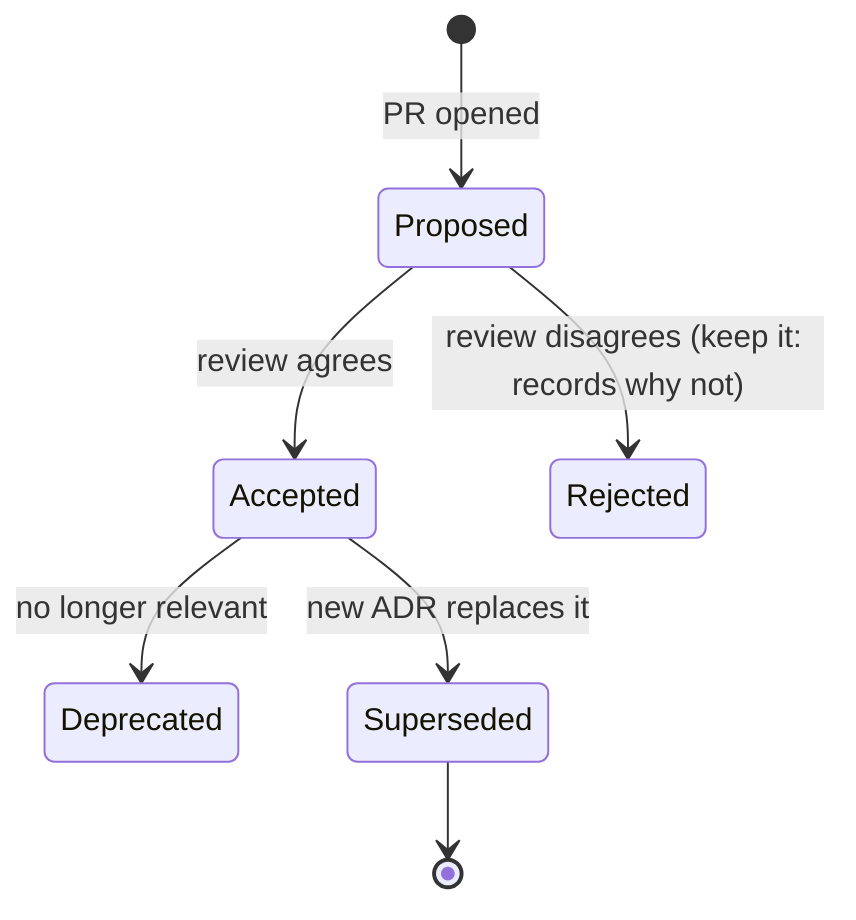
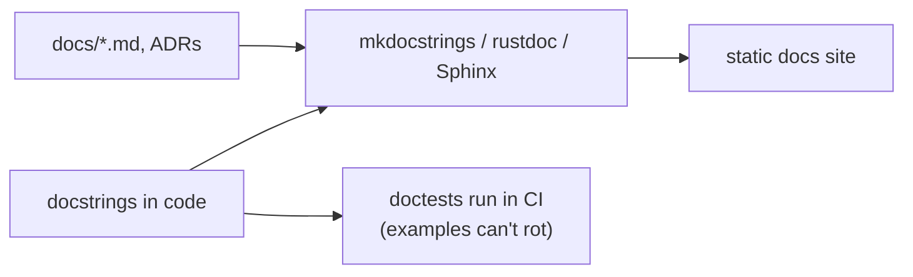
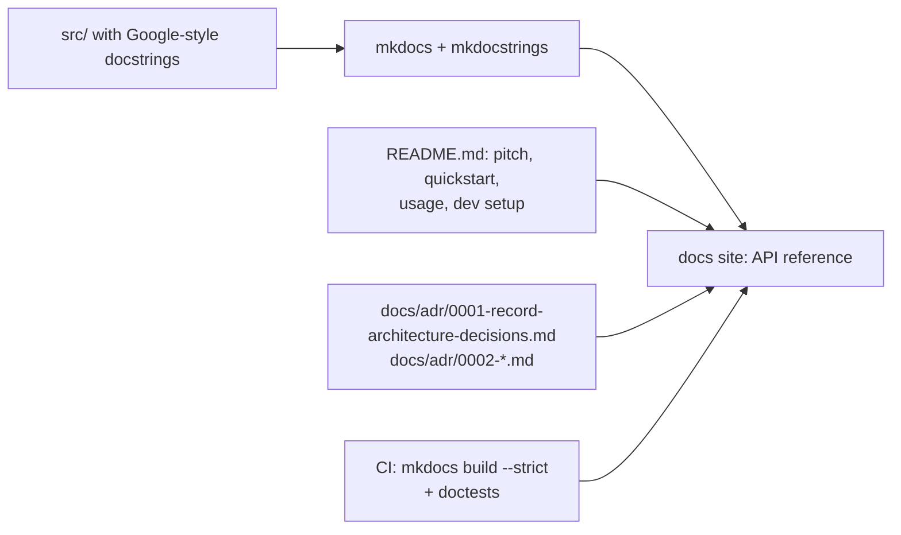

# Chapter 23 — Documentation, ADRs & READMEs

> **Volume 1 — Computer Science Foundations** · [Contents](index.md) · ← [Chapter 22 — Clean Code & Refactoring](ch22-clean-code-and-refactoring.md) · Next → [Chapter 24 — Logging](ch24-logging.md)

---

## Concept

Markdown, API docs, docstrings, Architecture Decision Records, and READMEs that actually help.

**In one sentence:** code shows *what* and *how*; documentation must capture *why*, *how to start*, and *what we decided and what it cost us* — in the smallest form that a reader will actually read.

**Mental model — signs in a building.** The README is the lobby sign: what this place is and how to get in. Docstrings are room labels: what happens in this room. ADRs are the architect's notebook: why the stairs are here and not there. Without the notebook, the next architect tears down a load-bearing wall.

**What goes where**

| Document | Audience | Answers | Lives |
|----------|----------|---------|-------|
| README | a newcomer in their first 5 minutes | What is it? How do I install, run, and test it? | repo root |
| Docstring / doc comment | a caller of one function or class | What does it do, what are the inputs, outputs, errors, and an example? | next to the code |
| Inline comment | a maintainer of that line | *Why* this odd-looking code exists | on the line |
| API reference | integrators | every endpoint or function, generated from code | built site |
| ADR | future maintainers | Why did we choose X over Y, and what did it cost? | `docs/adr/NNNN-title.md` |
| Guides / how-tos | users with a task | step-by-step procedures | docs site |
| Runbook | on-call engineers | alert fired → what do I check and do? | ops docs |

**README skeleton**

1. One-sentence description + a status badge.
2. Quick start: install → run → see a result, in under 10 commands.
3. Usage examples.
4. Configuration.
5. Development: tests, lint, project layout.
6. Links: docs, ADRs, contributing, license.

**Docstring content** — summary line; parameters with types and meaning; return value; raised errors; a runnable example (Python `doctest`, Rust doc tests compile and run!).

**ADRs** — short (one page), numbered, immutable once accepted. If the decision changes, write a new ADR that *supersedes* the old one; don't edit history.

---

## Prereqs

* [Chapter 22 — Clean Code & Refactoring](ch22-clean-code-and-refactoring.md)

---

## Diagram

**ADR template layout**

```
 ┌─────────────────────────────────────────────────────────────┐
 │ ADR 0007: Use PostgreSQL as the primary datastore           │
 │ Status: Accepted  ·  Date: 2024-05-02  ·  Supersedes: —      │
 ├─────────────────────────────────────────────────────────────┤
 │ CONTEXT       What forces are at play? Constraints, needs.  │
 │               "We need transactions across orders and       │
 │                payments; the team knows SQL; ~5k writes/s." │
 ├─────────────────────────────────────────────────────────────┤
 │ OPTIONS       PostgreSQL · MongoDB · DynamoDB                │
 ├─────────────────────────────────────────────────────────────┤
 │ DECISION      "We will use PostgreSQL 16 on managed RDS."   │
 ├─────────────────────────────────────────────────────────────┤
 │ CONSEQUENCES  + ACID, joins, mature tooling                 │
 │               − vertical scaling limits; sharding is manual │
 │               → revisit if writes exceed 20k/s              │
 └─────────────────────────────────────────────────────────────┘
```

**ADR lifecycle**



**Docs as a pipeline**



---

## Example

```python
def transfer(src: Account, dst: Account, amount_cents: int) -> Receipt:
    """Move money between two accounts atomically.

    Args:
        src: Account to debit. Must belong to the caller.
        dst: Account to credit.
        amount_cents: Positive amount in minor units (cents).

    Returns:
        A Receipt with the transaction ID and new balances.

    Raises:
        InsufficientFunds: If ``src`` balance is below ``amount_cents``.
        ValueError: If ``amount_cents`` is not positive.

    Example:
        >>> r = transfer(alice, bob, 500)
        >>> r.src_balance
        9500
    """
```

````rust
/// Returns the largest element, or `None` for an empty slice.
///
/// # Examples
///
/// ```
/// assert_eq!(mylib::largest(&[3, 9, 2]), Some(&9));
/// assert_eq!(mylib::largest::<i32>(&[]), None);
/// ```
pub fn largest<T: Ord>(xs: &[T]) -> Option<&T> { xs.iter().max() }
````

A good inline comment explains *why*:

```python
# Retry once: the payment provider returns 409 on the first call after
# a token refresh (vendor ticket #4412). Remove when they fix it.
```

---

## Exercises

1. Write a docstring that a tool can render.

   <details><summary>Solution</summary>Use one consistent style (Google, NumPy, or reST) so Sphinx/mkdocstrings can parse the sections. Include a doctest example and run <code>python -m doctest</code> or <code>pytest --doctest-modules</code> in CI so the example stays correct.</details>

2. Write an ADR for a real past decision.

   <details><summary>Solution</summary>Pick something like "why we chose FastAPI" or "why a monorepo". Fill in Context, Options (at least two real alternatives), Decision, and Consequences — include the negatives and a trigger for revisiting. Keep it to one page.</details>

3. A README says "Run the app". What's missing?

   <details><summary>Solution</summary>Prerequisites and versions, the exact commands, required environment variables or config, the expected output (URL, port), and what to do when it fails. A newcomer should succeed by copy-pasting.</details>

---

## Mini project

**Generate API docs from docstrings and write a project README + first ADR.**



**Steps**

1. Add docstrings to every public function of a small project.
2. Set up `mkdocs` with `mkdocs-material` and `mkdocstrings`; the API page is generated.
3. Write the README; test the quickstart on a clean machine or container.
4. ADR 0001 "Record architecture decisions" (the conventional first ADR), plus ADR 0002 for a real choice.
5. CI runs `mkdocs build --strict` (fails on broken links) and the doctests.

**Done when:** a stranger can go from clone to running app using only the README, and the docs build fails if an example breaks.

---

## Open source

* [`rust-lang/rust`](https://github.com/rust-lang/rust) rustdoc — every example in the std docs is compiled and run as a test. Read any page in `doc.rust-lang.org/std` for the gold standard.
* [`mkdocs/mkdocs`](https://github.com/mkdocs/mkdocs) — Markdown to a static site; see also `joelparkerhenderson/architecture-decision-record` for ADR templates.

---

## Interview

1. **"What belongs in a docstring vs a README?"**
   <details><summary>Answer</summary>A docstring documents one unit's contract for its callers: purpose, parameters, return value, errors, example. A README orients a newcomer to the whole project: what it is, how to install, run, and test it, and where to go next. Neither should duplicate the other.</details>

2. **"Why record ADRs?"**
   <details><summary>Answer</summary>Code shows what was built, not why, or what was rejected. ADRs preserve the context and trade-offs so future engineers don't reverse good decisions by accident or repeat old debates. They make onboarding and reviews faster and are cheap: one page per significant decision.</details>

---

## Checklist

- [ ] document why, not just what
- [ ] write renderable docstrings
- [ ] keep a decision log

---

> [Contents](index.md) · ← [Chapter 22 — Clean Code & Refactoring](ch22-clean-code-and-refactoring.md) · Next → [Chapter 24 — Logging](ch24-logging.md)
