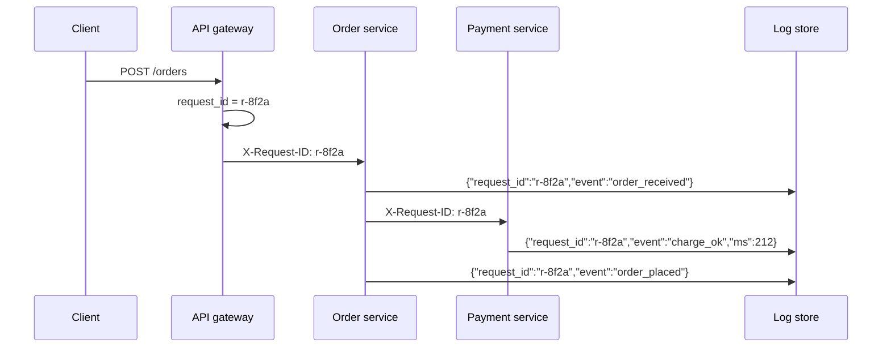
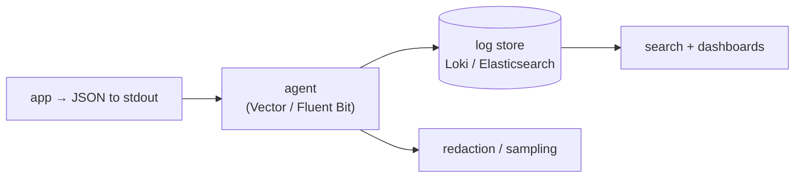
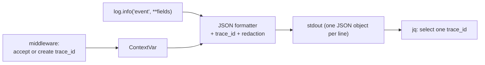

# Chapter 24 — Logging

> **Volume 1 — Computer Science Foundations** · [Contents](index.md) · ← [Chapter 23 — Documentation, ADRs & READMEs](ch23-documentation-adrs-and-readmes.md) · Next → [Chapter 25 — Configuration & Secrets Management](ch25-configuration-and-secrets-management.md)

---

## Concept

Log levels, structured logging, correlation IDs, and log hygiene (never leak secrets).

**In one sentence:** logs are the diary your program keeps for the person debugging it at 3 a.m., so they must be leveled, machine-parseable, linked by a request ID, and free of secrets.

**Mental model — a ship's logbook.** Every entry has a time, a severity ("routine", "warning", "emergency"), and facts in fixed fields (position, speed, crew). A voyage number on every page lets you follow one trip across many pages. You never write the safe combination in the logbook.

**Log levels**

| Level | Use for | Example | Pages someone? |
|-------|---------|---------|:-:|
| `DEBUG` | detail for developers; off in production | "cache lookup key=user:42 hit=false" | no |
| `INFO` | normal business events | "order_placed order_id=123" | no |
| `WARNING` | unexpected but handled; may need attention | "retrying payment attempt=2" | no |
| `ERROR` | an operation failed; a user or request was affected | "payment_failed order_id=123 reason=card_declined" | maybe (via alerts on rate) |
| `CRITICAL` | the service can't function | "database unreachable, shutting down" | yes |

**Rule of thumb:** a *recoverable* failure you retried successfully is `WARNING`; a failure that surfaces to the caller is `ERROR`.

**Structured vs free-text**

| Free text | Structured (JSON) |
|-----------|-------------------|
| `User 7 placed order 123 for $45.00` | `{"event":"order_placed","user_id":7,"order_id":123,"amount_cents":4500}` |
| easy for humans, hard to query | trivially filterable: `order_id=123`, `sum(amount_cents)` |
| message format drifts | stable field names become a contract |

**Correlation IDs** — generate an ID at the edge (or accept `traceparent` / `X-Request-ID`), attach it to every log line, and pass it to every downstream call. One search then shows the full story of one request across services. This is the logging half of distributed tracing ([Ch 58](ch58-observability-logs-metrics-traces-and-opentelemetry.md)).

**Hygiene — never log:** passwords, tokens, API keys, session cookies, full card numbers, secrets in URLs, or personal data you don't need (emails, addresses, health data). Redact by *field name* in the logger itself, so one careless `log.info(request)` can't leak.

---

## Prereqs

* [Chapter 22 — Clean Code & Refactoring](ch22-clean-code-and-refactoring.md)

---

## Diagram

**A correlation ID threaded through services into one log stream**



```
 search: request_id="r-8f2a"
 10:02:11.101  gateway  INFO  request_started    path=/orders
 10:02:11.109  order    INFO  order_received     order_id=123
 10:02:11.321  payment  INFO  charge_ok          ms=212
 10:02:11.330  order    INFO  order_placed       order_id=123
```

**Where logs go**



---

## Example

```python
import logging, json, sys, uuid, contextvars

request_id = contextvars.ContextVar("request_id", default="-")
SENSITIVE = {"password", "token", "authorization", "card_number", "api_key"}

class JsonFormatter(logging.Formatter):
    def format(self, record):
        entry = {
            "ts": self.formatTime(record, "%Y-%m-%dT%H:%M:%S%z"),
            "level": record.levelname,
            "event": record.getMessage(),
            "logger": record.name,
            "request_id": request_id.get(),
        }
        for k, v in getattr(record, "fields", {}).items():
            entry[k] = "[REDACTED]" if k.lower() in SENSITIVE else v
        if record.exc_info:
            entry["exc"] = self.formatException(record.exc_info)
        return json.dumps(entry)

handler = logging.StreamHandler(sys.stdout)
handler.setFormatter(JsonFormatter())
log = logging.getLogger("orders")
log.addHandler(handler)
log.setLevel(logging.INFO)

def handle(req):
    request_id.set(req.headers.get("X-Request-ID") or str(uuid.uuid4()))
    log.info("order_placed", extra={"fields": {"order_id": 123, "user_id": 7, "token": "abc"}})

# {"ts": "...", "level": "INFO", "event": "order_placed", "logger": "orders",
#  "request_id": "r-8f2a", "order_id": 123, "user_id": 7, "token": "[REDACTED]"}
```

```python
# With structlog: the same idea, less code
import structlog
log = structlog.get_logger()
log.info("order_placed", order_id=123, user_id=7, trace_id="t-91c")
```

---

## Exercises

1. Add a correlation ID to a request pipeline.

   <details><summary>Solution</summary>In middleware, read <code>X-Request-ID</code> (or generate a UUID), store it in a <code>contextvars.ContextVar</code> (safe with async), include it in the formatter, return it in the response header, and forward it on outgoing HTTP calls.</details>

2. Pick the right level for a warning vs error.

   <details><summary>Solution</summary>Disk at 85% → WARNING. A cache miss → DEBUG. A payment declined by the bank (expected business outcome) → INFO. An upstream timeout that you retried successfully → WARNING. The same timeout after all retries, returning 503 → ERROR.</details>

3. Find the leak: `log.info(f"login attempt {request.json}")`.

   <details><summary>Solution</summary>The body contains the password. Log specific safe fields (<code>username</code>, <code>ip</code>, <code>result</code>) and redact centrally by field name as a backstop.</details>

---

## Mini project

**A structured logger that emits JSON and injects a trace ID into every line.**



**Steps**

1. A tiny logger API: `log.info(event, **fields)` that validates `event` is `snake_case`.
2. Formatter: ISO timestamp, level, event, trace ID from a ContextVar, fields, and exception info.
3. Redaction by key name (case-insensitive), including nested dicts.
4. Middleware for a small FastAPI/Flask app that sets and returns the trace ID.
5. Tests: every line is valid JSON, secrets never appear, and concurrent async requests keep their own IDs.

**Done when:** `jq 'select(.trace_id=="…")'` reconstructs one request's full story, and a test proves tokens are redacted.

---

## Open source

* [`python/cpython`](https://github.com/python/cpython) `logging` — `Lib/logging/__init__.py`: loggers, handlers, formatters, and filters; the "Logging Cookbook" in the docs covers context injection.
* [`Delgan/loguru`](https://github.com/Delgan/loguru) — pleasant logging with `bind()` for context and `serialize=True` for JSON.

---

## Interview

1. **"Structured vs free-text logging?"**
   <details><summary>Answer</summary>Structured logs emit key–value fields (usually JSON), so machines can filter, aggregate, and alert on them reliably, and field names become a stable contract. Free text is easier to read raw but needs fragile regexes to query. In production, prefer structured and render it prettily for humans in development.</details>

2. **"What level is a recoverable failure?"**
   <details><summary>Answer</summary>WARNING if you handled it (retried successfully, fell back to a default) and the user wasn't affected. It becomes ERROR only when the operation ultimately fails for the caller. Alert on error <i>rates</i>, not on individual lines.</details>

---

## Checklist

- [ ] use levels consistently
- [ ] emit machine-parseable logs
- [ ] redact secrets

---

> [Contents](index.md) · ← [Chapter 23 — Documentation, ADRs & READMEs](ch23-documentation-adrs-and-readmes.md) · Next → [Chapter 25 — Configuration & Secrets Management](ch25-configuration-and-secrets-management.md)
