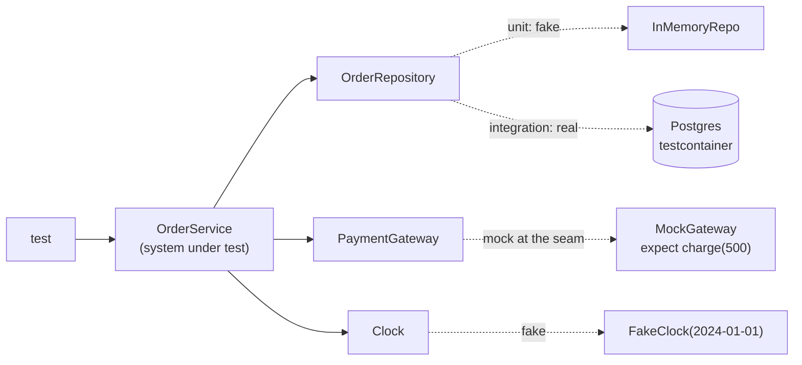
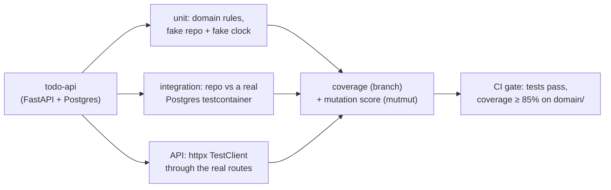

# Chapter 26 — Testing: Unit, Integration, Mocking & Coverage

> **Volume 1 — Computer Science Foundations** · [Contents](index.md) · ← [Chapter 25 — Configuration & Secrets Management](ch25-configuration-and-secrets-management.md) · Next → [Chapter 27 — Debugging & Profiling](ch27-debugging-and-profiling.md)

---

## Concept

The testing pyramid; unit vs integration; mocks/stubs/fakes; coverage as a signal, not a goal.

**In one sentence:** tests are executable claims about behavior; most should be fast unit tests of pure logic, some should prove real parts work together, a few should exercise the whole system — and every test must fail for the right reason.

**Mental model — checking a car.** Unit tests check each part on a bench: does the spark plug spark? Integration tests bolt a few parts together: does the engine start? End-to-end tests drive the car around the block. You run bench tests all day; you only take the test drive before delivery.

**Kinds of tests**

| Kind | Scope | Speed | Uses real I/O? | Catches |
|------|-------|-------|:-:|---------|
| Unit | one function or class | ms | no | logic bugs |
| Integration | a module + a real DB, queue, or HTTP server | 100 ms – s | yes (containers) | wiring, SQL, serialization, config |
| Contract | the API shape between two services | fast | no | breaking interface changes |
| End-to-end | the whole system through its UI/API | seconds – minutes | yes | user-flow breakage |
| Property-based | a function over many generated inputs | fast | no | edge cases you didn't think of |

**Test doubles**

| Double | What it does | Example |
|--------|-------------|---------|
| **Dummy** | fills a parameter, never used | `None` for an unused logger |
| **Stub** | returns canned answers | `get_rate()` always returns `1.1` |
| **Fake** | a working, simpler implementation | an in-memory repository instead of Postgres; a fake clock |
| **Spy** | records calls for later checks | counts how many emails were "sent" |
| **Mock** | pre-programmed with *expectations* that are verified | "expect `charge(500)` called exactly once" |

**Mock only at seams** — mock things *you don't own or can't control* at the boundary of your system: the network, the clock, randomness, third-party APIs. Don't mock your own internal classes: those tests break on every refactor and prove little.

**Good tests are FIRST:** Fast, Isolated (no order dependence), Repeatable (no flakiness), Self-checking (assert, don't print), Timely (written with the code). Structure each test as **Arrange → Act → Assert**.

**Coverage** tells you which lines ran, not whether they were *checked*. 100% coverage with weak asserts proves nothing. Use it to *find untested areas*; aim for high coverage of core logic; don't game it. *Branch* coverage is more honest than line coverage. *Mutation testing* (inject bugs, see if tests fail) measures test quality directly.

---

## Prereqs

* [Chapter 22 — Clean Code & Refactoring](ch22-clean-code-and-refactoring.md)

---

## Diagram

**The testing pyramid**

```
                    ▲  slower, costlier, more realistic
                   ╱ ╲
                  ╱E2E╲            ~5%   a few critical user journeys
                 ╱─────╲
                ╱ Integ-╲          ~20%  real DB / queue / HTTP in containers
               ╱ ration  ╲
              ╱───────────╲
             ╱    Unit     ╲       ~75%  pure logic, milliseconds each
            ╱───────────────╲
           ▼  faster, cheaper, more precise failure messages
```

**Where doubles plug in**



**A test that fails for the right reason**

```
 1. write the test          →  run  →  🔴 fails: "expected 450, got 500"
 2. implement the discount  →  run  →  🟢 passes
 3. break the code on purpose → run →  🔴 fails again   ← proves the test can catch it
```

---

## Example

```python
# pricing.py
from dataclasses import dataclass
from datetime import datetime

@dataclass
class Clock:
    def now(self) -> datetime: return datetime.now()

def price(amount_cents: int, clock: Clock) -> int:
    """10% off on weekends."""
    return amount_cents * 90 // 100 if clock.now().weekday() >= 5 else amount_cents
```

```python
# test_pricing.py — unit tests with a fake clock
from datetime import datetime
import pytest
from pricing import price

class FakeClock:
    def __init__(self, t): self.t = t
    def now(self): return self.t

@pytest.mark.parametrize("day, expected", [
    (datetime(2024, 6, 8), 450),     # Saturday
    (datetime(2024, 6, 10), 500),    # Monday
])
def test_weekend_discount(day, expected):
    assert price(500, FakeClock(day)) == expected       # arrange / act / assert
```

```python
# A mock at the seam: verify the interaction with an external API
from unittest.mock import Mock

def checkout(order, gateway):
    gateway.charge(order["total"], currency="EUR")
    return "ok"

def test_checkout_charges_once():
    gw = Mock()
    assert checkout({"total": 500}, gw) == "ok"
    gw.charge.assert_called_once_with(500, currency="EUR")
```

```python
# Integration test against a real Postgres in a container
import psycopg
from testcontainers.postgres import PostgresContainer

def test_save_and_load_order():
    with PostgresContainer("postgres:16") as pg:
        url = pg.get_connection_url().replace("+psycopg2", "")
        with psycopg.connect(url) as conn:
            conn.execute("CREATE TABLE orders (id serial PRIMARY KEY, total int)")
            conn.execute("INSERT INTO orders (total) VALUES (500)")
            assert conn.execute("SELECT total FROM orders").fetchone() == (500,)
```

```bash
pytest -q --cov=src --cov-branch --cov-report=term-missing
```

---

## Exercises

1. Write a unit test with a mock.

   <details><summary>Solution</summary>See <code>test_checkout_charges_once</code>. Use <code>Mock(spec=PaymentGateway)</code> so calls to methods that don't exist fail loudly. Assert on the interaction that matters (charged once, right amount), not on every internal call.</details>

2. Write an integration test that spins up a test DB.

   <details><summary>Solution</summary>See the testcontainers example. Use a session-scoped pytest fixture for the container, run migrations once, and wrap each test in a transaction that rolls back so tests stay isolated and fast.</details>

3. This test passes. What's wrong? `def test_parse(): result = parse("42"); print(result)`

   <details><summary>Solution</summary>It asserts nothing, so it can never fail (except on an exception). It inflates coverage while checking nothing. Add <code>assert result == 42</code>, plus cases for invalid input.</details>

---

## Mini project

**A test suite for a small service with unit + integration + a coverage report.**



**Steps**

1. A tiny to-do service: create, list, complete; due dates depend on a clock.
2. Unit-test the domain rules with a fake repository and fake clock — no I/O, under 1 s total.
3. Integration-test the SQL repository against a Postgres container.
4. Three API tests through `TestClient` for the main flows, including a 404 and a validation error.
5. Coverage with branch data; run `mutmut` on the domain module and kill the surviving mutants.

**Done when:** the whole suite runs in under 30 s, coverage is ≥ 85% on the domain, and no mutant survives in the pricing/rules code.

---

## Open source

* [`pytest-dev/pytest`](https://github.com/pytest-dev/pytest) — fixtures, `parametrize`, and plugins; `pytest`'s own `testing/` folder is a large example of a test suite.
* [`rust-lang/rust`](https://github.com/rust-lang/rust) `#[test]` — unit tests live beside the code in `#[cfg(test)] mod tests`; integration tests live in `tests/`; doc examples are tests too.

---

## Interview

1. **"Mock vs stub vs fake?"**
   <details><summary>Answer</summary>A stub returns canned data so the code under test can run. A fake is a real but simplified implementation (in-memory database, fake clock). A mock is programmed with expectations and verifies the calls made to it. Stubs and fakes test state and outcomes; mocks test interactions.</details>

2. **"Why is 100% coverage not the goal?"**
   <details><summary>Answer</summary>Coverage measures execution, not verification — a test with no asserts covers lines. Chasing 100% leads to brittle tests of trivial code and gaming the metric. Use coverage to find untested risky code, and judge test quality by whether tests fail when behavior breaks (mutation testing).</details>

---

## Checklist

- [ ] write tests that fail for the right reason
- [ ] mock only at seams
- [ ] read a coverage report

---

> [Contents](index.md) · ← [Chapter 25 — Configuration & Secrets Management](ch25-configuration-and-secrets-management.md) · Next → [Chapter 27 — Debugging & Profiling](ch27-debugging-and-profiling.md)
