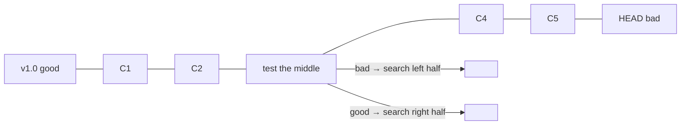
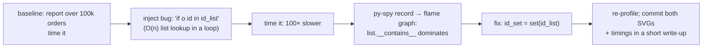

# Chapter 27 — Debugging & Profiling

> **Volume 1 — Computer Science Foundations** · [Contents](index.md) · ← [Chapter 26 — Testing: Unit, Integration, Mocking & Coverage](ch26-testing-unit-integration-mocking-and-coverage.md) · Next → [Chapter 28 — Static Analysis: Linters, Formatters & Type Checkers](ch28-static-analysis-linters-formatters-and-type-checkers.md)

---

## Concept

Debuggers (breakpoints, stepping), stack traces, profiling CPU/memory, and the scientific debugging method.

**In one sentence:** debugging is the scientific method applied to code — observe, guess, test the guess, narrow down — and profiling is measuring where time and memory actually go before you try to make anything faster.

**Mental model — a detective.** The stack trace is the crime scene photo. The debugger is the ability to freeze time and inspect every suspect. `git bisect` is interviewing witnesses in halves: "was it before or after lunch?" A profiler is the security camera that shows where everyone actually spent their time — usually not where you guessed.

**The scientific debugging loop**

1. **Reproduce** reliably — ideally as a failing automated test.
2. **Observe** — read the *whole* error, stack trace, and logs.
3. **Hypothesize** — one specific, falsifiable guess: "`items` is empty when the discount runs".
4. **Experiment** — a breakpoint, an assert, or a log line that proves or disproves *that one* guess.
5. **Narrow** — halve the search space: bisect commits, inputs, or code paths.
6. **Fix + keep the test** so the bug can never return silently.

**Debugger vocabulary**

| Command | pdb | gdb / lldb | Does |
|---------|-----|-----------|------|
| breakpoint | `b file:line`, `breakpoint()` | `break file:line` | stop here |
| continue | `c` | `continue` | run to the next breakpoint |
| step over | `n` | `next` | run this line, don't enter calls |
| step into | `s` | `step` | enter the called function |
| step out | `r` | `finish` | run until the current function returns |
| inspect | `p expr`, `pp`, `l` | `print expr`, `list` | look at values and code |
| stack | `w`, `u`, `d` | `bt`, `up`, `down` | walk the call stack |
| conditional | `b 42, total > 1000` | `break 42 if total > 1000` | stop only when a condition holds |

**Profiler types**

| Type | How | Overhead | Tools |
|------|-----|----------|-------|
| Sampling | snapshot the stack N times per second | low — safe in production | `py-spy`, `perf`, `samply` |
| Deterministic (tracing) | hook every call and return | high; distorts small functions | `cProfile`, `line_profiler` |
| Memory | track allocations | medium | `tracemalloc`, `memray`, `heaptrack` |

**Rule:** measure first. "Optimize" only the top of the profile, then measure again.

---

## Prereqs

* [Chapter 26 — Testing: Unit, Integration, Mocking & Coverage](ch26-testing-unit-integration-mocking-and-coverage.md)

---

## Diagram

**A stack trace, annotated**

```
 Traceback (most recent call last):                     ← read bottom-up for the cause
   File "app.py", line 41, in <module>                  ← outermost frame (entry point)
     main()
   File "app.py", line 36, in main
     report = build_report(orders)
   File "report.py", line 12, in build_report
     avg = total / len(paid)                            ← the exact failing line
 ZeroDivisionError: division by zero                    ← the error type + message
   → hypothesis: `paid` is empty. Why? Check the filter on line 10.
```

**A flame graph of hot functions**

```
 width = share of samples (time); stacked = call depth; read the WIDE bars
 ┌────────────────────────────────────────────────────────────────────┐
 │ main                                                               │
 ├──────────────────────────────────────────────────┬─────────────────┤
 │ build_report                                     │ load_orders     │
 ├───────────────────────────────────────┬──────────┼─────────────────┤
 │ format_rows                           │ sum      │ json.loads      │
 ├───────────────────────────────────────┤          └─────────────────┘
 │ str.format  ←  60% of all time        │
 └───────────────────────────────────────┘
```

**git bisect — binary search over history**



1,000 commits take about 10 test runs (log₂ 1000 ≈ 10).

---

## Example

```python
def build_report(orders):
    paid = [o for o in orders if o["status"] == "PAID"]   # bug: the data says "paid"
    breakpoint()                                          # drops into pdb here
    total = sum(o["amount"] for o in paid)
    return total / len(paid)
```

```
(Pdb) p len(orders), len(paid)
(3, 0)
(Pdb) p {o["status"] for o in orders}
{'paid', 'void'}                       ← hypothesis confirmed: a case mismatch
```

```bash
# CPU profiling
python -m cProfile -s cumtime app.py | head -20
py-spy top --pid 12345                        # live, like `top`, for Python functions
py-spy record -o profile.svg -- python app.py # flame graph
# Memory
python -X tracemalloc=25 app.py
memray run app.py && memray flamegraph memray-app.py.*.bin
# Bisect automatically with a test script (exit 0 = good, 1 = bad)
git bisect start HEAD v1.0
git bisect run pytest -q tests/test_report.py
git bisect reset
```

```
thread 'main' panicked at src/main.rs:14:22:
index out of bounds: the len is 3 but the index is 3
stack backtrace:            (set RUST_BACKTRACE=1)
   3: app::average           at ./src/main.rs:14:22
   4: app::main              at ./src/main.rs:20:5
```

---

## Exercises

1. Reproduce a bug, form a hypothesis, and confirm with a breakpoint.

   <details><summary>Solution</summary>Write the failing test first. State one hypothesis ("X is None at line N"). Set a breakpoint (or a conditional one) at line N, inspect, and confirm or reject. If rejected, form the next hypothesis from what you saw. Never change code "to see if it helps" without a hypothesis.</details>

2. Profile a slow function and find the hotspot.

   <details><summary>Solution</summary>Run <code>py-spy record</code> or <code>cProfile</code>; sort by cumulative time; look at the widest flame-graph bars. Typical finds: a repeated O(n) lookup inside a loop (fix with a dict or set), repeated string concatenation, N+1 database queries, or regex compilation inside a loop.</details>

3. A bug appears only in production, once a day. What do you do first?

   <details><summary>Solution</summary>Collect evidence without changing behavior: the full error with stack trace, request IDs, logs around the time, input data, version, and host. Look for what's special (a time of day, a specific tenant, data size). Try to reproduce with the captured input. Add targeted logging if needed.</details>

---

## Mini project

**Add an intentional performance bug, profile it, fix it, and record a before/after flame graph.**



**Steps**

1. Write a report generator and a benchmark with a fixed seed and a realistic data size.
2. Introduce one realistic bug: list membership in a loop, or an N+1 query against SQLite.
3. Capture a flame graph with `py-spy` and identify the hotspot *from the graph alone*.
4. Fix it and re-run the benchmark and profile.
5. Write a half-page note: hypothesis, evidence (graphs), fix, speedup.

**Done when:** the before and after flame graphs clearly show the hotspot disappearing, and the speedup is measured, not guessed.

---

## Open source

* [`benfred/py-spy`](https://github.com/benfred/py-spy) — a sampling profiler that reads another process's memory, so it needs no code changes and is safe in production.
* [`rr-debugger/rr`](https://github.com/rr-debugger/rr) — record a run once, then replay it deterministically *backwards and forwards* in gdb. Ideal for flaky bugs.

---

## Interview

1. **"How do you debug a crash you can't reproduce locally?"**
   <details><summary>Answer</summary>Gather production evidence: stack traces, core dumps, logs with request IDs, and metrics around the time. Find what differs from local (data, config, load, version, OS). Capture the failing input and replay it. Add targeted instrumentation and wait for the next occurrence. Use record-and-replay tools where possible. Once reproduced, write a failing test first.</details>

2. **"What is a flame graph?"**
   <details><summary>Answer</summary>A visualization of sampled stack traces. The x-axis is the share of samples (not time order), and the y-axis is stack depth. Wide bars are where the program spends its time. It shows the hot path and its callers at a glance.</details>

---

## Checklist

- [ ] read a stack trace
- [ ] bisect to a root cause
- [ ] profile before optimizing

---

> [Contents](index.md) · ← [Chapter 26 — Testing: Unit, Integration, Mocking & Coverage](ch26-testing-unit-integration-mocking-and-coverage.md) · Next → [Chapter 28 — Static Analysis: Linters, Formatters & Type Checkers](ch28-static-analysis-linters-formatters-and-type-checkers.md)
