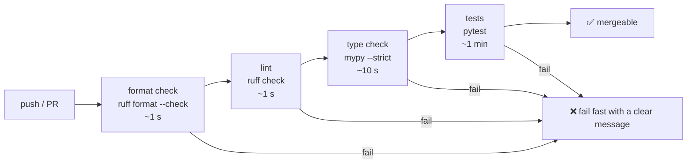
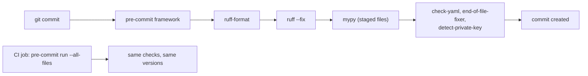

# Chapter 28 — Static Analysis: Linters, Formatters & Type Checkers

> **Volume 1 — Computer Science Foundations** · [Contents](index.md) · ← [Chapter 27 — Debugging & Profiling](ch27-debugging-and-profiling.md) · Next → [Chapter 29 — Basic Data Structures: Arrays, Linked Lists, Stack & Queue](ch29-basic-data-structures-arrays-linked-lists-stack.md)

---

## Concept

Catching bugs before runtime — linters (style/bugs), formatters (consistency), type checkers (soundness).

**In one sentence:** static analysis reads your code without running it, so whole classes of bugs, style arguments, and type mistakes are caught in seconds on every save instead of in production.

**Mental model — a spell checker, a typesetter, and a proofreader.** The formatter is the typesetter: it lays out every page the same way, and nobody argues about margins. The linter is the spell checker: it underlines suspicious words and common mistakes. The type checker is the proofreader who checks that every "he" refers to someone actually introduced.

**The three tools**

| Tool | Finds | Changes code? | Python | JS/TS | Rust |
|------|-------|:-:|--------|-------|------|
| Formatter | layout inconsistencies | yes, automatically | `ruff format`, `black` | Prettier | `rustfmt` |
| Linter | likely bugs, bad patterns, style | some auto-fixes | `ruff`, `pylint` | ESLint, Biome | `clippy` |
| Type checker | type errors: wrong arguments, `None` misuse, missing attributes | no | `mypy`, `pyright` | `tsc` | the compiler |
| Security scanner | injection, unsafe APIs, secrets | no | `bandit` (ruff `S` rules) | Semgrep, CodeQL | `cargo audit` |

**What each catches**

```python
import os                       # linter: unused import (F401)
def total(xs: list[int]) -> int:
    if xs == None:              # linter: use `is None` (E711)
        return "0"              # type checker: str is not int
    return sum(xs)
total(["a"])                    # type checker: list[str] is not list[int]
```

**Gradual typing (Python/TS)** — you can add types a module at a time. Strict mode turns on the checks that matter: no implicit `Any`, every function annotated, `Optional` handled.

| Strict flag (mypy) | Catches |
|--------------------|---------|
| `disallow_untyped_defs` | functions with no annotations |
| `no_implicit_optional` | `def f(x: int = None)` |
| `warn_return_any` | untyped values leaking out of functions |
| `strict_optional` | using a value that might be `None` without a check |

**Why automate formatting:** it ends style debates in code review, makes diffs show only real changes, and costs zero thought.

---

## Prereqs

* [Chapter 22 — Clean Code & Refactoring](ch22-clean-code-and-refactoring.md)

---

## Diagram

**A CI pipeline: cheapest and fastest checks first**



**Shift left: the same checks at every stage**

```
 editor (on save) ──► pre-commit hook ──► CI ──► code review
   instant             seconds             minutes   humans review logic, not commas
 the earlier a bug is caught, the cheaper it is to fix
```

**How a type checker narrows types**

```
 def greet(name: str | None) -> str:
     if name is None:            ← inside: name is None
         return "hi, stranger"
     return "hi, " + name.upper()  ← after the check: name is str
```

---

## Example

```toml
# pyproject.toml
[tool.ruff]
line-length = 100
target-version = "py312"

[tool.ruff.lint]
select = ["E", "F", "I", "B", "UP", "S", "SIM"]   # errors, pyflakes, isort, bugbear, pyupgrade, security, simplify
ignore = ["E501"]

[tool.mypy]
strict = true
python_version = "3.12"
```

```bash
ruff format .            # rewrite files
ruff check . --fix       # lint and auto-fix what's safe
mypy src/
```

```
src/billing.py:12: error: Incompatible return value type (got "str", expected "int")  [return-value]
src/billing.py:18: error: Item "None" of "User | None" has no attribute "email"  [union-attr]
Found 2 errors in 1 file (checked 14 source files)
```

```python
from typing import TypedDict

class Order(TypedDict):
    id: int
    total_cents: int

def find(orders: list[Order], oid: int) -> Order | None:
    return next((o for o in orders if o["id"] == oid), None)

o = find([], 1)
print(o["total_cents"])        # mypy: Value of type "Order | None" is not indexable
if o is not None:
    print(o["total_cents"])    # ✓
```

```bash
cargo clippy -- -D warnings    # Rust: the compiler type-checks; clippy adds 700+ lints
```

---

## Exercises

1. Configure a linter and fix its findings.

   <details><summary>Solution</summary>Add the <code>[tool.ruff]</code> block, run <code>ruff check . --statistics</code> to see counts per rule, auto-fix with <code>--fix</code>, fix the rest by hand, and add <code>ruff check</code> to CI. For a legacy codebase, enable rules gradually or record a baseline so only <i>new</i> code must be clean.</details>

2. Add type hints until `mypy` passes strict.

   <details><summary>Solution</summary>Start at leaf modules. Annotate function signatures first (return types matter most). Replace <code>dict</code> soup with <code>TypedDict</code> or dataclasses. Handle <code>Optional</code> explicitly. Use <code>typing.cast</code> or <code># type: ignore[code]</code> only with a comment explaining why. Enable <code>strict</code> per module with <code>[[tool.mypy.overrides]]</code>.</details>

3. The linter flags `def add(item, bucket=[])`. Which bug does rule B006 prevent?

   <details><summary>Solution</summary>A mutable default argument: the list is created once and shared across calls (see <a href="ch03-functions-parameters-return-values-scope-and-namespaces.md">Ch 3</a>). Use <code>bucket: list | None = None</code>.</details>

---

## Mini project

**Wire a pre-commit hook running format + lint + type-check on every commit.**



**Steps**

1. Add `.pre-commit-config.yaml` with ruff, ruff-format, mypy (with `additional_dependencies` for your stubs), and basic hygiene hooks.
2. `pre-commit install`; commit a deliberately broken file and watch it get blocked or auto-fixed.
3. Pin hook versions; add `pre-commit autoupdate` to a monthly routine.
4. Run the same config in CI with `pre-commit run --all-files`, so skipping hooks locally doesn't help.
5. Measure hook time; keep it under ~5 s so people don't bypass it.

**Done when:** a commit with a type error, an unused import, or a private key is refused locally *and* in CI.

---

## Open source

* [`astral-sh/ruff`](https://github.com/astral-sh/ruff) — a linter and formatter in Rust, 10–100× faster than the tools it replaces; `crates/ruff_linter/src/rules/` has one folder per rule family.
* [`python/mypy`](https://github.com/python/mypy) — the original Python type checker; its docs' "Type narrowing" and "Common issues" pages are essential.

---

## Interview

1. **"Linter vs type checker?"**
   <details><summary>Answer</summary>A linter pattern-matches code for style problems and common bug patterns (unused variables, <code>== None</code>, mutable defaults), rule by rule. A type checker builds a model of every expression's type and proves the program is consistent: arguments match parameters, <code>None</code> is handled, attributes exist. They overlap a little and complement each other.</details>

2. **"What does strict typing buy you?"**
   <details><summary>Answer</summary>A whole class of runtime errors (<code>AttributeError</code>, wrong argument types, <code>None</code> dereference) moves to edit time. Signatures become checked documentation. Refactors are safer because the checker finds every call site. IDEs autocomplete better. The cost is annotation effort and occasional fights with dynamic code.</details>

---

## Checklist

- [ ] keep a linter green
- [ ] format automatically
- [ ] type-check critical paths

---

> [Contents](index.md) · ← [Chapter 27 — Debugging & Profiling](ch27-debugging-and-profiling.md) · Next → [Chapter 29 — Basic Data Structures: Arrays, Linked Lists, Stack & Queue](ch29-basic-data-structures-arrays-linked-lists-stack.md)
