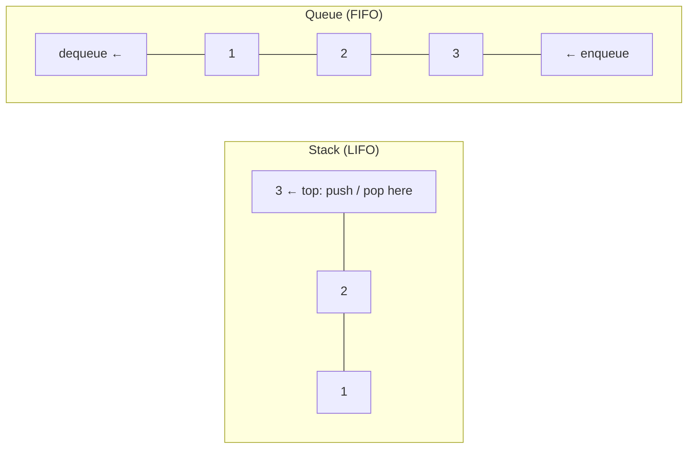
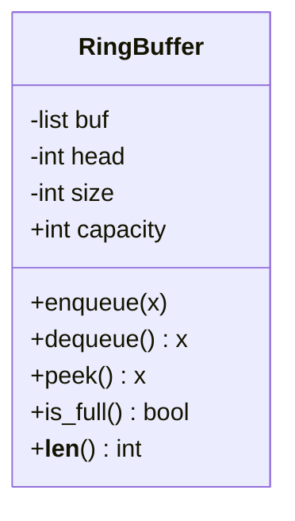

# Chapter 29 — Basic Data Structures: Arrays, Linked Lists, Stack & Queue

> **Volume 1 — Computer Science Foundations** · [Contents](index.md) · ← [Chapter 28 — Static Analysis: Linters, Formatters & Type Checkers](ch28-static-analysis-linters-formatters-and-type-checkers.md) · Next → [Chapter 30 — Trees, BST, Heap & Trie](ch30-trees-bst-heap-and-trie.md)

---

## Concept

Contiguous vs linked storage; LIFO stack, FIFO queue; operations and their Big-O.

**In one sentence:** an array keeps items side by side in one block of memory, a linked list scatters them and connects them with pointers, and stacks and queues are *rules* about which end you add to and remove from — each can be built on either storage.

**Mental model — a bookshelf vs a treasure hunt.** An array is a bookshelf: book 57 is exactly 57 slots from the left, so you reach it at once; inserting a book in the middle means sliding the rest over. A linked list is a treasure hunt: each clue tells you where the next one is; adding a clue anywhere is easy once you're standing there, but finding clue 57 means following 56 clues first.

**Operations and Big-O**

| Operation | Dynamic array | Singly linked list | Doubly linked list |
|-----------|:-:|:-:|:-:|
| Access by index | **O(1)** | O(n) | O(n) |
| Search by value | O(n) | O(n) | O(n) |
| Insert/delete at end | O(1) amortized | O(1) with a tail pointer (delete: O(n)) | **O(1)** |
| Insert/delete at front | O(n) | **O(1)** | **O(1)** |
| Insert/delete in middle (node known) | O(n) | O(1) after the node | **O(1)** |
| Memory per item | the item | item + 1 pointer | item + 2 pointers |
| Cache friendliness | **excellent** | poor | poor |

**Stack vs queue**

| | Stack (LIFO) | Queue (FIFO) | Deque |
|-|--------------|--------------|-------|
| Add | `push` on top | `enqueue` at the back | either end |
| Remove | `pop` from top | `dequeue` from the front | either end |
| Real uses | call stack, undo, DFS, parsing brackets | job queues, BFS, buffers, printers | sliding-window max, work stealing |
| Best backing | array (end) | ring buffer or linked list | ring buffer / block list |

**Cache locality** — the CPU loads memory in 64-byte *cache lines*. Reading `arr[0]` also brings `arr[1..15]` (for 4-byte ints) into cache for free, and the hardware prefetcher predicts the next line. Linked-list nodes live at random addresses, so each `next` is likely a cache miss costing ~100 ns. That's why arrays often beat linked lists even for operations where linked lists "win" on Big-O. See [Ch 36](ch36-binary-cpu-registers-cache-and-memory-hierarchy.md).

---

## Prereqs

* [Vol 0 Ch 6 — Asymptotic Notation](../volume-0-math/ch06-asymptotic-notation-big-o.md)
* [Vol 0 Ch 7 — Time/Space Complexity & Amortized Analysis](../volume-0-math/ch07-time-space-complexity-and-amortized-analysis.md)

---

## Diagram

**Array (contiguous) vs linked list (nodes + pointers)**

```
 ARRAY  base = 0x1000, 4-byte ints: address of arr[i] = base + 4·i
 0x1000  0x1004  0x1008  0x100C  0x1010
 ┌──────┬──────┬──────┬──────┬──────┐
 │  10  │  20  │  30  │  40  │  50  │     one cache line holds them all
 └──────┴──────┴──────┴──────┴──────┘

 LINKED LIST  (nodes scattered across the heap)
 head
  │    0x7a10            0x3f88            0x9c04
  └──► ┌────┬─────┐  ┌──► ┌────┬─────┐  ┌──► ┌────┬──────┐
       │ 10 │  ●──┼──┘    │ 20 │  ●──┼──┘    │ 30 │ null │
       └────┴─────┘       └────┴─────┘       └────┴──────┘
```

**Inserting 15 after 10 in a linked list — two pointer changes**

```
 before:  [10]──►[20]
 step 1:  new = [15]; new.next = node10.next     [15]──►[20]
 step 2:  node10.next = new                      [10]──►[15]──►[20]
```

**Push/pop vs enqueue/dequeue**



**Ring buffer: a queue in a fixed array**

```
 capacity 6, after enqueue A..E and dequeue A, B:
  index:  0    1    2    3    4    5
        ┌────┬────┬────┬────┬────┬────┐
        │    │    │ C  │ D  │ E  │    │
        └────┴────┴────┴────┴────┴────┘
                    ▲head          ▲tail
 enqueue F, G → tail wraps: (tail + 1) % 6 → index 0
        │ G  │    │ C  │ D  │ E  │ F  │
```

---

## Example

```python
from collections import deque

stack = []
stack.append(1); stack.append(2); stack.append(3)
print(stack.pop())                  # 3

q = deque([1, 2])
q.append(3)                         # enqueue
print(q.popleft())                  # 1 — O(1); list.pop(0) would be O(n)

class Node:
    __slots__ = ("val", "next")
    def __init__(self, val, next=None):
        self.val, self.next = val, next

class LinkedList:
    def __init__(self):
        self.head = None

    def push_front(self, val):                  # O(1)
        self.head = Node(val, self.head)

    def insert_after(self, node, val):          # O(1) once you have the node
        node.next = Node(val, node.next)

    def delete(self, val):                      # O(n): must find it first
        dummy = Node(None, self.head)           # dummy head avoids a special case
        prev = dummy
        while prev.next and prev.next.val != val:
            prev = prev.next
        if prev.next:
            prev.next = prev.next.next
        self.head = dummy.next

    def __iter__(self):
        cur = self.head
        while cur:
            yield cur.val
            cur = cur.next

ll = LinkedList()
for v in (30, 20, 10):
    ll.push_front(v)
ll.insert_after(ll.head, 15)
ll.delete(20)
print(list(ll))                                  # [10, 15, 30]
```

---

## Exercises

1. Implement a linked list with insert/delete.

   <details><summary>Solution</summary>See <code>LinkedList</code> above. The dummy-head trick removes the special case for deleting the first node. Test: delete from an empty list, delete the head, delete the tail, and delete a value that isn't there.</details>

2. Implement a queue using two stacks.

   <details><summary>Solution</summary>

   ```python
   class TwoStackQueue:
       def __init__(self): self.inbox, self.outbox = [], []
       def enqueue(self, x): self.inbox.append(x)
       def dequeue(self):
           if not self.outbox:
               while self.inbox:
                   self.outbox.append(self.inbox.pop())   # reverse the order once
           return self.outbox.pop()
   ```
   Each element moves from inbox to outbox at most once, so any sequence of n operations costs O(n): O(1) amortized per operation.
   </details>

3. Reverse a singly linked list in place.

   <details><summary>Solution</summary><code>prev = None; cur = head; while cur: cur.next, prev, cur = prev, cur, cur.next; return prev</code>. O(n) time, O(1) space.</details>

---

## Mini project

**A ring buffer with O(1) enqueue/dequeue and wraparound.**



**Steps**

1. A fixed list of `capacity` slots; track `head` and `size` (tail = `(head + size) % capacity`).
2. `enqueue` on a full buffer: either raise, or overwrite the oldest (a flag), which suits logs and metrics.
3. `dequeue` returns `buf[head]`, clears the slot, and advances `head = (head + 1) % capacity`.
4. Iteration in FIFO order across the wrap point.
5. Benchmark against `deque` and `list.pop(0)` for 10⁶ operations.

**Done when:** property tests (random sequences vs `deque` as reference) pass, and every operation is O(1).

---

## Open source

* [`python/cpython`](https://github.com/python/cpython) `listobject.c` and `deque` — `Objects/listobject.c` (`list_resize`, `ins1`) shows the O(n) shift on insert; `Modules/_collectionsmodule.c` shows `deque` as a doubly linked list of 64-item blocks, giving O(1) ends *and* decent cache behavior.

---

## Interview

1. **"Array vs linked list cache behavior?"**
   <details><summary>Answer</summary>Arrays are contiguous, so a sequential scan uses every byte of each 64-byte cache line and the prefetcher streams the next lines ahead. Linked-list nodes are scattered, so each hop is likely a cache miss (~100× slower than an L1 hit). In practice, arrays usually win even when Big-O says the linked list should.</details>

2. **"Queue with two stacks — complexity?"**
   <details><summary>Answer</summary>Enqueue is O(1). Dequeue is O(n) worst case when the outbox is empty and must be refilled, but each element is moved at most once, so n operations cost O(n) total — O(1) amortized per operation.</details>

---

## Checklist

- [ ] know each op's Big-O
- [ ] implement all four from scratch
- [ ] explain cache locality

---

> [Contents](index.md) · ← [Chapter 28 — Static Analysis: Linters, Formatters & Type Checkers](ch28-static-analysis-linters-formatters-and-type-checkers.md) · Next → [Chapter 30 — Trees, BST, Heap & Trie](ch30-trees-bst-heap-and-trie.md)
