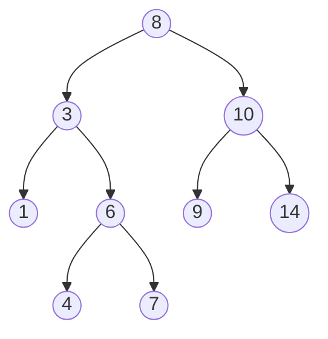
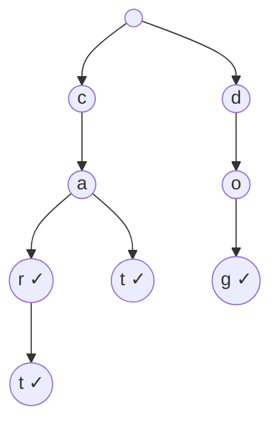
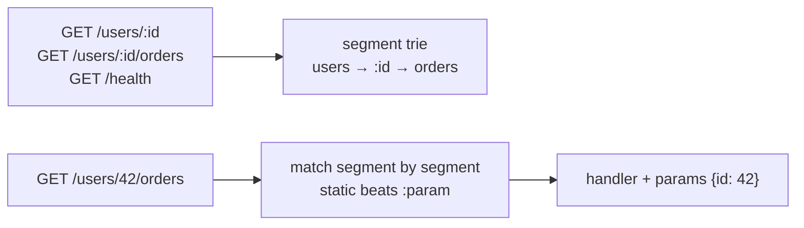

# Chapter 30 — Trees, BST, Heap & Trie

> **Volume 1 — Computer Science Foundations** · [Contents](index.md) · ← [Chapter 29 — Basic Data Structures: Arrays, Linked Lists, Stack & Queue](ch29-basic-data-structures-arrays-linked-lists-stack.md) · Next → [Chapter 31 — Hash Tables & Graphs](ch31-hash-tables-and-graphs.md)

---

## Concept

Tree terminology; binary search trees; heaps (priority queues); tries (prefix search).

**In one sentence:** a tree is a hierarchy with one root; a BST keeps it sorted so you can search by halving, a heap keeps only the *smallest* item on top so you can always grab it fast, and a trie shares common prefixes so you can find all words starting with "ca" at once.

**Mental model — three kinds of organizing.**

* **BST** — a "guess the number" game: at each node, go left if smaller, right if bigger.
* **Heap** — a company org chart where every boss earns more than their reports: the CEO (root) is always the max, but siblings aren't sorted.
* **Trie** — a phone's contact search: typing `c`, `a`, `r` narrows the tree letter by letter.

**Terminology**

| Term | Meaning |
|------|---------|
| Root / leaf | top node / node with no children |
| Parent / child / sibling | the obvious family relations |
| Depth / height | edges from the root / longest path down to a leaf |
| Binary tree | each node has ≤ 2 children |
| Balanced | height is O(log n) (AVL, red-black trees guarantee it) |
| Complete | every level full except the last, filled left to right (heaps) |

**Comparison**

| | BST (balanced) | Binary heap | Trie |
|-|----------------|-------------|------|
| Ordering rule | left < node < right | parent ≤ children (min-heap) | edges are characters |
| Search a key | O(log n) | O(n) | O(L), L = key length |
| Min / max | O(log n) | **O(1)** peek, O(log n) pop | — |
| Insert | O(log n) | O(log n) | O(L) |
| Sorted iteration | O(n) in-order | no | lexicographic via DFS |
| Prefix queries | range scan | no | **O(L + results)** |
| Typical use | ordered maps (`TreeMap`, `BTreeMap`), indexes | priority queues, schedulers, Dijkstra, top-k | autocomplete, routers, spell check, IP lookup |

**Traversals (DFS orders)**

| Order | Visit | Use |
|-------|-------|-----|
| Pre-order | node, left, right | copy / serialize a tree |
| In-order | left, node, right | **BST → sorted order** |
| Post-order | left, right, node | delete / evaluate expression trees |
| Level-order (BFS) | level by level | shortest depth, printing by level |

**Unbalanced BSTs degrade:** inserting 1, 2, 3, 4, 5 in order makes a "linked list" of height n, so search is O(n). Self-balancing trees rotate nodes to keep height O(log n).

---

## Prereqs

* [Chapter 29 — Basic Data Structures: Arrays, Linked Lists, Stack & Queue](ch29-basic-data-structures-arrays-linked-lists-stack.md)

---

## Diagram

**A balanced BST** — searching for 6: 8 → 3 → 6, three comparisons.



In-order traversal: 1, 3, 4, 6, 7, 8, 9, 10, 14 — sorted.

**Unbalanced BST after inserting 1..5 in order**

```
 1
  ╲
   2
    ╲
     3          height 5 = n → search is O(n)
      ╲
       4
        ╲
         5
```

**A min-heap as a tree and as an array**

```
            1                 index:  0  1  2  3  4  5  6
          ╱   ╲               value:  1  3  2  7  4  5  6
         3     2
        ╱ ╲   ╱ ╲             children of i: 2i+1, 2i+2
       7   4 5   6            parent of i:   (i-1)//2
 no pointers needed — the shape is implied by the index
```

**Heap push: sift up**

```
 push 0 at index 7 (child of 7):  [1,3,2,7,4,5,6,0]
 0 < 7 → swap                    [1,3,2,0,4,5,6,7]
 0 < 3 → swap                    [1,0,2,3,4,5,6,7]
 0 < 1 → swap                    [0,1,2,3,4,5,6,7]   done: O(log n) swaps
```

**A trie of: car, cart, cat, dog**



`✓` marks the end of a word. Autocomplete `"ca"`: walk c → a, then collect everything below: car, cart, cat.

---

## Example

```python
import heapq

h = []
for x in [5, 1, 8, 3]:
    heapq.heappush(h, x)
print(heapq.heappop(h), h[0])          # 1 3  (pop min, peek next min)
print(heapq.nsmallest(2, [9, 4, 7, 1]))  # [1, 4]

nums = [9, 4, 7, 1, 8]
heapq.heapify(nums)                     # O(n), not O(n log n)

class BST:
    class Node:
        __slots__ = ("key", "left", "right")
        def __init__(self, key): self.key, self.left, self.right = key, None, None

    def __init__(self): self.root = None

    def insert(self, key):
        def _ins(n):
            if n is None: return BST.Node(key)
            if key < n.key: n.left = _ins(n.left)
            elif key > n.key: n.right = _ins(n.right)
            return n
        self.root = _ins(self.root)

    def search(self, key):
        n = self.root
        while n and n.key != key:
            n = n.left if key < n.key else n.right
        return n is not None

    def inorder(self):
        def _walk(n):
            if n:
                yield from _walk(n.left); yield n.key; yield from _walk(n.right)
        return list(_walk(self.root))

t = BST()
for k in [8, 3, 10, 1, 6, 14, 4, 7]:
    t.insert(k)
print(t.search(6), t.search(5), t.inorder())   # True False [1, 3, 4, 6, 7, 8, 10, 14]
```

```python
class Trie:
    def __init__(self): self.root = {}
    def insert(self, word):
        node = self.root
        for ch in word:
            node = node.setdefault(ch, {})
        node["$"] = True                       # end-of-word marker
    def complete(self, prefix):
        node = self.root
        for ch in prefix:
            if ch not in node: return []
            node = node[ch]
        out, stack = [], [(node, prefix)]
        while stack:
            n, word = stack.pop()
            if "$" in n: out.append(word)
            stack.extend((child, word + ch) for ch, child in n.items() if ch != "$")
        return sorted(out)

tr = Trie()
for w in ["car", "cart", "cat", "dog"]:
    tr.insert(w)
print(tr.complete("ca"))                         # ['car', 'cart', 'cat']
```

---

## Exercises

1. Implement BST insert/search/delete.

   <details><summary>Solution</summary>Insert and search are above. Delete has three cases: (a) a leaf → remove it; (b) one child → replace the node with its child; (c) two children → copy the in-order successor's key (the minimum of the right subtree) into the node, then delete the successor from the right subtree.</details>

2. Build a trie and autocomplete a prefix.

   <details><summary>Solution</summary>See <code>Trie</code> above. Extensions: store a count per node for "how many words have this prefix" in O(L), and rank completions by frequency with a small heap.</details>

3. Why is `heapify` O(n) and not O(n log n)?

   <details><summary>Solution</summary>It sifts down from the last parent to the root. Most nodes are near the bottom and sift only a little: n/4 nodes move ≤1 level, n/8 move ≤2, and so on. The sum Σ n·k/2^(k+1) converges to O(n).</details>

---

## Mini project

**A URL router or autocomplete engine backed by a trie.**



**Steps (router version)**

1. Split paths into segments; each trie node has static children, one `:param` child, and an optional handler per HTTP method.
2. Match request paths segment by segment, preferring static over param; collect params into a dict.
3. Return 404 (no path) vs 405 (path exists, method doesn't).
4. Benchmark 1,000 routes: trie lookup vs trying 1,000 regexes in a loop.

**Done when:** matching is O(segments), independent of the number of routes, and static routes always win over params.

---

## Open source

* [`python/cpython`](https://github.com/python/cpython) `heapq` — `Lib/heapq.py` is a readable pure-Python heap (`_siftdown`, `_siftup`); the comments explain why `heapify` is linear.
* See also [`julienschmidt/httprouter`](https://github.com/julienschmidt/httprouter) — a radix-tree (compressed trie) HTTP router in Go.

---

## Interview

1. **"Heap vs BST?"**
   <details><summary>Answer</summary>A heap only guarantees the min (or max) is at the root: O(1) peek, O(log n) push/pop, no efficient search or sorted iteration, and it is compact as an array. A balanced BST keeps full order: O(log n) search, insert, delete, min, max, successor, and range queries. Use a heap for priority queues; use a BST for ordered maps.</details>

2. **"Why is a BST O(n) when unbalanced?"**
   <details><summary>Answer</summary>Operations take O(height). Inserting sorted data sends every key to the same side, making a chain of height n. Self-balancing trees (AVL, red-black) or B-trees rotate or split nodes to keep the height O(log n).</details>

---

## Checklist

- [ ] traverse pre/in/post-order
- [ ] heapify in O(n)
- [ ] autocomplete with a trie

---

> [Contents](index.md) · ← [Chapter 29 — Basic Data Structures: Arrays, Linked Lists, Stack & Queue](ch29-basic-data-structures-arrays-linked-lists-stack.md) · Next → [Chapter 31 — Hash Tables & Graphs](ch31-hash-tables-and-graphs.md)
