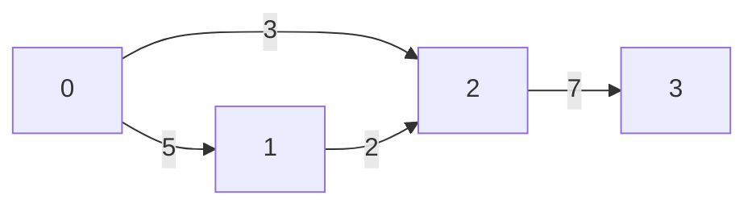
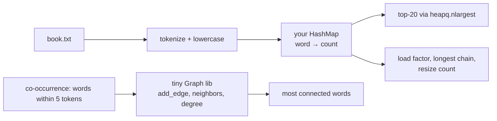

# Chapter 31 — Hash Tables & Graphs

> **Volume 1 — Computer Science Foundations** · [Contents](index.md) · ← [Chapter 30 — Trees, BST, Heap & Trie](ch30-trees-bst-heap-and-trie.md) · Next → [Chapter 32 — Advanced Structures: Segment Tree, Fenwick Tree & Union-Find](ch32-advanced-structures-segment-tree-fenwick-tree-and.md)

---

## Concept

Hash functions, collisions, resizing; graph representations (adjacency list/matrix), directed/weighted.

**In one sentence:** a hash table turns any key into an array index so lookups take constant time on average, and a graph is stored either as a table of "who connects to whom" (matrix) or as a list of neighbors per node (list).

**Mental model — the coat check and the subway map.** The coat check hashes your name to a hook number, and two people might get the same hook (a collision), so hooks hold a short line of coats. The subway map is a graph: stations are nodes, tracks are edges, and each station's sign lists only its neighboring stops (an adjacency list).

**Hash table anatomy**

| Part | Role |
|------|------|
| Hash function | maps a key to a big integer — fast, deterministic, spreads keys evenly |
| Index | `hash(key) % capacity` (or `& (capacity − 1)` when capacity is a power of 2) |
| Collision handling | *chaining* (a list per bucket) or *open addressing* (probe other slots) |
| Load factor α | `size / capacity`; resize (usually double) when α passes ~0.75 (chaining) or ~0.66 (open addressing) |
| Equality | after hashing to a slot, keys are compared with `==` |

**The hash contract:** if `a == b` then `hash(a) == hash(b)`. Keys must not change while in the table — that's why Python lists aren't hashable but tuples are.

**Collision strategies**

| Strategy | How | Pros | Cons |
|----------|-----|------|------|
| Separate chaining | each bucket holds a list | simple; tolerates α > 1 | pointer chasing |
| Linear probing | try `i+1, i+2, …` | cache-friendly | clustering; deletes need tombstones |
| Quadratic / double hashing | try `i+1², i+2², …` / a second hash | less clustering | more complex |
| Robin Hood / Swiss tables | probing with smart displacement / SIMD groups | very fast (Rust `HashMap`, Abseil) | complex |

**Graph representations**

| | Adjacency matrix | Adjacency list | Edge list |
|-|------------------|----------------|-----------|
| Memory | O(V²) | O(V + E) | O(E) |
| Edge u→v? | **O(1)** | O(deg u) | O(E) |
| Iterate neighbors | O(V) | **O(deg u)** | O(E) |
| Best for | dense graphs, small V, Floyd–Warshall | sparse graphs (most real ones), BFS/DFS/Dijkstra | Kruskal's MST, input files |

A graph with 1M nodes and 5M edges: matrix = 10¹² cells (impossible); list ≈ 6M entries (easy).

---

## Prereqs

* [Chapter 29 — Basic Data Structures: Arrays, Linked Lists, Stack & Queue](ch29-basic-data-structures-arrays-linked-lists-stack.md)

---

## Diagram

**A hash table with chaining, and a resize**

```
 capacity 4, α = 5/4 → too full        after resize to 8 (every key rehashed)
 [0] → ("dog",1) → ("ant",7)            [0] → ("ant",7)
 [1] → ("cat",3)                        [1] → ("cat",3)
 [2] ∅                                  [2] ∅
 [3] → ("eel",2) → ("fox",9)            [3] → ("eel",2)
                                        [4] → ("dog",1)
                                        [5] ∅   [6] ∅
                                        [7] → ("fox",9)      chains shrink
```

**Linear probing**

```
 insert "fox": hash % 8 = 3, but slot 3 is taken → try 4 → try 5 (free)
 [0][1][2][eel][dog][fox][6][7]
             ▲    ▲    ▲
             3    4    5   ← probe sequence
```

**The same weighted, directed graph three ways**



```
 ADJACENCY MATRIX (∞ = no edge)      ADJACENCY LIST                   EDGE LIST
       0   1   2   3                 0: [(1, 5), (2, 3)]              (0, 1, 5)
  0 [  ∞   5   3   ∞ ]               1: [(2, 2)]                      (0, 2, 3)
  1 [  ∞   ∞   2   ∞ ]               2: [(3, 7)]                      (1, 2, 2)
  2 [  ∞   ∞   ∞   7 ]               3: []                            (2, 3, 7)
  3 [  ∞   ∞   ∞   ∞ ]
  16 cells for 4 edges               4 entries                        4 rows
```

---

## Example

```python
from dataclasses import dataclass

@dataclass(frozen=True)                # frozen → __hash__ generated from fields
class Point:
    x: int
    y: int

seen = {Point(1, 2): "a"}
print(seen[Point(1, 2)])               # 'a' — equal objects, equal hashes

class Money:
    def __init__(self, cents, cur): self.cents, self.cur = cents, cur
    def __eq__(self, o): return (self.cents, self.cur) == (o.cents, o.cur)
    def __hash__(self): return hash((self.cents, self.cur))   # consistent with __eq__

# Weighted adjacency list
G = {0: [(1, 5), (2, 3)], 1: [(2, 2)], 2: [(3, 7)], 3: []}
out_degree = {u: len(vs) for u, vs in G.items()}
in_degree = {u: 0 for u in G}
for u, vs in G.items():
    for v, _w in vs:
        in_degree[v] += 1
print(out_degree, in_degree)
```

```python
class HashMap:
    def __init__(self, capacity=8):
        self._buckets = [[] for _ in range(capacity)]
        self._size = 0

    def _bucket(self, key):
        return self._buckets[hash(key) % len(self._buckets)]

    def put(self, key, value):
        b = self._bucket(key)
        for i, (k, _) in enumerate(b):
            if k == key:
                b[i] = (key, value); return
        b.append((key, value)); self._size += 1
        if self._size / len(self._buckets) > 0.75:
            self._resize(2 * len(self._buckets))

    def get(self, key, default=None):
        for k, v in self._bucket(key):
            if k == key: return v
        return default

    def _resize(self, new_cap):
        old = self._buckets
        self._buckets = [[] for _ in range(new_cap)]
        for bucket in old:
            for k, v in bucket:
                self._bucket(k).append((k, v))
```

---

## Exercises

1. Implement a hash table with chaining and resize.

   <details><summary>Solution</summary>See <code>HashMap</code> above. Add <code>delete</code> (remove from the chain, decrement size), <code>__len__</code>, and <code>__iter__</code>. Test with keys that collide on purpose: a custom class whose <code>__hash__</code> returns 1 still works, just slowly — proof that correctness doesn't depend on a good hash.</details>

2. Convert an adjacency matrix to a list.

   <details><summary>Solution</summary><code>adj = {u: [(v, w) for v, w in enumerate(row) if w != INF] for u, row in enumerate(M)}</code>. O(V²) time, because every cell must be read.</details>

3. What goes wrong if a key's hash changes after insertion?

   <details><summary>Solution</summary>It is stored in the bucket for its old hash, but lookups go to the bucket for the new hash, so it becomes unfindable (and may be duplicated). That's why dict keys must be immutable, or at least not mutated in ways that affect <code>__eq__</code> and <code>__hash__</code>.</details>

---

## Mini project

**A word-frequency counter with a custom hash table; a tiny graph library.**



**Steps**

1. Count words in a public-domain book with your `HashMap`; compare the results to `collections.Counter`.
2. Instrument it: load factor over time, longest chain, number of resizes.
3. Swap the hash for a deliberately bad one (`len(word)`) and measure the slowdown.
4. A `Graph` class (adjacency dict of dicts, weighted, directed flag) with `add_edge`, `neighbors`, `degree`, and `to_matrix`.
5. Build a word co-occurrence graph and print the highest-degree words.

**Done when:** your counts match `Counter` exactly, and your stats show chains staying short with a good hash and long with the bad one.

---

## Open source

* [`python/cpython`](https://github.com/python/cpython) dict — `Objects/dictobject.c` opens with a long comment on its open-addressing probe sequence (`perturb`) and the compact, insertion-ordered layout.
* [`networkx/networkx`](https://github.com/networkx/networkx) — `Graph` is a dict of dicts of dicts (node → neighbor → edge attributes): an adjacency list with metadata.

---

## Interview

1. **"How do you handle collisions?"**
   <details><summary>Answer</summary>Chaining: each bucket holds a small list, and colliding keys are appended and compared on lookup. Open addressing: store everything in the array itself and probe for the next free slot (linear, quadratic, or double hashing). Either way, keep the load factor bounded by resizing so the expected probes stay O(1). Defend against deliberate collisions (hash-flooding DoS) with randomized, keyed hashes like SipHash.</details>

2. **"Adjacency list vs matrix — memory trade-off?"**
   <details><summary>Answer</summary>A matrix uses O(V²) memory regardless of the number of edges, and gives O(1) edge checks — good for dense or small graphs. A list uses O(V + E) and iterates neighbors in O(degree) — better for the sparse graphs that dominate real systems (social, road, and dependency graphs).</details>

---

## Checklist

- [ ] implement hashing + probing/chaining
- [ ] model a graph two ways
- [ ] know amortized O(1)

---

> [Contents](index.md) · ← [Chapter 30 — Trees, BST, Heap & Trie](ch30-trees-bst-heap-and-trie.md) · Next → [Chapter 32 — Advanced Structures: Segment Tree, Fenwick Tree & Union-Find](ch32-advanced-structures-segment-tree-fenwick-tree-and.md)
