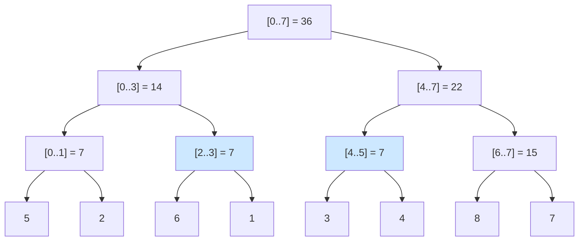
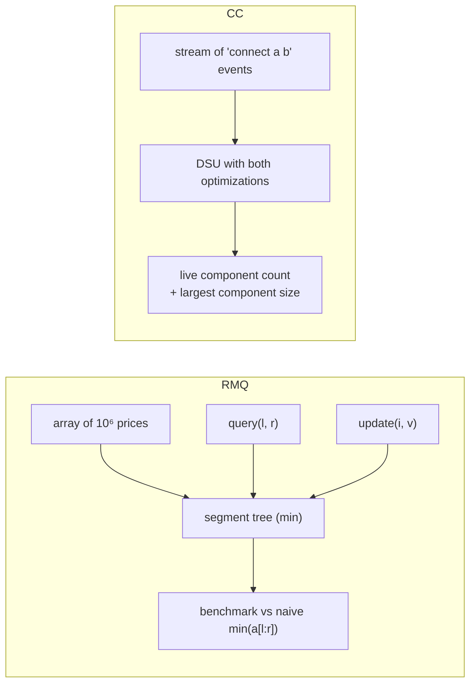

# Chapter 32 — Advanced Structures: Segment Tree, Fenwick Tree & Union-Find

> **Volume 1 — Computer Science Foundations** · [Contents](index.md) · ← [Chapter 31 — Hash Tables & Graphs](ch31-hash-tables-and-graphs.md) · Next → [Chapter 33 — Sorting, Searching & Binary Search](ch33-sorting-searching-and-binary-search.md)

---

## Concept

Range queries (segment/Fenwick) and dynamic connectivity (union-find with path compression + union by rank).

**In one sentence:** segment and Fenwick trees precompute partial answers over ranges so that "sum/min of `a[l..r]`" and "change `a[i]`" both take O(log n), and union-find keeps track of which items are in the same group while groups keep merging.

**Mental model.**

* **Segment tree** — a tournament bracket. Each match stores the winner (min) or total (sum) of its half. To answer "who's best among players 3–9?" you combine a few bracket nodes instead of rescanning everyone.
* **Fenwick tree** — a clever bookkeeper who keeps running totals of cleverly sized blocks (1, 2, 4, 8 … items), chosen by the lowest set bit of the index.
* **Union-find** — clubs where each member points to a "representative". Merging two clubs just makes one representative report to the other. "Are we in the same club?" = "do we have the same representative?"

**When to use what**

| Need | Naive | Prefix sums array | Fenwick (BIT) | Segment tree |
|------|:-:|:-:|:-:|:-:|
| Range sum, no updates | O(n) | **O(1)** query, O(n) build | O(log n) | O(log n) |
| Range sum + point updates | O(n) query | O(n) update | **O(log n) both, tiny code** | O(log n) both |
| Range min/max + updates | O(n) | ✗ | ✗ (not invertible) | **O(log n)** |
| Range update + range query | O(n) | ✗ | 2 BITs | lazy propagation |
| Memory | — | n | n | ~4n |

**Union-find (disjoint set union, DSU)**

| Operation | Meaning |
|-----------|---------|
| `find(x)` | return the representative (root) of x's set |
| `union(a, b)` | merge the sets containing a and b |
| `connected(a, b)` | `find(a) == find(b)` |

**Two optimizations — use both**

1. **Union by rank/size** — attach the shorter tree under the taller one, so trees stay shallow (height ≤ log n).
2. **Path compression** — during `find`, point every visited node directly at the root, so future finds are instant.

Together: amortized **O(α(n))** per operation, where α is the inverse Ackermann function — ≤ 4 for any n that fits in the universe. "Near O(1)".

Uses: Kruskal's minimum spanning tree, cycle detection in undirected graphs, grouping accounts/images/pixels, network connectivity, percolation.

---

## Prereqs

* [Chapter 30 — Trees, BST, Heap & Trie](ch30-trees-bst-heap-and-trie.md)
* [Chapter 31 — Hash Tables & Graphs](ch31-hash-tables-and-graphs.md)

---

## Diagram

**A sum segment tree over `a = [5, 2, 6, 1, 3, 4, 8, 7]`**



`sum(2..5) = [2..3] + [4..5] = 7 + 7 = 14` — two nodes instead of four elements. Any range needs at most ~2 log n nodes.

**Fenwick tree: what each index covers (lowest set bit)**

```
 i (binary)   covers           tree[i] =
 1  (0001)    a[1]             a1
 2  (0010)    a[1..2]          a1+a2
 3  (0011)    a[3]             a3
 4  (0100)    a[1..4]          a1..a4
 5  (0101)    a[5]
 6  (0110)    a[5..6]
 7  (0111)    a[7]
 8  (1000)    a[1..8]
 prefix(7) = tree[7] + tree[6] + tree[4]    (i -= i & -i:  7 → 6 → 4 → 0)
 update(3) touches tree[3], tree[4], tree[8] (i += i & -i:  3 → 4 → 8)
```

**Union-find forest with rank, before and after path compression**

```
 before find(6):             after find(6):
        0 (rank 2)                 0
       ╱ ╲                    ╱ ╱ ╲ ╲
      1   2                  1 2   5  6      ← 5 and 6 now point straight at the root
          │                      │
          5                      (2 keeps its other children)
          │
          6
```

---

## Example

```python
class Fenwick:
    """1-indexed binary indexed tree for prefix sums."""
    def __init__(self, n):
        self.n, self.t = n, [0] * (n + 1)

    def add(self, i, delta):            # a[i] += delta, O(log n)
        while i <= self.n:
            self.t[i] += delta
            i += i & -i                 # jump to the next node covering i

    def prefix(self, i):                # a[1] + … + a[i], O(log n)
        s = 0
        while i > 0:
            s += self.t[i]
            i -= i & -i                 # drop the lowest set bit
        return s

    def range_sum(self, l, r):
        return self.prefix(r) - self.prefix(l - 1)

a = [5, 2, 6, 1, 3, 4, 8, 7]
fw = Fenwick(len(a))
for i, x in enumerate(a, 1):
    fw.add(i, x)
print(fw.range_sum(3, 6))               # 6+1+3+4 = 14
fw.add(4, 10)                           # a[4] becomes 11
print(fw.range_sum(3, 6))               # 24
```

```python
class DSU:
    def __init__(self, n):
        self.parent = list(range(n))
        self.size = [1] * n

    def find(self, x):
        root = x
        while self.parent[root] != root:
            root = self.parent[root]
        while self.parent[x] != root:           # path compression
            self.parent[x], x = root, self.parent[x]
        return root

    def union(self, a, b):
        ra, rb = self.find(a), self.find(b)
        if ra == rb:
            return False                         # already connected → a cycle if a–b is an edge
        if self.size[ra] < self.size[rb]:
            ra, rb = rb, ra
        self.parent[rb] = ra                     # union by size
        self.size[ra] += self.size[rb]
        return True

edges = [(0, 1), (1, 2), (3, 4), (2, 0)]
d = DSU(5)
for u, v in edges:
    if not d.union(u, v):
        print("cycle via", (u, v))              # cycle via (2, 0)
print(len({d.find(i) for i in range(5)}))       # 2 components
```

---

## Exercises

1. Build a Fenwick tree for prefix sums.

   <details><summary>Solution</summary>See <code>Fenwick</code> above. Build in O(n) instead of n·log n: copy the array, then for each i add <code>t[i]</code> into <code>t[i + (i &amp; -i)]</code> if in range. Test against <code>sum(a[l-1:r])</code> after random updates.</details>

2. Implement union-find and detect a cycle in a graph.

   <details><summary>Solution</summary>For each undirected edge (u, v), if <code>find(u) == find(v)</code> they're already connected, so the edge closes a cycle; otherwise union them. O(E·α(V)) — the same loop is the core of Kruskal's MST.</details>

3. Why can't a Fenwick tree answer range *minimum* queries with updates?

   <details><summary>Solution</summary>It answers ranges as <code>prefix(r) − prefix(l−1)</code>, which needs an inverse operation. Subtraction undoes addition, but nothing "un-mins" a minimum. Use a segment tree.</details>

---

## Mini project

**A range-minimum-query engine and a connected-components counter.**



**Steps**

1. An iterative segment tree (size 2n array, bottom-up) for min, with `update(i, v)` and `query(l, r)`.
2. Property-test against naive `min` on random operations.
3. Benchmark 10⁵ mixed queries on 10⁶ elements vs naive.
4. DSU: process a stream of "connect a b" events, printing the component count and largest-component size after each.
5. Compare DSU with and without path compression and union by size on 10⁶ unions; plot the average tree height.

**Done when:** both match naive reference answers, and the benchmarks show O(log n) and near-O(1) behavior.

---

## Open source

* [`atcoder/ac-library`](https://github.com/atcoder/ac-library) (`dsu`, `segtree`) — `atcoder/dsu.hpp` and `atcoder/segtree.hpp` are short, well-tested, generic implementations used in competitive programming.

---

## Interview

1. **"When do you need a Fenwick tree?"**
   <details><summary>Answer</summary>When you need prefix or range sums (or any invertible, associative operation like XOR) <i>and</i> point updates, both fast. A plain prefix-sum array is O(1) query but O(n) update. A Fenwick tree makes both O(log n) with ~10 lines of code and n memory. For min/max or complex range updates, use a segment tree.</details>

2. **"Why is union-find near-O(1) amortized?"**
   <details><summary>Answer</summary>Union by rank keeps trees O(log n) tall. Path compression flattens every path it walks, so repeated finds become one hop. Tarjan proved the combination costs O(α(n)) amortized per operation, where the inverse Ackermann function α(n) ≤ 4 for all practical n.</details>

---

## Checklist

- [ ] implement range sum/update
- [ ] implement find/union with both optimizations
- [ ] know when each applies

---

> [Contents](index.md) · ← [Chapter 31 — Hash Tables & Graphs](ch31-hash-tables-and-graphs.md) · Next → [Chapter 33 — Sorting, Searching & Binary Search](ch33-sorting-searching-and-binary-search.md)
