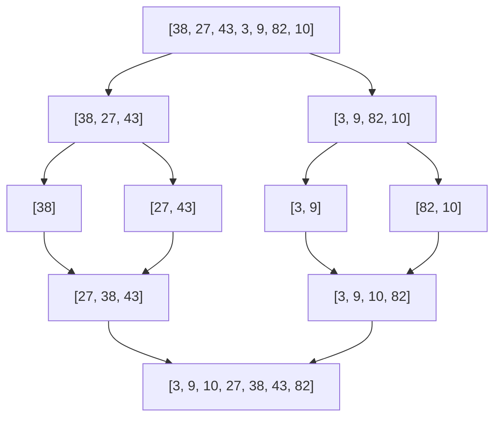
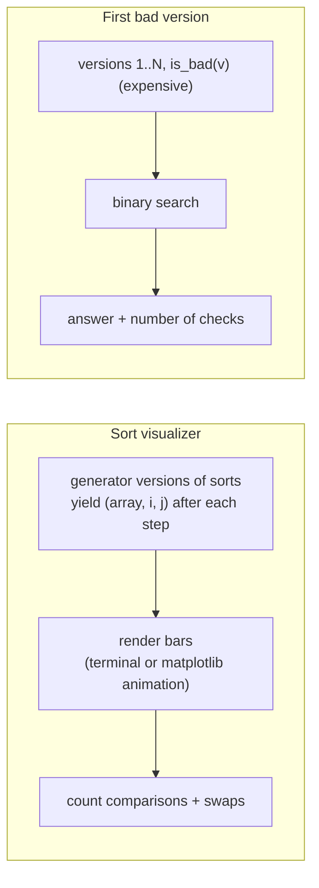

# Chapter 33 — Sorting, Searching & Binary Search

> **Volume 1 — Computer Science Foundations** · [Contents](index.md) · ← [Chapter 32 — Advanced Structures: Segment Tree, Fenwick Tree & Union-Find](ch32-advanced-structures-segment-tree-fenwick-tree-and.md) · Next → [Chapter 34 — Graph Algorithms: DFS, BFS, Topological Sort & Backtracking](ch34-graph-algorithms-dfs-bfs-topological-sort-and.md)

---

## Concept

Quicksort/mergesort/heapsort, stability, and binary search on sorted data and monotonic predicates.

**In one sentence:** sorting puts data in order so that later questions become cheap, and binary search answers "where does this go?" or "what's the smallest value that works?" by halving the candidates each step.

**Mental model — a phone book.** Nobody reads a phone book from page 1. You open it in the middle, see "M", and throw away half. Twenty halvings find any name among a million. Binary search works on *anything* where the answer flips once from "no" to "yes" — not just sorted arrays.

**The main sorts**

| Algorithm | Best | Average | Worst | Extra space | Stable? | Notes |
|-----------|:-:|:-:|:-:|:-:|:-:|-------|
| Insertion sort | O(n) | O(n²) | O(n²) | O(1) | yes | fastest for tiny or nearly sorted arrays |
| Merge sort | O(n log n) | O(n log n) | O(n log n) | O(n) | **yes** | predictable; good for linked lists and external sorting |
| Quicksort | O(n log n) | O(n log n) | O(n²) | O(log n) stack | no | fastest in practice; random pivot avoids the worst case |
| Heapsort | O(n log n) | O(n log n) | O(n log n) | O(1) | no | guaranteed bound, in place; poor cache behavior |
| Timsort (Python, Java objects) | **O(n)** | O(n log n) | O(n log n) | O(n) | yes | merge + insertion; exploits existing runs |
| Introsort (C++ `std::sort`) | O(n log n) | O(n log n) | O(n log n) | O(log n) | no | quicksort that switches to heapsort if recursion gets deep |
| Counting / radix sort | O(n + k) | O(n + k) | O(n + k) | O(n + k) | yes | integers or keys in a small range; not comparison-based |

Comparison sorts can't beat **Ω(n log n)** in the worst case: there are n! orderings, and each comparison gives one bit, so you need log₂(n!) ≈ n log n comparisons.

**Stability** — a stable sort keeps equal elements in their original order. It matters when you sort by several keys: sort by name, then *stably* by department, and names stay alphabetical inside each department.

**Binary search patterns**

| Pattern | Question | Tool |
|---------|----------|------|
| Exact match | is x in the sorted array? | `bisect_left` + check |
| Lower bound | first index with `a[i] >= x` | `bisect_left` |
| Upper bound | first index with `a[i] > x` | `bisect_right` |
| **Search on the answer** | smallest value v where `ok(v)` is true, given `ok` is monotonic (false … false true … true) | binary search over v |

Search-on-the-answer examples: minimum eating speed to finish in h hours, minimum ship capacity, first bad version, smallest `k` that makes a model's latency acceptable.

---

## Prereqs

* [Chapter 29 — Basic Data Structures: Arrays, Linked Lists, Stack & Queue](ch29-basic-data-structures-arrays-linked-lists-stack.md)
* [Vol 0 Ch 6 — Asymptotic Notation](../volume-0-math/ch06-asymptotic-notation-big-o.md)

---

## Diagram

**One quicksort partition step (Lomuto, pivot = last)**

```
 array: [7, 2, 9, 4, 3, 8, 5]   pivot = 5
 i marks the end of the "< pivot" zone
  j=0: 7 ≥ 5  skip                 [7, 2, 9, 4, 3, 8, 5]
  j=1: 2 < 5  swap into zone       [2, 7, 9, 4, 3, 8, 5]
  j=3: 4 < 5  swap                 [2, 4, 9, 7, 3, 8, 5]
  j=4: 3 < 5  swap                 [2, 4, 3, 7, 9, 8, 5]
 finally swap the pivot into place [2, 4, 3, 5, 9, 8, 7]
                                    └ < 5 ┘ ▲ └ ≥ 5 ┘
 recurse on the left and right parts
```

**Merge sort: split, then merge**



**Binary search halving**

```
 find 23 in [2, 5, 8, 12, 16, 23, 38, 56, 72, 91]
 lo=0 hi=10  mid=5 → 23 == 23 ✓ (found in 1 step here; ≤ ⌈log₂ 11⌉ = 4 in general)

 find 60:
 [2 5 8 12 16 | 23 38 56 72 91]   mid=5 (23) < 60 → go right
                [23 38 | 56 72 91]  mid=7 (56) < 60 → go right
                         [72 | 91]  mid=8 (72) ≥ 60 → go left
                         lo=hi=8 → insertion point 8, not found
```

**Search on a monotonic predicate**

```
 speed:  1   2   3   4   5   6   7   8
 ok?     ✗   ✗   ✗   ✓   ✓   ✓   ✓   ✓      ← flips exactly once
                     ▲ answer = first ✓, found in O(log range) checks
```

---

## Example

```python
from bisect import bisect_left, bisect_right
import math

xs = sorted([5, 1, 4, 1, 3])                   # Timsort → [1, 1, 3, 4, 5]
print(bisect_left(xs, 1), bisect_right(xs, 1))  # 0 2 — the range of 1s is [0, 2)

people = [("ann", "eng"), ("bob", "ops"), ("cat", "eng"), ("dan", "ops")]
by_dept = sorted(sorted(people), key=lambda p: p[1])   # stable → names stay sorted per dept
print(by_dept)   # [('ann','eng'), ('cat','eng'), ('bob','ops'), ('dan','ops')]

def merge_sort(a):
    if len(a) <= 1:
        return a
    mid = len(a) // 2
    left, right = merge_sort(a[:mid]), merge_sort(a[mid:])
    out, i, j = [], 0, 0
    while i < len(left) and j < len(right):
        if left[i] <= right[j]:                 # <= keeps it stable
            out.append(left[i]); i += 1
        else:
            out.append(right[j]); j += 1
    return out + left[i:] + right[j:]

import random
def quicksort(a, lo=0, hi=None):
    hi = len(a) - 1 if hi is None else hi
    if lo >= hi:
        return a
    p = random.randint(lo, hi)                  # random pivot avoids O(n²) on sorted input
    a[p], a[hi] = a[hi], a[p]
    pivot, i = a[hi], lo
    for j in range(lo, hi):
        if a[j] < pivot:
            a[i], a[j] = a[j], a[i]; i += 1
    a[i], a[hi] = a[hi], a[i]
    quicksort(a, lo, i - 1); quicksort(a, i + 1, hi)
    return a

def first_true(lo, hi, ok):
    """Smallest v in [lo, hi] with ok(v) True; ok must be monotonic."""
    while lo < hi:
        mid = (lo + hi) // 2
        if ok(mid): hi = mid
        else: lo = mid + 1
    return lo

piles, hours = [3, 6, 7, 11], 8
speed = first_true(1, max(piles), lambda k: sum(math.ceil(p / k) for p in piles) <= hours)
print(speed)                                    # 4 — minimum bananas/hour
```

---

## Exercises

1. Implement mergesort and quicksort.

   <details><summary>Solution</summary>See above. Test both against <code>sorted()</code> on random arrays, arrays with many duplicates, already-sorted arrays, and reversed arrays. For quicksort on many duplicates, switch to 3-way partitioning (&lt;, =, &gt;) to avoid O(n²).</details>

2. Use binary search on the *answer* (e.g., min speed).

   <details><summary>Solution</summary>See <code>first_true</code>. Recipe: (1) define <code>ok(v)</code>; (2) prove it's monotonic; (3) bound the range [lo, hi]; (4) binary search. Cost: O(log range × cost of ok).</details>

3. Why does `mid = (lo + hi) // 2` never loop forever in `first_true`, but `lo = mid` would?

   <details><summary>Solution</summary><code>mid</code> rounds down, so <code>mid &lt; hi</code> whenever <code>lo &lt; hi</code>. Setting <code>hi = mid</code> or <code>lo = mid + 1</code> always shrinks the range. With <code>lo = mid</code>, when <code>hi = lo + 1</code>, <code>mid == lo</code> and nothing changes.</details>

---

## Mini project

**A sort visualizer plus a "first bad version" binary-search solver.**



**Steps**

1. Write insertion, merge, quick, and heap sort as *generators* that `yield` the array state after each compare or swap.
2. Render each step as bars (Unicode blocks in the terminal, or `matplotlib.animation`); highlight the compared indices.
3. Show counters and compare the algorithms on random, sorted, reversed, and many-duplicate inputs.
4. First bad version: simulate `is_bad` with a 0.1 s delay over 10⁶ versions; binary search finds it in ~20 checks.
5. Bonus: connect it to `git bisect run` (see [Ch 27](ch27-debugging-and-profiling.md)).

**Done when:** the visualizer makes quicksort's worst case on sorted input (with a fixed pivot) visibly obvious, and the solver uses ≤ ⌈log₂ N⌉ + 1 checks.

---

## Open source

* [`python/cpython`](https://github.com/python/cpython) Timsort — `Objects/listsort.txt` is Tim Peters' famous design write-up: runs, galloping, and merge balancing. (Since 3.11 CPython uses "powersort" merge rules; the file explains that too.)

---

## Interview

1. **"Stable vs unstable sort?"**
   <details><summary>Answer</summary>A stable sort preserves the original relative order of equal keys; an unstable one may reorder them. Stability lets you sort by multiple keys in passes (secondary key first, then primary) and keeps UI ordering predictable. Merge sort and Timsort are stable; quicksort and heapsort usually aren't.</details>

2. **"Binary search on a predicate — how?"**
   <details><summary>Answer</summary>If a yes/no function over an ordered range is monotonic — all false, then all true — you can find the boundary in O(log range) evaluations. Keep a half-open [lo, hi), test mid, and move lo or hi so the invariant "the answer is in [lo, hi]" holds. Used for minimum capacity, first failing version, and tuning thresholds.</details>

---

## Checklist

- [ ] implement two sorts
- [ ] know stability implications
- [ ] binary-search on answers

---

> [Contents](index.md) · ← [Chapter 32 — Advanced Structures: Segment Tree, Fenwick Tree & Union-Find](ch32-advanced-structures-segment-tree-fenwick-tree-and.md) · Next → [Chapter 34 — Graph Algorithms: DFS, BFS, Topological Sort & Backtracking](ch34-graph-algorithms-dfs-bfs-topological-sort-and.md)
