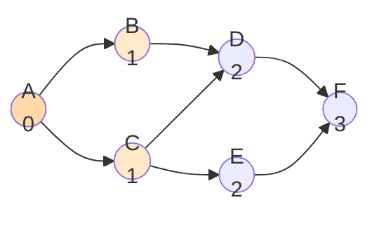
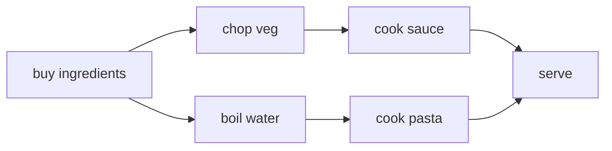
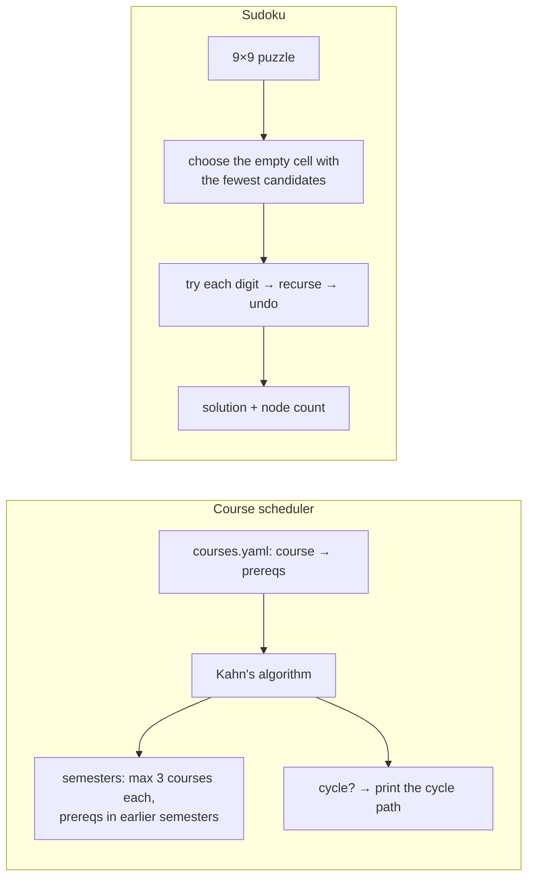

# Chapter 34 — Graph Algorithms: DFS, BFS, Topological Sort & Backtracking

> **Volume 1 — Computer Science Foundations** · [Contents](index.md) · ← [Chapter 33 — Sorting, Searching & Binary Search](ch33-sorting-searching-and-binary-search.md) · Next → [Chapter 35 — Dynamic Programming, Greedy, Divide & Conquer, Sliding Window & Two Pointers](ch35-dynamic-programming-greedy-divide-and-conquer-sliding.md)

---

## Concept

Depth-first and breadth-first traversal, cycle detection, topological order, and systematic backtracking.

**In one sentence:** BFS explores a graph in rings of increasing distance, DFS dives as deep as it can before backing up, topological sort orders tasks so every dependency comes first, and backtracking is DFS over the tree of *choices* that prunes dead ends early.

**Mental model — exploring a maze.** BFS is water poured at the entrance: it spreads to every corridor one step at a time, so it reaches each spot by the shortest route. DFS is one explorer with a ball of string: follow one corridor to its end, then back up to the last junction and try the next. Backtracking is the same explorer solving a puzzle, who turns back the moment a path breaks a rule.

**BFS vs DFS**

| | BFS | DFS |
|-|-----|-----|
| Data structure | queue | stack (or recursion) |
| Order | by distance (level by level) | deep first |
| Shortest path (unweighted) | **yes** | no |
| Memory | O(width) — can be large | O(depth) |
| Good for | shortest hops, nearest neighbors, level order, web crawling by depth | cycle detection, topological sort, connected components, mazes, backtracking |
| Time | O(V + E) | O(V + E) |

**Cycle detection**

* **Undirected:** during DFS, reaching an already-visited vertex that isn't your parent means a cycle (or use union-find, [Ch 32](ch32-advanced-structures-segment-tree-fenwick-tree-and.md)).
* **Directed:** three colors — white (unvisited), gray (on the current path), black (finished). Meeting a **gray** vertex means a back edge, so a cycle.

**Topological sort** (only for DAGs)

| Method | Idea |
|--------|------|
| Kahn's algorithm (BFS) | repeatedly remove a node with in-degree 0; if nodes remain at the end, there is a cycle |
| DFS post-order | output each node after all its descendants finish; reverse the list |

**Backtracking template**

```
solve(state):
    if state is complete: record it; return
    for choice in candidates(state):
        if valid(state, choice):          ← prune early
            apply(choice)
            solve(state)
            undo(choice)                  ← backtrack
```

---

## Prereqs

* [Chapter 31 — Hash Tables & Graphs](ch31-hash-tables-and-graphs.md)

---

## Diagram

**BFS level-by-level expansion from A**



```
 queue over time:  [A] → [B, C] → [C, D] → [D, E] → [E, F] → [F] → []
 levels:           0: A   1: B C   2: D E   3: F        (number = hops from A)
```

**The DFS recursion tree for the same graph**

```
 dfs(A)
 ├── dfs(B)
 │   └── dfs(D)
 │       └── dfs(F)        ← deepest first
 └── dfs(C)
     ├── D already visited
     └── dfs(E)
         └── F already visited
 visit order: A B D F C E
```

**A DAG and a topological order (Kahn's algorithm)**



```
 in-degree 0 first:  shop → chop, boil → cook, pasta → serve
 one valid order:    shop, chop, boil, cook, pasta, serve
```

**Backtracking on 4-queens — pruned branches**

```
 row 0: Q at col 0
   row 1: col 0 ✗ (same column)  col 1 ✗ (diagonal)  col 2 ✓
     row 2: all ✗  → backtrack
   row 1: col 3 ✓
     row 2: col 1 ✓
       row 3: all ✗ → backtrack … eventually:  . Q . .
                                               . . . Q
                                               Q . . .
                                               . . Q .
```

---

## Example

```python
from collections import deque

G = {"A": ["B", "C"], "B": ["D"], "C": ["D", "E"], "D": ["F"], "E": ["F"], "F": []}

def bfs_shortest_path(g, start, goal):
    parent = {start: None}
    q = deque([start])
    while q:
        u = q.popleft()
        if u == goal:
            path = []
            while u is not None:
                path.append(u); u = parent[u]
            return path[::-1]
        for v in g[u]:
            if v not in parent:           # mark when ENQUEUED, not when popped
                parent[v] = u
                q.append(v)
    return None

print(bfs_shortest_path(G, "A", "F"))     # ['A', 'B', 'D', 'F']

def has_cycle_directed(g):
    WHITE, GRAY, BLACK = 0, 1, 2
    color = {u: WHITE for u in g}
    def dfs(u):
        color[u] = GRAY
        for v in g[u]:
            if color[v] == GRAY: return True           # back edge
            if color[v] == WHITE and dfs(v): return True
        color[u] = BLACK
        return False
    return any(color[u] == WHITE and dfs(u) for u in g)

def kahn_topo(g):
    indeg = {u: 0 for u in g}
    for u in g:
        for v in g[u]: indeg[v] += 1
    q = deque(u for u in g if indeg[u] == 0)
    order = []
    while q:
        u = q.popleft(); order.append(u)
        for v in g[u]:
            indeg[v] -= 1
            if indeg[v] == 0: q.append(v)
    if len(order) != len(g):
        raise ValueError("cycle detected")
    return order

print(has_cycle_directed(G), kahn_topo(G))   # False ['A', 'B', 'C', 'D', 'E', 'F']

def n_queens(n):
    cols, d1, d2, board, out = set(), set(), set(), [], []
    def place(r):
        if r == n:
            out.append(board[:]); return
        for c in range(n):
            if c in cols or r - c in d1 or r + c in d2:
                continue                                 # prune
            cols.add(c); d1.add(r - c); d2.add(r + c); board.append(c)
            place(r + 1)
            cols.remove(c); d1.remove(r - c); d2.remove(r + c); board.pop()   # undo
    place(0)
    return out

print(len(n_queens(8)))                    # 92
```

---

## Exercises

1. Detect a cycle with DFS.

   <details><summary>Solution</summary>See <code>has_cycle_directed</code>. For deep graphs, use an explicit stack to avoid Python's recursion limit. To report the cycle, keep parent pointers and walk back from the gray node you hit.</details>

2. Topologically sort a task dependency graph.

   <details><summary>Solution</summary>See <code>kahn_topo</code>. Use a heap instead of a deque for the "lexicographically smallest" order. Group nodes by the round in which their in-degree hit 0 to find tasks that can run in parallel.</details>

3. Solve N-queens with backtracking.

   <details><summary>Solution</summary>See <code>n_queens</code>: one queen per row, and sets for columns and both diagonals (<code>r−c</code> and <code>r+c</code> are constant along diagonals) make each validity check O(1). 8 queens → 92 solutions.</details>

---

## Mini project

**A course-scheduler (topo sort) + a Sudoku solver (backtracking).**



**Steps**

1. Scheduler: parse prerequisites, run Kahn's by levels, pack each level into semesters of ≤ 3 courses.
2. On a cycle, print it (`A → B → C → A`) — a useful error beats "invalid".
3. Sudoku: bitmasks for rows, columns, and boxes; choose the most-constrained cell first (MRV heuristic).
4. Count search nodes with and without MRV on a hard puzzle.

**Done when:** the scheduler prints a valid plan or the exact cycle, and the Sudoku solver finishes "hard" puzzles in milliseconds with MRV.

---

## Open source

* [`networkx/networkx`](https://github.com/networkx/networkx) (`topological_sort`, `bfs_edges`) — `networkx/algorithms/dag.py` and `algorithms/traversal/breadth_first_search.py`, generator-based and readable.

---

## Interview

1. **"BFS vs DFS — when each?"**
   <details><summary>Answer</summary>BFS for shortest paths in unweighted graphs, minimum steps, and level-order processing; it uses memory proportional to the frontier. DFS for exhaustive exploration, cycle detection, topological order, connected components, and backtracking; it uses memory proportional to the depth. Both are O(V + E).</details>

2. **"How do you topologically sort?"**
   <details><summary>Answer</summary>Kahn's: compute in-degrees, queue all zero-in-degree nodes, pop one, append it to the order, and decrement its neighbors' in-degrees, queueing any that reach zero. If the order has fewer than V nodes, there is a cycle. Or: DFS, append nodes in post-order, then reverse. Both O(V + E).</details>

---

## Checklist

- [ ] traverse both ways
- [ ] detect cycles
- [ ] prune backtracking search spaces

---

> [Contents](index.md) · ← [Chapter 33 — Sorting, Searching & Binary Search](ch33-sorting-searching-and-binary-search.md) · Next → [Chapter 35 — Dynamic Programming, Greedy, Divide & Conquer, Sliding Window & Two Pointers](ch35-dynamic-programming-greedy-divide-and-conquer-sliding.md)
