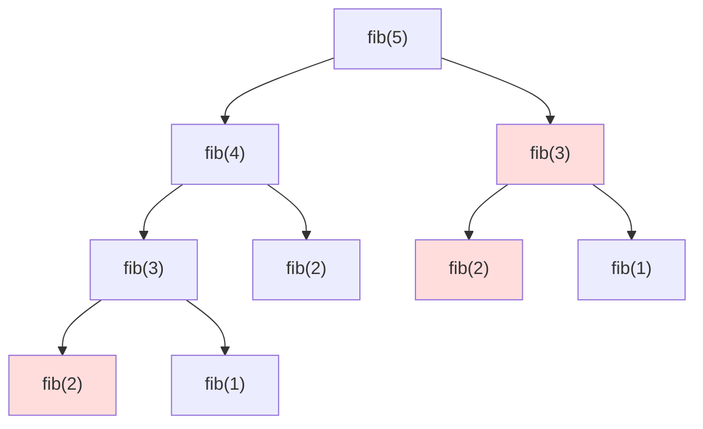
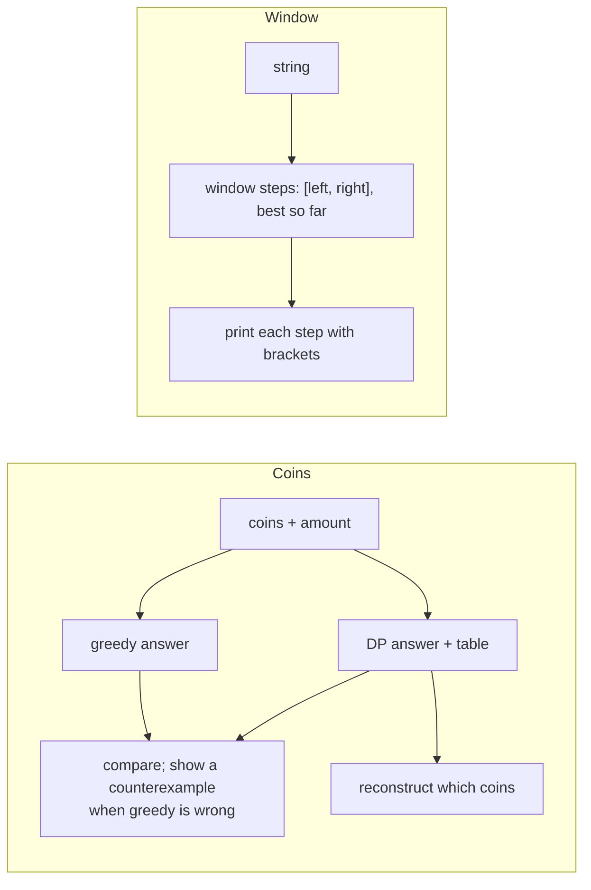

# Chapter 35 — Dynamic Programming, Greedy, Divide & Conquer, Sliding Window & Two Pointers

> **Volume 1 — Computer Science Foundations** · [Contents](index.md) · ← [Chapter 34 — Graph Algorithms: DFS, BFS, Topological Sort & Backtracking](ch34-graph-algorithms-dfs-bfs-topological-sort-and.md) · Next → [Chapter 36 — Binary, CPU, Registers, Cache & Memory Hierarchy](ch36-binary-cpu-registers-cache-and-memory-hierarchy.md)

---

## Concept

Overlapping subproblems + memoization (DP), local-optimal choices (greedy), split-and-combine (divide & conquer), and the sliding-window / two-pointer patterns.

**In one sentence:** these are five recipes for turning an obvious-but-slow brute force into a fast algorithm — remember answers you already computed (DP), commit to the best-looking choice when that's provably safe (greedy), split the problem in half (divide & conquer), or move two indices through the data instead of trying every pair (window / two pointers).

**Mental model.**

* **DP** — a notebook: before solving a subproblem, check whether you already wrote down its answer.
* **Greedy** — always grab the biggest coin that fits. Works for euros, fails for some odd coin systems.
* **Divide & conquer** — split a stack of exams between two helpers, then merge their sorted piles.
* **Sliding window** — a magnifying glass sliding along a line of text: add the character entering on the right, drop the one leaving on the left.

**Recognizing the pattern**

| Clue in the problem | Try |
|---------------------|-----|
| "number of ways", "min/max cost", choices that affect later choices, brute force recomputes the same subproblems | **DP** |
| a local choice provably never hurts (exchange argument), intervals, scheduling | **greedy** |
| the problem splits into independent halves; combining is cheap | **divide & conquer** |
| contiguous subarray/substring with a constraint (sum ≤ k, no repeats) | **sliding window** |
| sorted array, pairs/triples meeting a target, partitioning in place | **two pointers** |

**DP in four steps**

1. **State:** what defines a subproblem? e.g. `best(i, cap)` = best value using items `i..n` with capacity `cap`.
2. **Transition:** how does a state depend on smaller ones? `best(i, cap) = max(skip, take)`.
3. **Base cases:** `best(n, cap) = 0`.
4. **Order:** top-down with memoization (recursion + cache) or bottom-up (fill a table in dependency order).

Time = number of states × work per state. Space can often shrink to one or two rows.

**Greedy needs a proof.** The usual one is an *exchange argument*: take any optimal solution, swap in the greedy choice, and show it's no worse. Example that works: activity selection by earliest finish time. Example that fails: coins {1, 3, 4} for amount 6 — greedy gives 4+1+1 (3 coins), optimal is 3+3 (2 coins).

---

## Prereqs

* [Chapter 33 — Sorting, Searching & Binary Search](ch33-sorting-searching-and-binary-search.md)
* [Chapter 34 — Graph Algorithms: DFS, BFS, Topological Sort & Backtracking](ch34-graph-algorithms-dfs-bfs-topological-sort-and.md)

---

## Diagram

**Why memoization helps: the fib(5) call tree**



Red nodes are repeats. With a memo, each `fib(k)` is computed once: O(n) instead of O(φⁿ).

**A DP memo table for 0/1 knapsack** — items (weight, value): A(1, 1), B(3, 4), C(4, 5), D(5, 7); capacity 7.

```
 dp[i][c] = best value using the first i items with capacity c

            c=0  1   2   3   4   5   6   7
 no items    0   0   0   0   0   0   0   0
 +A (1,1)    0   1   1   1   1   1   1   1
 +B (3,4)    0   1   1   4   5   5   5   5
 +C (4,5)    0   1   1   4   5   6   6   9     ← B + C = 4 + 5
 +D (5,7)    0   1   1   4   5   7   8   9
 each cell = max(cell above,  value + cell above at c − weight)
             (skip the item)  (take it)
```

**A sliding window shrinking and expanding** — longest substring without repeats in `"abcabcbb"`

```
 a b c a b c b b
 [a b c]                 expand right: window "abc", best = 3
   [b c a]               'a' repeats → shrink left past the old 'a'
     [c a b]
       [a b c]
           [c b]         'b' repeats → jump left past it
               [b]       best stays 3
 each index enters and leaves the window at most once → O(n)
```

**Two pointers on a sorted array** — find a pair summing to 10 in `[1, 2, 4, 6, 8, 9]`

```
 L=1, R=9  → 10 ✓ found in one step
 (if sum < target, move L right; if sum > target, move R left)
```

---

## Example

```python
from functools import lru_cache

@lru_cache(maxsize=None)
def fib(n):
    return n if n < 2 else fib(n - 1) + fib(n - 2)

def knapsack_top_down(items, cap):
    @lru_cache(maxsize=None)
    def best(i, c):
        if i == len(items):
            return 0
        w, v = items[i]
        skip = best(i + 1, c)
        take = v + best(i + 1, c - w) if w <= c else 0
        return max(skip, take)
    return best(0, cap)

def knapsack_bottom_up(items, cap):
    dp = [0] * (cap + 1)                 # one row is enough
    for w, v in items:
        for c in range(cap, w - 1, -1):  # go downward so each item is used at most once
            dp[c] = max(dp[c], v + dp[c - w])
    return dp[cap]

items = [(1, 1), (3, 4), (4, 5), (5, 7)]
print(knapsack_top_down(items, 7), knapsack_bottom_up(items, 7))   # 9 9

def max_sum_window(xs, k):               # fixed-size sliding window
    s = best = sum(xs[:k])
    for i in range(k, len(xs)):
        s += xs[i] - xs[i - k]           # add the entering element, drop the leaving one
        best = max(best, s)
    return best

def longest_unique(s):                   # variable-size window
    last, left, best = {}, 0, 0
    for right, ch in enumerate(s):
        if ch in last and last[ch] >= left:
            left = last[ch] + 1          # shrink past the previous copy
        last[ch] = right
        best = max(best, right - left + 1)
    return best

def coin_change(coins, amount):          # min coins; DP because greedy can fail
    INF = float("inf")
    dp = [0] + [INF] * amount
    for a in range(1, amount + 1):
        dp[a] = min((dp[a - c] + 1 for c in coins if c <= a), default=INF)
    return dp[amount] if dp[amount] != INF else -1

print(max_sum_window([2, 1, 5, 1, 3, 2], 3), longest_unique("abcabcbb"), coin_change([1, 3, 4], 6))
# 9 3 2
```

---

## Exercises

1. Solve 0/1 knapsack top-down and bottom-up.

   <details><summary>Solution</summary>See both versions above. Top-down has O(n·cap) states with O(1) work each. The bottom-up single row must iterate capacity <i>downward</i>; upward would let one item be taken many times, which is the <i>unbounded</i> knapsack.</details>

2. Longest substring without repeating chars via sliding window.

   <details><summary>Solution</summary>See <code>longest_unique</code>: track each character's last index; when the entering character was seen inside the window, move <code>left</code> just past it. O(n) time, O(alphabet) space.</details>

3. Is "pick the interval that starts first" a correct greedy rule for scheduling the most non-overlapping meetings?

   <details><summary>Solution</summary>No: one long early meeting can block many short ones. The correct rule is <i>earliest finish time</i>. Exchange argument: the first meeting of any optimal schedule can be swapped for the earliest-finishing meeting without creating an overlap.</details>

---

## Mini project

**A coin-change solver and a longest-substring tool with visual step output.**



**Steps**

1. Coin change: DP for the minimum count, plus back-pointers to print the coins used.
2. Run greedy alongside; search small coin systems for inputs where greedy loses, and print them.
3. Count the number of *ways* to make the amount (a different DP: `ways[a] += ways[a − c]`, looping coins in the outer loop).
4. Window tool: print each step as `a b [c a b] c b b  best=3`.
5. Test both against brute force for small inputs.

**Done when:** the tool finds greedy counterexamples automatically, and every DP answer matches brute force for amounts ≤ 30.

---

## Open source

* [`TheAlgorithms/Python`](https://github.com/TheAlgorithms/Python) — `dynamic_programming/`, `greedy_methods/`, and `divide_and_conquer/` hold hundreds of small, documented implementations to compare with yours.

---

## Interview

1. **"How do you recognize a DP problem?"**
   <details><summary>Answer</summary>The question asks for an optimum or a count; the answer is built from answers to smaller versions of the same question (optimal substructure); and a naive recursion solves the same subproblems repeatedly (overlapping subproblems). Then define the state, the transition, and the base cases, and memoize or tabulate.</details>

2. **"When is greedy provably optimal?"**
   <details><summary>Answer</summary>When the problem has the greedy-choice property (some optimal solution starts with the greedy choice) plus optimal substructure. Prove it with an exchange argument, or with matroid theory. Classic correct cases: activity selection by earliest finish, Huffman coding, Dijkstra with non-negative weights, Kruskal/Prim MST. Without a proof, test against brute force.</details>

---

## Checklist

- [ ] write top-down + bottom-up DP
- [ ] prove a greedy choice
- [ ] apply two-pointer/sliding-window

---

> [Contents](index.md) · ← [Chapter 34 — Graph Algorithms: DFS, BFS, Topological Sort & Backtracking](ch34-graph-algorithms-dfs-bfs-topological-sort-and.md) · Next → [Chapter 36 — Binary, CPU, Registers, Cache & Memory Hierarchy](ch36-binary-cpu-registers-cache-and-memory-hierarchy.md)
