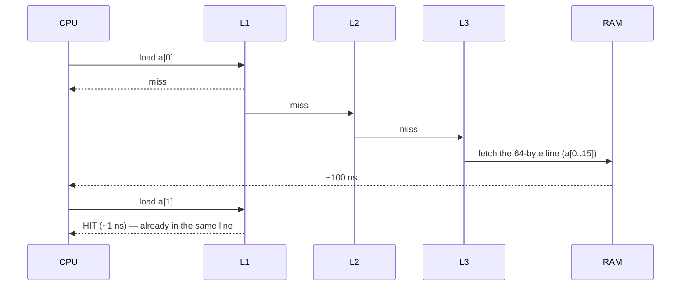
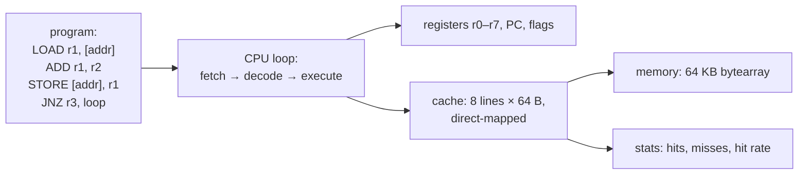

# Chapter 36 — Binary, CPU, Registers, Cache & Memory Hierarchy

> **Volume 1 — Computer Science Foundations** · [Contents](index.md) · ← [Chapter 35 — Dynamic Programming, Greedy, Divide & Conquer, Sliding Window & Two Pointers](ch35-dynamic-programming-greedy-divide-and-conquer-sliding.md) · Next → [Chapter 37 — Instruction Cycle, Pipelining, SIMD & Virtual Memory](ch37-instruction-cycle-pipelining-simd-and-virtual-memory.md)

---

## Concept

Binary and number representation (two's complement, floats); CPU registers; cache levels and the memory hierarchy.

**In one sentence:** everything in a computer is bits; the CPU computes only on a handful of tiny, ultra-fast registers; and because main memory is ~100× slower than the CPU, a ladder of caches keeps recently used data close — so *how* you walk through memory often matters more than how many instructions you run.

**Mental model — a chef's kitchen.** Registers are the chef's hands. L1 cache is the cutting board. L2 is the counter. L3 is the kitchen shelf. RAM is the pantry down the hall. The SSD is the grocery store across town. A good chef brings a whole crate from the pantry at once (a cache line) and uses everything in it before walking back.

**Number representation**

| Format | Example | Notes |
|--------|---------|-------|
| Unsigned binary | `1011₂ = 8 + 2 + 1 = 11` | n bits hold 0 … 2ⁿ − 1 |
| Hex | `0xFF = 255`, `0x1F = 31` | each hex digit is 4 bits |
| Two's complement (signed) | `−1 = 1111 1111` (8-bit) | range −2ⁿ⁻¹ … 2ⁿ⁻¹ − 1; addition hardware works unchanged |
| Negate x | invert all bits, add 1 | `5 = 0000 0101` → `1111 1010` → `1111 1011 = −5` |
| IEEE-754 float | sign, exponent, mantissa | see [Ch 15](ch15-correctness-traps.md) |
| Endianness | `0x12345678` stored as `78 56 34 12` (little-endian, x86/ARM) | matters in network protocols and binary files |

**CPU basics**

| Part | Role |
|------|------|
| Registers | a few dozen named slots (x86-64: `rax`, `rbx`, … 16 general-purpose; ARM64: 31) holding the values being computed right now |
| ALU | does arithmetic and logic on registers |
| Control unit | fetches and decodes instructions |
| Program counter (PC/RIP) | address of the next instruction |
| Stack pointer (SP/RSP) | top of the current stack ([Ch 12](ch12-memory-stack-heap-ownership-and-garbage-collection.md)) |
| Cores | independent CPUs on one chip, each with its own registers and L1/L2 |

**The memory hierarchy (typical, 2020s desktop)**

| Level | Size | Latency | ≈ CPU cycles |
|-------|------|---------|-------------:|
| Registers | ~1 KB | < 0.3 ns | 1 |
| L1 cache (per core) | 32–64 KB | ~1 ns | 4 |
| L2 cache (per core) | 256 KB – 2 MB | ~3–4 ns | 12 |
| L3 cache (shared) | 8–64 MB | ~10–15 ns | 40 |
| RAM (DRAM) | 8–512 GB | ~80–100 ns | 300 |
| NVMe SSD | TBs | ~20–100 µs | 100,000 |
| HDD | TBs | ~5–10 ms | 30,000,000 |
| Network, same datacenter | — | ~0.5 ms | 1,500,000 |

**Cache lines and locality** — memory moves in **64-byte cache lines**, never single bytes.

* **Spatial locality:** using `a[i]` makes `a[i+1]` cheap (same line).
* **Temporal locality:** using x again soon hits the cache.
* **False sharing:** two cores writing *different* variables on the *same* line fight over it — a big hidden slowdown in multithreaded code.

---

## Prereqs

* [Vol 0 Ch 1 — Logic & Boolean Algebra](../volume-0-math/ch01-logic-and-boolean-algebra.md)

---

## Diagram

**The memory-hierarchy pyramid**

```
                    ╱╲
                   ╱  ╲         registers      < 1 ns      bytes
                  ╱────╲
                 ╱  L1  ╲       ~1 ns          64 KB
                ╱────────╲
               ╱    L2    ╲     ~4 ns          1 MB
              ╱────────────╲
             ╱      L3      ╲   ~12 ns         32 MB
            ╱────────────────╲
           ╱       RAM        ╲  ~100 ns       64 GB
          ╱────────────────────╲
         ╱     SSD / network    ╲  ~50 µs+     TBs
        ╱────────────────────────╲
     faster, smaller, costlier ▲ │ ▼ slower, bigger, cheaper
```

**A cache hit vs a miss**



**Row-major vs column-major traversal of a 2D array**

```
 memory layout (row-major, as in C and NumPy):  [r0c0 r0c1 r0c2 r0c3 | r1c0 r1c1 …]

 row by row  →→→→  sequential: 1 miss per 16 ints   ✅ fast
 col by col  ↓↓↓↓  jumps a full row each step: a miss almost every access   ❌ slow
```

**Two's complement on an 8-bit wheel**

```
            0000 0000 = 0
   1111 1111 = −1       0000 0001 = 1
 1000 0000 = −128  ←→  0111 1111 = 127
      (adding 1 to 127 wraps to −128)
```

---

## Example

```python
print(bin(11), hex(255), int("1011", 2))     # 0b1011 0xff 11
print((-1).to_bytes(4, "little", signed=True).hex())    # ffffffff
print((5).to_bytes(2, "big").hex(), (5).to_bytes(2, "little").hex())   # 0005 0500

def twos_complement(x, bits=8):
    return format(x & ((1 << bits) - 1), f"0{bits}b")
print(twos_complement(-5), twos_complement(127), twos_complement(-128))
# 11111011 01111111 10000000
```

```python
import numpy as np, time
a = np.random.rand(4000, 4000)               # row-major (C order)

t = time.perf_counter(); s = sum(a[i, :].sum() for i in range(4000)); t_rows = time.perf_counter() - t
t = time.perf_counter(); s = sum(a[:, j].sum() for j in range(4000)); t_cols = time.perf_counter() - t
print(f"rows {t_rows:.2f}s  cols {t_cols:.2f}s")   # columns are several times slower
```

```c
// The same effect in C — identical work, very different speed
for (int i = 0; i < N; i++)          // fast: walks memory in order
    for (int j = 0; j < N; j++)
        sum += m[i][j];

for (int j = 0; j < N; j++)          // slow: strides N*4 bytes per step
    for (int i = 0; i < N; i++)
        sum += m[i][j];
```

---

## Exercises

1. Convert an int to two's complement bytes.

   <details><summary>Solution</summary>−300 in 16 bits: 300 = <code>0000 0001 0010 1100</code>; invert → <code>1111 1110 1101 0011</code>; add 1 → <code>1111 1110 1101 0100</code> = <code>0xFED4</code>. Little-endian bytes: <code>D4 FE</code>. Check with <code>(-300).to_bytes(2, "little", signed=True).hex()</code>.</details>

2. Explain why a row-major loop is faster than column-major.

   <details><summary>Solution</summary>In row-major layout, consecutive elements of a row are adjacent in memory. Walking a row uses all 16 ints of each 64-byte cache line, and the prefetcher streams the next lines. Walking a column jumps a whole row (e.g. 16 KB) per step, so almost every access is a cache miss and a TLB miss too.</details>

3. Two threads increment `counters[0]` and `counters[1]` in a tight loop. Why is it slow, and how do you fix it?

   <details><summary>Solution</summary>False sharing: both counters sit on one cache line, so each write invalidates the other core's copy. Pad each counter to its own 64-byte line (<code>#[repr(align(64))]</code>, <code>alignas(64)</code>), or keep per-thread local counters and combine them at the end.</details>

---

## Mini project

**A tiny instruction-set simulator with registers and a simulated cache.**



**Steps**

1. Define ~8 instructions (`LOAD`, `STORE`, `ADD`, `SUB`, `MOV`, `JMP`, `JNZ`, `HALT`) and a tiny assembler from text.
2. A CPU loop with 8 registers, a PC, and a zero flag.
3. A direct-mapped cache: address → (tag, index, offset); on a miss, load the whole 64-byte line and count it.
4. Programs: sum an array row-wise vs column-wise, and a linked-list walk; compare hit rates.
5. Bonus: make the cache 2-way set-associative with LRU and compare.

**Done when:** the simulator shows a >90% hit rate for sequential access and a much lower one for strided access on the same data.

---

## Open source

* [`riscv`](https://github.com/riscv) specs — `riscv-isa-manual`: RISC-V is a clean, open ISA; the base integer set is ~40 instructions and readable in an afternoon.
* [`rpjohnst/decs`](https://github.com/rpjohnst/decs) (educational CPU simulator) — see also *Computer Systems: A Programmer's Perspective* chapter 6 for the classic treatment of caches.

---

## Interview

1. **"Why is L1 cache tiny but critical?"**
   <details><summary>Answer</summary>It must answer in ~4 cycles, and speed falls as size grows: longer wires, bigger lookup structures, more power. So it's kept at ~32–64 KB per core. Most loads hit L1 thanks to locality, so its hit rate dominates performance; every miss costs 3× (L2) to 100× (RAM) more.</details>

2. **"What is a cache line?"**
   <details><summary>Answer</summary>The unit of transfer between memory and cache, usually 64 bytes. Loading one byte brings its whole line into cache. That's why sequential access is fast (spatial locality), why struct layout matters, and why two cores writing to one line cause false sharing.</details>

---

## Checklist

- [ ] encode two's complement
- [ ] name each memory tier's latency class
- [ ] exploit cache locality

---

> [Contents](index.md) · ← [Chapter 35 — Dynamic Programming, Greedy, Divide & Conquer, Sliding Window & Two Pointers](ch35-dynamic-programming-greedy-divide-and-conquer-sliding.md) · Next → [Chapter 37 — Instruction Cycle, Pipelining, SIMD & Virtual Memory](ch37-instruction-cycle-pipelining-simd-and-virtual-memory.md)
