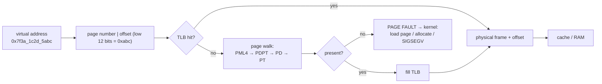
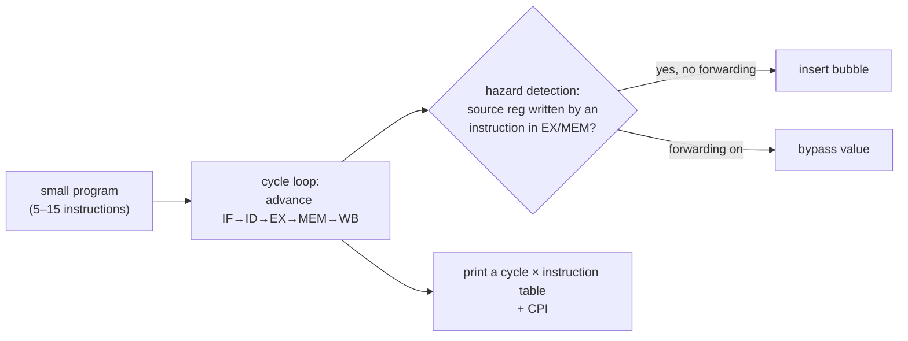

# Chapter 37 — Instruction Cycle, Pipelining, SIMD & Virtual Memory

> **Volume 1 — Computer Science Foundations** · [Contents](index.md) · ← [Chapter 36 — Binary, CPU, Registers, Cache & Memory Hierarchy](ch36-binary-cpu-registers-cache-and-memory-hierarchy.md) · Next → [Chapter 38 — OS: Processes, Threads, Scheduling, Synchronization & Deadlocks](ch38-os-processes-threads-scheduling-synchronization-and-deadlocks.md)

---

## Concept

Fetch-decode-execute; pipelining and hazards; SIMD (data parallelism); virtual memory and page tables.

**In one sentence:** a CPU runs instructions in an assembly line (pipeline) so several are in flight at once, does the same operation on many numbers with one instruction (SIMD), and gives every process the illusion of its own private memory through virtual addresses that hardware translates on the fly.

**Mental model — a laundromat.** Washing (fetch), drying (decode), folding (execute), putting away (write back). With one load at a time, each takes 4 hours. With an assembly line, a new load starts every hour, so 4 loads are in progress at once. A *hazard* is when load 2 needs a sock still in load 1's dryer: it must wait (a bubble). SIMD is a washer big enough for 8 shirts in one cycle.

**The instruction cycle**

| Stage | Classic 5-stage RISC | Does |
|-------|---------------------|------|
| IF | instruction fetch | read the instruction at PC |
| ID | decode / register read | work out the operation, read source registers |
| EX | execute | ALU computes, or computes an address |
| MEM | memory access | load or store |
| WB | write back | write the result to the destination register |

**Hazards — why the pipeline stalls**

| Type | Cause | Example | Fix |
|------|-------|---------|-----|
| **Data** | an instruction needs a result not yet written | `ADD r1, r2, r3` then `SUB r4, r1, r5` | forwarding/bypassing; stall |
| **Control** | a branch: which instruction comes next? | `if (x > 0)` | branch prediction (>95% accurate); speculative execution |
| **Structural** | two instructions need the same hardware in one cycle | one memory port for fetch and load | more hardware; separate I/D caches |

A mispredicted branch flushes the pipeline — ~15–20 cycles lost on modern CPUs. That's why sorted data can make an `if` inside a loop several times faster.

**SIMD (single instruction, multiple data)**

| ISA | Register width | 32-bit floats per instruction |
|-----|---------------:|:-:|
| SSE | 128 bits | 4 |
| AVX2 | 256 bits | 8 |
| AVX-512 | 512 bits | 16 |
| ARM NEON / SVE | 128 / up to 2048 bits | 4 / scalable |

You rarely write SIMD by hand: NumPy, BLAS, compilers (auto-vectorization), and libraries like `simdjson` use it for you. GPUs push the same idea to thousands of lanes.

**Virtual memory**

* Each process sees its own flat address space (0 … 2⁴⁸ on x86-64).
* Memory is split into **pages** (usually 4 KB; "huge pages" are 2 MB or 1 GB).
* A per-process **page table** maps virtual page → physical frame, plus permission bits (read/write/execute, user/kernel).
* The **TLB** (translation lookaside buffer) caches recent translations. A TLB miss triggers a *page walk* through 4–5 levels of table.
* A **page fault** happens when a page isn't mapped: the OS loads it (from disk or swap), allocates it on first touch, or kills the process (segfault).

Benefits: isolation (one process can't read another's memory), overcommit and lazy allocation, memory-mapped files, shared libraries mapped once, copy-on-write `fork()`.

---

## Prereqs

* [Chapter 36 — Binary, CPU, Registers, Cache & Memory Hierarchy](ch36-binary-cpu-registers-cache-and-memory-hierarchy.md)

---

## Diagram

**A 5-stage pipeline with a data-hazard bubble**

```
 cycle:            1    2    3    4    5    6    7    8
 I1 ADD r1,r2,r3   IF   ID   EX   MEM  WB
 I2 SUB r4,r1,r5        IF   ID   ░░   EX   MEM  WB         ← needs r1: one bubble
 I3 AND r6,r7,r8             IF   ░░   ID   EX   MEM  WB
                                  ▲ stall (forwarding from EX/MEM removes most of these)
 without a pipeline: 3 instructions × 5 cycles = 15 cycles; with it: ~8
```

**SIMD: one instruction, 8 lanes**

```
 scalar: 8 separate ADDs            AVX2: one VADDPS
 a0+b0  a1+b1  …  a7+b7             ┌──┬──┬──┬──┬──┬──┬──┬──┐
                                    │a0│a1│a2│a3│a4│a5│a6│a7│  ymm0
                                    ├──┼──┼──┼──┼──┼──┼──┼──┤  +
                                    │b0│b1│b2│b3│b4│b5│b6│b7│  ymm1
                                    ├──┼──┼──┼──┼──┼──┼──┼──┤  =
                                    │c0│c1│c2│c3│c4│c5│c6│c7│  ymm2
                                    └──┴──┴──┴──┴──┴──┴──┴──┘
```

**Virtual → physical address translation**



---

## Example

```python
import numpy as np, time
a = np.random.rand(10_000_000).astype(np.float32)
b = np.random.rand(10_000_000).astype(np.float32)

t = time.perf_counter(); c = [x + y for x, y in zip(a[:1_000_000], b[:1_000_000])]; slow = time.perf_counter() - t
t = time.perf_counter(); c = a + b; fast = time.perf_counter() - t    # vectorized, uses SIMD
print(f"python loop (1M): {slow:.3f}s   numpy (10M): {fast:.3f}s")
```

```python
# Branch prediction: the same work on sorted vs shuffled data (a classic)
import random, time
data = [random.randint(0, 255) for _ in range(2_000_000)]
for label, xs in (("shuffled", data), ("sorted", sorted(data))):
    t = time.perf_counter()
    s = 0
    for x in xs:
        if x >= 128:
            s += x
    print(label, round(time.perf_counter() - t, 3))
# The gap is small in Python (interpreter overhead hides it) but 2–6× in C/Rust.
```

```bash
getconf PAGESIZE                             # 4096
cat /proc/self/maps | head                   # this process's virtual memory regions
perf stat -e branch-misses,dTLB-load-misses ./app   # count mispredictions and TLB misses
grep -o -w 'avx2\|avx512f' /proc/cpuinfo | sort -u   # which SIMD sets this CPU supports
```

---

## Exercises

1. Identify a pipeline hazard in a code snippet.

   ```
   LW   r1, 0(r2)     # load from memory
   ADD  r3, r1, r4    # uses r1 immediately
   BEQ  r3, r0, done
   ```

   <details><summary>Solution</summary>Data hazard (load-use): ADD needs r1, which arrives only after LW's MEM stage — even forwarding leaves a 1-cycle bubble. Control hazard: BEQ's outcome is unknown until EX, so the CPU predicts. Compilers reorder independent instructions into the load-delay slot to hide the bubble.</details>

2. Explain how a TLB miss resolves.

   <details><summary>Solution</summary>The hardware page walker reads the page-table levels (4 or 5 memory accesses, often cached) to find the frame. If the entry is valid, it fills the TLB and the access retries (tens of cycles). If the page isn't present, a page fault traps into the kernel, which maps the page (possibly reading it from disk: µs to ms) or signals SIGSEGV.</details>

3. Why does `fork()` of a 10 GB process return almost instantly?

   <details><summary>Solution</summary>Copy-on-write: the child gets a copy of the page tables pointing to the same physical pages, all marked read-only. Only when either process writes a page does the kernel copy that one page.</details>

---

## Mini project

**A 5-stage pipeline simulator that shows stalls/bubbles on a small program.**



**Steps**

1. Represent each instruction with `op, dst, src1, src2`; keep five pipeline "latches".
2. Each cycle, move instructions forward; detect RAW (read-after-write) dependencies against instructions still in the pipeline.
3. Option A: stall until write-back. Option B: forwarding from EX/MEM, with a stall only for load-use.
4. Branches: predict not-taken; on a taken branch, flush and count the penalty.
5. Print the classic diagram table and the CPI (cycles per instruction) for both options.

**Done when:** your table matches a hand-drawn diagram for 3 test programs, and forwarding visibly lowers the CPI.

---

## Open source

* [`verilator/verilator`](https://github.com/verilator/verilator) (simulate real HDL) — compiles Verilog into fast C++; pair it with an open RISC-V core such as PicoRV32 or the Berkeley `riscv-sodor` educational 5-stage cores to watch a real pipeline.

---

## Interview

1. **"What is a pipeline hazard?"**
   <details><summary>Answer</summary>A situation where the next instruction can't safely enter its stage in the next cycle. Data hazards: it needs a result not yet produced. Control hazards: it's unknown which instruction comes after a branch. Structural hazards: two instructions need the same hardware. Fixes include forwarding, stalls, branch prediction with speculation, and duplicated hardware.</details>

2. **"Why does virtual memory exist?"**
   <details><summary>Answer</summary>Isolation and protection (processes can't touch each other's or the kernel's memory), a simple private address space for every program, efficient sharing (libraries, copy-on-write fork, shared memory), lazy allocation and overcommit, memory-mapped files, and swapping to disk when RAM runs out.</details>

---

## Checklist

- [ ] trace fetch-decode-execute
- [ ] name the three hazard types
- [ ] explain page faults

---

> [Contents](index.md) · ← [Chapter 36 — Binary, CPU, Registers, Cache & Memory Hierarchy](ch36-binary-cpu-registers-cache-and-memory-hierarchy.md) · Next → [Chapter 38 — OS: Processes, Threads, Scheduling, Synchronization & Deadlocks](ch38-os-processes-threads-scheduling-synchronization-and-deadlocks.md)
