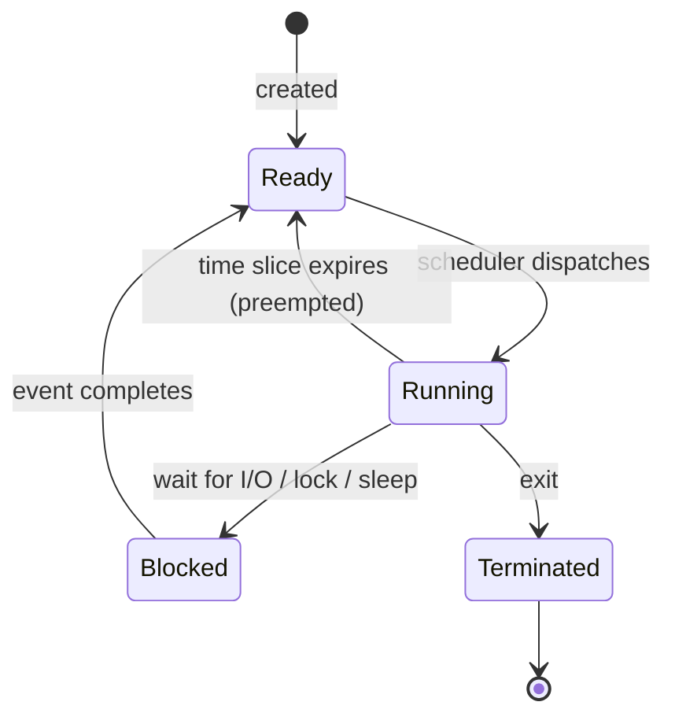
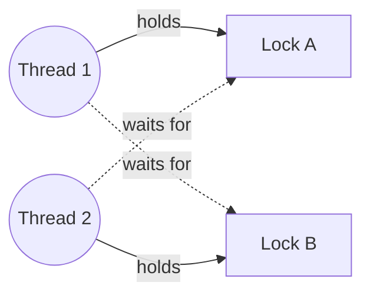
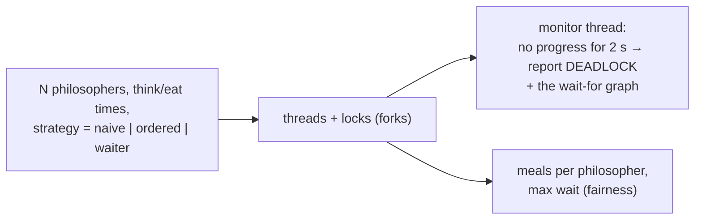

# Chapter 38 — OS: Processes, Threads, Scheduling, Synchronization & Deadlocks

> **Volume 1 — Computer Science Foundations** · [Contents](index.md) · ← [Chapter 37 — Instruction Cycle, Pipelining, SIMD & Virtual Memory](ch37-instruction-cycle-pipelining-simd-and-virtual-memory.md) · Next → [Chapter 39 — OS: Memory Management, File Systems, System Calls & IPC](ch39-os-memory-management-file-systems-system-calls.md)

---

## Concept

Process/thread lifecycle, CPU scheduling algorithms, synchronization primitives (mutexes, semaphores, condvars), and deadlock (four conditions).

**In one sentence:** the OS scheduler shares a few CPU cores among thousands of threads by switching quickly between them, and synchronization primitives stop threads from corrupting shared data — at the risk of deadlock if they wait on each other in a circle.

**Mental model — a single-lane bridge.** Cars (threads) take turns crossing (CPU time). A traffic light (the scheduler) decides who goes next. A toll booth that admits one car at a time is a mutex; a parking lot with 10 spaces is a semaphore. Deadlock is four cars at a four-way stop, each waiting for the car on its right.

**Thread states**

| State | Meaning |
|-------|---------|
| New | created, not yet runnable |
| Ready | could run; waiting for a CPU |
| Running | on a CPU now |
| Blocked / waiting | waiting for I/O, a lock, a timer, or a condition |
| Terminated | finished |

**Scheduling algorithms**

| Algorithm | Idea | Good | Bad |
|-----------|------|------|-----|
| FCFS | run in arrival order to completion | simple | one long job blocks everyone (convoy effect) |
| SJF / SRTF | shortest job next | minimal average wait | needs to know job length; starves long jobs |
| Round robin | each gets a time slice (e.g. 10 ms), then goes to the back | fair, responsive | too many switches if the slice is tiny |
| Priority | highest priority first | important work first | starvation; *priority inversion* |
| MLFQ | multiple queues; demote CPU hogs, keep interactive jobs high | adapts automatically | tuning |
| **CFS** (Linux 2.6.23–6.5) | pick the thread with the least *virtual runtime*, kept in a red-black tree; weights come from `nice` | fair over time, O(log n) | latency tuning |
| **EEVDF** (Linux 6.6+) | fairness plus "earliest eligible virtual deadline" | better latency for short tasks | newer |

A **context switch** saves one thread's registers and loads another's: ~1–5 µs direct cost, plus cache and TLB pollution.

**Synchronization primitives**

| Primitive | Semantics | Use |
|-----------|-----------|-----|
| Mutex | one owner at a time; the owner unlocks | protect a critical section |
| RW lock | many readers *or* one writer | read-heavy shared data |
| Semaphore | a counter; `wait` decrements (blocks at 0), `signal` increments | limit concurrency to N; signal between threads |
| Condition variable | wait until a predicate becomes true, releasing the mutex while waiting | producer–consumer queues |
| Atomic ops | CPU-level indivisible read-modify-write (CAS, fetch-add) | counters, lock-free structures |
| Spinlock | busy-wait loop | very short sections in kernels; avoid in user code |

**Deadlock: the four Coffman conditions** — all four must hold, so break any one:

| Condition | Meaning | How to break it |
|-----------|---------|-----------------|
| Mutual exclusion | resources can't be shared | use lock-free or read-only sharing |
| Hold and wait | hold one lock while waiting for another | acquire all locks at once, or none |
| No preemption | locks can't be taken away | `try_lock` with timeout, then back off and retry |
| **Circular wait** | T1 waits for T2 waits … for T1 | **always acquire locks in one global order** ← the usual fix |

---

## Prereqs

* [Chapter 13 — Concurrency: Threads, Processes, Async, Futures & Coroutines](ch13-concurrency-threads-processes-async-futures-and-coroutines.md)
* [Chapter 37 — Instruction Cycle, Pipelining, SIMD & Virtual Memory](ch37-instruction-cycle-pipelining-simd-and-virtual-memory.md)

---

## Diagram

**Ready / running / blocked state machine**



**Round robin, time slice = 2**

```
 jobs: A needs 5, B needs 3, C needs 1
 time: 0  1  2  3  4  5  6  7  8
       A  A  B  B  C  A  A  B  A
 finish: C at 5, B at 8, A at 9
```

**A deadlock wait-for cycle**



```
 T1: lock(A) … lock(B)        T2: lock(B) … lock(A)
       ✓           ⏳               ✓           ⏳     ← forever
 fix: both threads lock A before B (a global order) → no cycle is possible
```

**Dining philosophers**

```
        P0
     f4    f0          5 philosophers, 5 forks.
   P4        P1        Each grabs the LEFT fork, then the RIGHT.
     f3    f1          If all grab left at once → everyone waits → deadlock.
   P3   f2   P2        Fix: the last philosopher grabs RIGHT first (lock ordering),
                       or allow at most 4 at the table (a semaphore).
```

---

## Example

```python
import threading

class Account:
    _ids = iter(range(10**9))
    def __init__(self, balance):
        self.id = next(Account._ids)
        self.balance = balance
        self.lock = threading.Lock()

def transfer_deadlocky(src, dst, amt):
    with src.lock:                         # T1: A→B locks A then B
        with dst.lock:                     # T2: B→A locks B then A → deadlock risk
            src.balance -= amt; dst.balance += amt

def transfer(src, dst, amt):
    first, second = sorted((src, dst), key=lambda a: a.id)   # global lock order
    with first.lock, second.lock:
        src.balance -= amt; dst.balance += amt

a, b = Account(100), Account(100)
ts = [threading.Thread(target=transfer, args=(a, b, 1)) for _ in range(500)] + \
     [threading.Thread(target=transfer, args=(b, a, 1)) for _ in range(500)]
for t in ts: t.start()
for t in ts: t.join()
print(a.balance, b.balance)                # 100 100, no deadlock
```

```python
# Producer–consumer with a condition variable
import collections
buf, cv, CAP = collections.deque(), threading.Condition(), 5

def produce(x):
    with cv:
        cv.wait_for(lambda: len(buf) < CAP)    # releases the lock while waiting
        buf.append(x); cv.notify_all()

def consume():
    with cv:
        cv.wait_for(lambda: buf)               # always wait on a predicate (spurious wakeups)
        x = buf.popleft(); cv.notify_all()
        return x

sem = threading.BoundedSemaphore(3)            # at most 3 threads in a section
with sem:
    pass
```

---

## Exercises

1. Detect the deadlock in a lock-ordering bug and fix it.

   <details><summary>Solution</summary><code>transfer_deadlocky(a, b)</code> and <code>transfer_deadlocky(b, a)</code> at the same time: each holds one lock and waits for the other (circular wait). Fix by ordering locks by a stable key (account ID), as in <code>transfer</code>. Detect in production with thread dumps (<code>py-spy dump</code>, <code>jstack</code>, <code>gdb thread apply all bt</code>).</details>

2. Compare round-robin vs CFS scheduling.

   <details><summary>Solution</summary>Round robin gives every runnable thread an equal fixed slice in a FIFO rotation, with no memory of past usage. CFS tracks each thread's weighted virtual runtime and always runs the one that has had the least, so threads that slept (interactive ones) get priority when they wake. It's fair over time with weights from <code>nice</code>, using a red-black tree for O(log n) picks.</details>

3. What is priority inversion? Give the Mars Pathfinder example.

   <details><summary>Solution</summary>A low-priority task holds a lock that a high-priority task needs, while a medium-priority task preempts the low one, so the high one waits indefinitely. On Pathfinder (1997) this triggered watchdog resets. The fix, priority inheritance, temporarily raises the lock holder's priority. It was enabled remotely.</details>

---

## Mini project

**A simulator of the dining philosophers with deadlock vs a lock-ordering fix.**



**Steps**

1. Forks are `threading.Lock`s; a philosopher loops think → pick left → pick right → eat → release.
2. Add a small `sleep` between picking forks so the naive version deadlocks reliably.
3. A watchdog detects a deadlock (no meals for 2 s) and prints who holds and who waits for what.
4. Fix 1: global order (lower-numbered fork first). Fix 2: a "waiter" semaphore allowing N−1 at the table.
5. Compare throughput and fairness (meal counts) for each fix.

**Done when:** the naive version deadlocks within seconds, both fixes run for a minute without deadlock, and you can explain which Coffman condition each fix breaks.

---

## Open source

* [`torvalds/linux`](https://github.com/torvalds/linux) scheduler (`kernel/sched`) — `kernel/sched/fair.c` (CFS/EEVDF: `pick_next_task_fair`, `update_curr`) and `kernel/locking/mutex.c`; `Documentation/scheduler/sched-design-CFS.rst` explains the design.

---

## Interview

1. **"What are the four Coffman conditions?"**
   <details><summary>Answer</summary>Mutual exclusion, hold-and-wait, no preemption, and circular wait. All four are necessary for deadlock, so preventing any one prevents it. In practice: impose a global lock order (no circular wait), or use timeouts with back-off (a form of preemption).</details>

2. **"Mutex vs semaphore?"**
   <details><summary>Answer</summary>A mutex has one owner who must release it; it protects a critical section. A semaphore is a counter any thread can signal; it limits access to N (a counting semaphore) or signals events between threads. A binary semaphore resembles a mutex but has no ownership, so it can't do priority inheritance or detect wrong-thread unlocks.</details>

---

## Checklist

- [ ] lock in a consistent order
- [ ] avoid busy-waiting
- [ ] name the deadlock conditions

---

> [Contents](index.md) · ← [Chapter 37 — Instruction Cycle, Pipelining, SIMD & Virtual Memory](ch37-instruction-cycle-pipelining-simd-and-virtual-memory.md) · Next → [Chapter 39 — OS: Memory Management, File Systems, System Calls & IPC](ch39-os-memory-management-file-systems-system-calls.md)
