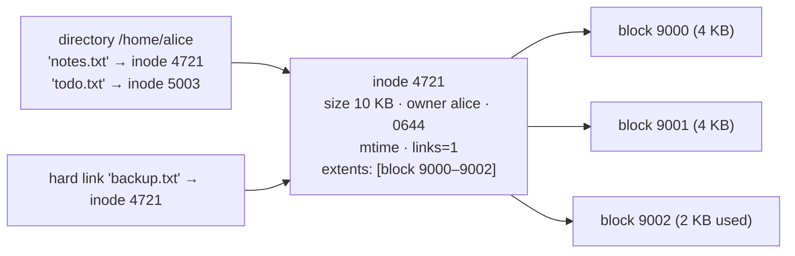
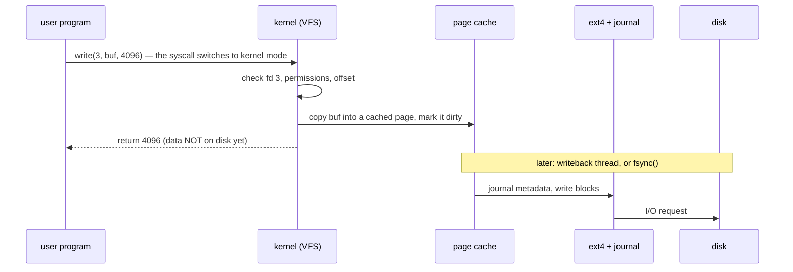
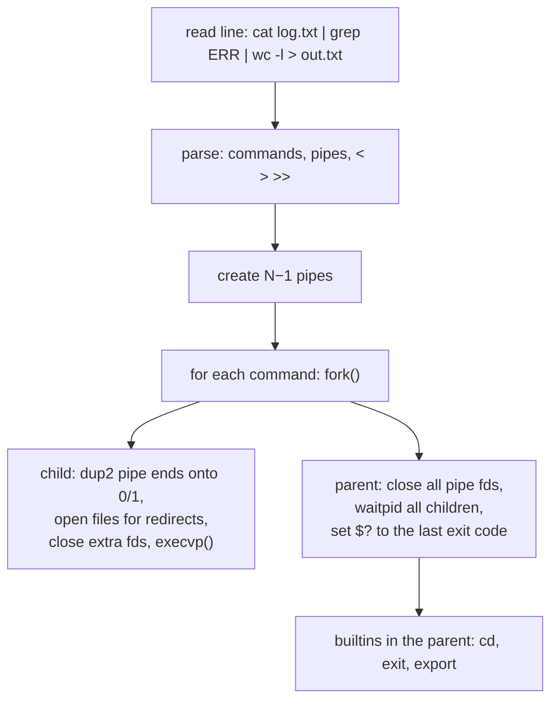

# Chapter 39 — OS: Memory Management, File Systems, System Calls & IPC

> **Volume 1 — Computer Science Foundations** · [Contents](index.md) · ← [Chapter 38 — OS: Processes, Threads, Scheduling, Synchronization & Deadlocks](ch38-os-processes-threads-scheduling-synchronization-and-deadlocks.md) · Next → [Chapter 40 — Networking Fundamentals: OSI, TCP/IP, IP, Ports, DNS & NAT](ch40-networking-fundamentals-osi-tcp-ip-ip-ports.md)

---

## Concept

Address spaces and paging; file systems (inodes, journals); the syscall boundary; IPC (pipes, sockets, shared memory, signals).

**In one sentence:** the kernel owns the hardware, so programs ask it for everything — memory, files, network, other processes — through system calls, and it answers with abstractions: virtual address spaces, files made of inodes and blocks, and pipes and sockets for processes to talk.

**Mental model — a government office.** User programs are citizens; the kernel is the office behind a counter. You can't walk into the vault (hardware) yourself. You fill in a form (a system call), the clerk checks your permissions, does the work, and hands back a result or an error code. File descriptors are ticket numbers. Pipes are pneumatic tubes between two desks.

**A process address space (x86-64 Linux, simplified)**

| Region | Holds | Grows |
|--------|-------|-------|
| Kernel space | the kernel (not accessible from user mode) | — |
| Stack | frames, locals, return addresses | down ↓ |
| Memory-mapped area | shared libraries, `mmap`'d files, large `malloc`s | — |
| Heap | `malloc`/`new` (via `brk`/`mmap`) | up ↑ |
| BSS | zero-initialized globals | — |
| Data | initialized globals | — |
| Text | machine code (read-only, executable) | — |

**File systems**

| Concept | Meaning |
|---------|---------|
| Inode | metadata for one file: size, owner, permissions, timestamps, and pointers to data blocks — **not the name** |
| Directory | a file mapping names → inode numbers |
| Hard link | another name for the same inode; the file is deleted when the link count hits 0 |
| Symlink | a small file containing a path |
| Blocks | fixed-size data chunks (4 KB); extents describe contiguous runs |
| Journal | a write-ahead log of metadata (and optionally data) changes, so a crash never leaves the FS inconsistent (ext4, XFS); copy-on-write FSs (btrfs, ZFS) never overwrite in place |
| VFS | a kernel layer giving every FS the same `open/read/write` interface |

**System calls** — the only door from user mode to kernel mode. The CPU switches privilege level (`syscall` instruction), the kernel runs, and control returns with a result (negative = `errno`). Cost: ~100 ns to ~1 µs, so batch work (buffered I/O, `readv`, `io_uring`).

| Category | Syscalls |
|----------|----------|
| Files | `open`, `read`, `write`, `close`, `lseek`, `fstat`, `fsync`, `rename` |
| Processes | `fork`, `execve`, `wait4`, `exit`, `kill` |
| Memory | `mmap`, `munmap`, `brk`, `mprotect` |
| Network | `socket`, `bind`, `listen`, `accept`, `connect`, `sendto`, `recvfrom` |
| Events | `poll`, `epoll_wait`, `io_uring_enter` |

**IPC options**

| Mechanism | Direction | Between | Speed | Use |
|-----------|-----------|---------|-------|-----|
| Pipe `\|` | one-way byte stream | parent/child | fast | shell pipelines |
| Named pipe (FIFO) | one-way | any local processes | fast | simple local hand-offs |
| Unix domain socket | two-way, stream or datagram | local processes | very fast | Docker, Postgres, systemd |
| TCP socket | two-way | across machines | network | everything networked |
| Shared memory + a lock | shared bytes | local processes | **fastest** (no copies) | databases, video, ML data loaders |
| Signals | tiny notifications | any | — | stop, reload, child exited |
| Message queues | messages | local | medium | POSIX mq, rarely used now |

---

## Prereqs

* [Chapter 38 — OS: Processes, Threads, Scheduling, Synchronization & Deadlocks](ch38-os-processes-threads-scheduling-synchronization-and-deadlocks.md)

---

## Diagram

**Process address-space layout**

```
 0xFFFF_FFFF_FFFF_FFFF ┌──────────────────────────┐
                       │ kernel space             │  (no access from user mode)
 0x7FFF_FFFF_FFFF      ├──────────────────────────┤
                       │ stack            ↓       │  main → f → g frames
                       │                          │
                       │ mmap: libc.so, files ... │
                       │                          │
                       │ heap             ↑       │  malloc'd objects
                       ├──────────────────────────┤
                       │ BSS  (zeroed globals)    │
                       │ data (initialized)       │
                       │ text (code, r-x)         │
 0x0000_0040_0000      └──────────────────────────┘
 0x0 — unmapped, so a NULL dereference segfaults
```

**Inode → blocks mapping**



**What happens on `write(fd, buf, n)`**



**A pipe between two processes: `ls | wc -l`**

```
  shell: pipe() → fds [r=3, w=4]; fork twice
  ┌──────────┐  stdout = fd 4   ┌───────────────┐   stdin = fd 3   ┌──────────┐
  │   ls     │ ───────────────► │ kernel buffer │ ───────────────► │  wc -l   │
  └──────────┘                  │   (64 KB)     │                  └──────────┘
                                └───────────────┘
  writer blocks when full; reader blocks when empty; EOF when all write ends close
```

---

## Example

```bash
strace -e trace=openat,read,write,close cat hello.txt
# openat(AT_FDCWD, "hello.txt", O_RDONLY) = 3
# read(3, "hi\n", 131072)                 = 3
# write(1, "hi\n", 3)                     = 3
# read(3, "", 131072)                     = 0      ← EOF
# close(3)                                = 0
strace -c python -c "print(1)"            # count syscalls by type
ls -i notes.txt; stat notes.txt           # inode number, links, blocks
cat /proc/$$/maps                         # the address space of this shell
```

```python
import os

r, w = os.pipe()
pid = os.fork()                           # Unix only
if pid == 0:                              # child: producer
    os.close(r)
    for i in range(5):
        os.write(w, f"item {i}\n".encode())
    os.close(w)                           # closing the write end → EOF for the reader
    os._exit(0)
else:                                     # parent: consumer
    os.close(w)
    with os.fdopen(r) as f:
        for line in f:
            print("got", line.strip())
    os.waitpid(pid, 0)
```

```python
from multiprocessing import shared_memory
import numpy as np
shm = shared_memory.SharedMemory(create=True, size=8 * 1_000_000)
arr = np.ndarray((1_000_000,), dtype=np.float64, buffer=shm.buf)   # no copy
arr[:] = 1.0                        # another process can attach by shm.name
shm.close(); shm.unlink()
```

---

## Exercises

1. Trace the syscalls of `cat file`.

   <details><summary>Solution</summary>Run <code>strace cat file</code>. After the startup noise (<code>execve</code>, <code>mmap</code> of libc, <code>brk</code>) you see <code>openat</code> → fd 3, a loop of <code>read(3, …)</code> + <code>write(1, …)</code>, a final <code>read</code> returning 0 (EOF), and <code>close</code>. Newer coreutils may use <code>copy_file_range</code> or <code>sendfile</code> to avoid copying through user space.</details>

2. Implement producer-consumer with a pipe.

   <details><summary>Solution</summary>See the <code>os.pipe</code> + <code>fork</code> example. Key rules: each side closes the end it doesn't use (or the reader never sees EOF); writes of ≤ <code>PIPE_BUF</code> (4096) bytes are atomic; the kernel buffer gives backpressure for free.</details>

3. You delete a 10 GB log file but `df` shows no free space. Why?

   <details><summary>Solution</summary>A running process still has it open. Deleting removes the name (the link count drops to 0), but the inode and blocks are freed only when the last file descriptor closes. Find it with <code>lsof +L1</code>, then restart the process or truncate via <code>/proc/&lt;pid&gt;/fd/&lt;n&gt;</code>.</details>

---

## Mini project

**A mini shell that forks, pipes, and redirects I/O.**



**Steps**

1. Read a line, split on `|`, and parse `<`, `>`, `>>` per command (use `shlex.split` for quoting).
2. Create pipes; fork each stage; in the child, `os.dup2` the right fds onto stdin/stdout, close the rest, and `os.execvp`.
3. The parent closes every pipe fd (or readers hang forever), then `waitpid`s all children.
4. Built-ins that must run in the parent: `cd`, `exit`, `export`.
5. Handle Ctrl+C: the shell ignores SIGINT; children restore the default.

**Done when:** `ls -l | grep py | sort -k5 -n > out.txt` works exactly like Bash, and `strace -f` shows the expected `pipe`/`dup2`/`execve` sequence.

---

## Open source

* [`torvalds/linux`](https://github.com/torvalds/linux) (`fs/`, `ipc/`) — `fs/read_write.c` (`ksys_write`), `fs/pipe.c`, `fs/ext4/inode.c`, `mm/mmap.c`; `man 2 syscalls` lists every syscall.

---

## Interview

1. **"User space vs kernel space?"**
   <details><summary>Answer</summary>Two CPU privilege levels. User space runs applications with restricted instructions and only their own virtual memory. Kernel space runs the OS with full hardware access. Crossing the line happens through system calls, interrupts, and exceptions (like page faults), each with a controlled entry point and permission checks. This protects the system from buggy or malicious programs.</details>

2. **"What happens on `write()`?"**
   <details><summary>Answer</summary>The libc wrapper executes the <code>syscall</code> instruction and the CPU enters kernel mode. The kernel validates the fd and buffer, dispatches through the VFS to the file system, copies the data into the page cache, marks the pages dirty, and returns the byte count. The data reaches disk later, via background writeback or <code>fsync</code> — which is why a successful <code>write</code> isn't durable on its own.</details>

---

## Checklist

- [ ] draw an address space
- [ ] explain an inode
- [ ] build a pipeline with pipes

---

> [Contents](index.md) · ← [Chapter 38 — OS: Processes, Threads, Scheduling, Synchronization & Deadlocks](ch38-os-processes-threads-scheduling-synchronization-and-deadlocks.md) · Next → [Chapter 40 — Networking Fundamentals: OSI, TCP/IP, IP, Ports, DNS & NAT](ch40-networking-fundamentals-osi-tcp-ip-ip-ports.md)
