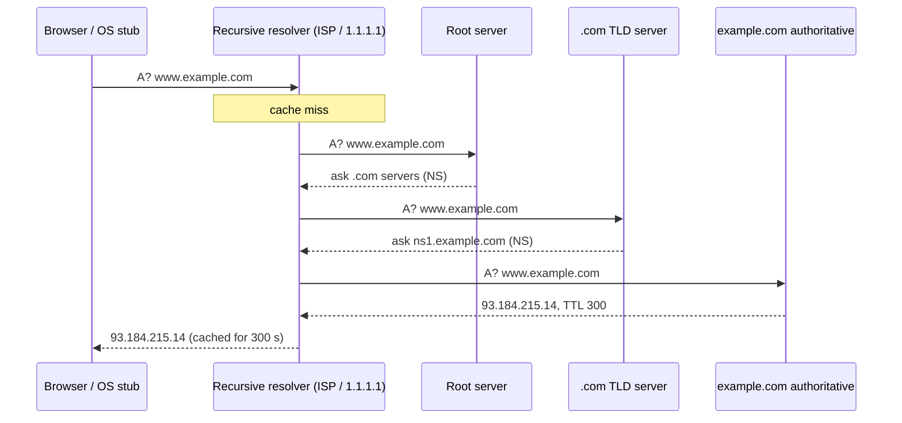
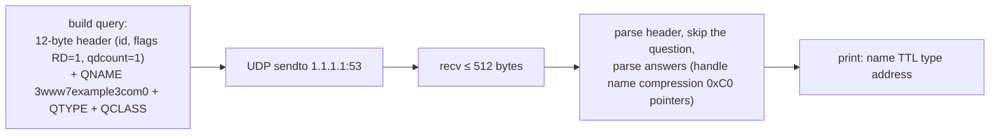

# Chapter 40 — Networking Fundamentals: OSI, TCP/IP, IP, Ports, DNS & NAT

> **Volume 1 — Computer Science Foundations** · [Contents](index.md) · ← [Chapter 39 — OS: Memory Management, File Systems, System Calls & IPC](ch39-os-memory-management-file-systems-system-calls.md) · Next → [Chapter 41 — Transport & Security: TCP, UDP, QUIC, TLS & HTTPS](ch41-transport-and-security-tcp-udp-quic-tls.md)

---

## Concept

Layered models, IP addressing/subnets, ports, DNS resolution, and NAT.

**In one sentence:** networks are built in layers — each layer wraps the one above it in its own envelope — IP addresses find the machine, ports find the program on it, DNS turns names into addresses, and NAT lets a whole house share one public address.

**Mental model — sending a letter.** Your letter (data) goes in an envelope addressed to an apartment number (the port) in a building (the IP address). The post office (routers) reads only the building address and forwards it hop by hop. The phone book (DNS) turns "Alice's Bakery" into a street address. Your building's front desk (NAT) sends all residents' mail out under the building's single address and routes replies back to the right apartment.

**OSI vs TCP/IP**

| OSI # | OSI layer | TCP/IP layer | Unit | Examples | Job |
|:-:|-----------|--------------|------|----------|-----|
| 7 | Application | Application | message | HTTP, DNS, SSH, SMTP | what the app says |
| 6 | Presentation | ↑ | | TLS, encoding | format, encryption |
| 5 | Session | ↑ | | (TLS sessions, RPC) | dialogue control |
| 4 | Transport | Transport | segment / datagram | TCP, UDP, QUIC | process-to-process, ports, reliability |
| 3 | Network | Internet | packet | IP, ICMP | host-to-host across networks (routing) |
| 2 | Data link | Link | frame | Ethernet, Wi-Fi, ARP | to the next hop on the local network (MAC addresses) |
| 1 | Physical | ↓ | bits | copper, fiber, radio | signals |

"L4 load balancer" and "L7 firewall" refer to these OSI numbers.

**IP addressing**

| Concept | Example | Meaning |
|---------|---------|---------|
| IPv4 | `192.168.1.10` | 32 bits, ~4.3 billion addresses |
| IPv6 | `2001:db8::1` | 128 bits; `::` collapses runs of zeros |
| CIDR | `192.168.1.0/24` | the first 24 bits are the network; 8 bits for hosts |
| Hosts in a /24 | 256 − 2 = 254 | minus the network address (.0) and broadcast (.255) |
| Private ranges (RFC 1918) | `10.0.0.0/8`, `172.16.0.0/12`, `192.168.0.0/16` | not routed on the internet |
| Loopback | `127.0.0.1`, `::1` | this machine |
| Socket | `192.168.1.10:443` | IP + port = one endpoint |

**Ports:** 16-bit numbers (0–65535). Well-known: 22 SSH, 53 DNS, 80 HTTP, 443 HTTPS, 5432 Postgres, 6379 Redis. Clients use *ephemeral* ports (Linux default 32768–60999). A TCP connection is identified by the **4-tuple** (src IP, src port, dst IP, dst port).

**Port exhaustion** — one client IP talking to one server IP:port has only ~28k ephemeral ports. Short-lived connections sit in `TIME_WAIT` for up to 60 s, so a busy proxy can run out and fail to connect. Fixes: connection pooling / keep-alive, more source IPs, widen `ip_local_port_range`, reuse `TIME_WAIT` sockets safely.

**DNS record types**

| Type | Maps | Example |
|------|------|---------|
| A / AAAA | name → IPv4 / IPv6 | `example.com → 93.184.215.14` |
| CNAME | alias → canonical name | `www → example.com` |
| MX | domain → mail server | |
| TXT | free text | SPF, domain verification |
| NS | zone → authoritative servers | |
| TTL | how long resolvers may cache it | 300 s |

**NAT** — a router rewrites private source addresses and ports to its public address and keeps a table to map replies back. It stretches IPv4 and blocks *unsolicited* inbound connections, but it is **not a firewall**, it breaks peer-to-peer (needing STUN/TURN), and it complicates logs and rate limiting (many users share one IP).

---

## Prereqs

None.

---

## Diagram

**OSI 7 layers next to TCP/IP 4 layers, with encapsulation**

```
  OSI                 TCP/IP             what gets wrapped (sending side)
 ┌───────────────┐   ┌─────────────┐
 │7 Application  │   │             │    [ HTTP data                         ]
 │6 Presentation │   │ Application │
 │5 Session      │   │             │
 ├───────────────┤   ├─────────────┤
 │4 Transport    │   │ Transport   │    [TCP hdr][ HTTP data               ]
 ├───────────────┤   ├─────────────┤
 │3 Network      │   │ Internet    │    [IP hdr][TCP hdr][ HTTP data       ]
 ├───────────────┤   ├─────────────┤
 │2 Data link    │   │ Link        │    [Eth][IP][TCP][ HTTP data ][Eth FCS]
 │1 Physical     │   │             │    01101001 …
 └───────────────┘   └─────────────┘
```

**A DNS resolution chain for `www.example.com`**



**A NAT table mapping private → public**

```
 home network 192.168.1.0/24                 router public IP 203.0.113.7
 laptop 192.168.1.10:51000 ──┐
 phone  192.168.1.23:51000 ──┼──► NAT ──► internet
                             │
   NAT table:
   inside                    outside                  remote
   192.168.1.10:51000   ↔   203.0.113.7:40001   ↔   142.250.1.1:443
   192.168.1.23:51000   ↔   203.0.113.7:40002   ↔   142.250.1.1:443
```

---

## Example

```bash
dig example.com A +short                 # 93.184.215.14
dig www.github.com +trace                # walk root → .com → github.com yourself
dig example.com MX
ip addr; ip route                        # your addresses; the default gateway
ss -tn state established                 # live TCP 4-tuples
curl -v https://example.com 2>&1 | head  # DNS → TCP connect → TLS → HTTP in one view
```

```python
import ipaddress
net = ipaddress.ip_network("192.168.1.0/24")
print(net.num_addresses, net.network_address, net.broadcast_address)   # 256 192.168.1.0 192.168.1.255
hosts = list(net.hosts()); print(hosts[0], hosts[-1], len(hosts))      # 192.168.1.1 192.168.1.254 254
for sub in net.subnets(new_prefix=26):                                  # four /26 subnets
    print(sub, "hosts:", sub.num_addresses - 2)
print(ipaddress.ip_address("10.3.4.5").is_private)                      # True

import socket
print(socket.getaddrinfo("example.com", 443, proto=socket.IPPROTO_TCP)[0][4])
```

---

## Exercises

1. Explain what happens between typing a URL and page load (DNS → TCP → TLS → HTTP).

   <details><summary>Solution</summary>(1) The browser parses the URL and checks its caches and HSTS. (2) DNS: browser/OS cache → recursive resolver → root → TLD → authoritative, returning an IP. (3) TCP 3-way handshake to IP:443 (or QUIC over UDP). (4) The TLS handshake verifies the certificate chain and agrees keys. (5) An HTTP request is sent, possibly through a CDN or load balancer. (6) The server responds; the browser parses HTML, discovers CSS/JS/images (more requests, often reusing the connection), builds DOM and CSSOM, lays out, and paints.</details>

2. Subnet a /24 and pick valid hosts.

   <details><summary>Solution</summary><code>10.0.5.0/24</code> into four /26s: <code>.0/26</code> (hosts .1–.62), <code>.64/26</code> (.65–.126), <code>.128/26</code> (.129–.190), <code>.192/26</code> (.193–.254). Each has 62 usable hosts: 64 minus the network and broadcast addresses.</details>

3. Why does `ping` work but `curl` to port 443 time out?

   <details><summary>Solution</summary>ICMP reaches the host, but TCP 443 is blocked (firewall or security group), nothing listens (that would be "connection refused", not a timeout), or a middlebox drops it. Check with <code>nc -vz host 443</code> and <code>ss -tlnp</code> on the server.</details>

---

## Mini project

**A small DNS client that resolves A/AAAA records over UDP.**



**Steps**

1. Encode the query with `struct.pack("!HHHHHH", id, 0x0100, 1, 0, 0, 0)` plus labels.
2. Send over UDP with a 2-second timeout; retry once.
3. Parse answers: type, class, TTL, rdlength, rdata; decode A (4 bytes) and AAAA (16 bytes) with `ipaddress`.
4. Handle compressed names (pointers starting with bits `11`) and CNAME chains.
5. Compare the output with `dig +short` for 10 domains.

**Done when:** your client matches `dig` for A, AAAA, and CNAME-chained names, and handles a timeout cleanly.

---

## Open source

* [`miekg/dns`](https://github.com/miekg/dns) — a complete DNS library in Go (used by CoreDNS); `msg.go` shows wire-format packing and name compression.
* [`curl/curl`](https://github.com/curl/curl) — `curl -v` and `--trace-time` show each phase of a connection; `lib/connect.c` implements Happy Eyeballs (racing IPv4 and IPv6).

---

## Interview

1. **"Walk me through DNS resolution."**
   <details><summary>Answer</summary>The app asks the OS stub resolver, which checks its cache and <code>/etc/hosts</code>, then asks a recursive resolver. On a miss, the resolver asks a root server (which refers it to the TLD), the TLD server (which refers it to the domain's authoritative servers), and the authoritative server, which returns the record with a TTL. Each layer caches answers for the TTL, which is why DNS changes take time to propagate.</details>

2. **"What does NAT solve (and not solve)?"**
   <details><summary>Answer</summary>It solves IPv4 scarcity: many private hosts share one public IP. As a side effect it hides internal topology and drops unsolicited inbound packets. It does not provide real security (use a firewall), breaks end-to-end connectivity (peer-to-peer and inbound services need port forwarding or STUN/TURN), and makes per-user rate limiting and logging harder. IPv6 removes the need for it.</details>

---

## Checklist

- [ ] name each layer's job
- [ ] resolve DNS by hand
- [ ] explain port exhaustion

---

> [Contents](index.md) · ← [Chapter 39 — OS: Memory Management, File Systems, System Calls & IPC](ch39-os-memory-management-file-systems-system-calls.md) · Next → [Chapter 41 — Transport & Security: TCP, UDP, QUIC, TLS & HTTPS](ch41-transport-and-security-tcp-udp-quic-tls.md)
