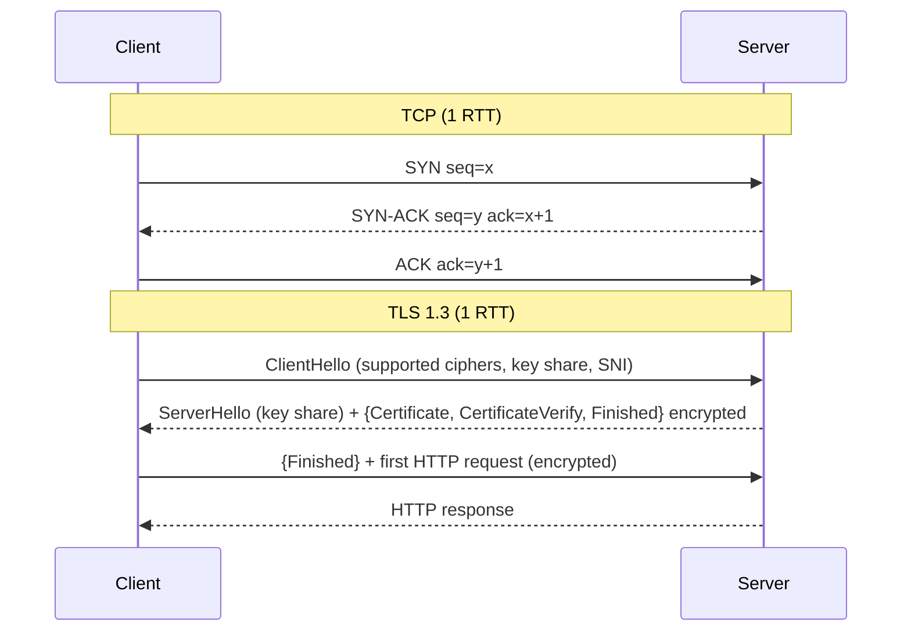
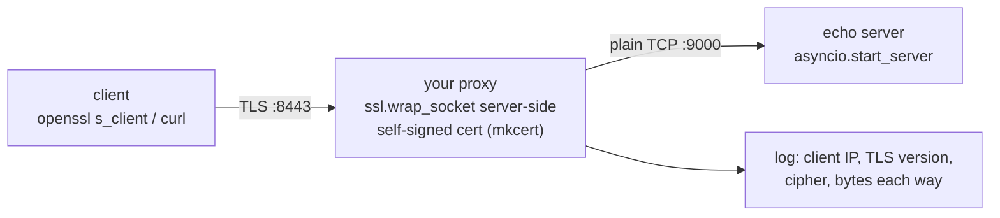

# Chapter 41 — Transport & Security: TCP, UDP, QUIC, TLS & HTTPS

> **Volume 1 — Computer Science Foundations** · [Contents](index.md) · ← [Chapter 40 — Networking Fundamentals: OSI, TCP/IP, IP, Ports, DNS & NAT](ch40-networking-fundamentals-osi-tcp-ip-ip-ports.md) · Next → [Chapter 42 — HTTP, REST, GraphQL & JSON-RPC](ch42-http-rest-graphql-and-json-rpc.md)

---

## Concept

TCP (handshake, reliability, flow/congestion control), UDP, QUIC; TLS handshake and HTTPS.

**In one sentence:** TCP turns an unreliable network into a reliable, ordered byte stream; UDP just sends datagrams and hopes; QUIC rebuilds TCP's reliability plus TLS encryption on top of UDP so connections start faster; and TLS makes any of them private and authenticated.

**Mental model — phone call vs postcards vs sealed courier.** TCP is a phone call: you dial and confirm ("hello?" "hello!"), then talk, and if something is garbled you ask again. UDP is postcards: fast and cheap, no confirmation, some get lost. TLS is a sealed envelope with a notarized ID card, so only the right person can read it, and you know who sent it.

**TCP vs UDP vs QUIC**

| | TCP | UDP | QUIC (HTTP/3) |
|-|-----|-----|---------------|
| Connection setup | 3-way handshake (1 RTT) + TLS (1 RTT) | none | 1 RTT including TLS 1.3; 0-RTT on resume |
| Reliable, ordered | yes (one stream) | no | yes, **per stream** |
| Head-of-line blocking | yes: one lost packet stalls everything | n/a | no across streams |
| Encryption | separate (TLS) | separate (DTLS) | built in, mandatory |
| Connection migration (Wi-Fi → 4G) | breaks (4-tuple changes) | n/a | survives (connection IDs) |
| Implemented in | the kernel | the kernel | user space libraries |
| Use for | web (HTTP/1.1, /2), databases, SSH | DNS, VoIP, games, video, metrics | HTTP/3, modern mobile and web |

**How TCP achieves reliability**

| Mechanism | Purpose |
|-----------|---------|
| Sequence numbers | order bytes; detect gaps and duplicates |
| ACKs (cumulative, plus SACK) | tell the sender what arrived |
| Retransmission on timeout / 3 duplicate ACKs | resend lost data |
| Checksums | detect corruption |
| **Flow control** (receive window) | don't overwhelm the *receiver* |
| **Congestion control** (cwnd: slow start, AIMD, CUBIC, BBR) | don't overwhelm the *network* |

**Congestion control in one picture:** start small and double each RTT (slow start) until loss or a threshold; then grow by 1 per RTT; on loss, cut sharply. BBR instead models bottleneck bandwidth and RTT directly.

**What TLS guarantees**

| Guarantee | How |
|-----------|-----|
| **Confidentiality** | symmetric encryption (AES-GCM, ChaCha20-Poly1305) with keys from an ephemeral (EC)DHE exchange → forward secrecy |
| **Integrity** | AEAD tags: tampering is detected |
| **Authentication** (of the server; optionally the client with mTLS) | an X.509 certificate chain signed by a trusted CA, and a matching hostname |
| Does **not** hide | IP addresses, timing, sizes, and (without ECH) the server name (SNI) |

---

## Prereqs

* [Chapter 40 — Networking Fundamentals: OSI, TCP/IP, IP, Ports, DNS & NAT](ch40-networking-fundamentals-osi-tcp-ip-ip-ports.md)

---

## Diagram

**TCP 3-way handshake and TLS 1.3 handshake**



**Round trips before the first byte of data**

```
 TCP + TLS 1.2   ├─TCP─┤├──TLS──┤├──TLS──┤ data      3 RTT
 TCP + TLS 1.3   ├─TCP─┤├──TLS──┤ data               2 RTT
 QUIC            ├─QUIC+TLS─┤ data                   1 RTT
 QUIC 0-RTT      data (on resume)                    0 RTT
 at 100 ms RTT, going from 3 RTT to 1 RTT saves 200 ms on every new connection
```

**Head-of-line blocking**

```
 TCP (HTTP/2): one byte stream   [s1][s2][s3 LOST][s1][s2] → everything waits for s3's resend
 QUIC:         separate streams  s1: ■■■■  s2: ■■■■  s3: ■ ✗ ■ (only s3 waits)
```

**A certificate chain**

```
 [Root CA]  (in your OS / browser trust store, self-signed)
     │ signs
 [Intermediate CA]  (sent by the server)
     │ signs
 [example.com leaf cert]  SAN: example.com, www.example.com · valid 90 days · public key
 client checks: each signature, expiry dates, hostname ∈ SAN, revocation (OCSP stapling)
```

---

## Example

```bash
# A TCP server and client in two terminals
nc -l 9000                       # server
nc localhost 9000                # client: type lines and watch them arrive

# Watch the handshake
sudo tcpdump -i lo -nn 'tcp port 9000 and (tcp[tcpflags] & (tcp-syn|tcp-fin) != 0)'
# … Flags [S]  … Flags [S.]  … Flags [.]   ← SYN, SYN-ACK, ACK

# Inspect a TLS chain and the negotiated parameters
openssl s_client -connect example.com:443 -servername example.com </dev/null 2>/dev/null \
  | grep -E 'subject=|issuer=|Protocol|Cipher'
curl -sv --http3 https://cloudflare.com -o /dev/null 2>&1 | grep -i 'http/3\|alpn'
ss -ti dst example.com          # live TCP info: rtt, cwnd, retransmits
```

```python
import socket, ssl
ctx = ssl.create_default_context()                 # verifies the chain and hostname by default
with socket.create_connection(("example.com", 443)) as raw:
    with ctx.wrap_socket(raw, server_hostname="example.com") as tls:
        print(tls.version(), tls.cipher()[0])      # TLSv1.3 TLS_AES_256_GCM_SHA384
        print(tls.getpeercert()["subject"])
        tls.sendall(b"GET / HTTP/1.1\r\nHost: example.com\r\nConnection: close\r\n\r\n")
        print(tls.recv(64))
```

---

## Exercises

1. Explain TCP's reliability mechanisms.

   <details><summary>Solution</summary>Every byte has a sequence number. The receiver ACKs the next byte it expects (plus SACK blocks for out-of-order data). The sender keeps unacked data and retransmits it on a timeout (RTO computed from measured RTT) or after 3 duplicate ACKs (fast retransmit). Checksums catch corruption. The receive window gives flow control, and the congestion window limits in-flight data to what the network can take.</details>

2. Walk through a TLS 1.3 handshake.

   <details><summary>Solution</summary>ClientHello: versions, cipher suites, a guessed (EC)DHE key share, and SNI. ServerHello: the chosen suite and its key share — both sides now derive handshake keys. The server sends, encrypted, its Certificate, a CertificateVerify signature proving it owns the private key, and Finished (a MAC over the transcript). The client verifies the chain, hostname, and signature, then sends Finished. Application keys are derived and data flows. One round trip.</details>

3. Why do video calls use UDP rather than TCP?

   <details><summary>Solution</summary>A late frame is useless, so retransmitting it (as TCP must) only adds delay and stalls later frames through head-of-line blocking. Over UDP (RTP/WebRTC) the app can drop or conceal lost packets and adapt its bitrate itself.</details>

---

## Mini project

**A minimal TCP echo server and a TLS-terminating proxy.**



**Steps**

1. Echo server with `asyncio.start_server`: read a line, write it back; handle many clients.
2. Generate a local CA and certificate with `mkcert` (or `openssl`).
3. The proxy accepts TLS on 8443, opens plain TCP to 9000, and pumps bytes both ways concurrently until either side closes.
4. Log TLS version, cipher, and byte counts per connection.
5. Test with `openssl s_client -connect localhost:8443`; then enable client certificates (mTLS) and reject clients without one.

**Done when:** 100 concurrent TLS clients echo correctly through the proxy, and a client without a certificate is refused in mTLS mode.

---

## Open source

* [`quinn-rs/quinn`](https://github.com/quinn-rs/quinn) (QUIC) — a QUIC implementation in Rust; the `quinn-proto` crate is a pure state machine with no I/O, great for reading.
* [`openssl/openssl`](https://github.com/openssl/openssl) — `ssl/statem/` holds the TLS handshake state machines; `openssl s_client` and `x509` are daily debugging tools.

---

## Interview

1. **"TCP vs UDP — when each?"**
   <details><summary>Answer</summary>TCP when you need every byte, in order: web, APIs, databases, file transfer, SSH. UDP when timeliness beats completeness or you want your own reliability logic: real-time audio and video, games, DNS, telemetry, and QUIC itself. UDP has no handshake and no head-of-line blocking, but also no congestion control unless you add it.</details>

2. **"Why is QUIC faster than TCP+TLS?"**
   <details><summary>Answer</summary>It merges the transport and TLS 1.3 handshakes into one round trip (0-RTT on resume), removes head-of-line blocking between streams, survives network changes through connection IDs, and lives in user space so it can improve quickly (better loss recovery and congestion control). The gains are largest on high-latency or lossy mobile networks.</details>

---

## Checklist

- [ ] draw the handshakes
- [ ] explain congestion control
- [ ] know TLS's guarantees

---

> [Contents](index.md) · ← [Chapter 40 — Networking Fundamentals: OSI, TCP/IP, IP, Ports, DNS & NAT](ch40-networking-fundamentals-osi-tcp-ip-ip-ports.md) · Next → [Chapter 42 — HTTP, REST, GraphQL & JSON-RPC](ch42-http-rest-graphql-and-json-rpc.md)
