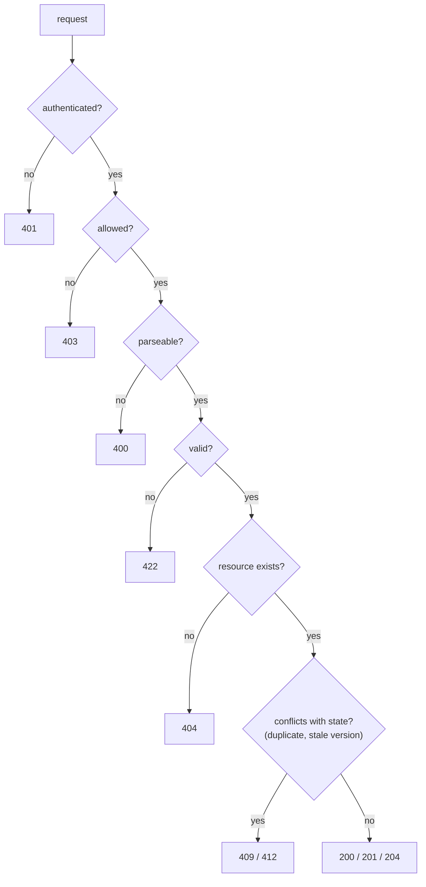
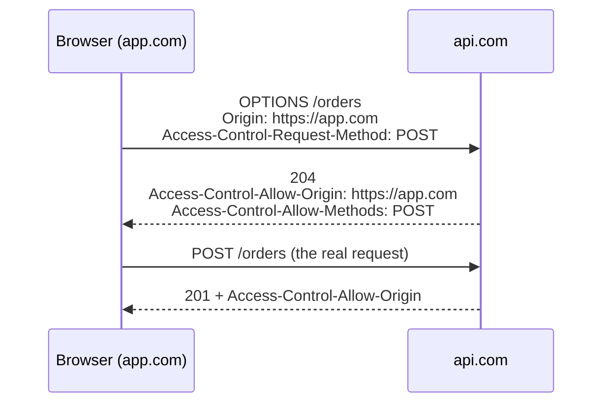
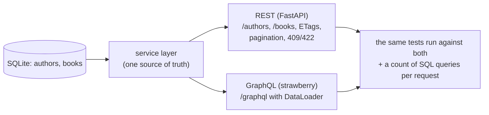

# Chapter 42 — HTTP, REST, GraphQL & JSON-RPC

> **Volume 1 — Computer Science Foundations** · [Contents](index.md) · ← [Chapter 41 — Transport & Security: TCP, UDP, QUIC, TLS & HTTPS](ch41-transport-and-security-tcp-udp-quic-tls.md) · Next → [Chapter 43 — WebSockets, gRPC, MQTT & SSE](ch43-websockets-grpc-mqtt-and-sse.md)

---

## Concept

HTTP methods/status codes/headers/cookies/caching/CORS; REST resources; GraphQL queries; JSON-RPC.

**In one sentence:** HTTP is a request/response protocol of verbs, paths, headers, and status codes; REST uses it to expose *resources*, GraphQL lets the client ask for exactly the fields it wants from one endpoint, and JSON-RPC simply calls named functions.

**Mental model — ordering food.** REST is a restaurant with a fixed menu per dish: `GET /pizzas/7` returns the whole pizza. GraphQL is a build-your-own bowl: you list exactly which ingredients you want in one order. JSON-RPC is phoning the kitchen: "please run `make_pizza` with these arguments".

**HTTP methods**

| Method | Meaning | Safe? | Idempotent? | Body? |
|--------|---------|:-:|:-:|:-:|
| GET | read | ✓ | ✓ | no |
| HEAD | headers only | ✓ | ✓ | no |
| POST | create / run an action | ✗ | ✗ | yes |
| PUT | replace the whole resource | ✗ | ✓ | yes |
| PATCH | partial update | ✗ | not necessarily | yes |
| DELETE | remove | ✗ | ✓ | optional |
| OPTIONS | capabilities; CORS preflight | ✓ | ✓ | no |

*Safe* = no side effects. *Idempotent* = doing it twice has the same effect as once, so it's safe to retry.

**Status codes you'll actually use**

| Code | Meaning | Use when |
|------|---------|----------|
| 200 OK | success with body | GET, PUT, PATCH |
| 201 Created | resource created; add a `Location` header | POST |
| 204 No Content | success, no body | DELETE |
| 301 / 308 | permanent redirect | moved URLs |
| 304 Not Modified | the cached copy is still valid | conditional GET |
| 400 Bad Request | malformed input | JSON parse errors |
| 401 Unauthorized | not authenticated | missing or invalid token |
| 403 Forbidden | authenticated, not allowed | wrong role |
| 404 Not Found | no such resource | |
| **409 Conflict** | conflicts with current state | **duplicate create**, version conflict |
| 412 Precondition Failed | `If-Match` ETag mismatch | optimistic concurrency |
| 422 Unprocessable Content | valid JSON, invalid meaning | validation errors |
| 429 Too Many Requests | rate limited; add `Retry-After` | |
| 500 / 502 / 503 / 504 | server bug / bad upstream / overloaded / upstream timeout | |

**Caching headers**

| Header | Effect |
|--------|--------|
| `Cache-Control: max-age=3600, public` | anyone may cache for 1 hour |
| `Cache-Control: no-store` | never cache (sensitive data) |
| `Cache-Control: private` | only the browser, not shared caches |
| `ETag: "v7"` + `If-None-Match: "v7"` | revalidate → `304` with no body |
| `Last-Modified` + `If-Modified-Since` | date-based revalidation |
| `Vary: Accept-Encoding, Authorization` | the cache key includes these headers |

**Cookies:** `Set-Cookie: session=…; HttpOnly; Secure; SameSite=Lax; Path=/; Max-Age=3600`. `HttpOnly` blocks JavaScript access (limits XSS theft), `Secure` means HTTPS only, and `SameSite` limits cross-site sending (CSRF).

**CORS** — browsers block JavaScript on `app.com` from *reading* responses from `api.com` unless `api.com` allows it with `Access-Control-Allow-Origin: https://app.com`. "Non-simple" requests (custom headers, JSON body, PUT/DELETE) first send an `OPTIONS` *preflight*. CORS protects users' browsers; it is not server-side access control.

**REST vs GraphQL vs JSON-RPC**

| | REST | GraphQL | JSON-RPC |
|-|------|---------|----------|
| Shape | many URLs, one per resource | one endpoint, a typed schema, client-chosen fields | one endpoint, named methods |
| Over/under-fetching | common | solved | depends on the method |
| HTTP caching | excellent (GET + URLs) | hard (POST, one URL) | poor |
| Errors | HTTP status codes | `200` with an `errors` array | `error` object |
| Tooling | OpenAPI | introspection, codegen | minimal |
| Best for | public APIs, CRUD, cacheable resources | many clients with different data needs (mobile/web), aggregating services | internal actions, blockchain nodes, LSP, MCP |

---

## Prereqs

* [Chapter 41 — Transport & Security: TCP, UDP, QUIC, TLS & HTTPS](ch41-transport-and-security-tcp-udp-quic-tls.md)

---

## Diagram

**A request/response exchange**

```
 GET /users/1 HTTP/1.1                    HTTP/1.1 200 OK
 Host: api.example.com                    Content-Type: application/json
 Accept: application/json                 Cache-Control: private, max-age=60
 Authorization: Bearer eyJ…               ETag: "u1-v7"
 If-None-Match: "u1-v6"                   
                                          {"id": 1, "name": "Ada"}
```

**Choosing a status code**



**REST vs GraphQL query shape** — "user 1's name and the titles of their 3 latest posts"

```
 REST: 2 round trips, extra fields          GraphQL: 1 round trip, exact fields
 GET /users/1                               POST /graphql
   → {id, name, email, avatar, bio, …}      { user(id: 1) {
 GET /users/1/posts?limit=3                     name
   → [{id, title, body, tags, …}, …]            posts(last: 3) { title }
                                                } }
                                            → {"data": {"user": {"name": "Ada",
                                                 "posts": [{"title": "…"}, …]}}}
```

**CORS preflight**



---

## Example

```python
# REST with FastAPI
from fastapi import FastAPI, HTTPException, Response, status
from pydantic import BaseModel

app = FastAPI()
USERS: dict[int, dict] = {1: {"id": 1, "email": "ada@example.com", "name": "Ada"}}

class NewUser(BaseModel):
    email: str
    name: str

@app.get("/users/{uid}")
def get_user(uid: int):
    if uid not in USERS:
        raise HTTPException(404, "user not found")
    return USERS[uid]

@app.post("/users", status_code=status.HTTP_201_CREATED)
def create_user(u: NewUser, response: Response):
    if any(x["email"] == u.email for x in USERS.values()):
        raise HTTPException(409, "email already registered")      # duplicate create
    uid = max(USERS) + 1
    USERS[uid] = {"id": uid, **u.model_dump()}
    response.headers["Location"] = f"/users/{uid}"
    return USERS[uid]
```

```graphql
type User { id: ID!  name: String!  posts(last: Int = 10): [Post!]! }
type Post { id: ID!  title: String!  author: User! }
type Query { user(id: ID!): User }
```

```json
{"jsonrpc": "2.0", "method": "add", "params": {"a": 2, "b": 3}, "id": 1}
{"jsonrpc": "2.0", "result": 5, "id": 1}
{"jsonrpc": "2.0", "error": {"code": -32601, "message": "Method not found"}, "id": 2}
```

```bash
curl -i https://api.example.com/users/1 -H 'If-None-Match: "u1-v7"'   # → 304 if unchanged
```

---

## Exercises

1. Design REST endpoints for a resource with nested relations.

   <details><summary>Solution</summary>

   ```
   GET    /projects                     list (?status=active&page=2)
   POST   /projects                     create → 201 + Location
   GET    /projects/{pid}               read
   PATCH  /projects/{pid}               partial update (If-Match: ETag)
   DELETE /projects/{pid}               → 204
   GET    /projects/{pid}/tasks         tasks of a project
   POST   /projects/{pid}/tasks         create a task in the project
   GET    /tasks/{tid}                  a task by its own ID (don't nest more than 1 level)
   POST   /tasks/{tid}:complete         an action that isn't CRUD (or POST /tasks/{tid}/completion)
   ```
   </details>

2. Write a GraphQL schema with a resolver.

   <details><summary>Solution</summary>Use the schema above with <code>strawberry</code> or <code>graphql-js</code>. Resolver for <code>User.posts</code>: <code>return db.posts.filter(author_id=user.id).order_by("-created").limit(last)</code>. Batch it with a DataLoader, or a query for 50 users makes 51 database calls (the N+1 problem).</details>

3. A client retries `POST /payments` after a timeout and the customer is charged twice. Fix the API.

   <details><summary>Solution</summary>Require an <code>Idempotency-Key</code> header. Store key → response. On a repeat with the same key, return the stored response instead of charging again. See <a href="../volume-3-low-level-design/ch14-resilience-patterns-idempotency-retries-backoff-circuit-breakers.md">Vol 3 Ch 14</a>.</details>

---

## Mini project

**A small REST API + a GraphQL endpoint exposing the same data.**



**Steps**

1. Model authors and books in SQLite; a service layer with plain functions.
2. REST: CRUD, cursor pagination, `ETag`/`If-None-Match` → 304, 409 on duplicate ISBN, 422 on validation.
3. GraphQL: the same data; `author { books { title } }`; a DataLoader to batch book lookups.
4. Log SQL queries per request; show N+1 without the DataLoader and the fix with it.
5. Add CORS for one origin and prove that a different origin is blocked in the browser.

**Done when:** both APIs return identical data from one service layer, and the GraphQL "50 authors with books" query uses 2 SQL queries, not 51.

---

## Open source

* [`graphql/graphql-js`](https://github.com/graphql/graphql-js) — the reference implementation; `src/execution/execute.ts` shows how resolvers are walked field by field.
* [`encode/django-rest-framework`](https://github.com/encode/django-rest-framework) — serializers, viewsets, pagination, and throttling for REST APIs.

---

## Interview

1. **"REST vs GraphQL — trade-offs?"**
   <details><summary>Answer</summary>REST is simple, uses HTTP semantics well, and caches easily at CDNs and browsers, but clients often over- or under-fetch and need many round trips. GraphQL gives exactly the needed data in one request with a typed schema, which suits varied clients, but caching, rate limiting (query cost), authorization per field, and N+1 performance are harder. Choose per audience; they can coexist.</details>

2. **"Which status code for a duplicate create?"**
   <details><summary>Answer</summary>409 Conflict: the request is valid but conflicts with existing state (e.g. an email already registered). With an idempotency key and a retried identical request, return the original 201 response instead. 422 is for semantically invalid input, and 400 for malformed syntax.</details>

---

## Checklist

- [ ] use correct methods/status codes
- [ ] set caching headers
- [ ] explain CORS

---

> [Contents](index.md) · ← [Chapter 41 — Transport & Security: TCP, UDP, QUIC, TLS & HTTPS](ch41-transport-and-security-tcp-udp-quic-tls.md) · Next → [Chapter 43 — WebSockets, gRPC, MQTT & SSE](ch43-websockets-grpc-mqtt-and-sse.md)
